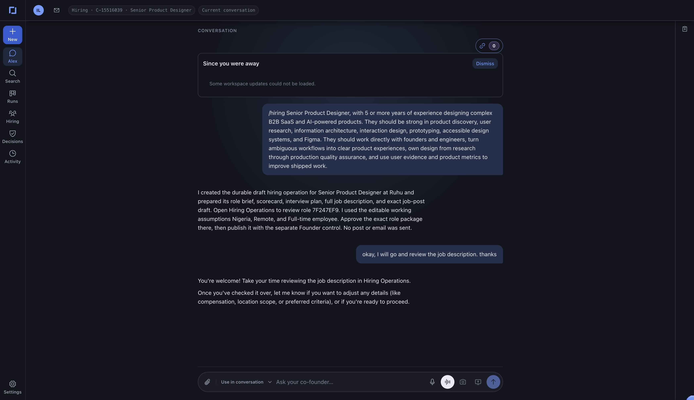
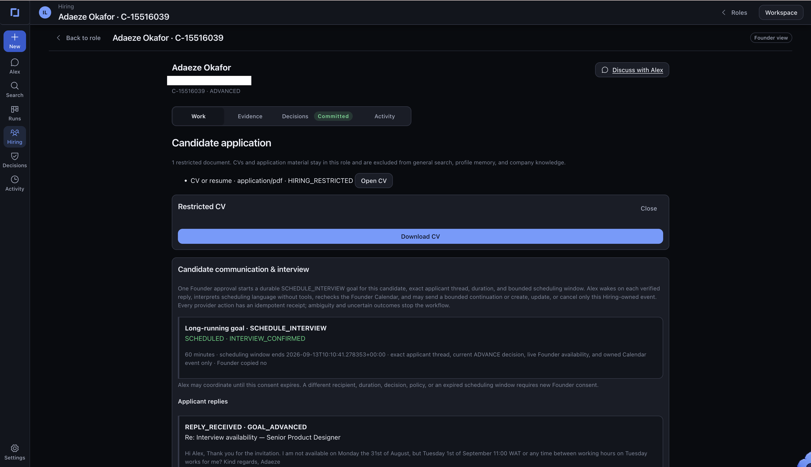
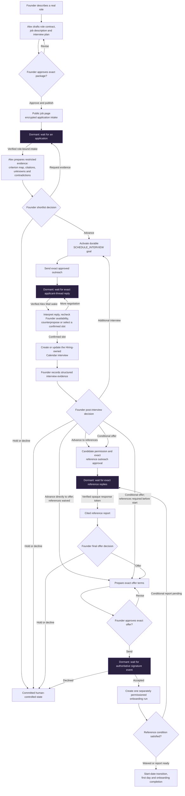
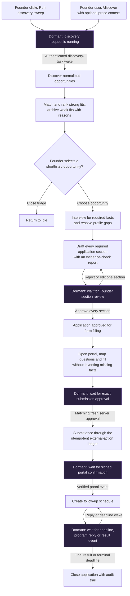
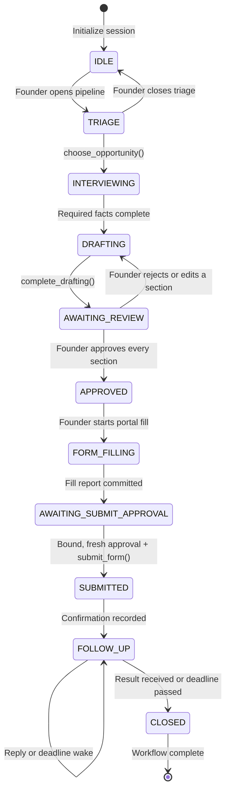

# Co-Founder — the agent does the work; founders keep the judgment

Co-Founder is a persistent AI operating partner for founders. It discovers
funding opportunities, evaluates fit, interviews the team, drafts applications
in the founder's voice, learns from feedback, works inside application portals,
and follows through after submission. It also runs a role-scoped Hiring
workspace: Alex drafts a real job package from the founder's description,
publishes only after Founder approval, receives applications, prepares cited
candidate evidence, coordinates interviews, and carries approved candidates
through references, offers, and onboarding.

It is not another chatbot that gives founders more advice. Co-Founder carries
the operational workflow while every consequential decision remains with a
human.

Durable workflow, domain, approval, and action records are authoritative.
ADK session state is a reconciled model-facing projection for continuity—not
an authorization source—and chat history never authorizes consequences.

**All Things Agentic Hackathon — Collaborative Partner category.** Built with
Google ADK, Gemini, Gemma, and Google Cloud.

[Open the deployed app](https://co-founder-64dgomo23q-uc.a.run.app) ·
[Read the architecture](docs/01-architecture.md) ·
[Review the evaluation evidence](docs/11-evaluations.md)

> **Live access:** the Founder application uses Google Sign-In and an exact,
> active `FOUNDER` workspace membership. Protected routes return a generic
> `401` to unauthenticated callers. A public job page exists only for an
> approved, published role; its application form additionally requires the
> encrypted-intake configuration. No credential, token, subject identifier, or
> secret is stored in this README.

---

## Inspiration

Every founder—solo or part of a founding team—knows the operational grind.
Applications, follow-ups, repetitive forms, and the fifteenth tailored version
of “describe your traction” consume the time founders should spend on the
company itself. Too often, the application quietly dies somewhere between a
promising opportunity and a missed deadline.

We wanted a co-founder that leads the work instead of creating more work: one
that remembers the committed state, learns how the team thinks, prepares the
materials, operates the portal, and asks for human judgment only when it is
actually needed.

Funding and accelerator applications are the first workflow because they make
the problem concrete and testable. The underlying engine deliberately uses
generic concepts such as `Opportunity`, `Application`, `ChecklistItem`, and
`ApprovalGate`, so future workflows can reuse the same orchestration, memory,
and safety boundaries.

## What Co-Founder does

- **Discovers opportunities autonomously** from live search results, program
  pages, and messy PDFs, preserving source URLs and evidence.
- **Matches opportunities to a persistent Founder Profile**, archives weak fits
  with an audited reason, and highlights deadline and workload urgency.
- **Leads a guided interview**, asking one relevant gap question at a time and
  explaining why the answer matters.
- **Drafts in the founder's voice**, grounded in verified company facts,
  previously approved answers, and the target program's requirements.
- **Learns from explicit feedback**. Approve, edit, and reject-with-reason
  actions become durable voice rules, canonical answers, and decision patterns.
- **Makes adaptation visible** by citing the prior rule that shaped a later
  draft—for example, avoiding a phrase the founder previously rejected.
- **Produces real artifacts**, including validated Word, Excel, PowerPoint, and
  PDF outputs with downloadable versions and provenance.
- **Reads founder attachments safely**. PDF, DOCX, PPTX, XLSX, TXT, and CSV are
  validated, extracted into page/slide/section chunks, and cited back to the
  original. Conversation-only use is the default; Founder Profile mutation is
  an explicit scope and unsupported scans are never presented as read.
- **Works inside application portals** using guarded, headless Playwright
  automation and reports partial success when a field needs founder input.
- **Requires durable authority for irreversible actions**. Submission and
  standalone effects use persisted, single-use, server-resolved approvals.
  Hiring coordination may instead use one recent Founder consent to activate a
  time-bounded mandate constrained to the exact applicant, thread, policy,
  availability, duration, and owned Calendar event.
- **Owns an operational identity**, Alex (`alex@ruhu.ai`), for portal accounts
  and program correspondence without using the founder's personal inbox.
- **Runs real Hiring operations** without a fixed demo role. A tool-less Gemini
  writer turns the founder's description into a complete job package using the
  existing schema; deterministic completeness and safety checks fail closed.
- **Keeps hiring judgment human**. Alex prepares citation-bound evidence and
  coordinates an approved applicant thread, but never scores, ranks, advances,
  rejects, offers, or hires a candidate on its own.
- **Coordinates interviews as a durable goal**. After an evidence-backed
  Founder `ADVANCE`, verified Alex Mail events wake the bounded
  `SCHEDULE_INTERVIEW` goal; Alex rechecks Founder Calendar availability,
  negotiates in the exact applicant thread, and creates or updates only the
  Hiring-owned event within the approved mandate.
- **Provides optional cross-session memory** with explicit Remember, Correct,
  Pin, Forget, Disable, export, deletion-ledger, expiry, and private-session
  fences. Memory is advisory and cannot authorize an action.
- **Can prepare bounded background drafts** from an immutable Founder-owned
  artifact. This lane has its own allowlist, queue, admission/execution flags,
  and kill switch; it cannot browse, use connectors, send messages, perform an
  external effect, or write memory.
- **Sleeps when nothing is happening** and resumes from durable state when a
  founder action, webhook, scheduled task, or program response arrives.

### Implementation and release status

| Capability | Repository state | Release boundary |
|---|---|---|
| Funding/program applications | Complete guarded lifecycle through submission and follow-up | Provider and submission effects still require their exact connectors and approvals |
| Hiring H0–H4 | Real role intake, public application, restricted evidence, Founder decisions, and durable interview coordination implemented | Gmail/Calendar watches, connectors, workspace admission, and kill switch must be healthy |
| Hiring H5–H6 | References, offers, accepted-offer handoff, and onboarding workflow implemented | External effects remain behind H7 prerequisites and release controls |
| Hiring H7 | Executable fail-closed release projection implemented | Disabled until KMS, secrets, HTTPS, provider, approved-package jurisdiction binding, and qualified technical review are real |
| Spec 39 M2 memory | Founder-controlled memory implementation and measured canary path implemented | Default-off outside the exact attested Founder cohort; private sessions always exclude optional memory |
| Spec 40 background work | One grounded, actor-private artifact-draft skill implemented | Separate admission/execution flags, bounded queue, monitoring, same-image rollback, and kill switch |

## Live demo

The production UI is deployed on Cloud Run:

**[https://co-founder-64dgomo23q-uc.a.run.app](https://co-founder-64dgomo23q-uc.a.run.app)**

The Founder product combines these surfaces:

- A product rail for Alex, Search, Runs, Hiring, Decisions, Activity, and
  Settings.
- A funding pipeline for discovered, shortlisted, and active opportunities.
- A Hiring workspace for roles, public application links, restricted candidate
  evidence, human decisions, communication, interviews, references, offers,
  and onboarding.
- A conversation with Alex over text, voice notes, or real-time Gemini Live.
- Contextual Work, Evidence, Decisions, and Activity views with committed-state
  indicators rather than optimistic UI transitions.
- A built-in Browser panel showing headless research and form-filling progress.
- Connector and approval panels for Drive, Gmail, Calendar, submission, email,
  and calendar actions.

The UI does not optimistically advance the workflow. A state changes only after
the backend commits the transition. Generated documents are real files; portal
fills have inspection evidence and exact filled/needs-human reports; approval
status is resolved on the server rather than accepted from chat.

### Hiring demo snapshots

These screenshots use the competition's fictional candidate data and show
committed product state rather than a mock interface.



*Alex turns a natural-language `/hiring` request into a durable draft role
package. The response identifies the role record and makes clear that no job was
published and no email was sent.*



*The candidate workspace keeps the CV Hiring-restricted while exposing the
durable `SCHEDULE_INTERVIEW` goal, its committed `INTERVIEW_CONFIRMED` state,
and the causally linked applicant reply.*

### Authenticated testing access

The product has one application role: `FOUNDER`. Google authentication proves
the account, while an active workspace membership grants product access. It
does not bypass recent-sign-in, CSRF, durable workflow, approval, connector, or
external-effect controls. Test accounts must be provisioned out of band; this
repository intentionally contains no allowlisted email, subject, or credential.

Suggested authenticated test flow:

1. Open the deployed app and choose **Continue with Google**.
2. Sign in with a provisioned Founder account.
3. Start a **New session** and ask Alex to show the current opportunity pipeline.
4. Select a shortlisted opportunity and answer the guided interview questions.
5. Review a draft section. Reject one with a specific reason, such as “avoid the
   word revolutionary; write plainly.”
6. Re-open the redraft and verify that the wording changed and its notes cite the
   learned Founder Profile rule.
7. Approve the sections and ask Alex to fill the program portal.
8. Watch the headless run in the built-in Browser panel and inspect the
   filled/needs-human report.
9. Try asking Alex to submit from chat before approval; it must refuse without
   calling a submission tool.
10. Use the approval panel, review the irreversible action, and approve the
    final submission.

A `401` on a protected route means the authentication boundary is working as
designed, not that the service is unavailable. Credentials must never be posted
in an issue, commit, recording, or shared URL.

---

## Reproducible Testing Instructions for Competition Judging Team

The judging team can test the deployed product with the email address and
password supplied privately in the competition submission. Those credentials
are intentionally not duplicated in this repository.

1. Open the **[live Cloud Run app](https://co-founder-64dgomo23q-uc.a.run.app)**
   in a fresh browser window.
2. Select **Continue with Google** and sign in with the competition-provided
   email address and password. The provisioned account enters the product as the
   authenticated `FOUNDER`; authentication does not bypass workflow approvals.
3. From the Alex chat surface, start a **New session**.
4. Paste this command exactly:

   ```text
   /hiring Founding Full-stack AI Engineer, with 4 or more years of experience, strong in python or typescript full-stack web development, and building AI or LLM powered products. They should work directly with founders, own delivery from idea to production and make practical technical decision in fast moving startup.
   ```

5. If Alex asks for the remaining publication facts, reply:

   ```text
   Company: Ruhu. Location: Nigeria. Work arrangement: Remote. Employment: Full-time.
   ```

6. Alex should create a new **draft** role package rather than reuse the optional
   synthetic fixture. Open **Hiring**, select the new role, and verify that the
   package contains a complete real-world job description, criteria, interview
   plan, advertised location, and application policy.
7. Review the package and use the explicit Founder approval to publish it. Open
   **View public job page** and confirm that the public page and application form
   are separate from the internal Hiring workspace.
8. For an end-to-end intake test, use only the fictional candidate identity and
   test CV supplied with the competition materials. After submission, verify
   that Alex prepares restricted criterion evidence and that **Work**,
   **Evidence**, **Decisions**, and **Activity** reflect committed backend state.
9. Commit an **Advance** decision to inspect the durable interview-coordination
   goal. Email, Calendar, reference, offer, or onboarding effects will proceed
   only when their exact connector, consent, approval, and release controls are
   active; a blocked effect must remain visible and fail closed.

Expected safety checks are reproducible too: asking Alex in chat to publish,
advance, submit, email, or book without the corresponding server-side decision
or approval must not perform the action. Refreshing or reopening the app should
show the same committed role and candidate state rather than reconstructing it
from chat history.

---

## Long-running operations

The same durable-state and event-wake architecture supports multiple product
workflows. Hiring appears first because it is the primary demo and the most
complete long-running workflow; Funding follows as a separate state machine.

| Fragile agent pattern | Co-Founder pattern | Why it matters |
|---|---|---|
| Infer progress from chat history | Explicit enum state, checklist, active IDs, and pending signals | The agent resumes the committed workflow instead of guessing after compaction or a restart. |
| Keep a worker alive or poll continuously | Event-driven dormancy with webhook/task `state_delta` | Cloud Run can scale to zero while sessions remain durable. |
| Give one agent every tool | Root orchestrator plus narrowly scoped specialists | Smaller tool surfaces reduce accidental actions and keep prompts focused. |
| Put safety rules only in the prompt | Tool-internal guards, callbacks, server-resolved approvals, and idempotency keys | A mis-prompted model still cannot perform an unauthorized irreversible action. |
| Store feedback as an inert transcript | Distill verbatim feedback into structured profile rules | Later work demonstrably changes rather than merely claiming to remember. |
| Treat a polished response as success | Validate tool outcomes, artifacts, audit rows, and eval result JSON | The system must prove that the side effect happened. |

### Hiring operations

Hiring is the primary demonstrated long-running workflow. It is separate and
role-scoped, not a synthetic package attached to the funding pipeline. The
fixed Forward Deployment Engineer case remains an optional, visibly synthetic
fixture; normal `/hiring` intake starts from the Founder's real description.



Purple nodes are durable dormant waits. A verified application, mailbox,
reference, signature, or timer event wakes the exact role/candidate run; a
worker never scans every candidate and a model message never manufactures a
transition.

Important boundaries:

- Applications, CVs, evidence, identities, and conversations remain inside the
  Hiring scope and are excluded from global search, Founder Profile memory, and
  company knowledge.
- Alex prepares `PRESENT`, `MISSING`, `UNCLEAR`, and contradiction evidence with
  resolvable source citations. These labels are not scores or hiring advice.
- Only the Founder commits `ADVANCE`, `HOLD`, `DECLINE`, reference, offer, and
  onboarding decisions. A model message or elapsed time never creates one.
- A single recent Founder consent may activate a time-bounded interview mandate
  for the exact candidate, policy, recipient, thread, duration, and scheduling
  window. Provider effects remain idempotent, receipted, and uncertainty-safe.
- Reference contacts are envelope encrypted; each outreach and response is
  bound to exact approval, a controlled Alex Mail action, and an opaque token.
- The Founder may require references before an offer, explicitly waive them, or
  bind them as a conditional-offer requirement before start. The choice is
  durable and included in the exact offer approval; it is never inferred.
- Offer acceptance creates exactly one separately permissioned onboarding run.
  A conditional-offer onboarding run cannot enter its start date before
  reference evidence is ready. Onboarding completion also refuses unresolved
  tasks or open external actions.

The H5/H6 workflow and execution core is implemented. Production H7 effects
remain deliberately fail-closed until the deployment has its exact Founder
membership, HTTPS public origin, Cloud KMS key, response/signature secrets,
chosen e-signature provider, qualified technical review reference, connector
readiness, enable flag, and released kill switch. The approved role package's
normalized advertised location is the operating-jurisdiction binding; it is
not legal advice or proof that laws were reviewed. Missing values are reported
as blockers; the application never invents release evidence. See
[docs/25-hiring-operations.md](docs/25-hiring-operations.md).

### Funding operations

The shipped application connects discovery to the complete application
lifecycle. The **Run discovery sweep** button or the feature-flagged `/discover`
chat command starts discovery and matching only when a founder asks. Alex then waits for the
founder to choose a ranked opportunity before the guarded application lifecycle
begins.



As in Hiring, purple nodes are durable pauses rather than running workers. Only
the named authenticated task, Founder action, or provider event wakes the
matching application; Alex never treats chat text as submission approval.

Set `DISCOVER_COMMAND_ENABLED=true` to enable the competition-safe adapter. It
accepts prose context only, reuses the existing discovery, matching, selection,
and application path, and never chooses or submits for the founder. Task-scoped
attachments, `/apply`, linked run records, and durable selection waits remain
the [north-star Phase 2 design](docs/21-alex-platform-north-star.md#151-funding-and-program-applications),
not claims about this adapter.

#### Funding application state machine and dormant pause gates

Co-Founder does not keep a model invocation or worker alive from discovery to
submission. Firestore owns the application state; the session contains only a
reconciled model-facing projection. At a human, provider, or timer boundary the
run records what it is waiting for and becomes dormant. A verified event first
commits authoritative state and a durable wake receipt, then resumes the same
session with a minimal `state_delta` before the next model inference.



The registered dormant gates are deliberately small and inspectable:

| Durable state | Waiting for | Trusted wake | What the wake may change |
|---|---|---|---|
| `AWAITING_REVIEW` | `founder_feedback` | Founder feedback submitted in the UI | Records feedback; either returns one section to `DRAFTING` or completes review when all sections are approved. |
| `AWAITING_SUBMIT_APPROVAL` | `founder_approval` | Server-resolved approval bound to the current fill report | Grants only the matching, unexpired, unconsumed submission action. Chat text cannot satisfy this gate. |
| `SUBMITTED` | `portal_confirmation` | Signed portal webhook | Records the confirmation and advances the durable application to `FOLLOW_UP`. |
| `FOLLOW_UP` | `deadline_tick` or a verified result event | Authenticated task or provider event | Refreshes urgency/status or closes the application; silence never fabricates a result. |

`TRIAGE`, browser Stop, and closed/cold containers do not weaken these rules.
No wake is authorized by chat history, and no wait is implemented by polling or
by keeping a long model call parked.

The opportunity pipeline has its own smaller lifecycle:

```text
DISCOVERED ── fit ≥ 70 ──▶ SHORTLISTED
     └────── fit < 70 ───▶ ARCHIVED (audited reason required)
```

The binding transition guards and side effects are documented in
[docs/03-state-machine.md](docs/03-state-machine.md).

---

## Multi-agent architecture

The root **Orchestrator** owns the founder relationship and state-machine
routing. Specialist agents receive only the tools required for their role:

| Agent | Responsibility | Deliberate boundary |
|---|---|---|
| Orchestrator | Route by committed state, lead the workflow, explain next actions | Delegates specialist work rather than owning every tool. |
| Scout | Search, browse, ingest, and extract structured opportunities | Cannot score, draft, or submit. |
| Matchmaker | Evaluate Founder Profile fit, urgency, and archive rationale | Cannot operate portals. |
| Interviewer | Resolve one required information gap at a time | Cannot draft before the interview gate closes. |
| Drafter | Retrieve relevant evidence, draft sections, and produce documents | Cannot submit an application. |
| Form-Filler | Inspect portals, map questions, fill approved answers, and submit behind approval | Cannot invent facts or draft new founder claims. |
| Distiller | Convert feedback into profile updates in an isolated system session | Receives the feedback payload with `include_contents="none"`, never founder chat history. |

Hiring adds bounded domain workers rather than widening the root agent's tool
authority: the job-spec writer is tool-less; the evidence analyst reads only
Hiring-restricted artifacts; the scheduling interpreter produces a validated
plan while deterministic services own thread correlation, availability,
idempotency, provider effects, and state transitions.

The model tiers are selected by workload:

- **Gemini 3.6 Flash** — orchestration, dialogue, matching, drafting, and
  tool-driven workflows.
- **Gemini 3.5 Flash-Lite** — high-volume extraction and classification.
- **Gemini Live 2.5 Flash** — real-time, bidirectional voice interaction.
- **`gemini-embedding-001`** — retrieval of relevant canonical answers.
- **Gemma 4 26B A4B IT** — optional, rollout-gated second-pass evidence checking
  before founder review.
- **Cloud Text-to-Speech, Chirp 3 HD** — read-aloud responses.

### Durable memory and visible adaptation

The Founder Profile in Firestore contains verified facts, voice rules, approved
canonical answers, rejection history, and recurring decision patterns. Raw
feedback is stored verbatim, then the isolated Distiller proposes structured
updates. The next draft retrieves the relevant rules and records their IDs in
the draft notes, making the causal chain inspectable:

```text
Founder rejection
  → verbatim feedback record
  → isolated distillation
  → versioned Founder Profile rule
  → later draft follows and cites that rule
  → append-only audit evidence
```

Optional M2 durable memory is a separate founder-controlled layer for small,
explicit facts and preferences. It is default-off outside an attested Founder
canary, performs zero optional-memory I/O in private sessions, and never ingests
transcripts automatically. Deletion tombstones and the separately administered
ledger prevent forgotten lineages from being restored by replay or backup.

### Bounded background work

The background skill lane can prepare one actor-private, citation-grounded
draft from an immutable artifact owned by the same Founder workspace/session.
It uses one bounded model call and no tool loop. Admission, specialist
execution, artifact preparation, and queue dispatch are independently
controlled; the preparation kill switch is the final enable. Open web,
connectors, approvals, external actions, memory writes, and conversation
delivery remain unavailable in that lane.

### Guarded browser automation

Playwright is permanently headless. Before acting, the Form-Filler inspects the
page, records a field signature, and verifies that signature again before using
approved answers. The browser layer includes prompt-injection scanning, SSRF
and DNS controls, action budgets, crash-safe records, staleness detection, and
idempotency. If only part of a form can be completed, partial success is
reported as data instead of being disguised as completion.

The mock program portal also exposes an A2A agent card and JSON-RPC
`message/send`, allowing Alex to ask a program's own agent about requirements,
deadlines, and submission status.

### Google Cloud architecture

- **Google ADK** — agent graph, sessions, tools, callbacks, and evaluations.
- **Vertex AI** — Gemini, Gemini Live, embeddings, and optional Gemma MaaS.
- **Cloud Run** — Founder application, isolated browser worker, and mock program
  portal.
- **Cloud SQL** — durable ADK sessions across cold starts and revisions.
- **Firestore** — opportunities, applications, profiles, approvals, feedback,
  evidence checks, browser runs, and append-only audit records.
- **Cloud Storage** — uploaded source documents and generated artifacts.
- **Secret Manager** — connector and portal credentials fetched by name only at
  execution time.
- **Pub/Sub, Cloud Scheduler, Cloud Tasks, and signed webhooks** — manual durable
  discovery, Gmail event wakes, scheduled deadline/watch maintenance,
  resumptions, background-pilot dispatch, and bounded retries.
- **Cloud Build** — reproducible deployment.

See the full [service architecture diagram](docs/architecture-diagram.md) and
[architecture specification](docs/01-architecture.md).

---

## Workflow steps

1. **Discovery and matching** — a founder-invoked UI or chat action searches,
   extracts, deduplicates, scores, and prepares a ranked shortlist.
2. **`IDLE / TRIAGE`** — show the pipeline, prioritize urgent opportunities,
   and let the founder choose what to pursue.
3. **`INTERVIEWING`** — fill only the gaps required for this program; persisted
   profile facts are reused rather than asked again.
4. **`DRAFTING`** — prepare one grounded section at a time and attach the voice
   rules that shaped it.
5. **`AWAITING_REVIEW`** — collect explicit approve, edit, or reject-with-reason
   feedback. Rejected sections return to drafting.
6. **`APPROVED`** — freeze founder-approved content and create the submission
   idempotency key.
7. **`FORM_FILLING`** — inspect the real portal, persist its questions, map
   approved answers, and report exactly what was filled.
8. **`AWAITING_SUBMIT_APPROVAL`** — show the irreversible action in the approval
   panel; pasted or fabricated chat tokens have no authority.
9. **`SUBMITTED`** — atomically consume approval, submit once, and store the
   portal confirmation.
10. **`FOLLOW_UP`** — monitor the Alex mailbox, program agent, deadlines, and
   scheduled obligations without polling.
11. **`CLOSED`** — record the outcome and final audit event.

---

## Project structure

```text
all-things-ai/
├── agents/co_founder/          # ADK app, state callbacks, instructions, tools
│   └── sub_agents/             # Scout, Matchmaker, Interviewer, Drafter, Form-Filler
├── app/                        # FastAPI UI, auth, chat, voice, webhooks, task routes
│   └── static/hiring.html      # Role, candidate, evidence, decision and onboarding UI
├── services/                   # Firestore, artifacts, memory, connectors and domain services
│   ├── hiring_*.py             # Intake, evidence, coordination, references, offers, onboarding
│   └── durable_memory*.py      # Founder-controlled M2 memory and release boundary
├── mock_portal/                # Demo application portal and A2A program agent
├── workflows/                  # Domain-neutral declarative workflow definitions
├── tests/
│   ├── unit/                   # Guards, state, security, documents, browser contracts
│   ├── integration/            # Adaptation and service/tool paths
│   ├── eval/                   # ADK configs, custom metrics, and golden eval sets
│   └── fixtures/               # Deterministic source and portal fixtures
├── scripts/                    # Setup, seed, E2E story, deployment, CI helpers
├── docs/                       # Binding architecture and implementation specifications
├── Dockerfile                 # Playwright + LibreOffice production image
└── requirements*.txt          # Reproducibly pinned Python dependencies
```

Key entry points:

- [ADK root app](agents/co_founder/agent.py)
- [State definitions](agents/co_founder/state_schema.py)
- [Orchestrator instructions](agents/co_founder/instructions.py)
- [FastAPI application](app/main.py)
- [Resume handler](app/resume_handler.py)
- [Workflow definition](workflows/grant_applications.yaml)
- [Security model](docs/12-security.md)
- [Build plan and acceptance checks](docs/14-build-plan.md)

---

## Prerequisites

- Python 3.11+
- [`uv`](https://docs.astral.sh/uv/getting-started/installation/)
- Google Cloud SDK (`gcloud`)
- A Google Cloud project with billing and Vertex AI access
- Application Default Credentials
- Chromium for browser automation (`python -m playwright install chromium`)
- LibreOffice/`soffice` is optional for generated-document PDF previews only.
  Uploaded PDF/DOCX/PPTX/XLSX/TXT/CSV files use native structured readers and do
  not launch LibreOffice; document previews degrade explicitly when it is absent.

Authenticate before setup:

```bash
gcloud auth application-default login
gcloud config set project <your-project-id>
```

## Run locally

The setup script is idempotent: it creates the virtual environment, installs
pinned dependencies, enables required APIs, writes missing local configuration,
and verifies the selected Gemini model.

```bash
./scripts/setup.sh
source .venv/bin/activate
cp .env.example .env   # only if setup.sh did not already create it
python -m playwright install chromium
python scripts/seed_demo.py
```

Run the complete local stack (founder app plus mock portal):

```bash
./scripts/run_local.sh
```

The launcher validates Google Application Default Credentials before opening a
port, waits for both health endpoints, and shuts both services down together.
It deliberately runs without hot reload so file edits cannot interrupt voice
conversations, approval flows, or OAuth callbacks. For active development, opt
in explicitly:

```bash
./scripts/run_local.sh --reload
```

Use `./scripts/run_local.sh --app-only` only when the mock portal is already
running elsewhere.

Open [http://127.0.0.1:8090](http://127.0.0.1:8090). `run_local.sh` makes this
the single canonical founder-app origin: it starts Uvicorn on the same address
it exports as `AGENT_BASE_URL`, so OAuth callbacks and task targets cannot
silently drift to a second port. Local development is open
when `APP_AUTH_TOKEN` is unset; production always fails closed. Portal
automation remains headless and is visible through the app's Browser panel.

For Google founder sign-in, register this exact **Authorized redirect URI** on
the configured Web OAuth client before the first local sign-in:
`http://127.0.0.1:8090/auth/google/callback`. This must match
`GOOGLE_LOGIN_REDIRECT_URI` exactly; do not register a rotating local port.

Founder sign-in (email + Google) is optional and off until configured: set
`FIREBASE_WEB_API_KEY`, `FIREBASE_PROJECT_ID`, and `ALLOWED_LOGIN_EMAILS` in
`.env` (see `.env.example` and docs/12 §Founder sign-in). Once set, `/login.html`
handles sign-in and the account menu (top-left avatar) shows the signed-in
founder with Connectors, Settings, and Log out.

The product role is always `FOUNDER`; there is no Owner/Operator role selector.
In a deployed workspace, seed the exact authenticated subject with
`scripts/seed_workspace_founder.py` before enabling protected mutations.

For automatic local Alex Mail wakeups, configure both the existing deployed
topic and the dedicated local subscription before starting the launcher:

```bash
ALEX_MAIL_PUBSUB_TOPIC=projects/<project>/topics/alex-mail-events
ALEX_MAIL_LOCAL_SUBSCRIPTION=projects/<project>/subscriptions/alex-mail-local-dev
./scripts/run_local.sh
```

The local subscriber acknowledges an event only after the authenticated local
webhook succeeds. Manual mailbox scan/replay remains a recovery tool, not the
normal scheduling loop.

To exercise conversational discovery locally after running the test and eval
commands below, set `DISCOVER_COMMAND_ENABLED=true`, restart the app, and send:

```text
/discover Find non-dilutive AI infrastructure opportunities for an African pre-seed startup
```

Alex acknowledges the request, runs the existing discovery/matchmaker path,
reports results in the same conversation, and waits for an explicit founder
selection. `@attachment` references are refused by this adapter rather than
silently updating the Founder Profile.

### Local development commands

| Command | Purpose |
|---|---|
| `./scripts/setup.sh` | Create/update the complete local environment and verify credentials/model access. |
| `python -m playwright install chromium` | Install the local browser used by guarded automation. |
| `python scripts/seed_demo.py` | Seed `founder`, `eval_founder`, demo opportunities, and workflow data. |
| `./scripts/run_local.sh` | Run and health-check the stable founder app and mock portal together. |
| `./scripts/run_local.sh --reload` | Run both local services with development hot reload. |
| `LOCAL_ENV_FILE=/saved/project/.env LOCAL_VENV_DIR=/saved/project/.venv ./scripts/run_local.sh` | Run an isolated clean checkout while keeping one authoritative local credential/session configuration. |
| `python -m pytest tests/unit tests/integration -q` | Run deterministic unit, service, and integration tests. |
| `ruff check .` | Run Python static checks. |
| `python scripts/check_contrast.py` | Verify the founder UI's semantic color contrast. |
| `python scripts/e2e_browser_story.py` | Run the real Gemini + Chromium end-to-end story against running services. |
| `./scripts/deploy.sh` | Deploy the application, portal, sessions, tasks, and schedules to Google Cloud. |
| `.venv/bin/python scripts/migrate_data_sources.py` | Dry-run the additive docs/24 connection/source migration (no writes). |
| `.venv/bin/python scripts/migrate_data_sources.py --apply` | Idempotently backfill canonical connection/source rows; preserves every legacy row. |

Full environment and cost guidance lives in
[docs/13-deployment.md](docs/13-deployment.md).

---

## Evaluation and validation

The repository uses deterministic tests and live ADK golden evaluations. The
golden sets cover persona identity, resume after idle time, document delivery,
and state/approval/effect safety gates. Attachment safety cases refuse to
summarize QUEUED or NO_TEXT inputs. A deterministic document matrix separately
tests real formats, structure/citations, hostile archives, scope isolation,
idempotency, and retry exhaustion.

Three metric configurations prevent false confidence:

- Positive trajectories use `IN_ORDER` matching for required tool subsequences.
- Safety gates use `EXACT` matching so an expected empty tool list truly means
  zero tool calls.
- Document delivery uses `artifact_delivery_score`, which requires a successful
  `produce_document` tool result with a real artifact name and download URL.

Run deterministic tests:

```bash
python -m pytest tests/unit tests/integration -q
ruff check .
```

Run a strict safety eval:

```bash
PYTHONPATH=. adk eval agents/co_founder \
  tests/eval/evalsets/gate_no_submit_without_approval.json \
  --config_file_path tests/eval/eval_config_strict.json
```

Run the document-outcome eval:

```bash
PYTHONPATH=. adk eval agents/co_founder \
  tests/eval/evalsets/doc_outputs.json \
  --config_file_path tests/eval/eval_config_artifact.json
```

CI runs every set, checks the persisted per-case status because ADK can return a
zero process exit code for a failed case, and uploads the raw eval history as a
build artifact. The adaptation integration test proves the complete causal path
from verbatim rejection to a cited rule in the next saved draft.

See [docs/11-evaluations.md](docs/11-evaluations.md) for config routing,
acceptance criteria, and the full evidence contract.

---

## Infrastructure and deployment

The deployment script provisions or updates the required Google Cloud services,
deploys both Cloud Run applications, binds secrets by name, configures durable
sessions and event queues, and prints the final URLs:

```bash
gcloud auth application-default login
gcloud config set project <your-project-id>
./scripts/deploy.sh
```

Production posture:

- Cloud Run scales to zero during dormant periods.
- The browser-owning service is limited to one instance to preserve run
  ownership until the worker extraction is complete.
- Cloud SQL holds ADK sessions; Firestore holds workflow state and audit data.
- Secrets are fetched by name at execution time, never baked into the image.
- Browser access is fail-closed to the production allowlist.
- Every externally visible action is idempotent and audited.
- M2 memory is default-off unless its exact candidate hash, attestation,
  Founder cohort, deletion ledger, monitoring, and rollback gate all pass.
- Background admission/execution flags are independent, queues are bounded,
  and kill switches default on.
- Hiring H5–H7 external effects stay disabled until active Founder membership,
  the approved role-package jurisdiction binding, qualified technical review,
  KMS/Secret Manager bindings, public HTTPS origin, connector checks, and the
  signature adapter are real and verifiable.

## Observability

OpenTelemetry instrumentation exports end-to-end GenAI spans to Cloud Trace and
runtime logs to Cloud Logging. Production telemetry captures metadata rather
than prompt or message contents. Completion telemetry can be written to a
restricted Cloud Storage path for evaluation without placing founder
conversation text in tracing systems.

Operational evidence is available through:

- Cloud Trace for orchestrator and specialist-agent execution.
- Cloud Logging for server, webhook, and task processing.
- Firestore's append-only audit records for domain actions and refusals.
- Browser run records and screenshots for inspected portal actions.
- ADK eval history artifacts retained by CI.

---

## Safety guarantees

- Durable workflow, domain, approval, and action records authorize every
  transition or consequence. Reconciled session state grounds model inference;
  chat history authorizes nothing.
- Tools return structured errors as data instead of raising failures into the
  model conversation.
- Drafting, portal opening, submission, email, and calendar actions have code
  guards independent of prompts.
- Approval records are founder-, session-, gate-, and action-bound; tokens stay
  server-side and are consumed once.
- Idempotency keys make retries and webhook redelivery safe.
- Web pages, PDFs, emails, and A2A messages are treated as untrusted data.
- The Distiller is isolated from founder conversation history.
- Private sessions perform zero optional-memory reads and writes; forgotten
  memory lineages cannot be restored through ordinary replay.
- Candidate evidence and identity remain Hiring-restricted. Alex cannot score,
  rank, recommend, advance, reject, offer, or hire without the corresponding
  human decision and exact effect authority.
- Gmail and Calendar scope grants are capabilities, not authority: recipient,
  thread, policy, availability, mandate, approval, idempotency, and kill-switch
  checks still execute in code.
- Every external action and refusal writes auditable evidence.

## License

Except for the exclusions below and separately licensed third-party material,
the source code and documentation authored by Ruhu in this repository are
Copyright 2026 Ruhu, Inc. and licensed under the
[Apache License 2.0](LICENSE). See [NOTICE](NOTICE) for attribution and brand
terms, and [THIRD_PARTY_NOTICES.md](THIRD_PARTY_NOTICES.md) for bundled
third-party components.

The Apache License does not grant permission to use Ruhu or Co-Founder names,
logos, trademarks, or visual brand assets except for customary attribution.
Credentials, secrets, access tokens, applicant or personnel data, and demo
identities are not reusable project assets and are not licensed for reuse.
Screenshots under `docs/assets/demo/` are documentation-only assets governed by
their [separate notice](docs/assets/demo/README.md), not by the Apache grant.

## What's next

Funding applications and Hiring operations are the first complete workflow
families on the same durable platform. The reusable pattern is
Discover/Intake → Evidence → Draft/Plan → Human Decision → Exact Action → Wait →
Reconcile → Close.

Near-term work is operational rather than another broad feature layer:

- provision and independently verify the remaining H7 KMS, secret, HTTPS,
  e-signature, approved-package jurisdiction binding, and qualified-review
  prerequisites before enabling real reference/offer/onboarding effects;
- keep validating Gmail watch recovery, exact applicant-thread correlation,
  Founder Calendar availability, and uncertain-effect reconciliation;
- expand the constrained background lane only through separately measured
  skills and unchanged kill-switch/rollback controls;
- graduate optional Gemma evidence checking only after labelled rollout evals
  meet the documented precision and false-positive thresholds; and
- design multi-founder admission and permissions as a separate reviewed model,
  not as another role flag in the current one-Founder product.

The boundary remains deliberate: strategy, pricing, hiring decisions, and
pivots belong to people.

**Co-Founder does the work; founders keep the judgment.**
