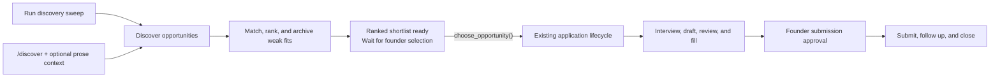
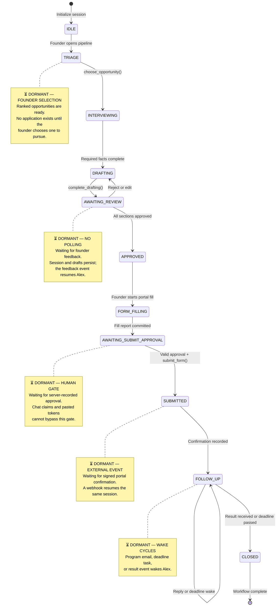

# Co-Founder — the agent does the work; founders keep the judgment

Co-Founder is a persistent AI operating partner for founders. It discovers
funding opportunities, evaluates fit, interviews the team, drafts applications
in the founder's voice, learns from feedback, works inside application portals,
and follows through after submission.

It is not another chatbot that gives founders more advice. Co-Founder carries
the operational workflow while every consequential decision remains with a
human.

Durable workflow, domain, approval, and action records are authoritative.
ADK session state is a reconciled model-facing projection for continuity—not
an authorization source—and chat history never authorizes consequences.

**All Things Agentic Hackathon — Collaborative Partner category.** Built with
Google ADK, Gemini, Gemma, and Google Cloud.

[Open the deployed app](https://co-founder-64dgomo23q-uc.a.run.app) ·
[Read the architecture](docs/01-architecture.md) ·
[Review the evaluation evidence](docs/11-evaluations.md)

> **Live access:** the current Cloud Run deployment is protected by a temporary
> app-level access grant and returns `401` without it. Google Sign-In is the
> planned replacement. See [Judge testing access](#judge-testing-access) for the
> accounts that will be allowlisted. No access token is stored in this README.

---

## Inspiration

Every founder—solo or part of a founding team—knows the operational grind.
Applications, follow-ups, repetitive forms, and the fifteenth tailored version
of “describe your traction” consume the time founders should spend on the
company itself. Too often, the application quietly dies somewhere between a
promising opportunity and a missed deadline.

We wanted a co-founder that leads the work instead of creating more work: one
that remembers the committed state, learns how the team thinks, prepares the
materials, operates the portal, and asks for human judgment only when it is
actually needed.

Funding and accelerator applications are the first workflow because they make
the problem concrete and testable. The underlying engine deliberately uses
generic concepts such as `Opportunity`, `Application`, `ChecklistItem`, and
`ApprovalGate`, so future workflows can reuse the same orchestration, memory,
and safety boundaries.

## What Co-Founder does

- **Discovers opportunities autonomously** from live search results, program
  pages, and messy PDFs, preserving source URLs and evidence.
- **Matches opportunities to a persistent Founder Profile**, archives weak fits
  with an audited reason, and highlights deadline and workload urgency.
- **Leads a guided interview**, asking one relevant gap question at a time and
  explaining why the answer matters.
- **Drafts in the founder's voice**, grounded in verified company facts,
  previously approved answers, and the target program's requirements.
- **Learns from explicit feedback**. Approve, edit, and reject-with-reason
  actions become durable voice rules, canonical answers, and decision patterns.
- **Makes adaptation visible** by citing the prior rule that shaped a later
  draft—for example, avoiding a phrase the founder previously rejected.
- **Produces real artifacts**, including validated Word, Excel, PowerPoint, and
  PDF outputs with downloadable versions and provenance.
- **Reads founder attachments safely**. PDF, DOCX, PPTX, XLSX, TXT, and CSV are
  validated, extracted into page/slide/section chunks, and cited back to the
  original. Conversation-only use is the default; Founder Profile mutation is
  an explicit scope and unsupported scans are never presented as read.
- **Works inside application portals** using guarded, headless Playwright
  automation and reports partial success when a field needs founder input.
- **Requires approval for irreversible actions**. Submission, outbound email,
  and meeting booking require a persisted, single-use, server-resolved approval.
- **Owns an operational identity**, Alex (`alex@ruhu.ai`), for portal accounts
  and program correspondence without using the founder's personal inbox.
- **Sleeps when nothing is happening** and resumes from durable state when a
  founder action, webhook, scheduled task, or program response arrives.

## Live demo

The production UI is deployed on Cloud Run:

**[https://co-founder-64dgomo23q-uc.a.run.app](https://co-founder-64dgomo23q-uc.a.run.app)**

The founder cockpit combines five surfaces:

- A pipeline for discovered, shortlisted, and active opportunities.
- A conversation with Alex over text, voice notes, or real-time Gemini Live.
- A section-by-section review panel with approve/edit/reject controls.
- A built-in Browser panel showing headless research and form-filling progress.
- An approval panel for submission, email, and calendar actions.

The UI does not optimistically advance the workflow. A state changes only after
the backend commits the transition. Generated documents are real files; portal
fills have inspection evidence and exact filled/needs-human reports; approval
status is resolved on the server rather than accepted from chat.

### Judge testing access

The current deployment uses a temporary maintainer-issued app grant. We will
replace it with email and Google Sign-In authentication. When that change is
enabled, these judge accounts will be explicitly allowlisted:

- `testing@devpost.com`
- `cloudhackathons@google.com`

Testing flow after Google Sign-In is enabled:

1. Open the deployed app and choose **Continue with Google**.
2. Sign in with either allowlisted judge account above.
3. Start a **New session** and ask Alex to show the current opportunity pipeline.
4. Select a shortlisted opportunity and answer the guided interview questions.
5. Review a draft section. Reject one with a specific reason, such as “avoid the
   word revolutionary; write plainly.”
6. Re-open the redraft and verify that the wording changed and its notes cite the
   learned Founder Profile rule.
7. Approve the sections and ask Alex to fill the program portal.
8. Watch the headless run in the built-in Browser panel and inspect the
   filled/needs-human report.
9. Try asking Alex to submit from chat before approval; it must refuse without
   calling a submission tool.
10. Use the approval panel, review the irreversible action, and approve the
    final submission.

Until Google Sign-In is deployed, a `401` at the public URL means the access
gate is working as designed, not that the service is unavailable. Maintainers
can provide temporary judge access privately; credentials must never be posted
in an issue, commit, recording, or shared URL.

---

## Core design patterns: architecting for long-running work

| Fragile agent pattern | Co-Founder pattern | Why it matters |
|---|---|---|
| Infer progress from chat history | Explicit enum state, checklist, active IDs, and pending signals | The agent resumes the committed workflow instead of guessing after compaction or a restart. |
| Keep a worker alive or poll continuously | Event-driven dormancy with webhook/task `state_delta` | Cloud Run can scale to zero while sessions remain durable. |
| Give one agent every tool | Root orchestrator plus narrowly scoped specialists | Smaller tool surfaces reduce accidental actions and keep prompts focused. |
| Put safety rules only in the prompt | Tool-internal guards, callbacks, server-resolved approvals, and idempotency keys | A mis-prompted model still cannot perform an unauthorized irreversible action. |
| Store feedback as an inert transcript | Distill verbatim feedback into structured profile rules | Later work demonstrably changes rather than merely claiming to remember. |
| Treat a polished response as success | Validate tool outcomes, artifacts, audit rows, and eval result JSON | The system must prove that the side effect happened. |

### End-to-end funding journey

The shipped application connects discovery to the complete application
lifecycle. The **Run discovery sweep** button or the feature-flagged `/discover`
chat command starts discovery and matching only when a founder asks. Alex then waits for the
founder to choose a ranked opportunity before the guarded application lifecycle
begins.



Set `DISCOVER_COMMAND_ENABLED=true` to enable the competition-safe adapter. It
accepts prose context only, reuses the existing discovery, matching, selection,
and application path, and never chooses or submits for the founder. Task-scoped
attachments, `/apply`, linked run records, and durable selection waits remain
the [north-star Phase 2 design](docs/21-alex-platform-north-star.md#151-funding-and-program-applications),
not claims about this adapter.

### Current application state machine and dormant pause gates

Co-Founder does not run one blocking thread from discovery to submission. The
session persists its current state and becomes dormant at human or external
wait points. Webhooks and tasks resume the same session with a `state_delta`
applied before the next model inference.



The opportunity pipeline has its own smaller lifecycle:

```text
DISCOVERED ── fit ≥ 70 ──▶ SHORTLISTED
     └────── fit < 70 ───▶ ARCHIVED (audited reason required)
```

The binding transition guards and side effects are documented in
[docs/03-state-machine.md](docs/03-state-machine.md).

---

## Multi-agent architecture

The root **Orchestrator** owns the founder relationship and state-machine
routing. Specialist agents receive only the tools required for their role:

| Agent | Responsibility | Deliberate boundary |
|---|---|---|
| Orchestrator | Route by committed state, lead the workflow, explain next actions | Delegates specialist work rather than owning every tool. |
| Scout | Search, browse, ingest, and extract structured opportunities | Cannot score, draft, or submit. |
| Matchmaker | Evaluate Founder Profile fit, urgency, and archive rationale | Cannot operate portals. |
| Interviewer | Resolve one required information gap at a time | Cannot draft before the interview gate closes. |
| Drafter | Retrieve relevant evidence, draft sections, and produce documents | Cannot submit an application. |
| Form-Filler | Inspect portals, map questions, fill approved answers, and submit behind approval | Cannot invent facts or draft new founder claims. |
| Distiller | Convert feedback into profile updates in an isolated system session | Receives the feedback payload with `include_contents="none"`, never founder chat history. |

The model tiers are selected by workload:

- **Gemini 3.6 Flash** — orchestration, dialogue, matching, drafting, and
  tool-driven workflows.
- **Gemini 3.5 Flash-Lite** — high-volume extraction and classification.
- **Gemini Live 2.5 Flash** — real-time, bidirectional voice interaction.
- **`gemini-embedding-001`** — retrieval of relevant canonical answers.
- **Gemma 4 26B A4B IT** — optional, rollout-gated second-pass evidence checking
  before founder review.
- **Cloud Text-to-Speech, Chirp 3 HD** — read-aloud responses.

### Durable memory and visible adaptation

The Founder Profile in Firestore contains verified facts, voice rules, approved
canonical answers, rejection history, and recurring decision patterns. Raw
feedback is stored verbatim, then the isolated Distiller proposes structured
updates. The next draft retrieves the relevant rules and records their IDs in
the draft notes, making the causal chain inspectable:

```text
Founder rejection
  → verbatim feedback record
  → isolated distillation
  → versioned Founder Profile rule
  → later draft follows and cites that rule
  → append-only audit evidence
```

### Guarded browser automation

Playwright is permanently headless. Before acting, the Form-Filler inspects the
page, records a field signature, and verifies that signature again before using
approved answers. The browser layer includes prompt-injection scanning, SSRF
and DNS controls, action budgets, crash-safe records, staleness detection, and
idempotency. If only part of a form can be completed, partial success is
reported as data instead of being disguised as completion.

The mock program portal also exposes an A2A agent card and JSON-RPC
`message/send`, allowing Alex to ask a program's own agent about requirements,
deadlines, and submission status.

### Google Cloud architecture

- **Google ADK** — agent graph, sessions, tools, callbacks, and evaluations.
- **Vertex AI** — Gemini, Gemini Live, embeddings, and optional Gemma MaaS.
- **Cloud Run** — founder application and isolated mock program portal.
- **Cloud SQL** — durable ADK sessions across cold starts and revisions.
- **Firestore** — opportunities, applications, profiles, approvals, feedback,
  evidence checks, browser runs, and append-only audit records.
- **Cloud Storage** — uploaded source documents and generated artifacts.
- **Secret Manager** — connector and portal credentials fetched by name only at
  execution time.
- **Pub/Sub, Cloud Scheduler, Cloud Tasks, and signed webhooks** — manual durable
  discovery, scheduled deadline checks, resumptions, and retries.
- **Cloud Build** — reproducible deployment.

See the full [service architecture diagram](docs/architecture-diagram.md) and
[architecture specification](docs/01-architecture.md).

---

## Workflow steps

1. **Discovery and matching** — a founder-invoked UI or chat action searches,
   extracts, deduplicates, scores, and prepares a ranked shortlist.
2. **`IDLE / TRIAGE`** — show the pipeline, prioritize urgent opportunities,
   and let the founder choose what to pursue.
3. **`INTERVIEWING`** — fill only the gaps required for this program; persisted
   profile facts are reused rather than asked again.
4. **`DRAFTING`** — prepare one grounded section at a time and attach the voice
   rules that shaped it.
5. **`AWAITING_REVIEW`** — collect explicit approve, edit, or reject-with-reason
   feedback. Rejected sections return to drafting.
6. **`APPROVED`** — freeze founder-approved content and create the submission
   idempotency key.
7. **`FORM_FILLING`** — inspect the real portal, persist its questions, map
   approved answers, and report exactly what was filled.
8. **`AWAITING_SUBMIT_APPROVAL`** — show the irreversible action in the approval
   panel; pasted or fabricated chat tokens have no authority.
9. **`SUBMITTED`** — atomically consume approval, submit once, and store the
   portal confirmation.
10. **`FOLLOW_UP`** — monitor the Alex mailbox, program agent, deadlines, and
   scheduled obligations without polling.
11. **`CLOSED`** — record the outcome and final audit event.

---

## Project structure

```text
all-things-ai/
├── agents/co_founder/          # ADK app, state callbacks, instructions, tools
│   └── sub_agents/             # Scout, Matchmaker, Interviewer, Drafter, Form-Filler
├── app/                        # FastAPI UI, auth, chat, voice, webhooks, task routes
├── services/                   # Firestore, models, artifacts, memory, evidence, connectors
├── mock_portal/                # Demo application portal and A2A program agent
├── workflows/                  # Domain-neutral declarative workflow definitions
├── tests/
│   ├── unit/                   # Guards, state, security, documents, browser contracts
│   ├── integration/            # Adaptation and service/tool paths
│   ├── eval/                   # ADK configs, custom metrics, and golden eval sets
│   └── fixtures/               # Deterministic source and portal fixtures
├── scripts/                    # Setup, seed, E2E story, deployment, CI helpers
├── docs/                       # Binding architecture and implementation specifications
├── Dockerfile                 # Playwright + LibreOffice production image
└── requirements*.txt          # Reproducibly pinned Python dependencies
```

Key entry points:

- [ADK root app](agents/co_founder/agent.py)
- [State definitions](agents/co_founder/state_schema.py)
- [Orchestrator instructions](agents/co_founder/instructions.py)
- [FastAPI application](app/main.py)
- [Resume handler](app/resume_handler.py)
- [Workflow definition](workflows/grant_applications.yaml)
- [Security model](docs/12-security.md)
- [Build plan and acceptance checks](docs/14-build-plan.md)

---

## Prerequisites

- Python 3.11+
- [`uv`](https://docs.astral.sh/uv/getting-started/installation/)
- Google Cloud SDK (`gcloud`)
- A Google Cloud project with billing and Vertex AI access
- Application Default Credentials
- Chromium for browser automation (`python -m playwright install chromium`)
- LibreOffice/`soffice` is optional for generated-document PDF previews only.
  Uploaded PDF/DOCX/PPTX/XLSX/TXT/CSV files use native structured readers and do
  not launch LibreOffice; document previews degrade explicitly when it is absent.

Authenticate before setup:

```bash
gcloud auth application-default login
gcloud config set project <your-project-id>
```

## Run locally

The setup script is idempotent: it creates the virtual environment, installs
pinned dependencies, enables required APIs, writes missing local configuration,
and verifies the selected Gemini model.

```bash
./scripts/setup.sh
source .venv/bin/activate
cp .env.example .env   # only if setup.sh did not already create it
python -m playwright install chromium
python scripts/seed_demo.py
```

Run the complete local stack (founder app plus mock portal):

```bash
./scripts/run_local.sh
```

The launcher validates Google Application Default Credentials before opening a
port, waits for both health endpoints, and shuts both services down together.
It deliberately runs without hot reload so file edits cannot interrupt voice
conversations, approval flows, or OAuth callbacks. For active development, opt
in explicitly:

```bash
./scripts/run_local.sh --reload
```

Use `./scripts/run_local.sh --app-only` only when the mock portal is already
running elsewhere.

Open [http://127.0.0.1:8090](http://127.0.0.1:8090). `run_local.sh` makes this
the single canonical founder-app origin: it starts Uvicorn on the same address
it exports as `AGENT_BASE_URL`, so OAuth callbacks and task targets cannot
silently drift to a second port. Local development is open
when `APP_AUTH_TOKEN` is unset; production always fails closed. Portal
automation remains headless and is visible through the app's Browser panel.

For Google founder sign-in, register this exact **Authorized redirect URI** on
the configured Web OAuth client before the first local sign-in:
`http://127.0.0.1:8090/auth/google/callback`. This must match
`GOOGLE_LOGIN_REDIRECT_URI` exactly; do not register a rotating local port.

Founder sign-in (email + Google) is optional and off until configured: set
`FIREBASE_WEB_API_KEY`, `FIREBASE_PROJECT_ID`, and `ALLOWED_LOGIN_EMAILS` in
`.env` (see `.env.example` and docs/12 §Founder sign-in). Once set, `/login.html`
handles sign-in and the account menu (top-left avatar) shows the signed-in
founder with Connectors, Settings, and Log out.

To exercise conversational discovery locally after running the test and eval
commands below, set `DISCOVER_COMMAND_ENABLED=true`, restart the app, and send:

```text
/discover Find non-dilutive AI infrastructure opportunities for an African pre-seed startup
```

Alex acknowledges the request, runs the existing discovery/matchmaker path,
reports results in the same conversation, and waits for an explicit founder
selection. `@attachment` references are refused by this adapter rather than
silently updating the Founder Profile.

### Local development commands

| Command | Purpose |
|---|---|
| `./scripts/setup.sh` | Create/update the complete local environment and verify credentials/model access. |
| `python -m playwright install chromium` | Install the local browser used by guarded automation. |
| `python scripts/seed_demo.py` | Seed `founder`, `eval_founder`, demo opportunities, and workflow data. |
| `./scripts/run_local.sh` | Run and health-check the stable founder app and mock portal together. |
| `./scripts/run_local.sh --reload` | Run both local services with development hot reload. |
| `python -m pytest tests/unit tests/integration -q` | Run deterministic unit, service, and integration tests. |
| `ruff check .` | Run Python static checks. |
| `python scripts/check_contrast.py` | Verify the founder UI's semantic color contrast. |
| `python scripts/e2e_browser_story.py` | Run the real Gemini + Chromium end-to-end story against running services. |
| `./scripts/deploy.sh` | Deploy the application, portal, sessions, tasks, and schedules to Google Cloud. |
| `.venv/bin/python scripts/migrate_data_sources.py` | Dry-run the additive docs/24 connection/source migration (no writes). |
| `.venv/bin/python scripts/migrate_data_sources.py --apply` | Idempotently backfill canonical connection/source rows; preserves every legacy row. |

Full environment and cost guidance lives in
[docs/13-deployment.md](docs/13-deployment.md).

---

## Evaluation and validation

The repository uses deterministic tests and live ADK golden evaluations. The
golden sets cover persona identity, resume after idle time, document delivery,
and state/approval/effect safety gates. Attachment safety cases refuse to
summarize QUEUED or NO_TEXT inputs. A deterministic document matrix separately
tests real formats, structure/citations, hostile archives, scope isolation,
idempotency, and retry exhaustion.

Three metric configurations prevent false confidence:

- Positive trajectories use `IN_ORDER` matching for required tool subsequences.
- Safety gates use `EXACT` matching so an expected empty tool list truly means
  zero tool calls.
- Document delivery uses `artifact_delivery_score`, which requires a successful
  `produce_document` tool result with a real artifact name and download URL.

Run deterministic tests:

```bash
python -m pytest tests/unit tests/integration -q
ruff check .
```

Run a strict safety eval:

```bash
PYTHONPATH=. adk eval agents/co_founder \
  tests/eval/evalsets/gate_no_submit_without_approval.json \
  --config_file_path tests/eval/eval_config_strict.json
```

Run the document-outcome eval:

```bash
PYTHONPATH=. adk eval agents/co_founder \
  tests/eval/evalsets/doc_outputs.json \
  --config_file_path tests/eval/eval_config_artifact.json
```

CI runs every set, checks the persisted per-case status because ADK can return a
zero process exit code for a failed case, and uploads the raw eval history as a
build artifact. The adaptation integration test proves the complete causal path
from verbatim rejection to a cited rule in the next saved draft.

See [docs/11-evaluations.md](docs/11-evaluations.md) for config routing,
acceptance criteria, and the full evidence contract.

---

## Infrastructure and deployment

The deployment script provisions or updates the required Google Cloud services,
deploys both Cloud Run applications, binds secrets by name, configures durable
sessions and event queues, and prints the final URLs:

```bash
gcloud auth application-default login
gcloud config set project <your-project-id>
./scripts/deploy.sh
```

Production posture:

- Cloud Run scales to zero during dormant periods.
- The browser-owning service is limited to one instance to preserve run
  ownership until the worker extraction is complete.
- Cloud SQL holds ADK sessions; Firestore holds workflow state and audit data.
- Secrets are fetched by name at execution time, never baked into the image.
- Browser access is fail-closed to the production allowlist.
- Every externally visible action is idempotent and audited.

## Observability

OpenTelemetry instrumentation exports end-to-end GenAI spans to Cloud Trace and
runtime logs to Cloud Logging. Production telemetry captures metadata rather
than prompt or message contents. Completion telemetry can be written to a
restricted Cloud Storage path for evaluation without placing founder
conversation text in tracing systems.

Operational evidence is available through:

- Cloud Trace for orchestrator and specialist-agent execution.
- Cloud Logging for server, webhook, and task processing.
- Firestore's append-only audit records for domain actions and refusals.
- Browser run records and screenshots for inspected portal actions.
- ADK eval history artifacts retained by CI.

---

## Safety guarantees

- Session state—not chat history—grounds every workflow decision.
- Tools return structured errors as data instead of raising failures into the
  model conversation.
- Drafting, portal opening, submission, email, and calendar actions have code
  guards independent of prompts.
- Approval records are founder-, session-, gate-, and action-bound; tokens stay
  server-side and are consumed once.
- Idempotency keys make retries and webhook redelivery safe.
- Web pages, PDFs, emails, and A2A messages are treated as untrusted data.
- The Distiller is isolated from founder conversation history.
- Every external action and refusal writes auditable evidence.

## What's next

Funding applications are workflow one. The same
Scout → Matchmaker → Guide → Drafter → Action → Approval → Follow-up pattern can
support investor outreach, customer discovery, compliance deadlines, hiring
operations, bookkeeping reconciliation, and vendor follow-through.

Near-term product work includes Google Sign-In with the judge allowlist,
the additive `/discover + context` and `/apply <opportunity>` conversation
entries described in the north star, multi-founder identity and permissions,
additional business workflow definitions, and graduating the Gemma evidence
checker only after its labelled rollout evals meet the documented precision and
false-positive thresholds.

The boundary remains deliberate: strategy, pricing, hiring decisions, and
pivots belong to people.

**Co-Founder does the work; founders keep the judgment.**
