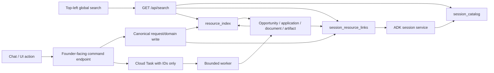

# 23 — Session-linked resources and global search

This specification makes Alex's durable work discoverable from the conversation
that produced or surfaced it. It covers conversations, discovery requests and
their searches, opportunities/leads, applications, documents, uploaded
artifacts, browser reports, and future workflow outputs. It also replaces the
current top-left recent-session picker with one typed global search surface.

This is a post-core compatibility slice. It does **not** make chat history the
workflow store, change an application guard, introduce WorkflowRun ahead of
21's migration phases, or widen any artifact permission. It prepares those
changes by reserving optional `run_id` and `journey_id` fields.

---

## 0. Decision

Session linkage is **provenance and navigation**, not ownership of domain state.

Three app-owned Firestore projections are added:

1. `resource_index/{resource_id}` — one canonical searchable row per logical,
   founder-visible resource;
2. `session_resource_links/{link_id}` — one immutable occurrence linking a
   resource to a founder conversation, with the relationship and launch/run
   provenance that caused the link;
3. `session_catalog/{session_id}` — a bounded searchable projection of an ADK
   conversation. ADK's session service remains the transcript and session-state
   authority.

The following equation is binding:

> Domain records own business truth. Runs own execution truth. ADK sessions own
> conversation state. The resource index makes work findable. Session links
> prove where that work entered the founder's experience.

A canonical record MAY carry an immutable `first_origin_session_id` as a
convenience, but it MUST NOT be used to enumerate every related session.
`session_resource_links` is the authority for that many-to-many relationship.

---

## 1. Problem statement

The current app has four incompatible patterns:

- produced documents, uploaded artifacts, browser runs, and approvals store a
  `session_id`;
- discovery receives a session for conversational `/discover`, but the durable
  receipt and discovered opportunities do not retain it;
- applications and feedback receive enough invocation context to identify a
  session but discard it at persistence time;
- `GET /api/sessions` loads recent ADK sessions, reads each transcript again,
  and the browser searches only the opening preview of the newest subset.

Consequences:

- a founder cannot search for “the Lagos accelerator search” or a document and
  jump back to the conversation that produced it;
- the discovery button cannot prove which conversation launched its work;
- adding `session_id` directly to `opportunities` would be wrong because a
  deduplicated opportunity can be surfaced by many discovery requests and
  sessions;
- global/latest-session notification shortcuts can misdeliver concurrent work;
- future leads, investor research, and customer discovery would each invent a
  different provenance/search adapter.

---

## 2. Scope and non-goals

### 2.1 In scope

- bind every **founder-initiated, user-visible output** to its originating
  session with a durable, idempotent link;
- retain additional links when an existing resource is resurfaced, referenced,
  selected, or continued in another session;
- persist searchable discovery request labels and the bounded queries actually
  executed;
- provide one authenticated, paginated, typed global search endpoint;
- make the top-left magnifying-glass surface search conversations, prior
  searches, opportunities/leads, applications, documents/artifacts, and other
  registered outputs;
- support read-through navigation without silently changing the active session;
- preserve exact request/run/session provenance through Cloud Tasks;
- backfill only evidence-supported legacy relationships;
- keep the projection compatible with 21's `run_id`, `journey_id`, inbox, and
  scoped-artifact migration.

### 2.2 Out of scope

- using chat history as workflow or domain truth;
- indexing full document bodies, attachment chunks, secrets, approval tokens,
  form values, raw emails, or browser page text;
- semantic/vector search in this slice;
- a universal workflow DSL or the full Phase-1A WorkflowRun runtime;
- changing application uniqueness (`founder_id + opportunity_id`);
- making a resource inaccessible merely because its originating session was
  deleted;
- binding autonomous/system-only deadline events to a guessed “latest” session;
- searching other founders' or workspaces' records;
- accepting model-authored collection names, resource refs, session IDs, search
  tokens, producer identities, or navigation actions.

---

## 3. Terminology and invariants

| Term | Meaning |
|---|---|
| **Resource** | One logical founder-visible work item, backed by a canonical domain/artifact record. |
| **Resource representation** | A file, preview, screenshot, draft section set, or other concrete form of a resource. It is not a second logical resource unless it has an independent lifecycle. |
| **Session link** | An immutable fact that one resource was created, discovered, selected, referenced, produced, or resurfaced in one conversation occurrence. |
| **Occurrence key** | Server-trusted idempotency identity for the link: request ID, invocation ID, selection request, run/step output key, or canonical resource ID. |
| **Session catalog** | Search/read projection of a conversation; never the transcript or workflow source of truth. |
| **Origin session** | The conversation from which a founder-launched request entered the system. A run may outlive it. |

Binding invariants:

1. One logical resource has one `resource_index` row.
2. One logical resource may have zero, one, or many session links.
3. Every founder-initiated visible output MUST have at least one committed
   session link before the operation reports durable success.
4. A system-created output with no founder conversation has no fabricated
   session link. It is correlated to its run/event and delivered through the
   founder inbox when Phase 1C exists.
5. Session linkage never grants access. Founder/workspace ownership is checked
   independently on every read.
6. The server resolves `founder_id` from authenticated identity and validates
   that the named ADK session belongs to that founder.
7. Agents and models never choose persistence scope, relationship, collection,
   producer identity, or navigation action.
8. Search projections contain bounded display metadata only. Canonical content
   is fetched through the existing authorized endpoint after selection.
9. A retry with the same occurrence identity creates no duplicate resource or
   link. An intentional repeated search uses a new `client_request_id` and is a
   new occurrence even when its text is identical.
10. Commit the canonical record, resource projection, and session link in one
    Firestore transaction/batch whenever they share Firestore. Publish UI/event
    hints only after the durable commit.
11. When a binary write must precede metadata, a failed metadata/link commit is
    reconciled as an orphan; it is never returned as a successful artifact.
12. Deleting a conversation follows retention policy for session-scoped source
    artifacts, but does not silently delete application/domain truth. Remaining
    resources render with an unavailable-origin tombstone where required.

---

## 4. Architecture



`resource_index` is an app-owned read model inspired by the one-logical-product
registry pattern. It does not replace `opportunities`, `applications`,
`documents`, `artifacts`, `browser_runs`, or future lead collections.

`session_resource_links` prevents the classic dedupe/provenance collision:
finding the same opportunity in two sessions creates two links to one
opportunity/resource, not two opportunities and not a mutable session array on
the opportunity.

---

## 5. Data contracts

All maps below are closed schemas. Unknown fields are rejected at service
boundaries. Timestamps are ISO-8601 UTC.

### 5.1 `resource_index/{resource_id}`

One row per logical resource. `resource_id` is deterministic:

```text
r_ + sha256("resource-index:v1" + founder_id + resource_type + canonical_ref)[:32]
```

| Field | Type | Contract |
|---|---|---|
| `schema_version` | int | Literal `1`. |
| `founder_id` | str | Owner, resolved server-side; indexed. |
| `resource_type` | str | Closed enum in §5.4. |
| `canonical_ref` | map | `{collection, id}` from a server registry; never model text. |
| `producer` | map | `{kind, id, output_key}` trusted server identity. |
| `origin` | map | `{first_session_id?, run_id?, journey_id?, request_id?, message_id?}`; first session is immutable convenience, not the link authority. |
| `title` | str | Escaped founder-facing title, max 200 chars. |
| `summary` | str | Bounded display summary, max 500 chars. No raw artifact/body text. |
| `status` | str | Type-specific current projection. |
| `visibility` | str | `primary`, `supporting`, or `internal`; global search defaults to `primary`. |
| `content_hash` | str\|null | Hash of the indexed display/provenance input, not necessarily file bytes. |
| `search_terms` | list[str] | Max 64 normalized tokens. |
| `search_prefixes` | list[str] | Max 256 bounded prefixes derived in code. |
| `representation_refs` | list[map] | Max 8 `{kind, ref}` opaque record-ID pointers; no content and no URLs of any kind. |
| `created_at`, `updated_at` | str | Ordering and staleness. |

Producer identity is mandatory for generated outputs and request records:

```json
{
  "kind": "discovery_request",
  "id": "req_789",
  "output_key": "request"
}
```

For a canonical domain entity such as an opportunity, `canonical_ref` is its
logical identity and `producer.output_key` is `"entity"`. For generated
documents, the logical resource is the **document lineage**
`(founder_id, doc_key)` — the same key that already drives the transactional
version counter — not one registry row per version. `canonical_ref` names the
newest registry row for that lineage; every produced version (registry row +
artifact file) is a representation, and `status` projects the latest version
(e.g. `"v3"`). Regenerating a document therefore updates one resource instead
of minting a new primary search hit per version. The artifact filename is
display/transport only and never an identity.

`representation_refs` entries are opaque server identifiers
(`{kind, ref}` where `ref` is a registry/artifact record ID). They MUST NOT be
URLs of any kind — signed or unsigned — because internal URLs can embed
session identifiers in query parameters (the attachment citation
`source_url` pattern is the counterexample).

### 5.2 `session_resource_links/{link_id}`

One immutable occurrence. `link_id` is deterministic:

```text
l_ + sha256(
  "session-resource-link:v1" + founder_id + session_id + occurrence_key +
  resource_id + relationship
)[:40]
```

| Field | Type | Contract |
|---|---|---|
| `schema_version` | int | Literal `1`. |
| `founder_id`, `session_id` | str | Both verified server-side; indexed. |
| `resource_id` | str | Existing `resource_index` row. |
| `resource_type` | str | Copied closed enum for indexed filtering. |
| `relationship` | str | `created`, `discovered`, `selected`, `produced`, or `continued`. (`referenced` and `resurfaced` are reserved enum values with **no v1 producer** — the schema accepts them for forward compatibility, but no code path emits them until a later slice names their deterministic triggers.) |
| `occurrence_key` | str | Trusted request/invocation/run output identity. |
| `request_id`, `message_id` | str\|null | Founder submission provenance. |
| `run_id`, `journey_id` | str\|null | Reserved now; required when the originating WorkflowRun exists. |
| `parent_resource_id` | str\|null | Discovery request → opportunity, application → document, etc. |
| `title_snapshot`, `summary_snapshot` | str | Bounded historical display/search snapshot from the occurrence. |
| `status_snapshot` | str | Status at link time; current status comes from `resource_index`. |
| `search_terms`, `search_prefixes` | list[str] | Bounded code-derived occurrence search data. |
| `occurred_at` | str | Immutable event time. |
| `updated_at` | str | May change only for projection-repair metadata, not event meaning. |
| `deleted_at` | str\|null | Tombstone-in-place. Set by session/retention deletion; never cleared. |

The link is append-only in meaning. A resource title/status may evolve; the
snapshot preserves what the founder saw in that session, while an opened result
loads the current authorized resource.

**Tombstones are load-bearing.** Because link IDs are deterministic, an
idempotent repair or backfill rerun would otherwise recreate a link that
deletion removed. Deletion therefore never physically deletes a link row in
place; it sets `deleted_at`. `register_session_resource`, repair, and backfill
treat an existing tombstoned row as final: they neither resurrect nor
duplicate it. Search excludes tombstoned links. Wholesale founder deletion
removes the rows physically because every producer of them is removed in the
same operation.

**Relationship triggers are named server code paths** (invariant 7 — agents
and models never choose them):

| Relationship | Producing code path | Occurrence key |
|---|---|---|
| `created` (discovery request) | `POST /api/discovery-requests` / `/discover` adapter | `client_request_id` |
| `discovered` | discovery worker per deduplicated extraction | `discovery_request_id + opportunity_id` |
| `selected` | `choose_opportunity` service call | ADK invocation ID of the selecting call |
| `created` / `continued` (application) | the same `choose_opportunity` transaction: `created` on its created branch, `continued` when it returns the existing application in a session with no prior link to it | ADK invocation ID |
| `produced` | `produce_document` / evidence-check / browser-report service writes | tool invocation ID (documents), report input hash (evidence), `run_id` (browser) |
| `created` (artifact) | `/api/ingest`, `/api/ingest/drive`, `/api/voice-note` boundary | ingestion/artifact ID |

### 5.3 `session_catalog/{session_id}`

| Field | Type | Contract |
|---|---|---|
| `schema_version` | int | Literal `1`. |
| `founder_id`, `session_id` | str | Owner and ADK session ID. Document ID equals session ID. |
| `title` | str | First useful founder request or explicit future rename; max 120 chars. |
| `preview` | str | Bounded current summary/preview; max 240 chars. |
| `message_count` | int | Founder-visible messages only; system notices excluded. |
| `resource_count` | int | **Advisory** projection count, updated best-effort after link commits (never inside the link transaction — see §6); repaired from links if drift is detected. |
| `resource_types` | list[str] | Bounded distinct visible types. |
| `status` | str | `active`, `archived`, or `deleted`. `archived`/`deleted` are **dormant values**: the product has no session archive/delete/rename operation today (`delete_session` is never called and ADK sessions live in SQL). The field exists so those future operations have a projection target; nothing in this slice sets them. |
| `search_terms`, `search_prefixes` | list[str] | Title/preview plus a bounded rolling set of founder-visible terms. |
| `created_at`, `updated_at` | str | From session lifecycle/events. |

ADK session events remain authoritative. The catalog may be rebuilt without
changing a transcript or session state. It MUST NOT copy tool payloads, hidden
system notices, secrets, or full message history.

### 5.4 Resource type registry

The registry is code-owned and versioned. Initial values:

| Type | Canonical record | Default visibility | Primary open target |
|---|---|---|---|
| `discovery_request` | `discovery_requests/{id}` | primary | request summary in origin session |
| `opportunity` | `opportunities/{id}` | primary | pipeline card/detail |
| `application` | `applications/{id}` | primary | application review panel |
| `document` | `documents/{id}` | primary | document preview/download card |
| `artifact` | `artifacts/{id}` | primary for founder uploads/voice notes; supporting for representations | authorized artifact detail/preview |
| `browser_report` | `browser_runs/{id}` | supporting | browser evidence/timeline |
| `evidence_report` | `evidence_checks/{id}` | supporting | application evidence panel |
| `lead` | future reviewed lead collection | primary | lead detail |
| `workflow_run` | future `workflow_runs/{id}` | primary | run card |

Feedback, approvals, audit rows, chunks, browser frames, and individual draft
sections remain searchable only through their parent resource/timeline unless a
later reviewed product contract promotes them. They still carry typed
session/run provenance where available. “All outputs” means all user-visible
logical work products, not every internal row becoming a top-level search hit.

### 5.5 Discovery request extensions

`discovery_requests/{request_hash}` adds:

| Field | Type | Contract |
|---|---|---|
| `origin_session_id` | str | Required for founder-launched requests. |
| `origin_message_id` | str\|null | ADK event/message identity when available. |
| `display_query` | str | Founder-visible normalized request label, max 500 chars. Default: “Profile-driven funding discovery”. |
| `executed_queries` | list[map] | Max 12 `{query_id, text, provider, status, result_count}`; text max 300 chars. |
| `result_opportunity_ids` | list[str] | Bounded first 100 IDs; full membership moves to a subcollection/run output in Phase 2. |
| `resource_id` | str | Corresponding resource-index ID. |

The context hash remains the idempotency/conflict input. `display_query` is not
an authority field and is never reparsed to launch work. Provider credentials,
raw response snippets, and source-page text are excluded. Because executed
provider queries are generated from Founder Profile facts (including
`decision_patterns`), the capture path MUST pass each query text through the
same sensitive-fact filter used for display surfaces **before persistence**,
not merely before rendering.

**Identity.** `discovery_request_id` **is** the existing receipt document ID —
`sha256(founder_id + ":" + client_request_id)[:32]` — not a new identity. API
responses may surface both the client's `request_id` and the derived
`discovery_request_id`; they name one document.

**Receipt state machine.** The current implementation creates the receipt at
worker-claim time with states `RUNNING | COMPLETE | FAILED`. This slice moves
creation to the public boundary, which requires:

```text
ACCEPTED ──enqueue ok──────────────► ACCEPTED (dispatch: queued)
ACCEPTED ──enqueue failed──────────► ACCEPTED (dispatch: error + retry state)
ACCEPTED ──worker claim────────────► RUNNING
RUNNING  ──lease expiry + reclaim──► RUNNING (new lease)
RUNNING  ──finish──────────────────► COMPLETE | FAILED
```

Dispatch outcome is metadata on the ACCEPTED receipt (`dispatch_status`,
`dispatch_error`), never a second request identity (§10). The worker claim
MUST use merge/update semantics that preserve `origin_session_id`,
`origin_message_id`, `display_query`, `resource_id`, and `created_at` — the
existing full-document `txn.set` replace would erase them and is a migration
defect until fixed. A claim that finds an `ACCEPTED` receipt with a matching
context hash proceeds; a mismatched hash remains a conflict.

### 5.6 Required Firestore indexes

Implementation adds reviewed composite indexes, split by purpose. **Search
scans order on immutable fields** (`occurred_at` for links, `created_at` for
resources and catalog rows) so keyset cursors are stable; **recency listings**
(the empty-query blank state) order on `updated_at` and are single-page:

- `session_catalog`: `founder_id ASC, status ASC, updated_at DESC` (recency);
- `session_catalog`: `founder_id ASC, search_prefixes ARRAY_CONTAINS, created_at DESC` (search scan);
- `session_resource_links`: `founder_id ASC, session_id ASC, occurred_at DESC`;
- `session_resource_links`: `founder_id ASC, search_prefixes ARRAY_CONTAINS, occurred_at DESC`;
- `session_resource_links`: `founder_id ASC, resource_type ASC, search_prefixes ARRAY_CONTAINS, occurred_at DESC`;
- `session_resource_links`: `founder_id ASC, resource_id ASC, occurred_at DESC`;
- `resource_index`: `founder_id ASC, visibility ASC, updated_at DESC` (recency);
- `resource_index`: `founder_id ASC, visibility ASC, search_prefixes ARRAY_CONTAINS, created_at DESC` (search scan).

Each shape is legal Firestore: equality filters plus at most one
`ARRAY_CONTAINS` plus one order field (with the implicit `__name__`
tiebreak). Multi-value `types=` filters are executed as **one query per
requested type** merged in code — never `in` + `array-contains` disjunction.

**These are the first composite indexes in this codebase.** The repository
currently has none, no index manifest, and an explicit habit of avoiding them.
Implementation MUST therefore add:

1. `infra/firestore.indexes.json` declaring every index above, plus a deploy
   step documented in 13;
2. a fake-store extension implementing the exact query semantics used
   (equality + one array-contains + order + start-after), so unit tests
   exercise real filter/order/cursor behavior instead of hand-written
   comprehensions;
3. a verification step against the Firestore emulator (or the production
   database at deploy time) for every declared query shape, so a missing index
   fails before founders see `FAILED_PRECONDITION`.

If Firestore rejects an index shape, change the query plan and document the
installed index; never fall back to an unbounded collection scan.

---

## 6. Write path contracts

All producers call one service seam:

```python
async def register_session_resource(
    *,
    founder_id: str,
    session_id: str,
    resource_type: ResourceType,
    canonical_collection: str,
    canonical_id: str,
    relationship: Relationship,
    occurrence_key: str,
    producer: ResourceProducer,
    title: str,
    summary: str,
    status: str,
    visibility: Visibility = Visibility.PRIMARY,
    request_id: str | None = None,
    message_id: str | None = None,
    run_id: str | None = None,
    journey_id: str | None = None,
    parent_resource_id: str | None = None,
    representation_refs: tuple[RepresentationRef, ...] = (),
) -> dict:
    """Register one canonical resource and its session occurrence.

    Every identifier and enum is server-resolved or validated against a closed
    registry. Returns errors as data. Repeating the same occurrence is a
    successful idempotent replay and returns the existing IDs.
    """
```

The function:

1. verifies owner/session membership;
2. resolves the canonical collection through a code registry;
3. applies the type's registered authorization resolver: founder/workspace
   ownership for private records, or an existing founder-scoped entitlement/
   discovery association for shared source facts such as an opportunity. (For
   `opportunity` in the current single-founder build, the resolver is the demo
   founder constant — the bounded `result_opportunity_ids` list cannot serve
   as an authorizer beyond its cap; full membership authorization arrives with
   the Phase-2 result subcollection.);
4. derives resource/link IDs and search data in code;
5. transactionally creates/updates the resource projection and creates the
   immutable link if absent. Session-catalog counters are **not** part of this
   transaction: a discovery sweep can commit dozens of links against one
   session in seconds, and serializing them on the catalog document would
   contend. Counters update best-effort after the commit (batched per request
   where possible) and are repairable from links;
6. writes an audit row containing IDs only;
7. returns `{status, resource_id, link_id, replayed}`.

It never accepts arbitrary collection paths or raw search tokens.

The current competition build has one founder and stores opportunities as
shared source records with founder-specific fit state. This slice does not
pretend that record is multi-tenant-safe. A future auth expansion MUST split
shared opportunity facts from founder-specific fit/pipeline projections before
multiple founders can coexist; the resource/link owner boundary is compatible
with that split but is not a substitute for it.

### 6.1 Producer coverage matrix

| Producer | Canonical write | Required session relationship |
|---|---|---|
| New session / chat turn / proactive reply | ADK event | update `session_catalog`; no resource for ordinary prose |
| `/discover` or discovery UI action | discovery receipt | `created` discovery request; executed queries update that resource's bounded search projection |
| Discovery extraction | deduped opportunity | `discovered`, occurrence keyed by request + opportunity |
| Matchmaker | opportunity update | updates resource current projection; does not invent a new link |
| Founder selects opportunity | application | `selected` opportunity and `created`/`continued` application |
| Interview/draft/review | application child state | update application resource; feedback stays parent-timeline data |
| `produce_document` | document + artifact bytes | `produced` document-lineage resource (`doc_key`); each version/file is a representation |
| Founder upload (`/api/ingest`) | artifact + ingestion | `created` artifact |
| Drive ingest (`/api/ingest/drive`, `ingest_document` drive branch) | artifact + ingestion | `created` artifact. **Precondition:** the Drive path currently writes a legacy `ingestions` row with no `session_id` and no paired `artifacts` record; this slice unifies it onto `register_artifact_ingestion` with a required, validated session before registering the resource |
| Voice note | artifact | `created` artifact. **Precondition:** `/api/voice-note` currently accepts no session and persists no Firestore record at all; this slice adds the required session parameter, the `artifacts` canonical record, and only then the resource/link |
| Browser fill/browse | browser run/report | `produced` supporting resource |
| Evidence checker | evidence report | `produced` supporting resource under the application; occurrence keyed by report input hash |
| Gmail / Alex-mail scan | `applications.followups` append | System producer, **no fabricated session link** (invariant 4). The current appender matches applications by fuzzy name substring with no idempotency key and reports to the latest session; this slice classifies it as internal child data and requires an idempotency key on the append in the same change. Inbox delivery arrives with Phase 1C |
| Drive sync (`/api/documents/{name}/sync_drive`) | external Drive copy | Occurrence on the document resource (`produced` representation export). Its missing approval row is a docs/15 conformance gap tracked separately; this slice only records the occurrence |
| Future lead discovery | deduped lead | `discovered`, same many-to-many rule as opportunities |

**Internal collections that are explicitly not resources** (so the
regeneration test has a closed answer): `founder_state` (proactive-delivery
routing — superseded for receipted work by §6.2 and by the Phase-1C inbox;
MUST enter the collection registry), `document_versions`, `source_state`,
`integrations`, `gmail_state`, `alex_mail_state`, `portal_registrations`,
`oauth_states`, `audit`, `feedback`, `approvals`, and all subcollections
(`frames`, `actions`, `chunks`, `update_receipts`).

Every implementation PR MUST regenerate this matrix from real writers with
`rg` and account for each caller. Adding a new founder-visible producer without
registering it is a failing test.

### 6.2 Founder-facing discovery boundary

The UI MUST NOT call `/tasks/discover` directly. Add:

```text
POST /api/discovery-requests
```

Request:

```json
{
  "session_id": "s_abc",
  "client_request_id": "req_789",
  "context": "African AI infrastructure accelerators"
}
```

The endpoint validates the session and request, transactionally persists the
receipt/resource/link, then enqueues an internal task carrying only stable IDs:

```json
{
  "discovery_request_id": "dr_123",
  "founder_id": "founder"
}
```

`/tasks/discover` loads authority and context from the receipt. It does not
accept UI-supplied session/founder authority. Local development invokes the same
worker function after the same durable commit.

**Completion delivery is origin-bound.** The worker's completion notice MUST
target `receipt.origin_session_id`. The latest-session fallback
(`_notify_founder(notice, session_id=None)` →
`founder_state.active_session_id`) is **forbidden for receipted work**: a
redelivered task recovers its target from the receipt, never from the payload
and never from whichever session the founder touched last. If the origin
session no longer exists, the completion is recorded on the receipt and no
wake is fabricated.

Deadline-scan and mail-scan wakes are pre-existing latest-session behavior
that this slice neither adopts nor extends: they create no session links, no
catalog resources, and no receipts, and they are replaced wholesale by the
Phase-1C run-correlated inbox. They are named here so the producer-coverage
test classifies them instead of missing them.

Response is `202` after durable acceptance:

```json
{
  "status": "accepted",
  "request_id": "req_789",
  "discovery_request_id": "dr_123",
  "resource_id": "r_...",
  "session_id": "s_abc",
  "duplicate": false
}
```

Duplicate delivery returns the same IDs. Reusing the request ID with different
normalized context returns a conflict and launches nothing.

**North-star mapping.** `POST /api/discovery-requests` is a compatibility
precursor to 21 §18's unified launch API and will be adapter-mapped under it,
not kept as a permanent second launch shape. When `opportunity_discovery:v1`
runs exist, the receipt remains the `discovery_request` resource, the run
becomes a separate `workflow_run` resource, and `parent_resource_id` links
them — additive, never a re-point.

### 6.3 Session catalog maintenance

The catalog is updated only by events already waking the app:

- session creation;
- accepted founder chat message;
- committed agent response;
- voice transcript persistence (note: the live-voice handler currently
  swallows transcript-persist failures with a bare `except`; the catalog
  update on this event MUST emit the same repair/audit marker on failure
  instead of inheriting that silent loss);
- resource-link commit;
- explicit archive/delete/rename — **future events**: these session
  operations do not exist yet (see §5.3) and are not built by this slice.

There is no polling or recurring reindex job. A bounded repair command may be
run explicitly during migration or operations. Catalog failure after an ADK
event returns the conversational response but emits a repair/audit marker; it
must not corrupt session state. Resource operations are stricter: their
resource/link commit is part of durable success.

---

## 7. Search contract

### 7.1 Endpoint

```text
GET /api/search?q=<text>&types=<csv>&session_id=<optional>&cursor=<opaque>&limit=30
```

Rules:

- identity comes from the authenticated founder; there is no `founder_id`
  query parameter;
- `q` is Unicode NFKC-normalized, case-folded, whitespace-collapsed, and capped
  at 160 characters;
- empty `q` returns recent conversations and primary resources;
- non-empty `q` requires at least two useful characters;
- `types` is validated against the closed resource registry plus `session`;
  multi-value `types` executes one indexed query per type, merged in code;
- `session_id`, if present, must belong to the founder and scopes resource
  results to that session's occurrences;
- limit is 1–50;
- **result unit:** results are **grouped by resource**. The primary row for a
  resource comes from `resource_index` (current title/status) and carries its
  most recent matching occurrence (`session_id`, `relationship`,
  `occurred_at`, snapshots) plus `occurrence_count`. A resource with zero
  links (`legacy_unlinked` backfill rows, retained resources whose origin was
  deleted, system-created outputs) is a first-class hit with
  `session_id: null`. With a `session_id` filter, the unit switches to that
  session's occurrence rows. Conversations are `session_catalog` rows. Two
  intentionally repeated searches are two `discovery_request` resources and
  therefore two rows — resource grouping never merges them;
- **cursor:** opaque, versioned, filter-bound, and keyset-based on each
  stream's **immutable** scan order — `(occurred_at, link_id)` for occurrence
  streams, `(created_at, id)` for resource and catalog streams. A cursor
  issued for different filters is rejected. Mutable fields (`updated_at`,
  status) never participate in cursor position, so a projection mutated
  between pages can neither be skipped nor duplicated;
- empty `q` (the blank state) is a bounded recency listing ordered by
  `updated_at` with `next_cursor: null` — it does not paginate;
- **truncation is explicit:** when the candidate cap is reached before the
  scan is exhausted, the response sets `"truncated": true` and the UI tells
  the founder to narrow the query. Silent omission of older matches is a
  contract violation. Globally rank-ordered pagination is out of scope for the
  Firestore backend; it arrives, if ever, with the PostgreSQL backend;
- results are owner-filtered before ranking; unknown/foreign IDs never reveal
  existence;
- no result contains raw document text, event payloads, storage URLs of any
  kind, approval tokens or any other approval-record field, form values, or
  hidden system messages.

Response:

```json
{
  "status": "success",
  "query": "africa accelerator",
  "results": [
    {
      "result_id": "r_...",
      "result_type": "opportunity",
      "resource_id": "r_...",
      "canonical_ref": {"collection": "opportunities", "id": "opp_42"},
      "title": "Africa AI Accelerator",
      "subtitle": "Shortlisted · closes in 12 days",
      "status": "SHORTLISTED",
      "occurrence_count": 2,
      "latest_occurrence": {
        "link_id": "l_...",
        "relationship": "discovered",
        "session_id": "s_abc",
        "occurred_at": "2026-08-25T12:00:00Z",
        "title_snapshot": "Africa AI Accelerator"
      },
      "focus": {"kind": "opportunity", "id": "opp_42"}
    }
  ],
  "truncated": false,
  "next_cursor": null
}
```

`focus.kind` is a closed server enum. The client maps it to existing local UI
actions; the server does not return executable URLs or JavaScript.

### 7.2 Firestore query and ranking

This slice provides deterministic lexical search, not semantic search:

1. normalize query and derive terms/prefixes in shared code;
2. choose the index probe deterministically: for each query term take its
   prefix capped at 16 characters, then probe with the **longest** such prefix
   (ties broken lexicographically). Longer terms are the more selective probe;
   "most selective" by observed statistics is unknowable without counters and
   is not attempted;
3. query owner + probe prefix + optional type/session using a declared index,
   scanning in the stream's immutable keyset order (§7.1);
4. fetch at most 5× the requested page size, capped at 250 candidates per
   stream; if the cap is reached before scan exhaustion, set `truncated`;
5. require every remaining query term to match a term/prefix in code;
6. group candidate occurrences and resource rows by `resource_id` (§7.1
   result unit); attach the latest matching occurrence and count;
7. **rank within the page only** — exact title, title prefix,
   all-title-token, summary, then recency. Rank is presentation order for the
   rows already selected by the scan; it never changes which rows a cursor
   walk visits, so pagination stays keyset-stable;
8. merge session-catalog and resource streams by their immutable keyset with
   stable tie-breaking; the returned `next_cursor` encodes each stream's scan
   frontier (the last **scanned** position, not the last displayed row).

Token/prefix generation:

- strip control/format characters;
- keep letters and numbers across scripts;
- tokens are 2–48 characters, max 64 unique terms;
- prefixes cover lengths 2–16, max 256 unique values;
- hashes, tokens, UUIDs, and opaque IDs may be indexed as whole terms for exact
  support lookup but do not generate every prefix;
- no embeddings or model calls occur on the search request path.

Firestore is not treated as an unbounded full-text engine. If the candidate
caps or query quality become insufficient, move the same projection contract to
app-owned PostgreSQL full-text search; do not query ADK's internal tables or
change the public API.

### 7.3 Searchable discovery history

Each discovery request is one primary “Search” result titled from
`display_query`. Its bounded `executed_queries` are indexed into that same
resource, so searching for an executed provider query returns the parent
request rather than manufacturing a second logical resource for an internal
query attempt. The request detail shows query text, provider-neutral status,
result count, and time.

Opening a previous search is read-only. “Run again” is a separate explicit
action that creates a new `client_request_id`; opening a result never launches
work.

---

## 8. UI contract

The existing top-left magnifying-glass button becomes **Search**, not “Search
sessions”. It opens one accessible command/search dialog.

### 8.1 Behavior

- `Cmd+K` / `Ctrl+K` toggles the dialog;
- typing is debounced 200 ms and cancels/ignores stale responses by request
  generation;
- Up/Down moves active result, Enter opens it, Escape closes;
- blank state shows recent conversations and work;
- non-empty results group into Conversations, Searches, Opportunities & Leads,
  Applications, and Documents & Artifacts;
- type chips filter without changing the query;
- loading retains the prior results and marks them stale instead of flashing an
  empty dialog;
- pagination uses “Show more” or sentinel-on-user-scroll only; no background
  polling;
- every row shows type, title, bounded context, status, relative time, and the
  origin session label;
- no third-party logos or remote content render in results.

### 8.2 Navigation

Selecting a result defaults to **read-through**:

1. validate/fetch the origin session;
2. open its transcript without changing `localStorage` or the active-session
   pointer;
3. load the canonical resource through its authorized endpoint;
4. focus the matching pipeline card, review application, document preview, or
   request summary;
5. provide an explicit `Resume` control to make that conversation active.

If the result belongs to the current session, focus it in place.

**Live voice locks the active-session binding on every path.** While a live
voice call is active: Resume is refused; creating a new session is refused;
and read-through MUST NOT touch the live-session binding — today
`viewSession` reassigns the global `sessionId` that both the live WebSocket
and mid-call typed-input routing key on, so a read-through implemented that
way would silently re-route the founder's typed messages. Read-through during
a call either parks the viewed transcript separately (the `viewingSession`
pattern) without reassigning the active identifier, or is refused. The
implementation MUST close all three switch paths (`resumeSession`,
`viewSession`, `newSession`), not only the one guarded today.

A missing/deleted origin session shows the resource with “Origin conversation
unavailable”; it never turns a resource 404 into an existence oracle.

The dialog copy says: “Search conversations and Alex's work.” It MUST NOT claim
that applications or drafts are owned by a session.

### 8.3 Visual rules

- use only semantic tokens and existing type/space scales from 16;
- use the generated Phosphor sprite; `magnifying-glass`, `chat-circle`,
  `compass`, `target`, and file icons already exist;
- visible focus, `aria-activedescendant` or equivalent listbox semantics, and
  44 px touch targets on mobile;
- selected/type/status meaning uses text/icon/form as well as color;
- `scripts/check_contrast.py` and `scripts/build_icons.py` remain green.

---

## 9. Authorization, privacy, retention, and deletion

1. Search resolves founder/workspace identity server-side before any query.
2. `canonical_ref` is resolved through a closed registry whose loader applies
   the canonical collection's ownership check again.
3. Foreign, deleted, unknown, and inaccessible resources collapse to omission
   or one generic 404 on direct open.
4. Search indexes only display metadata already allowed on a founder-owned card.
5. Secret values, credentials, tokens, email bodies, profile fact values marked
   sensitive, raw attachment chunks, browser page text, and form mappings are
   forbidden search inputs. **Approval records are a binding example**: the
   `approvals` collection stores a live plaintext bearer `token` and
   unredacted `details` (full outbound email bodies, portal emails). Approvals
   are not a resource type (§5.4), and a test MUST assert that no approval
   field ever reaches an index row or search response.
6. Audit detail contains resource/link/session/run IDs, never indexed text.
7. **Deletion/export reality check (binding rescope).** The product currently
   has **no** founder-export route, **no** founder-deletion route, **no**
   session archive/delete/rename operation, and **no** collection-accessor
   registry or coverage test — the docs/02 registry is an unchecked checkbox
   and the code has drifted to 19+ collections including the accessor-less
   `founder_state`. This spec therefore does **not** claim incremental
   inclusion into existing coverage. It requires instead:
   - Work item 1 creates a **code-level collection registry** in
     `services/firestore.py` and an introspection coverage test that fails
     when any `collection("…")` literal in `services/` or `app/` is absent
     from the registry;
   - the three new collections register there on creation;
   - link deletion semantics are defined **now** via `deleted_at` tombstones
     (§5.2) so a future deletion implementation cannot be resurrected by
     idempotent repair/backfill;
   - the future export/deletion implementation enumerates from the registry;
     until it exists, the §13 acceptance for this area asserts registry
     membership and tombstone behavior only.
8. When founder export exists, it includes session catalog, links, resource
   index rows, and the referenced canonical records the founder is authorized
   to export — enumerated from the registry, never a hand-written list.
9. When founder deletion exists, it removes projections and canonical records
   so no orphaned search row remains discoverable.
10. A future workspace/auth expansion replaces the current demo `FOUNDER_ID`
    constant without changing these record boundaries.

---

## 10. Failure and reconciliation

| Failure | Required behavior |
|---|---|
| Session does not exist or belongs to another founder | Generic not-found; no receipt/resource/link. |
| Resource canonical write fails | No projection/link; error as data. |
| Resource/link transaction conflicts | Retry boundedly; deterministic IDs make replay safe. |
| Cloud Task dispatch fails after durable request acceptance | Receipt stays accepted with dispatch error/retry state; UI shows truthful failure, no second request identity. |
| Worker redelivery | Reuse receipt and occurrence keys; no duplicate queries/opportunity links. |
| Crash mid-sweep after `set_source_hash` but before all records saved | Known pre-existing silent-loss window (`source_state` marks the source unchanged before per-record saves commit). The discovered-link registration MUST commit per record with the record, so a partially saved sweep produces links exactly for what was saved; the source-hash ordering fix is tracked with the worker changes. |
| Crash between document bytes and registry row | Pre-existing orphan-blob window in `produce_document` (bytes then registry, no transaction). Resource/link registration commits with the registry row, so an orphan blob has no resource; reconciliation treats it as §3.11 orphan cleanup. |
| Resource indexed but binary missing | Mark resource failed/unavailable; never serve a broken download. |
| Link references missing resource | Hide from search, emit repair audit/metric; repair or tombstone explicitly. |
| Session catalog missing | Conversation still works; event-driven repair recreates projection. |
| Search candidate/index error | Return error as data and preserve the current UI result set. |
| Deleted origin session | Resource remains accessible if otherwise retained; show origin tombstone. |

Operational metrics:

- resource registrations/replays/failures by type;
- founder-initiated outputs missing a session link (target zero);
- dangling link/resource refs;
- search latency/candidate count/result count by type, without query text;
- cursor rejection and authorization omission counts;
- repair count and age of oldest unrepaired projection.

There is no periodic repair poll. Repair runs explicitly at deploy/migration,
on a relevant session/resource wake, or through an operator command.

---

## 11. Migration and implementation order

### Work item 1 — Contracts and registry

- add the **code-level collection registry** to `services/firestore.py`
  covering every existing collection (including `founder_state`) plus the
  three new ones, and the introspection coverage test that fails on any
  unregistered `collection("…")` literal — this lands first because §9.7 and
  §13 depend on it;
- add typed enums/dataclasses and the closed canonical resource registry;
- add deterministic ID, text normalization, prefix, and cursor golden vectors;
- add `infra/firestore.indexes.json`, its deploy step (13), and the
  query-capable fake-store extension from §5.6 — the existing conftest fake
  is a function-monkeypatch table with no query engine and cannot exercise
  any of these queries;
- update 02's data model in the same change (and the 07/10 route/UI tables
  when their surfaces change in later items).

### Work item 2 — Core write/read service

- implement `register_session_resource`, resource/link ownership reads, and
  session catalog writes;
- prove transactional idempotency and cross-founder refusal;
- add a producer-coverage registry that tests enumerate rather than relying on
  a hard-coded collection count.

### Work item 3 — Discovery boundary first

- **first**, extend the receipt schema and make the worker claim merge-safe
  (§5.5) — landing the public endpoint before this would let the first claim
  erase the origin fields;
- add `POST /api/discovery-requests`;
- remove the UI's direct `/tasks/discover` call;
- make the worker load its durable receipt and deliver its completion notice
  to `receipt.origin_session_id` (§6.2);
- persist executed query records (sensitivity-filtered) and
  request → opportunity links;
- retain `/discover` compatibility by routing it through the same service;
- rewrite the tests this breaks by design: the whitespace-exact source grep in
  `test_findings_hardening.py` (discover enqueue), the "manual button"
  empty-body test, and the hard-coded route list in `test_app_server.py`.

### Work item 4 — Remaining producers

- application selection/continuation;
- documents and their artifact representations;
- uploaded/Drive artifacts and voice notes;
- browser reports and evidence checks;
- future lead registration seam;
- audit every producer-matrix row.

### Work item 5 — Backfill

Run an idempotent, resumable script with dry-run and bounded pages:

- direct: documents, uploaded artifacts, ingestions, browser runs, approvals;
- exact inference only: discovery receipts whose `client_request_id` appears in
  exactly one founder ADK session invocation; applications with one exact
  session-bearing creation artifact/approval/event;
- ambiguous: create the canonical resource projection but no session link;
  report as `legacy_unlinked`, never infer from timestamp proximity;
- opportunities discovered before receipt membership exists remain unlinked;
- tombstone-aware: a link whose deterministic ID exists tombstoned is final —
  backfill neither resurrects nor duplicates it;
- write a JSON summary with counts only, no founder content.

The script must be safe to rerun and must never modify optional reference repos.

### Work item 6 — Search API

- implement shared normalization/ranking/cursor code;
- add owner-scoped indexed queries and candidate caps;
- add `GET /api/search` and `GET /api/sessions/{session_id}/resources`;
- load canonical details only after authorization and selection.

### Work item 7 — Top-left UI

- ship the search dialog reading the new API first; delete the old
  `GET /api/sessions` implementation only after parity tests pass **and**
  after `TestSessionHistory` is rewritten — otherwise CI blocks the migration
  mid-flight;
- replace session-only modal with typed grouped results;
- preserve read-through versus Resume semantics and close all three
  voice-call switch paths (§8.2);
- add keyboard behavior, stale-request suppression, empty/error/truncated
  states, and focus navigation;
- keep the no-framework/no-build design.

### Work item 8 — Reconciliation and registry coverage

- add explicit projection repair/backfill command (tombstone-aware);
- assert the three collections are present in the WI-1 collection registry
  and carry defined tombstone/retention semantics (full export/deletion
  implementation is a separate future work item per §9.7 — this slice does
  not pretend to extend coverage that does not exist);
- add metrics and production index verification.

Do not start by rewriting existing pipeline/domain collections. Land the
projection and dual writes first, backfill, switch reads, then remove the old
`GET /api/sessions` N+1 implementation only after parity tests pass.

---

## 12. Test matrix

### Identity and data model

- same founder/session/occurrence/resource/relationship replays one link;
- same opportunity found by two sessions produces one opportunity/resource and
  two links;
- same search text sent intentionally with two request IDs produces two request
  resources/occurrences;
- foreign session/resource combinations reveal nothing and create nothing;
- model-supplied collection/ref/relationship/token fields cannot reach the
  service seam;
- resource status updates do not erase historical link snapshots.

### Producer coverage

- every founder-visible producer in §6.1 either registers a resource/link or is
  explicitly classified as ordinary conversation/internal child data;
- document production extracts session from `ToolContext`, not model args;
- voice-note API requires and verifies a session;
- discovery UI and `/discover` converge on the same durable request contract;
- internal task routes cannot be used as UI authority shortcuts.

### Search

- results older than the newest 30 sessions remain findable;
- a term from a later bounded session preview/title is findable;
- prior discovery requests and executed searches are findable by query text;
- opportunities, applications, and documents return typed focus targets and
  originating sessions;
- **result unit:** one opportunity linked in two sessions returns one grouped
  row with `occurrence_count == 2` and both occurrences navigable; the same
  query with `session_id=A` returns only A's occurrence; a `legacy_unlinked`
  resource is findable with `session_id: null` and opens with the
  origin-unavailable tombstone;
- **pagination stability:** mutating a returned resource's status/`updated_at`
  between page 1 and page 2 causes neither a skip nor a duplicate across the
  cursor walk (cursors bind to immutable scan keys only);
- **truncation:** with more matches than the candidate cap, the response sets
  `truncated: true` and the oldest match is either reachable by cursor
  exhaustion or explicitly reported as truncated — never silently absent;
- type/session filters, within-page ranking, malformed/mismatched cursors,
  candidate caps, and Unicode normalization are covered;
- no full artifact/chunk/page/form/secret value appears in indexed rows or API
  responses; **no field of any `approvals` record** (token, details, subject
  hash) appears in any index row or search response;
- query timing/result shape does not expose a foreign resource.

### UI and lifecycle

- Cmd/Ctrl+K, arrows, Enter, Escape, focus return, mobile touch targets, and
  screen-reader labels work;
- out-of-order search responses cannot replace newer results;
- opening a result does not resume/switch the active session;
- Resume changes active session only after explicit founder action;
- live voice blocks **all three** switch paths (resume, view/read-through
  reassignment, new session) and never re-routes mid-call typed input;
- deleted origin sessions show a tombstone while retained resources still open;
- a tombstoned link stays excluded from search and is not resurrected by
  repair or backfill reruns.

### Reliability

- forced failure at every commit/dispatch boundary leaves no claimed success
  without canonical record + resource + required link;
- worker/task retries do not duplicate query or opportunity links;
- the worker claim preserves `origin_session_id`, `display_query`, and
  `resource_id` written at acceptance (merge-safe claim);
- a completed discovery delivers its notice to `receipt.origin_session_id`
  even when the founder has since touched another session, and even on
  redelivery from a different process (target recovered from the receipt,
  never the payload or the latest-session pointer);
- backfill dry-run writes nothing; rerun is idempotent; ambiguous rows stay
  unlinked;
- projection repair reconstructs the same visible catalog without reading raw
  document bodies into search.

---

## 13. Acceptance checks

- [ ] Every founder-initiated visible output has a durable session link before
      its API/tool reports success.
- [ ] One opportunity or future lead can appear in two sessions without entity
      duplication, overwritten origin, or an unbounded session-ID array.
- [ ] The discovery button and conversational `/discover` use the same public
      request service; the UI never calls `/tasks/discover` directly.
- [ ] A discovery receipt records origin session, display query, executed
      bounded searches, result IDs, and its resource ID.
- [ ] Documents, uploads, voice notes, applications, browser reports, and
      evidence reports appear in their origin conversations and global search.
- [ ] Top-left search finds conversations, previous searches, opportunities/
      leads, applications, documents, and artifacts with typed navigation.
- [ ] Search is server-side, founder-scoped, indexed, paginated, candidate-
      bounded, model-free, and does not scan ADK histories per query.
- [ ] Opening a result is read-through; resuming a session remains explicit.
- [ ] System-only work is run/event-correlated and never assigned to a global
      latest session merely to satisfy linkage.
- [ ] Legacy backfill links only exact evidence and reports ambiguous rows as
      unlinked.
- [ ] The WI-1 collection registry exists with its introspection coverage
      test, includes all three new collections (and `founder_state`), and
      link tombstone semantics are implemented and tested; future
      export/deletion enumerates from this registry (§9.7).
- [ ] Discovery completion notices target the receipt's origin session; no
      receipted work uses the latest-session fallback.
- [ ] All tests in §12 pass, existing state-machine/approval/browser/document
      suites remain green, and design/icon/contrast checks pass.
