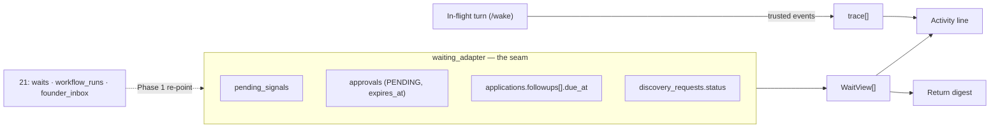

# 24 — Activity and waiting

This specification makes Alex's work legible in the two regimes it actually
runs in: **attention-time**, where the founder is watching a turn for seconds
to minutes, and **absence-time**, where nobody is there for hours to weeks.
It covers the in-conversation activity line, the wait states, and the return
digest.

This is a post-core presentation slice. It adds **no durable collection**, no
new workflow state, and no second source of run truth. It does not introduce
WorkflowRun ahead of 21's phases, weaken a guard, or change an approval. It
reads records that already exist and renders them honestly.

---

## 0. Decision

Two regimes share one vocabulary and almost nothing else.

| | Attention-time | Absence-time |
|---|---|---|
| Duration | 2 s – 2 min | hours – weeks |
| Founder | watching | elsewhere |
| Question | "is it alive?" | "who is blocked, and when does it move?" |
| Clock | elapsed (`38.4s`) | absolute + expectation (`since Tue · chase Fri`) |
| Motion | spinner while a worker executes | **none** |
| Source | in-flight turn events | durable records, read on load |

The following equations are binding:

> Motion means a worker is executing. A dormant wait shows no motion, because
> nothing is running.

> An open wait always states its next check. A wait without one is
> indistinguishable from a hang.

> Blocked-on-the-founder is a task. Everything else is information. They never
> look alike.

**The digest is derived, never stored.** It is computed per request from
existing records. There is no new collection, no dual write, no backfill, no
repair path, and therefore nothing to migrate when 21's `workflow_runs`,
`waits`, and `founder_inbox` arrive — only the adapter behind it is re-pointed.

---

## 1. Problem statement

- A turn that searches, fetches, hands off between agents and browses for 40
  seconds renders three grey dots (`setThinking` in `app/static/index.html`).
- `/wake` already iterates every ADK event and discards everything except text,
  so the signal for a rich indicator is produced and thrown away.
- A background discovery run reports a toast and then nothing until its report
  lands; the UI has no periodic poll (correctly — 10), so the founder cannot
  distinguish work from a hang.
- Nothing anywhere renders **what Alex is waiting for**, even though
  `pending_signals` has declared it since day one (03 §dormancy).
- A founder returning after two days has no triage surface. The transcript is a
  log, not an answer to "what needs me?".

---

## 2. Scope and non-goals

### 2.1 In scope

- one activity component with six states, used by both regimes;
- a closed, server-owned step vocabulary in founder voice;
- wait states derived from `pending_signals`, approvals, followups and
  discovery receipts;
- a return digest ordered by who is blocked;
- one adapter seam so the Phase-1 migration changes no component and no copy;
- honest degradation: with no signal at all the component is today's dots.

### 2.2 Out of scope

- token-level streaming of assistant text (separate, later — §7.3);
- a new durable collection of any kind;
- cross-device notification (that is `founder_inbox`, 21 Phase 1C);
- multi-run pause/cancel/priority (21 Phase 1A–1B);
- progress percentages or ETAs for work of unknown duration;
- periodic polling of any endpoint;
- any model-authored status text, verb, or state.

---

## 3. Terminology and invariants

| Term | Meaning |
|---|---|
| **Activity line** | The one-row component in the transcript. Six states, collapsible. |
| **Step** | One completed or running unit inside a turn, rendered from a trusted event. |
| **Open wait** | A durable dormancy: nothing executes, an event or timer will resume it. |
| **Next check** | The founder-visible promise attached to an open wait: what happens, and when. |
| **Digest** | A derived, ordered summary of what changed and what is blocked, for a returning founder. |

Binding invariants:

1. Motion (spinner, pulse) renders **only** while a worker holds a lease and
   code is executing. An open wait renders a static glyph.
2. Every open wait renders a next check. If no timeout or scheduled action can
   be derived, the wait renders "I'll tell you as soon as I hear" and never a
   fabricated date.
3. Waiting on the founder and waiting on the world are visually and
   semantically distinct, and the former always sorts first.
4. Elapsed time is never shown for an open wait. Absolute time is never
   replaced by a running counter.
5. An external action with an unconfirmed outcome renders as uncertain. It is
   never rounded to success (README §4, 21 §12.3).
6. State is carried by glyph and text as well as colour.
7. The step vocabulary is a closed server-side map. Models never author status
   text, verbs, state, or ordering.
8. The object inside a step ("meridian.org", a filename) is data. It is set as
   text, never as markup.
9. The digest is a pure function of durable records plus a caller-supplied
   `since`. It holds no state and is identical after a cold start.
10. No surface added here polls. Reads happen on load, on founder activity, on
    focus, and on visibility restore, exactly as 10 already requires.
11. Failure to render activity never fails a turn, a tool, or a run.
12. Nothing here is authoritative. The transcript, the domain records and the
    audit trail remain the sources of truth.

---

## 4. Architecture



The adapter is the whole point. Everything above it — component, states, copy,
ordering, tests — is written against `WaitView`, never against
`pending_signals`. When 21 Phase 1B lands, `waits` replaces the four readers
below the seam and nothing above it changes.

---

## 5. Data contracts

No collection is created. These are in-memory view types.

### 5.1 `WaitView`

```python
@dataclass(frozen=True)
class WaitView:
    wait_kind: str        # closed enum, §5.2
    blocked_on: str       # "founder" | "world" | "timer"
    title: str            # founder-voice, bounded 120 chars
    since: str            # ISO-8601 UTC, when the wait opened
    next_check: str | None      # ISO-8601 UTC, if derivable
    next_check_action: str      # founder-voice promise, bounded 160 chars
    urgency: str          # "none" | "soon" | "critical" | "expired"
    focus: dict           # {kind, id} — closed enum, same registry as 23
    source: str           # provenance of this view, for tests/repair
```

`source` names which reader produced the view (`pending_signals`, `approval`,
`followup`, `discovery_receipt`, and later `wait`). It is never rendered; it
exists so a test can assert coverage and a future migration can diff old
against new readers.

### 5.2 Wait kinds

Closed, and mapped from what exists today:

| `wait_kind` | `blocked_on` | Derived from | Next check |
|---|---|---|---|
| `founder_feedback` | founder | `pending_signals` + `AWAITING_REVIEW` | none; it waits on a person |
| `founder_approval` | founder | `approvals` PENDING | `expires_at` |
| `portal_confirmation` | world | `pending_signals` + `SUBMITTED` | followup `due_at` if present |
| `deadline_tick` | timer | `pending_signals` + `FOLLOW_UP`, `followups[].due_at` | `due_at` |
| `discovery_running` | world | `discovery_requests.status` in `ACCEPTED`/`RUNNING` | lease expiry |
| `action_uncertain` | founder | a browser action left `UNCERTAIN` (02, 18) | none; reconciliation first |

A wait kind with no reader is not rendered. Adding a kind without a reader, or
a reader without a kind, is a failing test (§12).

### 5.3 `TraceStep`

Produced by the in-flight turn only.

| Field | Contract |
|---|---|
| `verb` | From the closed map in §6.1. Never model text. |
| `object` | Bounded 80 chars, rendered as text. May be empty. |
| `state` | `running` \| `done` \| `failed`. |
| `started_at`, `ended_at` | For per-step duration. |

### 5.4 Bounds

- max 24 steps rendered per turn; beyond that the line reports
  "and N more steps" and the rest live in the audit tail;
- max 8 waits in a digest; beyond that, "and N more waiting";
- digest `since` is clamped to 30 days;
- every string is bounded before it reaches the client.

---

## 6. Copy contract

### 6.1 Step vocabulary

Server-owned, closed. Founder voice per 10: no tool names, no agent names, no
model names.

| Signal | Running | Completed |
|---|---|---|
| transfer → scout | Looking for programmes | Looked for programmes |
| transfer → matchmaker | Scoring the fit against your profile | Scored the fit |
| transfer → interviewer | Working out what's still missing | Worked out what's missing |
| transfer → drafter | Drafting | Drafted |
| `search_programs` | Searching the web | Searched the web |
| `fetch_source` | Reading *{host}* | Read *{host}* |
| `save_opportunity` | Saving a programme | Saved a programme |
| `save_draft_section` | Writing *{section}* | Wrote *{section}* |
| `run_evidence_check` | Checking the draft against your evidence | Checked the draft |
| `produce_document` | Building your application pack | Built your application pack |
| `browse.*` | Browsing *{host}* | Browsed *{host}* |
| `request_approval` | — | Asked for your approval |
| no event for 6 s | Thinking | — |
| unmapped | Working | Did some work |

**Tense follows persistence.** These rows survive the turn as a receipt, so a
running step is present-progressive and a finished step is past tense. An
unmapped signal degrades to a generic verb; it never leaks a tool name.

### 6.2 Wait copy

Two halves: what is awaited, and the next check.

| Kind | Title | Next check |
|---|---|---|
| `founder_approval` | Needs you before I can submit | "approval expires in 4 hours, then I'll need a fresh fill" |
| `founder_feedback` | Needs your review | "nothing moves until you look" |
| `portal_confirmation` | Waiting for the portal to confirm | "nothing is running · if there's no word by {date} I'll chase it" |
| `deadline_tick` | Following up after the decision date | "{programme} decides {date} · I'll check then and tell you either way" |
| `discovery_running` | Searching for programmes | "running in the background · closing this chat is safe" |
| `action_uncertain` | Not sure the submission went through | "I'm checking with them before trying again — I won't resubmit blind" |

Rules:

- an open wait states that nothing is running, once, where it is true;
- no wait invents a date. Where no next check exists, say so plainly;
- "expired" is never silent: an expired approval says what is now required.

---

## 7. Interfaces

### 7.1 `GET /api/waiting`

```text
GET /api/waiting?session_id=<optional>&since=<optional ISO-8601>
```

- identity is the authenticated founder; there is no `founder_id` parameter;
- `session_id`, when present, must belong to the founder and scopes waits to
  that conversation; without it the response is founder-wide;
- `since` is clamped to 30 days and only affects `changed[]`;
- errors are data; a reader that fails degrades that reader only (§10).

```json
{
  "status": "success",
  "waits": [
    {
      "wait_kind": "founder_approval",
      "blocked_on": "founder",
      "title": "Needs you before I can submit",
      "since": "2026-08-25T09:12:00Z",
      "next_check": "2026-08-25T13:12:00Z",
      "next_check_action": "approval expires in 4 hours, then I'll need a fresh fill",
      "urgency": "critical",
      "focus": {"kind": "approval", "id": "ap_42"}
    }
  ],
  "changed": [
    {"kind": "document", "title": "Application pack v3",
     "at": "2026-08-24T16:04:00Z", "focus": {"kind": "document", "id": "app1:pack"}}
  ],
  "blocked_on_you": 1,
  "as_of": "2026-08-26T08:00:00Z"
}
```

`changed[]` is read from `session_resource_links` (23) filtered by
`occurred_at > since` — the provenance already landed, so the digest needs no
new writer.

### 7.2 `trace[]` on `/wake`

Additive, non-breaking. `/wake` keeps its `{session_id, replies}` contract and
gains:

```json
{"trace": [{"verb": "Searched the web", "object": "", "state": "done",
            "started_at": "…", "ended_at": "…"}]}
```

Collected inside the existing event loop. A trace failure is swallowed and the
turn returns normally (invariant 11).

### 7.3 Live narration (deferred)

Mid-turn narration requires a transport. When it is added it MUST reuse the
browser-events shape already proven in this codebase — authenticated,
snapshot-first, bounded queues, monotonic versions — published into by the
turn, with `/wake`'s contract unchanged. Token-level streaming of assistant
text is a separate decision and is not authorised here.

---

## 8. UI contract

### 8.1 The activity line

Six states, one row, collapsible:

| State | Glyph | Motion | Clock |
|---|---|---|---|
| Working | spinner | yes | elapsed, only past 5 s |
| Queued | static dot | no | none |
| Waiting on you | pulsing amber dot | pulse only | absolute + expiry |
| Waiting on the world | dashed ring | **no** | absolute + next check |
| Done | filled green dot | no | total duration |
| Failed / uncertain | filled red dot / dashed ring | no | when |

Behaviour:

- collapsed by default; the header is a real button with `aria-expanded`;
- the row is `aria-live="polite"`;
- no elapsed counter under 5 s;
- **Stop replaces Send** at the same threshold — one slot, one meaning;
- appearance is delayed ~500 ms to avoid flicker between fast steps;
  disappearance is never delayed, and a visible line is never re-graced;
- the glyph slot is fixed width so swapping glyphs causes no reflow;
- weight marks "running"; colour is reserved for outcome;
- `prefers-reduced-motion` removes spinner and pulse, and the state stays
  legible from glyph and text alone.

### 8.2 The return digest

- rendered above the transcript on load when `blocked_on_you > 0` or
  `changed[]` is non-empty;
- ordered: blocked-on-you first (by urgency), then changed, then open waits;
- at most three rows before "show the rest";
- opening a row is read-through (23 §8.2): it focuses the resource and does not
  change the active session;
- dismissible, and dismissal is local — it never mutates a domain record;
- copy names the elapsed absence ("2 days") from `since`, not a timestamp.

### 8.3 Visual rules

- semantic tokens and the existing type/space scales from 16 only;
- the generated Phosphor sprite; no new icon files;
- 44 px touch targets on coarse pointers;
- `scripts/check_contrast.py` and `scripts/build_icons.py` stay green.

---

## 9. Security and privacy

1. The step object is escaped as text. A host, filename or section name that
   originated in fetched content is never interpolated as markup.
2. No approval field — token, `details`, `subject_hash` — reaches any activity
   or digest payload. Approvals appear as an opaque id plus founder-voice copy.
3. No browser page text, form values, attachment chunks, secrets, or raw
   connector payloads enter a trace, a wait, or a digest.
4. Waits and digests resolve founder identity server-side, and unknown or
   foreign sessions collapse to one generic not-found.
5. Activity payloads carry no signed URLs and no URL-shaped refs; navigation
   uses the closed `focus` enum from 23.
6. Metrics record counts, kinds and latencies — never titles, objects, or
   founder text.

---

## 10. Failure and degradation

| Failure | Required behaviour |
|---|---|
| No trace and no waits | The line renders exactly today's behaviour: dots while working, nothing after. |
| One reader raises | That reader contributes nothing; the rest of the digest renders. The response reports `partial: true`. |
| Session state unreadable | Waits derived from Firestore still render; `pending_signals`-derived ones are omitted, not guessed. |
| No next check derivable | The wait renders "I'll tell you as soon as I hear". A date is never fabricated. |
| Unmapped step signal | Generic verb. A tool name never reaches the founder. |
| Stream drops (once §7.3 exists) | Reads as a dropped stream, never as a stalled agent; the last known state is kept and marked stale. |
| Clock skew / `since` in the future | Clamped to now; `changed[]` is empty rather than negative. |

Operational metrics: waits rendered by kind, digests served, reader failures by
reader, unmapped-signal count (target zero), and time-to-first-activity-row.

---

## 11. Implementation order

### Work item 1 — Vocabulary and view types
`WaitView`, `TraceStep`, the closed step map and the wait-copy map, with golden
tests for every mapping and the unmapped fallback. No I/O.

### Work item 2 — The activity component
The six states, collapse behaviour, thresholds, grace period, a11y and reduced
motion, in `app/static/index.html`. Fed by nothing but start/end at this stage.
This alone replaces the dots and is independently shippable.

### Work item 3 — `trace[]`
Collect trusted signals inside the existing `/wake` event loop; return them
additively. Finished turns gain receipts.

### Work item 4 — `waiting_adapter` and `GET /api/waiting`
The four readers behind one seam, each independently failable. Every reader is
tested against the fake store.

### Work item 5 — The digest
Render, order, dismiss, read-through. Wire `changed[]` to
`session_resource_links` (23).

### Work item 6 — Live narration
Only after 1–5 have shipped, and only under the §7.3 constraint.

Work items 1–5 require no transport change and no new collection. Because
founder absence is the normal case, items 4–5 carry more product value than
item 6 and are sequenced ahead of it deliberately.

---

## 12. Test matrix

### Vocabulary
- every signal in §6.1 maps to a running and a completed string;
- an unmapped signal yields the generic verb and never the tool name;
- every `wait_kind` in §5.2 has exactly one reader, and every reader emits a
  declared kind — a mismatch fails;
- copy contains no tool, agent, or model name (asserted by scan).

### Wait semantics
- an open wait never renders motion, and never renders elapsed time;
- a wait with no derivable next check renders the honest fallback, not a date;
- `blocked_on == "founder"` always sorts above `world` and `timer`;
- an expired approval renders as expired and states what is now required;
- an `UNCERTAIN` action renders uncertain and never success.

### Adapter
- each reader failing in isolation degrades only itself and sets `partial`;
- unreadable session state omits `pending_signals` waits rather than guessing;
- the digest is a pure function: identical inputs give identical output after a
  simulated cold start;
- `since` in the future, and older than 30 days, are both clamped.

### Authorization and privacy
- a foreign `session_id` yields one generic not-found;
- no approval field, browser text, form value, or secret appears in any
  response (asserted by scan over the serialized payload);
- responses contain no URL-shaped values.

### UI
- no elapsed counter under 5 s; Stop replaces Send at the threshold;
- an open wait renders a static glyph in both themes;
- reduced motion removes spinner and pulse and the state stays readable;
- digest ordering puts blocked-on-you first;
- opening a digest row does not change the active session;
- contrast and icon checks stay green.

### Migration
- swapping the adapter's readers for a stub `waits` reader produces the same
  `WaitView[]` for equivalent inputs — proving the seam holds before Phase 1B
  exists.

---

## 13. Acceptance checks

- [ ] A dormant wait renders no motion anywhere, in either theme.
- [ ] Every open wait states a next check, or says plainly that it cannot.
- [ ] Waiting-on-you is visually distinct from waiting-on-the-world and always
      sorts first.
- [ ] Elapsed time appears only while a worker executes, and only past 5 s.
- [ ] A returning founder sees, above the transcript, what needs them and what
      changed, ordered by who is blocked.
- [ ] The digest adds no collection, no dual write and no backfill, and is
      reproducible after a cold start.
- [ ] Swapping the adapter's readers changes no component, no copy and no test
      above the seam.
- [ ] An unconfirmed external action never renders as success.
- [ ] No tool, agent, or model name reaches the founder; no approval field,
      secret, or page text reaches any payload.
- [ ] With every signal removed, the surface degrades to today's behaviour.
- [ ] No surface added here polls.
- [ ] Existing state-machine, approval, browser, document and search suites stay
      green; design and contrast checks pass.
