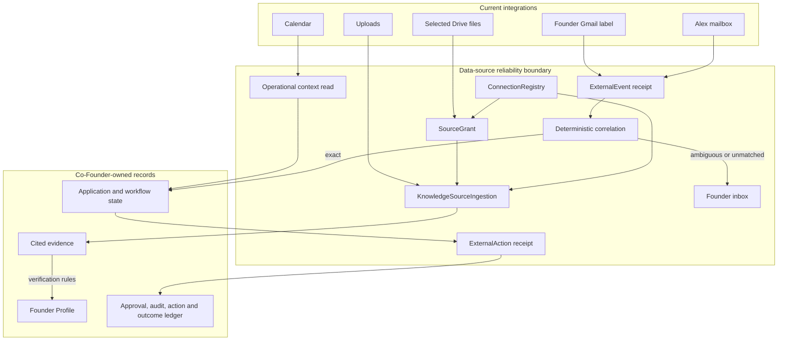

# 24 — Data-source reliability and company evidence boundaries

## Status and decision

**Status:** proposed; review and correction are required before implementation.

This specification hardens the data connections already needed by the funding
workflow. It does **not** authorize a generic connector marketplace, a new
company-wide RAG system, or a Gemini Enterprise dependency.

The immediate product needs four integration roles:

| Role | Current sources/destinations | Product contract |
|---|---|---|
| **Knowledge source** | founder upload, explicitly selected Drive file | Produce owner-scoped, citation-bearing evidence. Retrieval is not canonical truth. |
| **Context source** | Calendar upcoming/free-busy reads | Produce bounded, point-in-time operational context. It is neither company truth nor a durable event. |
| **Event source** | founder Gmail label, Alex mailbox, deadline/provider signals | Produce durable, provider-idempotent events correlated to a workflow or founder inbox. |
| **Action destination** | portal, Alex email send, Calendar create, Drive export | Produce an idempotent, audited external effect through approval and reconciliation rules. |

One connector can implement several roles, but every operation declares one
role. Reading a Drive file and exporting a document to Drive are different
operations with different authorization and effect contracts.

### Binding product boundary

Co-Founder continues to own:

- Founder Profile facts, verification levels, provenance, and canonical answers;
- opportunities, applications, workflow state, approvals, actions, and outcomes;
- session/resource provenance and founder-visible evidence;
- exact approval binding and uncertain-effect handling;
- the pipeline, review, inbox, and embedded-browser experience.

External services may eventually replace retrieval or runtime infrastructure.
They never become the authority for company truth or completed business work.

## 1. Goals

1. Make every current datasource operation owner-scoped and purpose-scoped.
2. Put Drive imports through the same safe, durable, session-linked ingestion
   pipeline as direct uploads.
3. Make inbound provider events durable before they are acknowledged or marked
   processed.
4. Prevent duplicate follow-ups, lost events, and wrong-session delivery.
5. Give ambiguous or unmatched events a durable founder inbox rather than a
   guessed active chat session.
6. Make connection state honest: scope, health, last success, last error,
   reauthorization, revocation, and source availability.
7. Make the difference between retrieved evidence, evidence-verified facts,
   and founder-confirmed facts explicit in code and UI.
8. Extend PREPARED/SUCCEEDED/FAILED/UNCERTAIN reasoning to non-browser external
   actions where a retry could duplicate an effect.
9. Preserve the current standalone product. Consumer OAuth and uploads remain
   sufficient; no enterprise license is required.

## 2. Non-goals

This work does not build:

- Gemini Enterprise, StreamAssist, Memory Bank, or Computer Use integration;
- a second vector database or organization-wide semantic index;
- full-Drive or full-mailbox crawling;
- custom enterprise ACL synchronization;
- generic Slack, Jira, GitHub, CRM, ATS, accounting, or marketplace connectors;
- a universal workflow/agent/capability registry;
- multi-workspace tenancy (but every new record is owner-scoped so it does not
  make the current single-founder limitation worse);
- autonomous legal, financial, employment, or compliance decisions;
- a new provider abstraction merely to wrap the one retrieval implementation
  that exists today.

`CompanyKnowledgeProvider` is specified in §12 as a deferred seam. It is not an
immediate implementation item until a second retrieval backend is approved.

## 3. Current inventory and gaps

| Path | Current implementation | Retain | Gap addressed here |
|---|---|---|---|
| Direct upload | `/api/ingest` → byte validation → artifact bytes → `artifacts` + `ingestions` (one batch) → session resource link → Cloud Task/local worker → chunks/citations | Yes | Add authority labels and connection/source metadata without changing scope semantics. The resource link commits **before** dispatch and chunks are produced last; that order is load-bearing (a founder-visible artifact must be findable while extraction is still QUEUED) and MUST be preserved. |
| Attachment retrieval | `document_ingestion.search_attachments` over max eight active-session refs, lexical/optional embedding rank, citations | Yes | Normalize authority and refuse incomplete citations; do not introduce another provider yet. The current result shape carries none of §8.1's authority/source identity fields — see §8.1, this is net-new. |
| Drive read | `/api/ingest/drive` and the model-callable `ingest_document(source_type="google_drive")` both fetch one file by id. `integrations.drive_files` was written by the selection UI and rendered back to the founder, but **no** read path consulted it: possession of a file id was the authorization over a whole-Drive `drive.readonly` grant. An emergency gate now exists in `drive_adapter.assert_selected`. | Yes, gated | Source grants are the FIRST durable, structured authorization for Drive reads — not a restructuring of one. They formalize `assert_selected`: an owner-scoped, revocable, scope-bearing record with selection provenance, replacing an unstructured map read at call time. Also require an owned session and route both paths through standard artifact ingestion and the resource-link transaction. |
| Founder Gmail | one label; processed message ids stored in `gmail_state`; heuristic application-name matching | Yes | The processed-id write happened **inside the adapter scan, before the caller wrote anything**, so a crash in that window lost the message permanently — it stayed on the processed list and every later scan skipped it. With no lease anywhere, two concurrent scans also both returned the same message and both appended a follow-up. Correlation is heuristic; unmatched delivery falls back to active session. |
| Alex mailbox | history/watch support; processed ids in `alex_mail_state`; portal-registration matching and application-name matching | Yes | Same permanent-loss ordering and same duplicate-on-concurrency exposure as founder Gmail, plus: the push handler ran the history fetch, N message reads and a full agent turn inline before acknowledgement. |
| Calendar | read operations plus approval-gated event creation | Yes | Persist honest connection health and external-action receipts; Calendar reads are context, not company truth. |
| Connector panel | descriptor catalogue plus live OAuth/token configuration | Yes, reduced | It mixes knowledge, event, action, and speculative roadmap connectors, and includes one live non-workflow connector (`github`, §5.1). Status is not merely configuration-centric: rendering the panel fans out to Google synchronously (`configured()` per connector → tokeninfo, plus `account_email()` → Gmail `getProfile`), and the results are held in process caches with no TTL, so a revoked grant still reports Connected until restart. |
| Action safety | strong submission/browser approval and browser action ledger; email/Calendar approval gates that check for *an* approval but not for *this* payload (§11.1) | Yes, strengthened | Non-browser effects lack one shared durable effect receipt and reconciliation contract, and their approval gates lack exact subject binding. |
| Session provenance | docs/23 resource index and immutable session occurrences | Yes | Drive ingestion and inbound-event routing do not consistently use it. |

### Existing behavior that MUST remain

- Upload scope is explicit: `profile` or `reference_only`.
- Unsafe, malformed, encrypted, oversized, legacy, or unreadable documents fail
  closed before model use — **on the upload path only**. This was never true of
  Drive: `document_ingestion.validate_upload` ran in `/api/ingest` alone, and
  both Drive entry points (`/api/ingest/drive` and the model-callable
  `ingest_document(source_type="google_drive")`) reached the extractor without
  it. This is a defect to fix, not a property to preserve: after this work the
  invariant MUST hold on every knowledge path (§7.1 step 5), and the tests in
  §20 assert it per-path rather than once.
- Reference-only material never mutates Founder Profile.
- Provider content is untrusted data and cannot authorize a tool.
- Tools return errors as data.
- External work is event-driven; no connector polling loop remains awake.
- Browser observation remains in the Co-Founder Browser panel; remote pages are
  not opened in an external browser.

## 4. Architecture



The boundaries are deliberately separate:

- `KnowledgeSourceIngestion` obtains and validates bytes. It is not retrieval.
- Attachment search retrieves evidence from already-authorized artifacts.
- `ExternalEvent` records what a provider reported. It does not decide business
  state by itself.
- Correlation decides where an event belongs using persisted causal evidence.
- `FounderInboxItem` handles ambiguity without inventing a session.
- `ExternalAction` reasons about attempted effects and reconciliation.
- `ConnectionRegistry` is a status/read model, not a credential store.

## 5. Closed registries

All connector, role, event-kind, action-kind, and error-code values come from
code-owned closed registries. The model cannot author collection names,
connector ids, role names, provider scopes, or destination types.

### 5.1 Current connector registry

| Connector id | Roles enabled now | Allowed scope |
|---|---|---|
| `upload` | knowledge | one founder-provided file, one explicit session, `profile` or `reference_only` |
| `drive` | knowledge, action destination | founder-selected file ids for reads; app-produced files only for export |
| `founder_gmail` | event | one founder-selected label, read-only |
| `alex_mail` | event, action destination | Alex role mailbox; reads/events, approval-gated send |
| `calendar` | context, action destination | upcoming/free-busy reads; approval-gated create; no edit/delete; Calendar watch/events are not added in this slice |
| `browser` | knowledge-by-observation, action destination | existing URL/network/action policies and in-app observation only |

Two entries in that table are aspirational today and MUST be made true by this
work:

- **`drive` export scope.** "App-produced files only" is not enforced.
  `POST /api/documents/{artifact_name}/sync_drive` accepts any artifact name
  matching `[A-Za-z0-9_.-]+` that exists under the artifact root — including
  founder uploads (`companydoc_*`), Drive material re-imported under
  `companydoc_drive_*`, recon screenshots (`recon_*`), and voice notes
  (`voicenote_*`). The export destination policy (§11.2 step 2) MUST reject any
  artifact that is not an app-produced document, and the check MUST be a
  positive allowlist over the produced-document registry, never a name prefix.
- **`github`.** It is not a roadmap descriptor: it is live. `services/connectors.py`
  exposes `github_connect`/`github_disconnect`, which validate a personal access
  token against `api.github.com/user` and persist `GITHUB_TOKEN`/`GITHUB_LOGIN`
  as secrets, and `app/main.py` serves `POST` and `DELETE
  /api/connectors/github/token`. It has no role in the funding workflow and no
  tools consume it, so it is a stored credential with no purpose scope — exactly
  the shape §5 exists to prevent. This work MUST remove the two routes and the
  connect/disconnect functions, delete any stored token, and reduce the
  descriptor to an unavailable roadmap entry (`available: False`) or drop it.
  Until that lands, `github` is not in the registry table above and no operation
  may declare a role for it.

`slack`, `telegram`, `imap`, `jira`, and the remaining roadmap descriptors are
not enabled by this specification. The Connections UI may hide them or label
them outside the current product, but implementation is not part of this work.

### 5.2 Roles

```python
class DataSourceRole:
    KNOWLEDGE = "knowledge"
    CONTEXT = "context"
    EVENT = "event"
    ACTION_DESTINATION = "action_destination"
```

Every adapter entry point declares its role in code. A knowledge operation must
not receive action credentials or an action service object.

## 6. Persistent data contracts

Five collections are added. They are product safety records, not a generic
connector platform. Each must be added to `TOP_LEVEL_COLLECTIONS`, export and
deletion coverage, emulator/fake-store support, and Firestore indexes.
Registration is enforced today; export/deletion coverage is not, because no
export or deletion implementation exists yet — WI-1 owns it (§19, §20).

### 6.1 `data_connections/{connection_id}`

One row per founder, connector, and provider account. Deterministic id:

```
dc_ + sha256("data-connection:v1" + founder_id + connector_id + account_ref)[:32]
```

`account_ref` is a stable opaque account identity or `default`; it is not an
access token and must not be an email address when a provider supplies a stable
subject id.

| Field | Type | Contract |
|---|---|---|
| `schema_version` | int | `1` |
| `connection_id` | str | deterministic document id |
| `founder_id` | str | owner; server-derived |
| `connector_id` | str | closed registry value |
| `account_ref` | str | stable provider/account reference; bounded |
| `account_hint` | str | optional founder-visible masked label; never logged |
| `roles` | list[str] | enabled closed roles for this connector |
| `auth_kind` | str | `builtin`, `google_oauth`, or `token_ref` |
| `credential_ref` | str\|null | Secret Manager/configuration name only; never credential material |
| `granted_scopes` | list[str] | normalized non-secret OAuth scopes |
| `status` | str | `CONNECTED`, `DEGRADED`, `REAUTH_REQUIRED`, `DISCONNECTING`, `DISCONNECTED` |
| `last_verified_at` | str\|null | most recent explicit provider identity/scope verification |
| `last_success_at` | str\|null | most recent successful real operation |
| `last_error_code` | str\|null | closed safe code; no provider body |
| `last_error_at` | str\|null | timestamp |
| `disconnected_at` | str\|null | timestamp |
| `version` | int | monotonic optimistic-concurrency version |
| `created_at`, `updated_at` | str | server timestamps |

Status rules:

- OAuth callback success writes `CONNECTED` only after token exchange and an
  identity/scope check.
- A successful provider operation updates `last_success_at`; UI reads the
  projection and never calls every provider on page load.
- Authentication failure sets `REAUTH_REQUIRED`.
- Provider permission/scope or repeated transient failure sets `DEGRADED` with
  a safe code; one timeout does not erase a valid connection.
- Disconnect first marks `DISCONNECTED`, revokes the grant at the provider,
  deletes the credential by name, and revokes active source grants (§10). No
  such path exists today for any Google connector; failure to revoke remotely or
  to remove the credential is surfaced as an incomplete disconnect and retried
  by an operator task, and is never reported to the founder as revoked.
- Disconnect does not silently delete historical evidence or business records.
  Source links become unavailable/tombstoned according to retention policy.

### 6.2 `source_grants/{source_grant_id}`

One explicit authorization to read a provider source. For v1 this primarily
replaces the unstructured Drive file list. The grant authorizes a source; each
ingestion still supplies and validates its own owner session and usage scope.
Deterministic id:

```
sg_ + sha256("source-grant:v1" + founder_id + connection_id
             + provider_source_id)[:32]
```

| Field | Type | Contract |
|---|---|---|
| `schema_version` | int | `1` |
| `source_grant_id` | str | deterministic id |
| `founder_id`, `connection_id`, `connector_id` | str | owner and connector |
| `provider_source_id` | str | bounded provider file id; never model-authored |
| `display_name` | str | escaped founder-visible name |
| `source_kind` | str | `file` in this slice |
| `allowed_ingestion_scopes` | list[str] | closed subset of `reference_only`, `profile`; set by the founder-facing selection flow |
| `selected_session_id` | str\|null | optional selection provenance; never the authorization for a later ingestion session |
| `provider_content_type` | str\|null | evidence only; bytes are revalidated |
| `provider_version` | str\|null | revision/etag/checksum when available |
| `provider_modified_at` | str\|null | provider timestamp, not trusted as freshness truth |
| `status` | str | `ACTIVE`, `REVOKED`, `SOURCE_MISSING` |
| `selected_by` | str | `founder:<id>` only in this slice |
| `selected_at`, `revoked_at`, `updated_at` | str | timestamps |

Only the founder-facing selection endpoint may create or reactivate a grant.
An agent cannot authorize a new Drive file by supplying its id. Ingestion scope
must be present in `allowed_ingestion_scopes`, and the request session is checked
independently. Revocation prevents new fetches but does not rewrite historical
citations.

### 6.3 `external_events/{event_id}`

One durable receipt per provider event/message. Deterministic id:

```
xe_ + sha256("external-event:v1" + founder_id + connection_id
             + provider_event_id)[:32]
```

| Field | Type | Contract |
|---|---|---|
| `schema_version` | int | `1` |
| `event_id` | str | deterministic id |
| `founder_id`, `connection_id`, `connector_id` | str | owner and source |
| `provider_event_id` | str | Gmail message id, Calendar event/change id, Pub/Sub message id, etc. |
| `provider_thread_id` | str\|null | correlation evidence; not displayed without authorization |
| `event_kind` | str | closed registry, e.g. `mail_confirmation`, `mail_request`, `mail_result`, `calendar_changed`, `deadline_critical` |
| `payload_hash` | str | hash of canonical bounded provider metadata; raw content is not audit detail |
| `source_ref` | map | bounded provider ids needed to re-read under authorization; no body |
| `safe_display` | map | escaped title/sender/date/excerpt caps for founder inbox only |
| `content_risk` | str | `CLEAR`, `INJECTION_SUSPECTED`, `WITHHELD` |
| `processing_status` | str | `RECEIVED`, `APPLYING`, `APPLIED`, `INBOXED`, `FAILED` |
| `lease_owner`, `lease_started_at`, `lease_seconds` | scalar | single-writer claim/reclaim authority for nonterminal processing |
| `correlation_status` | str | `PENDING`, `EXACT`, `AMBIGUOUS`, `UNMATCHED` |
| `application_id`, `session_id`, `resource_id` | str\|null | set only for exact/founder-resolved correlation |
| `correlation_basis` | str\|null | closed value: `causal_action`, `portal_registration`, `provider_thread`, `founder_resolution`; heuristic name matching is never exact |
| `delivery_status` | str | `PENDING`, `ENQUEUED`, `DELIVERED`, `FAILED`, `NOT_REQUIRED` |
| `effect_ref` | str\|null | follow-up/domain receipt produced by applying the event |
| `attempt_count` | int | bounded delivery attempts |
| `received_at`, `occurred_at`, `updated_at` | str | timestamps |

The event record is the idempotency authority. A bounded list of processed ids
is not sufficient, and the two failure modes are not hypothetical alternatives —
both were live at once:

- **Permanent loss.** The processed-id write happened inside the adapter's fetch,
  before the caller had written anything. A crash, a wake failure, or a
  Firestore error between the fetch and the follow-up left the message marked
  processed with no domain effect, and every later scan skipped it. The message
  was not delayed; it was gone.
- **Duplication.** There was no lease anywhere on the path, so two concurrent
  scans (a Pub/Sub redelivery racing the original, or a push racing a manual
  scan) each read the same processed set, each saw the message as unseen, and
  each appended a follow-up and woke the founder.

Moving the mark after the domain effect fixes loss and makes delivery
at-least-once; only a leased, deterministic receipt fixes duplication. Both are
required.

### 6.4 `founder_inbox/{inbox_item_id}`

One durable ambiguity/action-required item, keyed from the causal event:

```
fi_ + sha256("founder-inbox:v1" + founder_id + event_id + item_kind)[:32]
```

| Field | Type | Contract |
|---|---|---|
| `schema_version` | int | `1` |
| `inbox_item_id`, `founder_id`, `event_id` | str | deterministic identity/owner |
| `item_kind` | str | `UNMATCHED_EVENT`, `AMBIGUOUS_EVENT` (§22 answer 1: connection actions and source conflicts are projections, not inbox rows) |
| `status` | str | `UNREAD`, `RESOLVED`, `DISMISSED` |
| `title`, `summary` | str | escaped, bounded, founder-visible; untrusted content never inserted into agent instructions |
| `candidate_refs` | list[map] | max five authorized `{resource_id, application_id, reason_code}` entries; no confidence prose from a model |
| `resolved_resource_id`, `resolved_session_id` | str\|null | founder-selected, server-validated |
| `resolution` | str\|null | closed code |
| `created_at`, `updated_at`, `resolved_at` | str | timestamps |

Inbox creation and external-event state commit in one Firestore transaction or
batch. Resolving an item transactionally updates the event correlation and
creates the domain effect exactly once. The UI does not pass arbitrary
collection names or resource references.

### 6.5 `external_actions/{action_id}`

One product-level receipt for a non-browser external effect. Browser actions
remain in `browser_runs/{run_id}/actions`; submission may reference both.

Deterministic id:

```
xa_ + sha256("external-action:v1" + founder_id + action_kind
             + idempotency_key)[:32]
```

| Field | Type | Contract |
|---|---|---|
| `schema_version` | int | `1` |
| `action_id`, `founder_id`, `connection_id` | str | identity/owner |
| `session_id`, `application_id`, `resource_id` | str\|null | causal product refs |
| `action_kind` | str | closed enum: `send_email`, `create_calendar_event`, `export_drive_file`, plus approved existing kinds |
| `idempotency_key` | str | server-derived effect identity |
| `request_hash` | str | canonical destination/payload hash; no secret/raw body in the row |
| `subject_hash` | str\|null | exact approval subject when approval is required |
| `approval_id` | str\|null | server-resolved approval record |
| `status` | str | `PREPARED`, `SUCCEEDED`, `FAILED`, `UNCERTAIN` |
| `provider_effect_id` | str\|null | provider message/event/file id on success |
| `result_ref` | map | bounded safe receipt fields |
| `uncertainty_reason`, `error_code` | str\|null | safe closed/bounded values |
| `lease_owner`, `lease_started_at`, `lease_seconds` | scalar | reclaim/reconcile authority |
| `created_at`, `updated_at`, `completed_at` | str | timestamps |

The external-action row and append-only `audit` serve different purposes:

- `external_actions` is mutable execution truth with constrained transitions;
- `audit` is immutable history of prepare, refusal, completion, uncertainty,
  and reconciliation decisions.

## 7. KnowledgeSourceIngestion contract

### 7.1 Shared registration service

Both upload and Drive import call one service-layer operation:

```python
async def register_source_ingestion(
    *, founder_id: str, session_id: str, source_type: str,
    source_grant_id: str | None, source_ref: str, display_name: str,
    data: bytes, declared_content_type: str, scope: str,
    occurrence_key: str,
) -> dict:
    """Validate bytes, persist artifact+ingestion+session provenance, dispatch once."""
```

The implementation order is binding:

1. verify that the session belongs to the founder;
2. validate `scope` against `profile | reference_only`;
3. for Drive, load an ACTIVE owner-matching source grant and connected Drive
   connection; never trust a request-supplied name, MIME, or account;
4. fetch at most one file and enforce size/time bounds;
5. validate bytes through `document_ingestion.validate_upload`;
6. write randomized artifact bytes;
7. atomically create `artifacts`, `ingestions`, registration audit, and the
   docs/23 artifact resource/session occurrence wherever Firestore permits one
   transaction/batch;
8. if provenance commit fails, mark metadata failed and report an error; the
   orphan blob is never a successful attachment;
9. enqueue a deterministic Cloud Task `ingest:{ingestion_id}` in production or
   run request-bound locally under the existing contract;
10. return `202` only after durable metadata/provenance and dispatch success.

Steps 7–9 tighten the order §3 records for the upload path today —
`artifacts` + `ingestions` in one batch, then the session resource link, then
dispatch — by collapsing the two commits into one wherever Firestore permits.
Step 8 exists because they are two commits today and may remain two across a
transaction boundary: the resource link must still commit **before** dispatch,
so that a founder-visible artifact is findable from its conversation while
extraction is QUEUED, and a failure there is a hard error rather than a
successful-but-unfindable attachment.

### 7.2 Drive endpoint

Replace the current body with:

```json
{
  "session_id": "s-...",
  "source_grant_id": "sg_...",
  "scope": "profile"
}
```

`provider_source_id`, filename, MIME, version, and account are loaded from the
grant/provider. The endpoint does not accept an arbitrary `file_id` after
cutover. During compatibility migration it may accept `file_id` only when it
resolves to an ACTIVE migrated grant; responses always return `source_grant_id`.

Drive-native export rules remain deterministic and format-aware. Exported bytes
are revalidated exactly like uploads. A provider-reported MIME never bypasses
the byte validator.

### 7.3 Artifact additions

The current artifact/ingestion schema gains optional fields:

- `connection_id`;
- `source_grant_id`;
- `provider_source_id`;
- `provider_version`;
- `provider_modified_at`;
- `authority` (`reference_only` or `profile_candidate`).

No provider token, signed URL, email body, or provider response object is stored.

## 8. Evidence and Founder Profile authority

### 8.1 Evidence result contract

Every retrieval result contains:

```json
{
  "source_type": "upload",
  "source_id": "artifact-id",
  "source_title": "Pitch deck.pdf",
  "excerpt": "bounded text",
  "citation": {
    "artifact_id": "artifact-id",
    "chunk_id": "chunk-id",
    "locator": {"slide": 4},
    "quote": "supporting text",
    "quote_sha256": "...",
    "source_url": "/api/ingest/.../source?session_id=...#slide=4"
  },
  "authority": "unconfirmed_evidence"
}
```

The service refuses a successful-looking result missing source identity,
locator, quote, matching quote hash, or owner-authorized source URL. Empty
search results are successful abstention, not fabricated summaries.

This contract is **net-new**, not a description of `search_attachments`.
Today each result carries `filename`, `score`, `content`, and a `citation` of
`artifact_id`/`chunk_id`/`locator`/`quote`/`quote_sha256`/`source_url` — there is
no `authority`, `source_type`, `source_id`, or `source_title`, `content` is
returned alongside the citation as unlabelled prose, and the service never
refuses an incomplete citation (`_citation_for` always synthesizes one from the
chunk, and an empty locator is emitted as `{}`). Adding the fields is the small
half; the refusal path and its tests are the substance.

### 8.2 Verification levels

Founder Profile facts and canonical answers expose one of:

| Level | Meaning | Permitted origin/use |
|---|---|---|
| `UNCONFIRMED_EVIDENCE` | retrieved or extracted claim; not in canonical profile | reference/search/draft citation only |
| `EVIDENCE_VERIFIED` | exact quote-bound, non-conflicting, deterministic extraction from a founder-designated profile source | may reduce interview questions; UI shows source and permits correction |
| `FOUNDER_CONFIRMED` | founder explicitly confirmed the value/version | eligible for consequential external representations subject to workflow approval |
| `SUPERSEDED` | retained history, not current truth | audit/history only |

Current high-confidence auto-application may remain only for
`EVIDENCE_VERIFIED`. It must not be labeled founder-confirmed. A model inference,
summary, email, Calendar event, web page, Memory Bank item, or reference-only
attachment can never become evidence-verified automatically.

"Current auto-application is quote-bound" holds on one path only, and not for
every kind. Both gaps MUST close before auto-application survives:

- **Path.** On the upload path `extract_profile_proposals` locates every claimed
  quote in an extracted chunk and downgrades an unlocatable one to low
  confidence, which routes it to founder review. The Drive path does not reach
  that code at all: the model tool hands the fetched artifact to the legacy
  `profile_service.ingest_document`, which stages whatever the extractor
  returned — no chunking, no citation, no confidence downgrade — and
  `auto_apply_profile_updates` then applies it. Auto-application MUST be
  refused for any proposal without a bound, hash-matching citation, whatever
  path produced it, rather than relying on one extractor to self-downgrade.
- **Kind.** `_conflict` is defined for `fact_update` and
  `canonical_answer_update` only. `voice_rule` and `decision_pattern` are
  accepted kinds that fall through it to `None`, so a non-low-confidence
  proposal of either kind is **always** auto-applied with no conflict check at
  all. Until each has explicit conflict semantics (what "the same rule" means,
  and what supersession does to an existing one), `voice_rule` and
  `decision_pattern` MUST be excluded from auto-application and staged for
  founder review regardless of confidence.

The following high-impact categories require `FOUNDER_CONFIRMED` before use in
an external submission or message: financial metrics, ownership/equity, legal
or compliance status, customer identities/counts, binding commitments,
credentials, payment details, signatures, and prior submissions/awards
(previous funding received, awards held, and earlier applications to the same
program — eligibility frequently turns on them, and they are the facts most
likely to be stale in an extracted document; §22 answer 3). This gate lives in code and can
be satisfied by founder approval of the exact draft/action payload when the
profile fact itself is not globally promoted.

### 8.3 Conflict behavior

- Same key/value/source version: idempotent replay.
- Same key, different value: retain both versions, surface the conflict in the
  profile conflict-review surface, and do not choose by recency alone. That
  surface is a projection over pending conflicting proposals, not a
  `founder_inbox` row (§22 answer 1) — the inbox exists for events with no
  session to return to, which a profile conflict always has.
- Deleted or revoked source: historical provenance remains, source becomes
  unavailable, and any current high-impact fact requires revalidation before a
  new consequential action.
- Founder correction: new version becomes founder-confirmed; old version is
  superseded, never overwritten without history.

## 9. EventSourceConnector contract

### 9.1 Provider envelope

Adapters normalize provider signals to a bounded envelope:

```python
@dataclass(frozen=True)
class ExternalEventEnvelope:
    connector_id: str
    provider_event_id: str
    provider_thread_id: str | None
    event_kind: str
    occurred_at: str | None
    source_ref: dict[str, str]
    safe_display: dict[str, str]
    payload_hash: str
```

The envelope contains no instructions and no authorization. Email subject,
sender, excerpt, and document content are attacker-controlled
data even when delivered by an authenticated provider webhook.

### 9.2 Durable processing order

1. authenticate the webhook/task caller;
2. validate and normalize provider ids before fetching content;
3. for a direct webhook carrying a stable provider event id, create/load the
   deterministic `external_events/{event_id}`; for Gmail/Pub/Sub notification
   envelopes that contain only a cursor/history id, enqueue a deterministic
   authenticated fetch task keyed by the Pub/Sub message id and fast-ack—the
   worker creates one external-event receipt per fetched provider message;
4. transactionally claim a nonterminal event by lease; a duplicate terminal
   `APPLIED`/`INBOXED` event returns its existing receipt, while a concurrent
   live lease is a success/in-progress response and an expired lease is
   reclaimable—duplicate delivery never repeats a committed effect;
5. scan content metadata for injection and withhold unsafe display/prompt text;
6. correlate using §9.3;
7. in one lease-qualified transaction, commit the exact domain effect and mark
   `APPLIED`, **or** create the inbox item and mark `INBOXED`; include `event_id`
   in every produced follow-up/record;
8. enqueue a deterministic delivery/wake task only for an exact session;
9. acknowledge a direct event webhook after its durable receipt and task
   dispatch; acknowledge a cursor-only push after its deterministic fetch task
   is durably accepted, never after provider fetch or agent/model work;
10. mark DELIVERED only from the internal worker receipt.

If provider fetch fails after a push, Cloud Tasks redelivers the fetch task. The
adapter must split “fetch unseen provider messages” from “mark event applied”:
it never adds a message to a bounded processed-id list before the corresponding
external-event/domain receipt is durable.

### 9.3 Correlation authority hierarchy

Only these can yield `EXACT`:

1. `causal_action`: provider thread/message/reference maps to a successful
   `external_actions` row carrying application and session ids;
2. `portal_registration`: persisted pending registration maps host/account and
   session to the verification message;
3. `provider_thread`: previously founder-resolved thread mapping;
4. `founder_resolution`: founder selects an authorized application/resource
   from an inbox item.

Application/opportunity name appearance in subject or excerpt is a candidate
signal only. One candidate remains `AMBIGUOUS` until founder resolution; zero is
`UNMATCHED`; multiple candidates are `AMBIGUOUS`. A model may propose candidates
but cannot commit correlation.

`founder_state.active_session_id` is forbidden for external-event delivery.
When no exact causal session exists, create an inbox item and update the
founder-facing UI without waking a guessed conversation.

### 9.4 Domain application

An exact application mail event creates a follow-up carrying:

```json
{
  "id": "deterministic-from-event",
  "external_event_id": "xe_...",
  "kind": "email_request",
  "status": "PENDING",
  "note": "bounded escaped metadata",
  "created_at": "..."
}
```

The application update and event `effect_ref` commit transactionally. If arrays
remain in `applications`, the transaction refuses a duplicate
`external_event_id`. Moving follow-ups to a subcollection is outside this slice
unless Firestore size/contention tests demonstrate the array is unsafe.

### 9.5 Gmail watch/push

- Pub/Sub push validates OIDC **and** the message id, persists/queues bounded
  work, and fast-acknowledges. Only the first clause holds today:
  `/webhooks/alex_mail` authenticates the OIDC token and then never parses the
  Pub/Sub envelope at all — no message id, therefore no dedupe key, no
  deterministic task name, and no lease — and it runs the history fetch, the
  per-message reads and a full agent turn inline, past the ack deadline, while
  its docstring claims it fast-acks. `/webhooks/deadline` already does the right
  thing: parse the envelope, reject a missing/malformed `messageId`, enqueue
  `deadline:{message_id}`, acknowledge. Bringing `/webhooks/alex_mail` to that
  contract is net-new work, not a preserved property.
- Gmail history pagination and expired-history recovery remain — pagination
  does; recovery must be **repaired**. On a 404 the stored `startHistoryId` has
  aged out, and the recovery branch returned the unread-scan result without ever
  replacing the cursor, so the dead cursor persisted: every later push 404'd
  straight back into the same capped (~20 unread) full scan, permanently,
  until someone re-ran `start_watch` by hand. Recovery MUST read a fresh cursor
  *before* the recovery scan (so mail arriving during the scan belongs to the
  next fetch rather than a gap), persist it only once the scan succeeded, and
  leave the stored cursor untouched when no fresh cursor can be obtained.
- Gmail message id is the provider event identity; history id is a cursor, not
  the business-event id.
- Watch renewal remains scheduled/event-driven and updates connection health.
- Founder Gmail remains one-label read-only. Alex mailbox retains its separate
  account and broader inbox scope under docs/12.

## 10. ConnectionRegistry contract

`ConnectionRegistry` is a small service over the closed connector descriptors
and `data_connections`. It does not dynamically load code or let agents install
connectors.

```python
async def record_connection_success(connection_id: str, operation: str) -> dict
async def record_connection_failure(connection_id: str, error_code: str) -> dict
async def disconnect_connection(founder_id: str, connection_id: str) -> dict
async def list_connection_status(founder_id: str) -> dict
```

All methods return errors as data. Success/failure updates use transactions and
monotonic versioning so a stale timeout cannot overwrite a later successful
reauthorization.

### API projection

`GET /api/integrations` remains for compatibility but reads the new projection.
A future rename is unnecessary. It returns only:

- connector id/title;
- enabled roles;
- status;
- masked account hint;
- granted-scope summary;
- selected-source count;
- last successful operation time;
- safe actionable error code;
- connect/reconnect/disconnect availability.

It does not call provider APIs synchronously merely to render the panel. That is
a **change in behavior**, not a preserved property. `GET /api/integrations`
today calls `google_oauth.configured()` once per connector — each of which can
reach Google's tokeninfo endpoint through `granted_scopes()` — plus
`account_email()`, which calls Gmail `getProfile` and falls back to Drive
`about.get`; `GET /api/connectors` fans out the same way for its catalogue. The
answers are memoized in module-level process caches (`_creds`, `_granted`,
`_account_email`) with no TTL and no invalidation, so the panel is
simultaneously slow on a cold process and stale on a warm one: a grant revoked
at Google still renders as Connected until the container restarts. Reading a
durable projection replaces both problems; the caches MUST NOT remain the
status source.

### Disconnect/revoke

`DELETE /api/integrations/{connection_id}` requires a founder-authenticated
request and an optimistic `version`. It is entirely net-new: there is no
disconnect route and no disconnect function for any Google connector today, and
no call to Google's token-revocation endpoint anywhere in the codebase
(`services/google_oauth.py` contains zero occurrences of "revoke"). The only
disconnect that exists is `connectors.github_disconnect`, which blanks the
stored `GITHUB_TOKEN`/`GITHUB_LOGIN` and does not tell GitHub anything. It:

1. marks the connection disconnecting/disconnected transactionally;
2. revokes the grant **at the provider** — `POST
   https://oauth2.googleapis.com/revoke` with the refresh token — and only then
   deletes the local credential through the existing secret boundary, and
   clears the in-process credential/scope caches so status cannot be served from
   a stale cache. A revocation call that returns an error, times out, or cannot
   be attempted leaves the connection `DISCONNECTED` locally and the disconnect
   `UNCERTAIN`/action-required (step 7), never `SUCCEEDED`;
3. revokes active source grants;
4. cancels renewable watches where supported;
5. audits ids and result only;
6. preserves historical domain records and citations;
7. returns `UNCERTAIN`/action-required if provider revocation outcome cannot be
   determined.

Step 2 is the requirement. An interim v1 that removes **local access only** is
acceptable if, and only if, the UI says exactly that: the founder is told the
app can no longer use the account and that the grant is still live at Google,
with a link to the Google account permissions page, and the connection is
reported as locally disconnected rather than revoked. Shipping local deletion
under the word "revoke" is not acceptable — it tells the founder a lie about who
still holds access. Remote revocation is then a named follow-up with an owner,
not an implicit someday (§22 Q6).

**Granularity constraint.** Remote revocation is not per-connector today and
cannot be made so by this route alone. Drive, founder Gmail, and Calendar are
incremental scopes on **one** refresh token per Google account
(`GOOGLE_OAUTH_REFRESH_TOKEN` for the founder, `ALEX_OAUTH_REFRESH_TOKEN` for
Alex); `configured(connector)` distinguishes them by comparing required scopes
against the scopes that single token carries. Revoking at Google therefore
revokes every connector on that account at once. Disconnect MUST NOT paper over
this. Either:

- the route revokes remotely only when it is disconnecting the **last** enabled
  connector on that account, and otherwise performs a local, scope-level
  disconnect it describes as such; or
- per-connector disconnect drops the connector's scopes by re-consenting the
  account with the reduced scope set, and reports UNCERTAIN if the founder does
  not complete it.

Whichever is chosen, the founder MUST be told which other connectors a
disconnect will take down with it before it runs.

## 11. ActionDestination and ExternalAction contract

### 11.1 Which actions require approval

| Action | Approval |
|---|---|
| Agent sends email | persisted, exact subject/body/recipient binding; single-use |
| Agent creates Calendar event | persisted, exact attendees/time/title binding; single-use |
| Portal account creation/submission | existing exact approval contracts |
| Founder directly clicks “Copy to Drive” for a new file | founder request is the authorization; no model-visible approval token, but an external-action receipt is still required |
| Read/search/list/fetch | no approval; read-only role and owner scope still enforced |

The first two rows are the contract that must hold, not a description of the
gates as they stood. Neither binding existed: `send_email` and `create_event`
both resolved an approval for their gate **without passing a subject hash**, so
any GRANTED approval on that gate satisfied any later call. Worse than a missing
check, drift was *repaired*: when the call arguments differed from the approved
ones the approved recipient/subject/body — or summary/attendees/time — were
substituted over the caller's, the substitution was audited as `drift_ignored`,
and the call returned success. Asking to send message B under an approval for
message A sent A and reported that B had gone out, which is both the wrong
effect and a false receipt. The drift comparison was also skipped entirely when
the persisted approval carried no details, so an approval with an empty payload
failed open.

Therefore, normatively: every approval-gated non-browser action MUST derive its
subject hash from the **current call arguments** by the same derivation used
when the request was minted, MUST pass it as the expected binding when claiming,
and MUST **refuse** — `approval_binding_mismatch` — when a GRANTED approval
covers a different payload. An approval carrying no binding MUST refuse with
`approval_binding_missing`, never proceed. A refusal MUST leave the existing
approval untouched and MUST NOT auto-request a replacement, or a re-invocation
driven by injected content could expire the founder's real pending grant.
Substituting approved values over caller values is forbidden outright: there is
no correct action to take when the two disagree except refusal.

An explicit founder HTTP request does not automatically need a separate
submission-grade approval token. If the request can be retried asynchronously,
overwrite/share an existing object, or broaden recipients, exact persisted
approval is required.

### 11.2 Execution protocol

1. derive founder, session, connection, domain target, and idempotency key in
   code;
2. validate destination policy and exact approval subject if required;
3. transactionally claim/create `external_actions` as PREPARED;
4. call the provider once;
5. on provider receipt, commit SUCCEEDED and audit the provider effect id;
6. on definitive refusal/failure, commit FAILED;
7. on timeout/crash/ambiguous response after request transmission, commit
   UNCERTAIN and do not retry blindly;
8. reconcile by provider idempotency key, message id, event id, file checksum,
   or destination listing as supported;
9. UNCERTAIN blocks another effect until reconciliation or explicit founder
   decision under a newly bound action.

Provider APIs that support native idempotency keys receive the same stable
key. When they do not, the service reconciles using provider receipts and
payload hashes before any retry.

### 11.3 Audit

Every prepare, refusal, completion, uncertainty, reconciliation, and founder
resolution appends an audit row. Audit detail contains ids, action kind, safe
error code, and provider receipt id only—never email body, Calendar description,
Drive bytes, credentials, approval token, or raw provider response.

## 12. Deferred `CompanyKnowledgeProvider`

Do not implement this interface while scoped attachment retrieval is the only
backend. The current `search_attachment` remains the agent tool and behavioral
reference.

When a second approved backend exists, introduce:

```python
class CompanyKnowledgeProvider(Protocol):
    name: str

    async def search(self, request: KnowledgeQuery) -> KnowledgeSearchResult:
        """Return owner-scoped, cited, unconfirmed evidence or errors as data."""
```

`KnowledgeQuery` contains server-derived founder/workspace identity, session
scope, bounded query, allowed source scope, and top-k. The model cannot select a
provider or broaden sources. `KnowledgeSearchResult` uses the §8 citation and
authority contract.

Activation gates for StreamAssist or another provider:

- a real eligible Workspace test tenant;
- zero unauthorized title/snippet/existence leakage;
- citation and conflict benchmarks accepted by the founder/product owner;
- update/deletion/freshness behavior measured;
- no provider result promoted to Founder Profile without §8 rules;
- fully loaded cost, latency, licensing, and administrator setup measured;
- standalone fallback retained;
- Preview dependencies have an explicit fallback and are not required for the
  consumer-founder path.

Provider selection is deployment/workspace configuration, never model choice.
No automatic fan-out to every provider is allowed without an explicit source
scope and cost budget.

## 13. API changes

### Immediate

| Method/path | Change |
|---|---|
| `GET /api/integrations` | Return durable connection status/roles/scopes/health projection; preserve current compatible keys during migration. |
| `DELETE /api/integrations/{connection_id}` | **New route.** Disconnect/revoke with optimistic version and honest uncertainty (§10). No disconnect route exists for any Google connector today. |
| `DELETE /api/connectors/github/token`, `POST /api/connectors/github/token` | **Removed** (§5.1), together with any stored `GITHUB_TOKEN`/`GITHUB_LOGIN`. |
| `POST /api/integrations/drive/files` | Create/revoke deterministic `source_grants`; accept founder-selected file only. Today it appends to an `integrations.drive_files` map that only `drive_adapter.assert_selected` reads. |
| `POST /api/ingest/drive` | Require `session_id`, `source_grant_id`, and scope; route through shared safe ingestion. |
| `POST /api/documents/{artifact_name}/sync_drive` | Restrict to app-produced documents and record an external-action receipt; it currently accepts any artifact name under the root (§5.1). |
| `GET /api/founder-inbox` | Owner-scoped keyset-paginated items; no raw provider body. |
| `POST /api/founder-inbox/{id}/resolve` | Validate candidate/resource/session and transactionally apply event once. |
| `POST /api/founder-inbox/{id}/dismiss` | Idempotent founder dismissal; event remains durable. |

### Unchanged

- `/api/ingest` upload contract except for additional response metadata;
- owner/session-scoped ingestion status/source routes;
- `search_attachment` agent tool — its name, arguments, and owner/session scope
  are unchanged; its result gains the §8.1 authority/source identity fields and
  the refusal path, which today it has neither of;
- approval resolution endpoints;
- browser state/events/stop routes;
- current application and pipeline surfaces.

All new mutation routes require JSON content type, founder authentication,
server-derived owner id, closed request models, and generic 404 behavior across
foreign/missing records.

## 14. Dormancy, tasks, and concurrency

- No adapter adds a permanent poll loop.
- Pub/Sub/webhook routes authenticate, persist receipts, enqueue deterministic
  tasks, and fast-acknowledge.
- Cloud Task names derive from stable event/action/ingestion ids.
- Event/task redelivery is expected and returns the existing receipt.
- Every transaction is owner-qualified.
- Bounded processed-id lists remain compatibility fences only until all
  in-flight provider cursors pass the migration horizon.
- Connection health is updated by real operations, OAuth callbacks, watch
  renewals, or explicit verification—not UI polling.
- A container crash after provider transmission but before receipt commit
  results in UNCERTAIN, never an automatic duplicate. This holds today for
  browser actions only, which alone write a PREPARED row before the effect and
  terminalize it exactly once. Gmail send and Calendar create have **no receipt
  at all**: the single-use approval is consumed just before transmission, and an
  ambiguous provider outcome produces an audit string and a returned error —
  nothing durable that a later process could reconcile from, and nothing at all
  if the container dies before the audit write. Extending PREPARED → terminal to
  these two is the point of §6.5 and WI-4/WI-6, and is a precondition for the
  reconciliation in §11.2 step 8 being reachable after a crash rather than only
  inside a surviving request.

## 15. Security and privacy

1. Credentials remain in Secret Manager/local development configuration and
   are fetched by name at execution time. Firestore stores credential refs only.
2. OAuth scopes stay least-privilege and role-specific.
3. `founder_id`, connection ownership, session ownership, and source grant are
   rechecked on every read and action.
4. Provider content is untrusted. Injection-shaped content is withheld from
   prompts and presented only in a direct founder review surface where safe.
5. Source and event existence must not leak through error wording.
6. Search results, inbox rows, global search, logs, metrics, and audit never
   include approval tokens, credentials, raw email bodies, document bodies,
   form values, or signed provider URLs.
7. Historical citations preserve source identity/hash when a source is revoked,
   but source download returns unavailable unless retention and authorization
   allow it.
8. Connection deletion/export coverage is added to the collection registry
   before writes ship.
9. The embedded browser invariant remains unchanged; OAuth current-tab redirect
   is the only separate first-party authorization boundary.

## 16. Observability

Emit structured metrics/logs with ids and counts only:

- connection status transitions and age since last success;
- source grant create/revoke/missing counts;
- ingestion registration, dispatch, terminal status, and provenance failure;
- external event received/duplicate/exact/ambiguous/unmatched/delivered/failed;
- inbox age and unresolved count by safe item kind;
- external action prepared/succeeded/failed/uncertain/reconciled;
- wrong-session or foreign-owner refusals;
- provider latency and safe error code;
- projection repair/backfill counts.

No metric label contains founder text, email, filename, URL query, document
content, event subject, or high-cardinality provider response.

## 17. Migration and compatibility

Migration is additive and reversible until cutover.

### Phase M1 — schemas and dual reads

1. Register new collections and indexes.
2. Add fake-store/emulator support and export/delete enumeration.
3. Deploy read-compatible models; no producer writes yet.
4. Add a dry-run migration report that counts current integrations, selected
   Drive ids, processed message ids, and records missing owner/session refs.

### Phase M2 — connection/source backfill

1. Create deterministic `data_connections` rows from configured connectors
   without reading or copying credential material.
2. Convert `integrations.drive_files` entries to ACTIVE `source_grants`.
3. Keep the old integrations map as a compatibility projection; new writes
   update the canonical record and projection until UI cutover.
4. Do not claim provider verification merely because a token/config value
   exists; use `DEGRADED`/unverified until a real operation succeeds.

### Phase M3 — event receipts

1. New Gmail/Alex messages write `external_events` first.
2. Existing processed-id sets remain a secondary dedupe fence. WI-0 item 2 has
   already moved their write after the domain effect, so at this phase they are
   an at-least-once fence, never the loss-bearing receipt they were.
3. Do not synthesize historical follow-ups from processed ids because original
   correlation/content is unavailable.
4. After provider cursors and retention horizon pass, stop writing processed-id
   lists; keep read compatibility for rollback.

### Phase M4 — action receipts

1. Put email send and Calendar create behind `external_actions` first.
2. Add Drive export receipt without requiring an unnecessary model-visible
   approval for the direct founder click.
3. Reference existing browser/submission receipts rather than duplicating their
   detailed ledgers.
4. Historical audit rows are not rewritten; UI labels pre-migration actions as
   legacy audit-only.

### Phase M5 — cutover

1. Switch `/api/integrations` and UI reads to canonical connection/source rows.
2. Remove active-session fallback from receipted event delivery.
3. Enable founder inbox.
4. Stop legacy producer writes only after parity, rollback, and backfill checks
   pass.

Every migration script defaults to dry-run, is idempotent, reports explicit
target counts, and never deletes records automatically.

## 18. Failure behavior

| Failure | Required behavior |
|---|---|
| Drive id is not selected/active | Generic not-found/refused; no fetch; audit ids only. |
| Drive source deleted or permission removed | Grant becomes `SOURCE_MISSING` or connection degraded; historical citation retained; no fabricated ingestion. |
| Artifact bytes saved but metadata/provenance fails | Error (HTTP 503) and never attachment success — this half holds. The orphan record and its reconciler do **not** exist: `/api/ingest`, `/api/ingest/drive`, and `/api/voice-note` all mark the rows FAILED, return 503, and leave the written blob behind with a comment saying it will be reconciled; the only orphan reconciliation in the codebase is for browser runs. WI-3 MUST add the orphan record and a sweep that deletes or adopts unreferenced artifact blobs, or the claim is dropped from this table. |
| Ingestion task delivered twice | Existing ingestion receipt; no duplicate chunks/profile proposals. |
| Gmail/Alex message delivered twice | Existing external-event receipt; one follow-up or inbox item, one wake at most. |
| Crash after event receipt before domain effect | Redelivery resumes from receipt and transactionally applies once. |
| Subject resembles two applications | AMBIGUOUS inbox item; no application mutation or chat wake. |
| No causal session | Founder inbox; never latest-session fallback. |
| Injection-shaped email/document | Withhold from prompt; preserve safe metadata and direct review path; no tool authorization. |
| OAuth revoked | `REAUTH_REQUIRED`; no silent fallback to broader account/source. |
| Provider write times out after transmission | External action becomes UNCERTAIN; reconcile before retry. |
| Connection disconnect cannot confirm provider revocation | Local access disabled and caches cleared, connection marked DISCONNECTED, the disconnect action marked UNCERTAIN/action-required, and the founder told plainly that the grant may still be live at Google with a link to revoke it there. The word "revoked" is never shown for a disconnect that only removed local access (§10). |
| Firestore unavailable | Error as data/HTTP 503; no provider action before PREPARED receipt. |
| Source conflict | Conflict-review surface; both versions retained; no recency-based silent overwrite. |

## 19. Work items and build order

Implementation begins only after this spec is reviewed and accepted — **except
WI-0**, which is remediation of live defects and is not gated on this review.

### WI-0 — live defect remediation (do first, independent of the rest)

These are not design work. Each one is exploitable or lossy today, each is
fixable inside the existing schema, and **none** of them depends on
`data_connections`, `source_grants`, `external_events`, `external_actions`, or
the founder inbox. Shipping them behind the storage primitives in WI-1 would
leave the product exposed for the length of the whole slice.

1. **Gate both Drive read paths on explicit founder selection, and route both
   through byte validation.** The HTTP route and the model-callable
   `ingest_document(source_type="google_drive")` must each refuse a file id the
   founder did not select — generically, without revealing whether the id exists
   — and must each run `document_ingestion.validate_upload` on the fetched bytes
   before anything reaches an extractor. The model path is the sharper one: its
   `ref` is model-authored text, so an id named by injected page or email
   content otherwise reaches a whole-Drive `drive.readonly` grant and lands in
   Founder Profile facts.
2. **Move both mailboxes' processed-id write to after the domain effect.** Fetch
   and mark become separate operations: the adapter returns events and the exact
   ids to mark, the caller commits its durable effect, and only then marks. The
   price is at-least-once delivery, which is the safe direction and which item 3
   absorbs. Splitting the adapter is only half of it — **every** caller of the
   split fetch MUST then mark. A caller that fetches and never marks converts a
   permanent-loss bug into unbounded redelivery: the same messages are returned
   on every push, and without item 3 each pass appends another follow-up and
   wakes the founder again. Founder Gmail and Alex are both callers here.
3. **Make `applications.followups` appends transactional and dedupe-keyed.**
   Replace every blind read-modify-write of the whole array with a transactional
   append that refuses a duplicate `external_event_id`. Two writers racing
   currently destroy one follow-up outright, and item 2's redelivery would
   otherwise duplicate one. This applies to every writer of the array — the
   founder Gmail scan, the Alex mailbox scan, and any agent tool — not to
   whichever one is being touched at the time; one remaining blind writer
   reintroduces the lost-write race for all of them.
4. **Bind email and Calendar approvals to an exact subject and refuse drift.**
   Derive the subject hash from the current call arguments, claim against it,
   and refuse `approval_binding_mismatch`/`approval_binding_missing` (§11.1). No
   substitution, no `drift_ignored`, no auto-request from the mismatch branch.

WI-0 items 2–4 together are what makes an inbound message neither lost nor
duplicated with the schema that exists now; the durable receipts in WI-4 replace
the mechanism, not the guarantee.

### WI-1 — closed contracts and storage primitives

- Add closed registries, deterministic id helpers, collection registry entries,
  data models, indexes, fake-store support, and transaction helpers.
- Implement registry-driven export and deletion over
  `TOP_LEVEL_COLLECTIONS`/`SUBCOLLECTIONS`. The registry and its coverage test
  exist; the export/deletion implementation they were built to feed does not, so
  "new collections are covered by export/deletion" is not provable until this
  ships (§20, §21).
- No endpoint or adapter cutover.

### WI-2 — connection status and source grants

- OAuth callbacks/real operations project honest status.
- Drive selection writes source grants with compatibility projection.
- Disconnect/revoke lifecycle and UI status.

### WI-3 — shared ingestion and Drive parity

- Factor shared source-ingestion registration.
- Route direct upload through it without behavior regression.
- Route selected Drive import through it with session/resource provenance.
- Retire the legacy profile-only Drive ingestion path so no knowledge source
  reaches the extractor without chunking and citation binding (§8.2).
- Record the orphan blob on a provenance failure and add the sweep that
  reconciles it (§18); today the 503 is honest and the orphan is simply left.

### WI-4 — external event receipts and correlation

- Normalize Gmail/Alex events.
- Durable idempotency receipt and atomic application/inbox effect.
- Deterministic correlation hierarchy; remove heuristic automatic matching.
- Fast-ack push and task delivery receipts. `/webhooks/alex_mail` must parse the
  Pub/Sub envelope, key a deterministic task by `messageId`, and acknowledge —
  the `/webhooks/deadline` contract (§9.5).

### WI-5 — founder inbox

- Read, resolve, dismiss, and UI surfaces.
- No model consumption of raw untrusted content.

### WI-6 — external action receipts

- Email send, Calendar create, Drive export.
- Exact approvals where required and uncertainty reconciliation.

### WI-7 — evidence authority and conflict UI

- Retrieval authority labels.
- Profile verification-level projection and high-impact gates.
- Conflict inbox items and source-unavailable behavior.

### WI-8 — migration, evals, and cutover

- Dry-run/backfill, dual-read parity, rollback, adversarial tests, metrics, docs,
  and acceptance run.

### Deferred WI-9 — CompanyKnowledgeProvider

Only after a second provider passes §12 activation gates.

### Ordering

The numbering is not the build order. WI-0 is first and is not gated on this
review. After WI-1, **WI-4 precedes WI-2**: event durability is where the live
loss and duplication are, whereas connection status is presentation of state the
product already holds — no founder loses work because the panel reports
"Connected" from a process cache. Sequencing WI-2 first spends the opening of the
slice on the panel while inbound mail is still the weakest link, and WI-2 also
carries the disconnect/revoke lifecycle (§10), which is genuinely net-new
provider work and should not be what blocks receipts from landing. WI-3 may run
in parallel with either once WI-0 item 1 has closed the Drive hole. The resulting
order is WI-0 → WI-1 → WI-4 → WI-5 → WI-2 → WI-3 → WI-6 → WI-7 → WI-8.

## 20. Tests

### Contract and ownership

- Every registry rejects unknown connectors, roles, event kinds, action kinds,
  statuses, collection refs, and error codes.
- Foreign founder/session/connection/grant/event/inbox/action ids collapse to
  generic not-found or refusal with no existence leak.
- Model-authored file/provider ids cannot create a source grant.

### Drive and ingestion

- Unselected/revoked/foreign Drive source is never fetched.
- Direct upload and Drive import produce the same artifact/ingestion/chunk and
  resource-link contracts.
- Malformed MIME, archive bomb, oversized export, deletion during fetch,
  provenance failure, dispatch failure, and duplicate delivery fail honestly.
- Drive import creates exactly one immutable session occurrence per occurrence
  key and never uses the legacy profile-only ingestion path.
- Byte validation is asserted **per entry point**, not once: `/api/ingest`, the
  Drive HTTP route, and the model-callable Drive tool each reject the same
  malformed/encrypted/oversized fixture, and each refuses an unselected file id.
  A single shared-helper test would have passed throughout the period in which
  neither Drive path called the validator at all.
- Drive export refuses an artifact that is not an app-produced document —
  `companydoc_*`, `companydoc_drive_*`, `recon_*`, and `voicenote_*` names are
  all rejected by `sync_drive` (§5.1).

### Evidence/profile

- Every result has owner-authorized source, locator, quote, matching hash, and
  `UNCONFIRMED_EVIDENCE` authority.
- Reference-only sources never mutate profile.
- Auto-applied exact facts are `EVIDENCE_VERIFIED`, never founder-confirmed.
- A proposal without a bound, hash-matching citation is never auto-applied, on
  any ingestion path, at any claimed confidence.
- A `voice_rule` or `decision_pattern` proposal is staged for founder review and
  never auto-applied, including when nothing in the profile resembles it (§8.2).
- High-impact conflicting/unconfirmed facts cannot enter an external action
  without exact founder approval, and the list includes prior submissions and
  awards (§22 answer 3).
- Revoked/deleted source behavior is visible and never silently considered
  fresh.

### Events/inbox

- Fifty concurrent duplicate deliveries yield one external event, one domain
  effect/inbox item, and at most one wake.
- Crash injection at every boundary—receipt, correlation, domain transaction,
  task enqueue, wake—converges without loss or duplicate effect.
- Subject-name match alone never yields exact correlation.
- Exact causal thread mapping reaches the correct application/session.
- Ambiguous/unmatched events create owner-scoped inbox items and never use
  `active_session_id`.
- Founder resolution is idempotent and validates every candidate/resource.
- Injection-shaped content is withheld from model prompts.

### Connections/actions

- OAuth/configured is not reported healthy until provider verification or a
  successful real operation.
- Auth failure projects REAUTH_REQUIRED; stale failure cannot overwrite a later
  success.
- Disconnect revokes source grants and local credential access without deleting
  historical work, clears the in-process credential/scope caches, and calls the
  provider revocation endpoint; a revocation error or timeout yields
  UNCERTAIN/action-required and never the word "revoked" in the UI.
- Panel status is served from the durable projection: rendering
  `/api/integrations` and `/api/connectors` makes zero provider calls.
- Duplicate email/Calendar/Drive actions return the original receipt.
- Timeout after send/create/upload becomes UNCERTAIN and blocks blind retry,
  and the UNCERTAIN state is durable — asserted by killing the process between
  transmission and receipt commit, not only by returning an error in-request.
- Altering recipients/body/time/file hash invalidates the approval subject and
  the call is **refused**; the approved payload is never substituted for the
  requested one, and the existing approval survives the refusal untouched.
- Direct founder Drive export is audited/idempotent without inventing a model
  approval token.

### Privacy/observability

- Logs, audit, metrics, global search, inbox projection, and connection status
  contain no credentials, approval tokens, raw bodies, document chunks, form
  values, or signed URLs.
- Export/deletion inventory includes all new collections and subcollections.
  This is only assertable once WI-1 ships registry-driven export/deletion.
  `TOP_LEVEL_COLLECTIONS`/`SUBCOLLECTIONS` exist and
  `tests/unit/test_collection_registry.py` already fails the build on an
  unregistered `.collection("…")` literal in `services/`, `app/`, or `agents/`,
  but export and deletion themselves are explicitly future work — the registry
  comment says so. If WI-1 does not deliver them, this check downgrades to
  "every new collection and subcollection is **registered**", and the missing
  export/deletion coverage is recorded as a known gap with an owner rather than
  ticked off.
- Collection registry coverage and Firestore index tests pass.

### Regression

- Existing state-machine, approval, document, browser containment, resource
  search, auth, and deployment invariant suites remain green.
- Browser work is still observable only in the in-app Browser panel.
- No new polling loop or always-on component is introduced.

## 21. Acceptance checks

- [ ] Every connector reachable from the running application is in the §5.1
      registry with a declared role and scope. Provable, not asserted: no route
      under `/api/connectors/*` or `/api/integrations/*` accepts or stores a
      credential for a connector absent from that table, and `github` in
      particular has no live connect/disconnect route, no stored
      `GITHUB_TOKEN`/`GITHUB_LOGIN`, and renders as unavailable (§5.1). No
      generic connector/platform expansion was introduced.
- [ ] Drive import requires owner session + ACTIVE explicit source grant and
      uses the same safe ingestion/provenance path as upload.
- [ ] Every knowledge result is cited and explicitly classified; retrieval is
      never silently canonical truth.
- [ ] Connection UI reports durable scope/health/reconnect/revoke state without
      synchronous provider fan-out.
- [ ] A direct provider event has a durable deterministic receipt before domain
      application/acknowledgement; a cursor-only push has a deterministic
      durable fetch task before acknowledgement and per-message receipts before
      domain application.
- [ ] Duplicate/redelivered events create one effect and at most one wake.
- [ ] Heuristic subject/name matching cannot mutate an application.
- [ ] Ambiguous/unmatched events enter a durable founder inbox and never a
      guessed active session.
- [ ] Email/Calendar/Drive external effects have PREPARED → terminal receipts,
      exact approvals where required, and UNCERTAIN reconciliation.
- [ ] No secret, raw provider body, approval token, document body, form value,
      or signed URL appears in logs, audit, metrics, search, or inbox metadata.
- [ ] Disconnect calls the provider's revocation endpoint and reports UNCERTAIN
      when the outcome is unknown; if v1 ships the local-access-only interim,
      the UI says so in those words and never claims revocation (§10). Either
      way it is idempotent and preserves historical business evidence.
- [ ] WI-0 shipped and is verified independently of the rest: neither Drive path
      reads an unselected file or skips byte validation; neither mailbox marks a
      message processed before its domain effect commits; a follow-up append is
      transactional and refuses a duplicate `external_event_id`; and an email or
      Calendar call whose payload differs from the granted approval is refused
      rather than substituted.
- [ ] Migration is dry-run-first, idempotent, dual-read compatible, and has a
      tested rollback.
- [ ] Full existing and new test suites pass.
- [ ] `CompanyKnowledgeProvider` remains deferred until a second provider
      satisfies §12 gates.

## 22. Explicit review decisions required

Reviewers must accept or revise these decisions before build:

1. Are five new top-level collections justified, or can any be safely folded
   into existing records without contention, leakage, or lifecycle ambiguity?
2. Should high-confidence profile extraction remain auto-applied as
   `EVIDENCE_VERIFIED`, or should all new facts require founder confirmation?
3. Is the high-impact fact list complete and practical for the funding flow?
4. Is a founder inbox required now to eliminate active-session fallback, or is
   a smaller notification-only projection sufficient?
5. Should application follow-ups remain a transactional bounded array or move
   to a subcollection in this slice?
6. Does disconnect require remote provider-token revocation, or is deletion of
   local access plus honest uncertainty sufficient for v1 providers?
7. Which provider reconciliation mechanisms are actually available for Gmail,
   Calendar, and Drive, and where must UNCERTAIN require founder intervention?
8. Is the deferred CompanyKnowledgeProvider gate correctly placed after—not
   before—the second retrieval backend decision?

### Review answers (accepted)

The implementation-readiness review answered all eight. These are binding on the
build; the sections they touch have been updated to match.

1. **Four justified as specified; the fifth kept but reduced.**
   `data_connections`, `source_grants`, `external_events`, and
   `external_actions` each carry a distinct lifecycle, writer, and retention rule
   and stand as written. `founder_inbox` stays — answer 4 explains why nothing
   smaller works — but narrows to two item kinds (`UNMATCHED_EVENT`,
   `AMBIGUOUS_EVENT`) and three statuses (`UNREAD`, `RESOLVED`, `DISMISSED`).
   `CONNECTION_ACTION` and `SOURCE_CONFLICT` are projections of connection and
   profile state, not durable inbox rows, and `ACKNOWLEDGED` is a status nothing
   acts on.
2. **Keep auto-apply, narrowed.** It survives only for citation-bound
   `fact_update` and `canonical_answer_update` proposals extracted from a
   profile-scoped source read under an ACTIVE grant. `voice_rule` and
   `decision_pattern` are excluded until they have conflict semantics (§8.2), and
   an uncited proposal is never auto-applied regardless of claimed confidence.
3. **Add "prior submissions and awards" to the high-impact list.** Prior funding,
   awards, and past applications to the same program are the facts most likely to
   be silently wrong and most consequential when misrepresented to a funder —
   eligibility often turns on them. §8.2's list is otherwise accepted as complete
   and practical.
4. **Inbox required now, minimal.** A notification-only projection cannot hold
   the resolution state that removes the active-session fallback, so it does not
   solve the problem it is offered for. Build it at the reduced scope in answer 1
   and nothing more.
5. **Keep the array.** With transactional dedupe-keyed appends (WI-0 item 3) the
   contention and lost-write arguments for a subcollection fall away, and the
   array keeps `get_pipeline` a single read. Revisit past roughly 200 follow-ups
   on one application, or if a document approaches the Firestore size limit —
   whichever comes first. Record the threshold; do not migrate speculatively.
6. **Remote revocation does not exist and must not be implied.** No Google
   connector has a disconnect path and nothing calls Google's revoke endpoint.
   Implement real revocation with UNCERTAIN on failure, or ship the
   local-access-only interim under UI wording that says exactly that (§10).
   Note the granularity constraint recorded in §10: one refresh token per Google
   account backs all of that account's connectors, so remote revocation is
   account-wide, not per-connector. The question is therefore not only *whether*
   to revoke remotely but *at what granularity* — decide that before WI-2.
7. **No provider gives free idempotency; derive the keys.** Calendar takes a
   client-supplied event id, and `iCalUID` identifies the event afterwards.
   Gmail has no idempotency key, so the send carries a deterministic RFC822
   `Message-ID` derived from the approval identity and reconciles via
   `rfc822msgid:` search. Drive has no key either; use `appProperties` carrying
   the content checksum and the source artifact id, and reconcile by listing on
   that property. UNCERTAIN requires founder intervention wherever the effect
   left the system visibly — a sent message or an emailed invitation — because
   reconciliation can establish what happened but cannot undo it.
8. **Correctly placed.** The deferral gate stays after the second-backend
   decision. Building the seam first would let the interface be shaped by the one
   implementation that exists, which is the failure it is meant to avoid.
