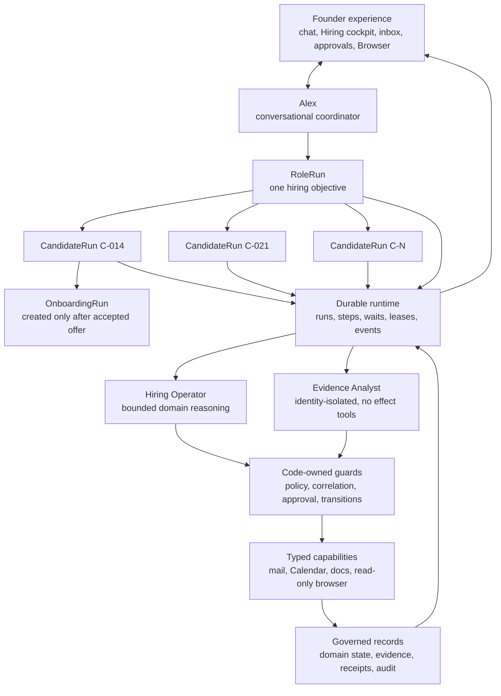

# 25 — Hiring Operations: Founding Hire Relay

## Status and decision

**Status:** Founder-authorized bounded production implementation. Normal
`/hiring` intake creates a real, editable Founder role draft from the supplied
description; the former Ruhu FDE package is an optional synthetic demo fixture
only. The app-owned role page and encrypted role-scoped application form may be
enabled with a dedicated deployment secret. A valid submission atomically
creates one candidate run and dispatches an authenticated, idempotent Alex
evidence job. The Hiring Operator owns the durable step; the identity-isolated,
tool-less Hiring Evidence Analyst receives only the closed role/criterion/
evidence envelope and produces criterion-linked `PRESENT` / `MISSING` /
`UNCLEAR` coverage. The UI reports **Alex is preparing evidence** until the
validated passport is committed, then offers the Founder **View evidence**.
The Founder never starts evidence preparation. After the Founder reviews the
committed Evidence Passport and records an attributed `ADVANCE`, the real H4
lane may use the connected Alex Mail and Founder Calendar accounts to prepare
candidate communication, read Founder free/busy, correlate candidate replies,
negotiate bounded availability, and create/update/cancel one candidate-bound
interview. One fresh Founder consent activates a durable
`SCHEDULE_INTERVIEW` goal bound to the candidate, current decision and policy,
exact applicant thread, interview duration, bounded scheduling window,
optional Founder copy, and expiry. Alex may then continue that exact thread,
interpret explicit or free-form scheduling replies, recheck Founder
availability, and create or update only the Hiring-owned interview without
per-message approval. Every provider effect still has a `PREPARED` receipt;
`UNCERTAIN` blocks retry until reconciliation. This is not H4S and does not
require synthetic identities. Third-party job posting, scoring, ranking,
recommendation, automatic hiring decisions, offer, and onboarding effects
remain disabled and unauthorized.

**Evidence preparation boundary:** intake and evidence preparation are separate
durable boundaries. The public request commits encrypted identity/CV records,
the candidate run, and `EVIDENCE_QUEUED` atomically, then returns. Cloud Tasks
(or the signed exact-loopback local adapter) wakes only
`/tasks/hiring/prepare_candidate_evidence`. The worker authenticates its
workload principal before reading the application id, re-resolves the exact
published role and approved policy, claims one version-fenced lease, decrypts
only the bound restricted CV, uses the document-ingestion tool, redacts unsafe
blocks, validates the closed analyst envelope, and commits one idempotent
Evidence Passport. Delivery or preparation failure is a visible content-free
`DELAYED`/`FAILED` state; it never becomes a candidate decision. Duplicate
delivery reuses the same run, evidence ids, assessment id, and event keys.

**Role-package writing boundary:** normal `/hiring` drafting uses the configured
Gemini model through an injectable, tool-less service boundary. The model sees
only the exact Founder description, bounded canonical company facts, and the
visible working-model assumptions. It fills the existing role-description
fields; deterministic code preserves the title and numeric requirements,
checks counts, duplication, grounded optional facts, prohibited selection
criteria, and section overlap, then permits at most one bounded repair. Provider
failure returns `role_writer_unavailable`; a second invalid response returns
`role_draft_unsafe`; neither persists a role. The shallow compiler is available
only as an explicitly labelled non-Cloud local fallback, and the synthetic FDE
fixture never participates in normal drafting.

**Public application surface:** the app-owned public role page renders the
complete approved job description before a minimal application form containing
full name, email, PDF/DOCX CV upload, an optional message, and one Submit application
button. Published roles expose View public job page and Copy application link
controls in the authenticated Hiring workspace. Local development persists a
dedicated user-private 256-bit intake key outside the repository by default so
Founder-published local roles are actually testable across restarts; an explicit
local `0` disables intake. Cloud Run never falls back to that local key and
continues to require its separately configured intake secret and release gate.

**Decision:** build hiring as a curated, human-controlled outcome pack on the
shared Alex runtime. A role may remain open for months. One durable parent role
run coordinates independent candidate child runs, and an accepted candidate
creates a separately permissioned onboarding run. No model invocation, process,
websocket, or browser remains alive while the operation waits.

**Binding v1 intake and distribution decision:** the Founder reviews and
approves the exact role package, then separately clicks **Publish approved
role**. Co-Founder publishes that exact package only on its own public role page
and opens its encrypted, role-scoped application form. External job boards
remain a manual Founder handoff; Co-Founder does not automate LinkedIn or any
third-party publication/application API.

**Product promise:** Alex does not choose who is hired. Alex keeps the process
moving, preserves job-related evidence and uncertainty, wakes the correct run
when a real event arrives, prepares approved actions, and makes every human
decision and external effect reviewable.

**Agent count:** three logical reasoning roles participate in the hiring pack:

1. the existing founder-facing **Alex / Conversational Coordinator**;
2. one new bounded **Hiring Operator**;
3. one new identity-isolated **Hiring Evidence Analyst**.

The existing cross-workflow Distiller may process founder feedback about Alex's
general writing or operating preferences, but it is not part of candidate
assessment and is not counted as a hiring agent. Hiring policy changes use the
versioned role-policy path in this document, never an implicit memory update.

There is deliberately no agent per stage, candidate, connector, or wait. The
durable runtime, event normalizer, correlation engine, policy guards, approval
service, action ledger, redaction boundary, and timers are code-owned services.

---

## 1. Review of the attached assessment

### 1.1 Findings accepted

The attached assessment is directionally correct on the important points:

- the operation can last weeks or months;
- one role run must coordinate many independently sleeping candidate runs;
- runtime status and hiring-domain state are orthogonal;
- the strongest demonstration opens on an operation with history rather than
  pretending the entire hire happens live;
- evidence should be criterion-by-criterion, cited, and explicit about unknowns;
- policy changes require a version and impact analysis across affected work;
- Alex cannot make the final advance, decline, hire, or offer decision;
- candidate communication, Calendar invitations, references, job publication,
  offers, and onboarding effects require explicit authority;
- production use requires a dedicated policy, retention, evaluation, and
  qualified employment/privacy review.

### 1.2 Pre-implementation corrections that remain binding

The response overstated how much was reusable at the review baseline. H0–H3
now implement the named dependency slices; the constraints below remain the
reason those implementations exist and are not authorization for H4–H7:

1. Durable ADK sessions and the current `state_delta` wake path were
   insufficient alone; H1 adds generic `WorkflowRun`, `RunEvent`, `Wait`,
   `StepAttempt`, lease, pause/resume, parent/child run, and cancellation
   contracts independent of chat history.
2. Gmail push and generic durable mail receipts/inbox routing remain
   insufficient alone; H3 adds trusted intake identity and H4 now adds exact
   outbound-thread plus server-resolved candidate-address correlation for the
   normal Alex mailbox. Subject/excerpt matches remain non-authoritative and
   are never safe candidate correlation.
3. H4 reuses the reviewed email/Calendar provider primitives behind a separate
   candidate-run-bound consequence service. Current ADVANCE, role policy,
   connector identity/scopes, payload bounds and the active Founder coordination
   consent are rechecked before the shared `external_actions` receipt enters
   `PREPARED`.
4. Founder free/busy, interview create/update/cancel and receipt/reconciliation
   tracking are implemented for events created by Hiring. Candidate calendars
   are never queried; Alex proposes Founder slots and the applicant accepts or
   counters by email.
5. The Browser panel and containment runtime exist and remain reusable for
   read-only inspection. They are not authorization to automate LinkedIn or an
   unsupported job board. LinkedIn publication is a founder handoff in v1; the
   grant form-filler must not be repurposed by prompt alone.
6. Upload/Drive ingestion, artifacts, citations, previews, session-resource
   links, and global search exist. Candidate evidence needs a stricter identity,
   visibility, search, retention, and model-context boundary; it must never flow
   into the Founder Profile or company-knowledge retrieval by default.
7. The existing general surfaces supplied reusable components, not a hiring
   product surface. H3 adds the role cockpit, candidate board, evidence
   passport, human-decision controls, policy impact, inbox, causal timeline,
   and data-rights controls. H4 adds candidate-scoped live communication,
   reply, availability and interview receipts. Reference, offer and onboarding
   views remain later work and are intentionally absent.
8. A passing current test suite demonstrates current primitives, not hiring
   correctness, fairness, privacy, event correlation, or months-long recovery.
9. The former authentication path answered only “is this an allowed founder?”
   and collapsed authenticated humans into one process-wide `FOUNDER_ID`.
   Hiring now requires a server-derived actor principal with an active
   `FOUNDER` membership before a human decision, interview scorecard, approval,
   or audit row can be trusted.
10. Current upload registration makes general artifacts searchable before
    extraction. Hiring therefore needs a closed restricted-ingestion scope and
    sensitivity-aware search boundary before any résumé or candidate document
    is accepted.

The implementation dependency is therefore:

```text
docs/21 phases 1A–1C durable runtime
    + docs/24 event/inbox/action reliability foundations
    + this reviewed hiring domain contract
    + qualified legal/HR/privacy review and labelled evals
    = authorization to consider a production hiring pilot
```

### 1.3 Adversarial review disposition

The subsequent `ACCEPT_WITH_REQUIRED_CHANGES` review was accepted with these
binding deltas:

- server-derived ActorPrincipal, workspace membership, roles/assignments, and
  distinct attribution for decisions, scorecards, approvals, waivers, and audit;
- `HIRING_RESTRICTED` ingestion/sensitivity with zero general resource/search
  registration;
- fail-closed block redaction and inbox escalation;
- workspace/run-scoped approvals that survive chat-session changes;
- queryable external-action truth committed `PREPARED` before provider calls;
- explicit role-cancellation communication obligations;
- a code invariant that timeout/silence cannot become an employment decision;
- HELD exits, withdrawal/acceptance race handling, start-date supersession, and
  immediately effective policy-version guards;
- persisted synthetic markers and refusal of live effects/connectors;
- Firestore index/query contracts and no hot aggregate role counter;
- prohibition on comparative candidate prose from Alex;
- per-candidate envelope encryption and honest provider-deletion limits.

Any candidate-portal/mock-ATS-first interpretation and any implication that
LinkedIn should be written through the Browser were rejected because they
contradict the binding email-first/manual-publication decision. This is a design
disposition, not an attribution that the prior reviewer recommended a portal.
The compatible reliability findings were retained and applied to Gmail
application intake.

The review requested one transaction to activate a policy and mark every
affected candidate stale. This specification preserves the safety property but
uses a scalable form: current-policy pointer plus immutable impact manifest are
atomic, and guards immediately treat every mismatched output as stale; display
backfill may then proceed idempotently.

### 1.4 Email-intake re-review disposition

The later `ACCEPT_WITH_REQUIRED_CHANGES` email-intake review is accepted with
the following binding refinements:

- Alex's mailbox uses one unfiltered Gmail watch and one unfiltered mailbox
  history stream. Role labels select hiring messages after fetch; neither
  `INBOX` nor a dynamic list of active labels scopes the watch or cursor.
- Expired-cursor recovery starts from a persisted complete-sync checkpoint with
  overlap, enumerates every applicable binding to exhaustion, and refuses to
  advance the cursor if completeness cannot be proven.
- A fetched history cursor is never advanced before every fetched message id is
  represented by a durable receipt or recoverable fetch-batch manifest. This
  closes a crash window missed by the review.
- A mailbox binding is not trusted merely because a Gmail filter produced a
  label. Its routing mechanism must pass an implementation feasibility review,
  a positive delivery probe, and a negative forged-header probe. Failure
  revokes the binding and quarantines affected mail.
- High-authority operations require server-verified recent authentication in
  addition to current membership and assignment authorization.
- Founder publication attestation and optional public verification are
  orthogonal. LinkedIn automated read-only verification is disabled until a
  qualified terms review explicitly allows it.
- Delivery failures and automatic replies are deterministic event classes;
  neither can create or imply a candidate decision.
- One person may apply to multiple roles. Applications, evidence, assessments,
  decisions, and agent context remain role-scoped with no cross-role signal.

The review's suggestion that zero applications for a configured number of days
proves mailbox failure is rejected. A quiet role may be healthy. Binding health
comes from watch expiry, cursor lag, complete reconciliation checkpoints, and
controlled positive/negative probes—not the presence or absence of candidates.

### 1.5 Hiring workflow design disposition

Five production patterns are binding:

1. backend-authoritative surfaces with no optimistic workflow advancement;
2. causal receipt-before-derived-artifact presentation;
3. a two-sided founder/candidate interaction visualization without an owned
   candidate portal or candidate-side control plane;
4. versioned ADK golden trajectories for long-delay resume and gate safety, in
   addition to deterministic runtime tests;
5. a demonstration read from ordinary durable projections, with no independent
   mutable demo case store.

Process-memory cases, local artifact authority, UI interval polling,
caller-selected webhook session identity, direct tool state mutation,
prompt-only transition enforcement, and simulated provisioning secrets are
explicitly rejected for this product. Optional Agent Runtime packaging remains
a deployment decision and is not required to satisfy H0–H3.

### 1.6 Cross-cutting production disposition

The repository-wide risk review accepts four additional production patterns:

1. strict, versioned model-to-code envelopes with deterministic validation;
2. authenticated workload identity distinct from human actor identity;
3. request-scoped connector credentials that cannot cross sessions or workers;
4. baseline-parity, hard-negative, false-activation, and correct-abstention
   evaluation with human-reviewed synthetic cases.

The review explicitly rejects shortcuts including unauthenticated task,
viewer, browser-decision, or mutation routes; process-global user OAuth tokens;
tokens in logs, task prompts, session state, Firestore, or object storage;
prompt-only approval/policy enforcement; unrestricted browser navigation;
dynamic code-generated agents; generic tool/MCP import; polling memory; and
non-idempotent event workers. Only the checked-in contracts and measured
runtime behavior are production-authoritative.

---

## 2. Outcome, scope, and non-goals

### 2.1 Founder outcome

The canonical objective is:

> Hire `<headcount_target>` people for `<role>` by `<target_date>`, within an
> approved compensation/location/employment envelope, using a founder-approved
> evidence policy, while preserving human control over every employment
> decision and external commitment.

The run may remain active for months. Long duration changes the reliability
contract: credentials expire, people reply late, role requirements change,
interviews are rescheduled, providers redeliver events, workers crash, models
change, and retention deadlines become due. Durable records—not chat history or
an open agent invocation—must survive all of those conditions.

### 2.2 In scope for the reviewed v1 product contract

- role intake, role contract, job description, and structured interview plan;
- founder approval of the exact role contract and exact publication package;
- founder-performed LinkedIn/job-board publication with an attributed manual
  receipt; optional read-only public-URL verification only for a destination
  whose reviewed policy and terms explicitly permit it;
- one role-specific application address such as
  `apply+<opaque-role-token>@ruhu.ai` on Alex's mailbox;
- Gmail push/event ingestion, attachment copying, and safe résumé/application
  extraction from that mailbox;
- identity-separated, criterion-by-criterion candidate evidence passports;
- founder screen decisions: `ADVANCE`, `HOLD`, `REQUEST_EVIDENCE`, `DECLINE`;
- one bounded Founder consent for candidate email coordination plus exact reply
  correlation;
- Founder availability, consent-bound proposed slots, receipt-backed Calendar
  invitations, rescheduling, cancellation, and interview completion events;
- consented interview notes/transcripts and structured scorecards;
- candidate-authorized reference checks with exact-approved questions/outreach;
- founder final decision, exact offer preparation/send, and acceptance event;
- creation of a separate onboarding run, first-week plan, meetings, policy
  acknowledgements, and approval-bound access requests;
- cancellation, pause, resume, retries, timeouts, reconciliation, deletion, and
  audit across the complete lifecycle.

### 2.3 Explicit non-goals for v1

- autonomous hiring, rejection, advancement, offer, compensation, or reference
  decisions;
- an opaque fit score, ranking leaderboard, or model-generated cutoff;
- personality, emotion, honesty, facial, voice, accent, style, or culture-fit
  inference;
- school or employer prestige as a proxy for a job criterion;
- inference or scoring of protected or sensitive characteristics;
- broad candidate sourcing, scraping personal data, or unsolicited mass mail;
- arbitrary job-board automation or a claim to work on every ATS;
- automated LinkedIn access, posting, scraping, applicant download, messaging,
  or use of browser automation to simulate a founder;
- an owned application portal or candidate account system in v1;
- background checks, right-to-work adjudication, medical/disability inquiries,
  payroll, benefits, tax, immigration, or legal advice;
- automatic creation of employee identities, production access, financial
  accounts, payroll records, or binding contracts;
- using candidate data to train models, enrich the Founder Profile, populate
  company knowledge, or make it globally searchable;
- replacing an ATS, HRIS, e-signature, identity provider, or qualified human.

---

## 3. Target architecture



### 3.1 Run hierarchy

| Run | Cardinality | Responsibility | Completion |
|---|---:|---|---|
| `RoleRun` | one per approved requisition | role contract, publication, aggregate progress, policy versions, headcount, closure | target filled or founder closes/cancels; all child effects reconciled |
| `CandidateRun` | one per deduplicated application | evidence, human decisions, correspondence, interviews, references, offer | declined/withdrawn/accepted/closed with all actions and waits resolved |
| `OnboardingRun` | zero or one per accepted candidate | pre-start and first-week obligations under a new permission/retention boundary | required tasks complete or explicitly waived by an authorized human |

All runs in one hiring objective share a `journey_id`. `parent_run_id` records
the immediate role/candidate relationship. A candidate run is never represented
as another chat session, and chat is never its system of record.

### 3.2 Why onboarding is a separate run

Offer acceptance changes the purpose and authority for processing data. The
candidate becomes a future teammate; provisioning and employment documents have
different connectors, approvers, retention, and blast radius. Creation of the
onboarding run and the accepted-offer transition must be atomic. Only the
minimum approved identity/contact/offer facts cross the boundary. Recruiting
notes and comparative assessments do not automatically become employee records.

### 3.3 Binding email-first v1 flow

This diagram supersedes any earlier owned-portal, mock-ATS-first, or automated
LinkedIn/browser-publication proposal:

```mermaid
flowchart TB
    F["Ruhu: Hire a Forward Deployment Engineer"] --> RC["Alex creates Role Brief,<br/>Hiring Scorecard, Interview Plan<br/>and Public Job Description"]
    RC --> AP{"Founder approves exact<br/>Role Contract and publication package?"}

    AP -- "Revise" --> RC
    AP -- "Approved" --> HANDOFF["Founder manually publishes to LinkedIn<br/>or another unsupported destination"]
    HANDOFF --> RECEIPT["Record attributed URL/post receipt<br/>Attestation separate from verification status"]
    RECEIPT --> WAIT1["Dormant: waiting at<br/>apply+role-token@ruhu.ai"]

    WAIT1 -->|"Unfiltered Gmail push/history<br/>recoverable batch + durable receipt"| CORR1{"Trusted route identity + label<br/>from verified mailbox binding?"}
    CORR1 -- "No" --> INBOX["Founder inbox / quarantine"]
    CORR1 -- "Yes" --> INGEST["Copy email and résumé attachments<br/>into hiring-restricted ingestion"]
    INGEST --> SAFE["Format/malware/injection scan,<br/>data minimization and fail-closed redaction"]
    SAFE --> ASSESS["Criterion-by-criterion Evidence Passport<br/>with citations and unknowns"]

    ASSESS --> REVIEW{"Attributed human decision"}
    REVIEW -- "Hold / request evidence" --> HOLD["Record decision and wait<br/>No decision by silence"]
    REVIEW -- "Decline" --> DECLINE["Record human decision<br/>Separate message approval obligation"]
    REVIEW -- "Advance" --> OUT{"Approve exact outreach?"}

    OUT -- "Approved" --> EMAIL["Send email through external-action ledger<br/>Record Gmail message/thread receipt"]
    EMAIL --> WAIT2["Dormant: waiting for candidate reply"]

    WAIT2 -->|"Gmail push"| CORR2{"Exact causal thread/token?"}
    WAIT2 -->|"Permanent DSN"| CONTACT["Contact-correction inbox<br/>No candidate decision"]
    WAIT2 -->|"Temporary DSN / automatic reply"| WAIT2
    CONTACT --> OUT
    CORR2 -- "Ambiguous" --> INBOX
    CORR2 -- "Certain" --> SLOTS["Propose founder-available interview slots"]

    SLOTS --> INVITE{"Approve exact attendees,<br/>time, timezone and content?"}
    INVITE -- "Approved" --> INTERVIEW["Create Calendar invite and interview brief"]
    INTERVIEW --> NOTES["Attributed structured interview evidence"]

    NOTES --> CONSENT{"Founder advances candidate<br/>and candidate permits references?"}
    CONSENT -- "Yes" --> REFS["Approve exact reference questions/outreach"]
    REFS --> WAIT3["Dormant: waiting for reference replies"]

    WAIT3 -->|"Exact Gmail thread/token"| REFSUM["Cited reference report<br/>with uncertainty and contradictions"]
    REFSUM --> OFFER{"Attributed founder offer decision<br/>and exact terms/document approval"}

    OFFER -- "Send" --> WAIT4["Dormant: waiting for authoritative acceptance"]
    WAIT4 -->|"Accepted-offer event"| ONBOARD["Atomically create OnboardingRun<br/>plan, meetings and access requests"]
    ONBOARD --> DONE["Outcome: teammate ready to start"]

    SAFE -- "Unsafe or unredactable" --> INBOX
```



LinkedIn Easy Apply notification email branches to
`APPLICATION_AVAILABLE_AT_PROVIDER → founder inbox`; it does not enter `INGEST`
unless the founder performs an authorized manual import or an approved official
provider adapter supplies the complete application.

---

## 4. Agent topology and permissions

### 4.1 Alex / Conversational Coordinator — existing

Alex owns the founder relationship, not hiring truth.

**May:**

- start/inspect/control an authorized hiring run through runtime APIs;
- explain status, evidence, waits, failures, and next decisions;
- ask focused role or candidate clarification questions;
- present policy proposals, impact reports, decisions, and approvals;
- route bounded work to the Hiring Operator or Evidence Analyst;
- prepare a founder-facing summary from committed typed records.

**May not:**

- write run/domain state directly;
- resolve an approval or founder decision from chat text;
- read raw candidate identity plus assessment evidence in one unrestricted
  context;
- produce prose that compares candidates or launders a ranking/recommendation
  through chat, including “strongest,” “best,” or “better than” summaries;
- send, publish, invite, reject, offer, provision, or sign directly;
- infer that silence, a calendar event, or a positive summary is a decision.

### 4.2 Hiring Operator — new

One bounded domain agent serves role design, process preparation, communication
drafting, interview-plan drafting, contradiction surfacing, offer-package
preparation, and onboarding-plan preparation. The runtime invokes it for a
single typed step with a minimal context pack.

**Context:** current run/step ids, approved role policy version, pseudonymous
candidate id when applicable, typed evidence/decision records needed for the
step, allowed capability descriptors, and explicit negative constraints.

**Tools:** read typed hiring records; prepare artifacts; propose questions;
prepare (not execute) messages, meetings, postings, offers, and onboarding
tasks. Effect tools are unavailable. It returns a typed `StepOutcome`.

### 4.3 Hiring Evidence Analyst — new and isolated

This agent processes untrusted résumé, application, portfolio, interview, and
reference content. It runs with `include_contents="none"`, receives no chat
history, no founder profile, no external action tools, and no direct candidate
contact details. Its input uses a pseudonymous candidate code and redacted
evidence bundle.

It returns only a validated schema:

```json
{
  "schema_version": "hiring_evidence_passport.v1",
  "policy_version_id": "hpv_...",
  "candidate_application_id": "ca_...",
  "criteria": [
    {
      "criterion_id": "criterion_customer_deployment",
      "status": "SUPPORTED|PARTIAL|NOT_DEMONSTRATED|CONTRADICTED|UNKNOWN",
      "evidence_refs": ["ce_..."],
      "reason": "bounded job-related explanation",
      "questions": ["bounded clarification question"]
    }
  ],
  "conflicts": [],
  "withheld_refs": [],
  "model_provenance": {}
}
```

`UNKNOWN` and `NOT_DEMONSTRATED` are not converted into zero. V1 has no total
score and no rank. Schema validation rejects free-form recommendations such as
“hire,” “reject,” “best,” “culture fit,” or personality judgments.

Both the analyst input and output use closed, versioned schemas with
`additionalProperties: false`, closed enums, bounded strings/arrays, and no
free-form extension map. Model JSON is never persisted directly. A
deterministic validator first verifies the schema version, invocation-bound
workspace/role/application/policy ids, every evidence reference against the
authorized input set and immutable evidence hash, citation ownership, size
limits, and forbidden fields/phrases. Unknown fields, an unsupported version,
an invented or cross-application citation, or an invocation-id mismatch returns
a safe validation error, commits no assessment, and routes the step to its
review/failure contract. JSON response MIME type alone is not validation.

### 4.4 Responsibilities that are not agents

| Responsibility | Owner |
|---|---|
| run/step/wait/event state | durable runtime |
| webhook authentication and normalization | connector adapter |
| internal task/push identity verification | workload-principal verifier |
| event deduplication and correlation | deterministic event service |
| protected-field removal and context assembly | code-owned redaction service |
| model envelope/citation validation | code-owned schema validator |
| connector credential resolution | request-scoped credential broker |
| state-transition decision | deterministic transition guard |
| approval mint/resolve/consume | server-side approval service |
| action idempotency/reconciliation | external-action service |
| policy diff and affected-record enumeration | deterministic policy-impact service |
| retention/deletion | lifecycle service |
| fairness metrics and release gates | evaluation/observability services plus qualified reviewers |

---

## 5. Runtime and lifecycle contract

### 5.1 Universal runtime status

Every role, candidate, and onboarding run uses doc 21's universal runtime:

```text
RECEIVED → VALIDATING → QUEUED → RUNNING ↔ QUEUED
                                 │
                                 ├→ WAITING → QUEUED
                                 ├→ PAUSED → QUEUED
                                 ├→ CANCELLING → CANCELLED
                                 ├→ FAILED
                                 └→ SUCCEEDED
```

`WAITING_FOR_REFERENCE` is a hiring-domain position. `WAITING` proves no worker
is executing. The UI must display both.

### 5.2 Role domain lifecycle

```text
ROLE_INTAKE
→ AWAITING_QUALIFIED_REVIEW (only when the jurisdiction/policy matrix requires it)
→ AWAITING_ROLE_CONTRACT_APPROVAL
→ READY_TO_DISTRIBUTE
→ AWAITING_PUBLICATION_APPROVAL
→ AWAITING_FOUNDER_PUBLICATION
→ POSTED
→ OPEN
→ FILLING
→ FILLED
→ CLOSING
→ CLOSED
```

`PAUSED` and `CANCELLED` are runtime controls, not role-domain states. A founder
may revise a draft role contract. Once candidates exist, a material policy
change creates a new immutable version and impact workflow; it never edits old
evidence or decision history in place.

`OPEN` does not imply every candidate is in the same stage. `FILLING` means the
accepted-offer count is below the approved headcount but at least one offer is
active. `FILLED` requires accepted-offer receipts meeting the target. Cancelling
or closing a role creates an explicit candidate communication-obligation set.
For every affected nonterminal candidate, the founder must either approve and
complete an appropriate closure message or record an attributed waiver with a
bounded reason permitted by policy. `CLOSED` requires every obligation terminal,
open waits cancelled/resolved, uncertain effects reconciled or explicitly
handed to the founder, candidate retention deadlines scheduled, and all child
run terminal states accounted for.

`POSTED → OPEN` requires `publication_evidence=FOUNDER_ATTESTED`, a current
verified `ApplicationMailboxBinding`, a non-expired Gmail watch, and a complete
mailbox cursor checkpoint. Public URL verification is not required. A binding
that becomes `UNVERIFIED`, `REVOKED`, or stale while a role is `POSTED|OPEN`
creates a role-level intake-health obligation and visibly blocks any claim that
intake is healthy; already received events are still receipted and quarantined.

### 5.3 Candidate domain lifecycle

```text
APPLICATION_RECEIVED
→ CONSENT_AND_NOTICE_VALIDATION
→ EVIDENCE_INGESTION
→ SCREEN_READY
→ AWAITING_SHORTLIST_DECISION

AWAITING_SHORTLIST_DECISION
├→ WAITING_FOR_CANDIDATE_EVIDENCE
├→ AWAITING_CONTACT_APPROVAL
├→ HELD
└→ HUMAN_DECLINED

AWAITING_CONTACT_APPROVAL
→ WAITING_FOR_CANDIDATE_REPLY
→ SCHEDULING
→ AWAITING_INVITE_APPROVAL
→ WAITING_FOR_INTERVIEW
→ INTERVIEW_EVIDENCE_READY
→ AWAITING_INTERVIEW_DECISION

AWAITING_INTERVIEW_DECISION
├→ WAITING_FOR_ADDITIONAL_INTERVIEW
├→ AWAITING_REFERENCE_PERMISSION
├→ AWAITING_OFFER_APPROVAL (explicit Founder reference waiver)
├→ AWAITING_OFFER_APPROVAL (conditional offer; reference remains open)
├→ HELD
└→ HUMAN_DECLINED

AWAITING_REFERENCE_PERMISSION
→ AWAITING_REFERENCE_CONTACT_APPROVAL
→ WAITING_FOR_REFERENCE
→ REFERENCE_EVIDENCE_READY
→ AWAITING_FINAL_DECISION

AWAITING_FINAL_DECISION
├→ AWAITING_OFFER_APPROVAL
├→ HELD
└→ HUMAN_DECLINED

AWAITING_OFFER_APPROVAL
→ WAITING_FOR_OFFER_RESPONSE
→ OFFER_ACCEPTED | OFFER_DECLINED

For a conditional offer, the reference workflow is orthogonal to the offer
state: `AWAITING_PERMISSION → REFERENCES_IN_PROGRESS → REPORT_READY`. Offer
acceptance may create the separate onboarding run, but the onboarding start-date
transition fails closed until `REPORT_READY`. A waiver is an explicit attributed
Founder decision with approved job-related reason codes; silence or missing
reference data can never create a waiver.

Any nonterminal state → CANDIDATE_WITHDREW
HELD → the immediately preceding human-decision state (attributed re-decision)
HELD → CLOSING (role closure with terminal communication obligation)
Terminal decision/withdrawal → CLOSING → CLOSED

WAITING_FOR_CANDIDATE_REPLY
├→ AWAITING_CONTACT_APPROVAL (authoritative permanent delivery failure;
│   corrected recipient and new exact approval required)
└→ WAITING_FOR_CANDIDATE_REPLY (automatic/vacation reply or temporary status;
    receipt only, no candidate decision)
```

The state graph is implemented as a closed transition table. An agent returns a
typed proposal; only code commits a transition. `HUMAN_DECLINED` requires an
authenticated human decision record and does not itself send a message.
`HELD` records the preceding decision state and can leave only through a new
attributed decision or role-closure obligation. No timer, silence, failed
delivery, or model output may enter `HUMAN_DECLINED` or `OFFER_DECLINED`.

A permanent delivery failure supersedes the current reply wait, marks the
causal external action's delivery outcome, and creates exactly one founder
inbox item. It may return the branch to `AWAITING_CONTACT_APPROVAL` only after
an authorized actor supplies a corrected address; the corrected message needs
a new payload-bound approval. A temporary delivery status or vacation/automatic
reply does not resolve the candidate-reply wait.

`CANDIDATE_WITHDREW` applies only while no authoritative accepted-offer event is
committed. A withdrawal racing with acceptance is ordered by provider event
identity/time plus receipt commit; an unresolved conflict enters the founder
inbox and cannot undo `OFFER_ACCEPTED` or orphan an OnboardingRun.

### 5.4 Onboarding domain lifecycle

```text
ONBOARDING_INTAKE
→ AWAITING_PLAN_APPROVAL
→ PRE_START
→ WAITING_FOR_START_DATE
→ FIRST_DAY
→ FIRST_WEEK
→ AWAITING_COMPLETION_REVIEW
→ COMPLETE
→ CLOSED
```

A start-date change supersedes the current `WAITING_FOR_START_DATE` wait,
appends a start-date version, invalidates affected meeting/task approvals, and
creates one replacement wait. An older timer/event cannot advance the run.

Access, account, payroll, benefits, contract, or policy-acknowledgement actions
remain separate checklist items with their own authoritative connector and
approval/completion receipt. Alex may prepare an access request; it cannot
silently provision access.

### 5.5 Wait contract

Every wait persists:

- `wait_id`, `run_id`, `step_id`, `domain_state`, and `plan_version`;
- one closed `event_type` and exact correlation keys;
- `opened_at`, optional `timeout_at`, timeout behavior, and status;
- expected actor (`founder`, `candidate`, `reference`, `provider`, `timer`);
- supersession/cancellation reason;
- resolution `event_id` and committed next step.

A timeout never creates or implies a human employment decision. For every
candidate-facing wait, `hiring.wait_timeout` may only create a founder inbox
item, move the branch to `HELD`, or enqueue an already approved non-decision
follow-up. It cannot create a decision row or transition to `HUMAN_DECLINED`,
`OFFER_DECLINED`, or any other adverse/positive decision state.

Timeouts longer than a queue's scheduling horizon use doc 21's bounded
checkpoint chain. A checkpoint performs no model work. There is no periodic
scan as the primary mechanism.

---

## 6. Role Contract and hiring-policy versions

### 6.1 Role Contract

Before publication, the founder reviews one exact, versioned Role Contract.
The contract has four named, immutable, linked artifacts with their own hashes:

1. **Role Brief** — mission, responsibilities, constraints, employment and
   compensation envelope, and 30/90/180-day outcomes;
2. **Hiring Scorecard** — job-related required/preferred criteria, evidence
   anchors, unknown handling, prohibited attributes and proxies;
3. **Interview Plan** — stages, questions, owners, consent requirements, and
   evidence expectations;
4. **Public Job Description** — the exact founder-approved publication text,
   application mailbox, privacy/AI-assistance notice link, accommodation/human
   contact, and application instructions.

Together they include:

- company identity, role title, mission, employment type, headcount, target
  date;
- location, time-zone, travel, work authorization, and physical requirements
  only when validated as lawful and genuinely job-related;
- compensation range and approved public wording;
- role outcomes for 30/90/180 days;
- required and preferred criteria with a job-related rationale;
- acceptable evidence types and clarification questions per criterion;
- structured interview stages, questions, owners, and evidence expectations;
- reference stage, consent language, questions, and permitted timing;
- prohibited attributes, inferences, proxies, and data sources;
- candidate notice, accommodation contact/path, and human-review statement;
- communication policy, response targets, quiet hours, and escalation rules;
- retention period, candidate deletion/export path, jurisdiction tags;
- distribution destinations, manual/API publication mode, role-specific
  application address, and exact public job description;
- model/prompt/capability versions used for evidence organization;
- policy owner and qualified-review status.

Role approval binds the exact contract and four artifact hashes. Publication
package approval is a second approval bound to the exact rendered posting,
destination, account/company identity, application address, notice URL, and
policy version. In v1 the founder—not Alex—performs LinkedIn publication.

### 6.2 Criterion schema

Each criterion contains:

```json
{
  "criterion_id": "criterion_customer_deployment",
  "label": "Customer-facing production deployment",
  "kind": "REQUIRED|PREFERRED",
  "job_related_rationale": "Why this predicts the named role outcome",
  "allowed_evidence_types": ["application", "portfolio", "interview"],
  "positive_anchors": ["bounded behavioral examples"],
  "counterevidence_anchors": ["bounded job-related contradictions"],
  "clarification_questions": ["approved question"],
  "prohibited_proxies": ["school_prestige", "employer_prestige"],
  "status": "ACTIVE"
}
```

V1 does not assign numeric weights or compute a total score. A later ranking or
cutoff feature is a separate high-risk product decision requiring a new legal,
fairness, explainability, and evaluation review. Human readers see the same
criterion order for every active candidate.

### 6.3 Policy update and impact analysis

A correction such as “do not use culture fit; require concrete reference
examples” creates `HiringPolicyVersion N+1`; it never edits N.

Before approval, deterministic impact analysis reports:

- all active candidate runs using N;
- evidence products, assessments, interview briefs, and reference summaries
  derived under N;
- items that remain valid, must be regenerated, or require human review;
- open approvals invalidated because their policy/plan hash changed;
- open waits that remain reachable versus require replacement;
- completed human decisions made under N;
- expected model work, time, and cost;
- whether the change is material enough to require historical reconsideration.

Approval of N+1 atomically commits the immutable impact manifest and updates the
role's current policy pointer. From that commit onward, guards treat every
derived output whose `policy_version_id != role.current_policy_version_id` as
`STALE_POLICY` even before its optional display projection is backfilled. This
avoids an unsafe partial multi-document update and scales beyond one Firestore
transaction limit. No new human decision may rely on a stale assessment. All
affected active candidates are reprocessed uniformly. Completed human decisions
remain immutable and visible; the system presents the full historical impact
set and never selectively reopens candidates. Any reconsideration is an
explicit, uniformly scoped human plan with its own audit.

---

## 7. Evidence, identity, and decision contract

### 7.1 Three data zones

1. **Identity vault:** name, email, phone, address, provider candidate id,
   signed consent/notice receipts, and reference contact details. Accessible
   only to identity-required services and authorized founder UI.
2. **Evidence zone:** pseudonymous candidate code, source artifact ids,
   criterion-linked quotes/facts, locators, confidence/verification status,
   conflicts, and withheld-content markers. This is the only zone supplied to
   the Evidence Analyst.
3. **Decision zone:** authenticated human decision, job-related reason codes,
   policy version, evidence refs reviewed, actor, timestamp, and correction
   lineage. A model cannot write the authoritative decision.

The code-owned context builder enforces the boundary. Prompt instructions are
not sufficient.

### 7.2 Evidence item

Every material claim references an immutable evidence item:

```json
{
  "evidence_id": "ce_...",
  "candidate_application_id": "ca_...",
  "source_artifact_id": "artifact_...",
  "source_kind": "APPLICATION|RESUME|PORTFOLIO|INTERVIEW|REFERENCE|FOUNDER_NOTE",
  "criterion_ids": ["criterion_..."],
  "locator": {"page": 2, "block": "resume-experience-3"},
  "quote": "bounded exact excerpt",
  "normalized_fact": "bounded job-related fact",
  "authority": "CANDIDATE_CLAIM|INTERVIEW_OBSERVATION|REFERENCE_CLAIM|FOUNDER_OBSERVATION",
  "verification": "UNVERIFIED|CORROBORATED|CONTRADICTED",
  "content_risk": "CLEAR|INJECTION_SUSPECTED|WITHHELD",
  "created_at": "..."
}
```

Evidence extraction must preserve provenance and distinguish quotation,
observation, candidate claim, reference claim, and inference. A résumé claim is
not silently upgraded to verified fact.

### 7.3 Protected and prohibited data boundary

Before model assessment, deterministic and model-assisted redaction removes or
withholds direct identifiers and prohibited fields including photo, age/date of
birth, graduation year where it reveals age, nationality, marital/family
status, religion, disability/medical information, race/ethnicity, sex/gender,
sexual orientation, genetic information, and other jurisdiction-configured
protected data.

Redaction does not pretend the source never contained the field. A separate
safe receipt records field category, action (`REDACTED`/`WITHHELD`), rule
version, and source locator without copying the value. False-positive and
false-negative rates are part of the release eval.

Redaction fails closed at the evidence-block level. Deterministic rules and
layout/OCR classification run before any assessment model. Model assistance may
identify additional risk but is never the sole allow gate for a protected
category. If extraction confidence is below the reviewed threshold, a region
cannot be classified, or deterministic/model-assisted passes disagree, the
entire affected block is `WITHHELD`, the related criterion remains `UNKNOWN`,
and one safe founder-inbox item is created. Raw uncertain content never enters
the Evidence Analyst context merely because a best-effort model returned it.

### 7.4 Candidate Evidence Passport

The founder sees, in fixed criterion order:

| Criterion | Evidence status | Cited evidence | Contradictions | Unknowns/questions |
|---|---|---|---|---|
| customer deployment | supported | project excerpt, interview note | none | none |
| regulated workflow | unknown | none | none | request a concrete example |
| incident response | partial | résumé claim | no behavioral example | ask approved question |

There is no default total score, rank, “recommended candidate,” personality
label, or culture-fit field. The UI must not encode a pseudo-ranking through
color, card order, progress bars, or celebratory copy.

### 7.5 Human decision record

`ADVANCE`, `HOLD`, `REQUEST_EVIDENCE`, `DECLINE`, `REOPEN`, and `CORRECT`
require an authenticated human UI/API action. The record binds:

- founder/workspace, role, candidate, run, stage, and policy version;
- evidence/assessment versions actually displayed;
- one or more approved job-related reason codes;
- optional bounded human note;
- decision actor and timestamp;
- superseded decision id for a correction/reopen;
- whether candidate communication is required and its separate action id.

Chat may open the decision surface but cannot resolve it. Absence of evidence,
model confidence, elapsed time, missed email, or a timeout never becomes a
decline decision.

### 7.6 Authenticated actor principal and authorization

Hiring cannot use the process-wide `FOUNDER_ID` as human identity. Every
founder-facing request resolves a signed, server-derived `ActorPrincipal`:

```json
{
  "actor_id": "member_...",
  "workspace_id": "workspace_...",
  "role": "FOUNDER",
  "session_auth_time": "..."
}
```

Email/display name may be shown in an authorized member surface but is not the
audit identity and cannot be supplied by the client. `workspace_members` is the
generic authority collection. `FOUNDER` is the only accepted human membership
role and receives the workspace's product and administrative access.
Membership status changes are append-only audited and take effect at execution
time. Retired role values are invalid and require the explicit pre-production
reset described in doc 13.

Every hiring decision, scorecard, manual publication receipt, approval
resolution, waiver, correction, data export, identity reveal, and audit row
stores `actor_id`. Server authorization checks workspace, current membership,
operation, freshness, and any exact durable approval or consequence gate. The
current boolean `request_is_founder()` and
constant `FOUNDER_ID` may remain for the funding compatibility path, but they
are explicitly incompatible with hiring and must not cross the H1 exit gate.

Authentication lifetime and authority lifetime are separate. A long-lived
signed session may authorize ordinary reads and preparation, but the following
operations require a server-verified authentication age of at most 15 minutes:

- reveal candidate identity or restricted contact data;
- export candidate data or resolve a deletion/legal-hold request;
- approve or execute an offer/signature send;
- activate or revoke a workspace membership;
- cancel or close a role with active candidates.

The reviewed `AuthFreshnessPolicy` is versioned and may shorten this limit;
lengthening it requires security review. The server derives
`session_auth_time` from the verified identity-provider authentication event,
stores it in the signed session, and compares it with server time at both
approval resolution and effect execution. A client-supplied timestamp, cookie
refresh, page reload, or ordinary token refresh cannot extend freshness. An
expired high-authority request returns a step-up-required response without
revealing the protected record or mutating state. The production founder token
and compatibility `FOUNDER_ID` path cannot satisfy hiring step-up.

### 7.7 Authenticated workload principal

Human authority and compute authority are separate. Every Cloud Tasks,
Pub/Sub, scheduler, webhook-to-worker, or internal-service request resolves a
server-derived `WorkloadPrincipal` before reading task payload identifiers:

```json
{
  "principal_kind": "CLOUD_TASKS|PUBSUB|INTERNAL_SERVICE",
  "service_account": "hiring-worker@project.iam.gserviceaccount.com",
  "issuer": "https://accounts.google.com",
  "audience": "https://co-founder.example/tasks/hiring/execute_step",
  "delivery_id": "provider-delivery-id"
}
```

The verifier validates the signed token, issuer, exact route audience,
expiration, verified service-account identity, and a route-specific allowlist.
Cloud Tasks/Pub/Sub informational headers are not authentication and cannot
construct this principal. Missing, expired, forged, wrong-audience, or wrong-
service-account requests are refused before task/run existence is disclosed.
Local development uses an explicit test principal/dispatcher that cannot be
enabled in production.

`WorkloadPrincipal` authorizes only bounded internal delivery. It never
substitutes for `ActorPrincipal`, approves an effect, reveals candidate
identity, or supplies a human decision. Step attempts, event receipts and
external-action attempts record the workload principal and originating human
actor/approval as separate provenance. Direct clients and founder-facing UI
cannot invoke internal worker routes.

### 7.8 Request-scoped connector credentials

Provider credentials are resolved at execution time by a code-owned
`ConnectorCredentialBroker` from the connector grant, workspace, actor or
approved delegated-action authority, run/action id, provider account, and exact
required scopes. The adapter receives the shortest-lived usable credential
inside the request/task call scope; the model receives only typed capability
descriptors and safe adapter results.

User or provider tokens, refresh tokens, signed URLs, and secret material must
never be placed in process-global/module-global variables, ADK session state,
workflow/event/action records, Firestore, artifacts, task bodies/prompts,
browser state, model context, or logs—not even prefixes. Background and resumed
tasks carry an opaque grant/action reference, re-resolve authorization and
credentials at execution, and enter `REAUTH_REQUIRED` when no valid credential
exists. They never reuse another request's or user's token and never copy a
token into object storage to extend a long-running job. Secret Manager may hold
server-managed provider secrets under least privilege; user OAuth storage must
use the reviewed encrypted connector store and remain inaccessible to agents.

Concurrent requests for different actors/workspaces are isolation-tested at
the adapter boundary. A cache may contain only non-user configuration or a
credential object keyed and access-controlled by the complete immutable
principal/grant/account/scope tuple, with expiry and revocation enforcement;
there is no process-wide fallback credential.

---

## 8. Stage behavior and completion contracts

### 8.1 Role intake and publication

The Hiring Operator converts the objective into the Role Contract. Missing or
potentially unlawful criteria produce an `AWAITING_QUALIFIED_REVIEW` wait. After
contract approval, Alex prepares the exact publication package: public job
description, destination-specific copy, company/job metadata, role-specific
application address, notice URL, accommodation/human contact, and posting
instructions.

For LinkedIn in v1:

1. the founder approves the exact package;
2. Co-Founder displays copyable fields but neither opens an external browser nor
   operates LinkedIn through Playwright;
3. the run becomes `AWAITING_FOUNDER_PUBLICATION`;
4. the authenticated founder publishes through their own LinkedIn account;
5. the founder records the resulting job URL/post id and attests which approved
   package version was used.

Publication evidence and optional verification are orthogonal:

```text
publication_evidence = FOUNDER_ATTESTED
verification_status = NOT_ATTEMPTED | PUBLICLY_VERIFIED |
                      DRIFT_DETECTED | VERIFICATION_UNAVAILABLE
```

`FOUNDER_ATTESTED` is sufficient publication evidence for `POSTED → OPEN` when
the role's other guards pass. `NOT_ATTEMPTED` and `VERIFICATION_UNAVAILABLE` do
not imply failure, drift, or successful verification and must use neutral UI
language. Only an actual permitted observation that differs from the approved
package creates `DRIFT_DETECTED`, an inbox item, and an `OPEN` block until the
founder corrects or explicitly approves a new package/receipt.

Automated read-only LinkedIn inspection is disabled in v1 until qualified terms
review explicitly permits the exact access pattern. If a different destination
has an approved public-verification policy, a bounded docs 18/22 read-only run
may persist a content hash. It performs no login, typing, submission, applicant
access, or unrelated data extraction; attempts are capped, authwalls/403/429/
robots or policy refusal become `VERIFICATION_UNAVAILABLE`, and no system
browser is opened. A founder may explicitly open an allowed public URL only in
the embedded Browser panel for their own visual review. A screenshot alone is
not provider publication proof.

The immutable manual-publication receipt is a typed `RunEvent` with a current
projection on the role. It contains a deterministic receipt id, role/run,
destination, approved package/policy hashes, server-derived `actor_id`, bounded
public URL/post id, attested time, `publication_evidence`, independent
`verification_status`, verification policy/version/attempt count, optional
observed content hash, and supersession link. URLs containing credentials,
fragments used as tokens, or non-HTTP(S) schemes are refused. Re-recording the
same client request returns the original receipt; changing the package requires
a new approval and receipt.

LinkedIn prohibits unauthorized third-party website automation, and its Job
Posting API is restricted to approved partners. Consequently no hiring browser
write capability exists for LinkedIn, and the optional verification capability
is disabled for LinkedIn until the qualified review above. A future official
API adapter is a new reviewed capability and uses exact approval plus provider
status receipts:

- <https://www.linkedin.com/help/linkedin/answer/a1340567>
- <https://learn.microsoft.com/en-us/linkedin/talent/job-postings/api/overview>

Other unsupported job boards follow the same founder handoff. A reviewed
official API adapter may replace the manual handoff for that destination; the
agent never falls back from a failed API to browser automation.

**Completion:** exact package hash, attributed founder manual-action receipt,
destination/account/company identity, founder-supplied public URL/post id,
timestamp, `publication_evidence=FOUNDER_ATTESTED`, and an independent
verification status that may remain `NOT_ATTEMPTED` or
`VERIFICATION_UNAVAILABLE`. With an official adapter, completion instead
requires the shared external-action receipt plus provider publication status.
Preparing copy or showing a browser frame is not completion.

### 8.2 Application monitoring and ingestion

Applications may arrive through the exact role's gated public form or a
role-specific address, for example `apply+7f3d92@ruhu.ai`. The public token is
opaque, bounded, maps to one open role, and exposes no internal role/run id.
The generic `jobs@` address, subject text, role name, candidate name/email, or
model similarity is never correlation authority. The ordinary Founder inbox
and Alex's general-purpose mailbox are not Hiring sources and are never scanned
to discover applications.

Each role has a code-owned `ApplicationMailboxBinding`: workspace/role,
connection id, public alias, provider label id, trusted routing mechanism/id,
status `PROVISIONING|VERIFIED|UNVERIFIED|REVOKED`, activation/revocation time,
probe receipts, last complete-sync checkpoint, and version. The Gmail label is
a selection projection, not by itself proof of the SMTP envelope recipient:
mailbox users and user filters can add labels, and `to:`/`deliveredto:` filters
may depend on sender-visible headers.

Before a binding becomes `VERIFIED`, an implementation feasibility review must
prove that the configured Workspace alias/routing/gateway mechanism exposes a
provider- or trusted-ingress-derived route identity that cannot be established
by an arbitrary message header. Activation then performs both probes:

1. **positive:** a controlled message delivered to the public role alias carries
   the exact trusted route identity and configured provider label;
2. **negative:** a controlled message delivered elsewhere but containing forged
   `To`/`Delivered-To` values for the role alias does not acquire exact role
   authority.

The probe sender, token, event, expected binding version, result, and actor or
authorized system principal are audited. Probes repeat after routing/admin
changes and on a reviewed cadence. Probe mail is recognized before candidate
ingestion and can never create a candidate. A failed or inconclusive probe sets
the binding to `UNVERIFIED` or `REVOKED`, quarantines matching mail, and blocks
`POSTED → OPEN`. A raw `To`, `Cc`, `Delivered-To`, subject, body value, manually
applied label, or model interpretation cannot establish exact correlation. If
the provider connector cannot expose a trustworthy route identity, this email
intake design fails closed rather than silently downgrading to header matching.

The dedicated Hiring-mailbox connection owns one unfiltered Gmail watch within
that Hiring-only account. It does not share credentials or history with the
ordinary Founder inbox or Alex's general-purpose mailbox. `users.watch` omits `labelIds`
and label filtering, and `users.history.list` omits `labelId`; `INBOX` and a
dynamic list of role labels must never scope the watch or cursor. This preserves
events for messages that a rule archives, marks read, categorizes, or routes to
a recently revoked role. Watch renewal persists expiration and configuration
hash. Binding health is derived from watch expiration/renewal, cursor lag,
complete-sync checkpoints, and controlled probe results. Zero applications for
an interval is not a health failure.

The approved job description offers both the dedicated role address and, only
after its independent channel gate passes, a role-bound application form. The
separate candidate-facing page presents the complete approved job description
before a simple form containing an explicitly entered email address, PDF/DOCX
CV, and optional message. One **Submit application** control records acceptance
of the adjacent role-specific privacy notice; the system never infers contact
details from document contents. Its encrypted application and CV records
converge on the same restricted candidate queue as role-addressed mail, while
neither channel starts assessment, ranking, a decision, contact, or any external
effect. Every published role in the internal workspace provides **View public
job page** and **Copy application link** actions without rendering public intake
controls or restricted candidate material in the workspace itself.
Accommodation, withdrawal, and data-rights paths remain separate human or
authenticated flows. Synthetic fixtures are never eligible for public intake.

Processing order:

1. authenticated Gmail Pub/Sub push fast-acks only after a deterministic cursor
   fetch task is durable;
2. the worker reads the committed mailbox cursor, fully paginates the
   unfiltered history stream, de-duplicates message ids, and persists a
   recoverable, chunked `MailboxFetchBatch` binding the old cursor, proposed new
   cursor, watch/configuration hash, and every fetched message id;
3. without fetching unrelated content, the deterministic selector marks each
   manifest entry either `IGNORED` under a versioned non-hiring rule or
   `HIRING_MESSAGE`; every hiring message then receives one durable
   `external_events` receipt before any domain effect;
4. the verified trusted route identity plus the matching binding label—not an
   untrusted message header, subject, body, or user-applied label—establishes
   the role for a new application;
5. Gmail message/thread ids establish the application/reply correlation after
   the candidate record is transactionally created;
6. the identity service stores sender/contact fields in the encrypted identity
   vault, while bounded untrusted body/attachments enter hiring-restricted
   ingestion;
7. supported attachments are copied immediately into controlled storage,
   validated, malware/format/size checked, injection-scanned, and redacted;
8. notice/consent policy is evaluated from the approved publication/response
   evidence; when explicit acknowledgement is required but absent, assessment
   stops and a founder inbox item/approved clarification path is created;
9. a deterministic intake gate requires an open role, valid trusted-route
   binding,
   bounded sender identity, and at least one allowed application answer or
   supported attachment; spam, malformed, oversized, unsupported, or
   injection-withheld submissions remain receipted/quarantined and do not
   silently create a candidate run;
10. one candidate identity/application/child run and one event effect commit
    idempotently; duplicates return the original receipt;
11. only after every fetch-batch entry has a durable hiring receipt or a
    deterministic `IGNORED` disposition does a compare-and-set advance the
    mailbox cursor from the batch's old value to its proposed new value. An
    incomplete batch is replayed; it never advances the cursor.

Capturing events and advancing the cursor are separate phases by design. A
crash after provider fetch but before receipt creation replays the open batch;
a crash after some receipts reuses their deterministic ids; a crash after batch
completion but before cursor compare-and-set safely repeats the batch. Cursor
advancement never waits for candidate assessment or an agent run—only for the
durable inbound receipt/ignore boundary.

When Gmail rejects an old `startHistoryId`, recovery captures a current provider
history id as the upper checkpoint, then creates one resumable, unfiltered
mailbox recovery batch covering every active and recently revoked binding. Its
lower bound is the earliest applicable binding `activated_at` or persisted
`last_complete_sync_at`, with a reviewed overlap; it is never inferred from
`last_receipt_date`. The time-window enumeration is fully paginated to
exhaustion across read, archived, categorized, and manually relabelled mail;
minimal provider metadata is then selected against every applicable binding,
provider `internalDate` is checked against the recovery window, and results
reconcile by Gmail message id. Individual tasks may remain quota-bounded, but
no fixed result cap such as 20 or 50 may declare the recovery complete.
`in:inbox`, `is:unread`, label-only enumeration, and an unpaginated message list
are forbidden in hiring recovery. If any page, binding, or manifest entry cannot
be completed, the system preserves the old cursor, persists the gap window,
creates one founder inbox item, and reports intake health as degraded. After
full reconciliation, compare-and-set advances to the captured upper history id;
mail arriving during recovery is then replayed from that checkpoint and safely
de-duplicated.

The mailbox adapter must add bounded attachment enumeration/download; the
current classified-excerpt path is insufficient. HTML, tracking pixels, remote
images, links, and attachments are untrusted and never executed or followed as
instructions. Candidate replies stay on the recorded Gmail thread or a
candidate-specific opaque reply token.

The immutable mail receipt records bounded SPF/DKIM/DMARC/Authentication-Results
metadata where the provider supplies it. Failure or absence never becomes an
employment decision or silent exclusion; contradictory/high-risk results
quarantine the application for an identity/consent clarification path. A
forwarded application is likewise receipted but enters the founder inbox
because sender identity and notice/consent provenance are ambiguous. The
forwarder is not silently treated as the candidate.

Mail arriving for a revoked binding or closed role is still durably receipted
and cannot resurrect the role. It creates a bounded late-application obligation:
an approved closure/privacy response or an attributed policy-permitted waiver.
The trust model records that Workspace administrators and mailbox principals
can alter routing or labels; membership/audit controls and the trusted-route
probe mitigate that insider boundary, while a manually applied label alone is
never exact authority.

LinkedIn Easy Apply/job-notification email is not treated as a complete
application. LinkedIn documents that applicant information remains stored on
LinkedIn when email notification is selected, and Recruiter notifications may
be tied to a member-scoped address. Such a notification creates an
`APPLICATION_AVAILABLE_AT_PROVIDER` inbox item; Alex neither scrapes LinkedIn
nor fabricates an application from the notification. The founder may manually
download/import an authorized application, or a future approved Apply Connect/
ATS adapter may supply it:

- <https://www.linkedin.com/help/linkedin/answer/a517570/applicant-options-for-your-job-post>
- <https://www.linkedin.com/help/linkedin/answer/a416410/manage-your-job-post-email-notifications>

**Completion:** one candidate identity, one role-scoped application, immutable
source artifacts, notice/consent status, one candidate child run, Gmail
message/thread correlation, and one event effect—created transactionally and
idempotently. A notification without application evidence cannot satisfy it.

### 8.3 Structured screen

The redaction service creates an identity-free bundle. The Evidence Analyst
maps evidence to the current role policy. A code validator rejects prohibited
fields and recommendation language. Prompt-injection-shaped content is
withheld; it cannot alter policy, capability scope, criteria, or tool use.

**Completion:** validated assessment for every active criterion, citations for
every supported/partial/contradicted claim, explicit unknowns, policy/model
provenance, redaction receipt, and zero decision field.

### 8.4 Founder shortlist

The founder reviews the passport and records a human decision. `REQUEST_EVIDENCE`
opens a wait plus an approved clarification draft. `DECLINE` closes the decision
branch but does not communicate until the separate exact-send action succeeds.

**Completion:** human decision receipt bound to displayed evidence/policy. No
model call may satisfy this contract.

### 8.5 Communication and scheduling

The Hiring Operator prepares the initial message and confirmed Founder time
options. The Founder gives one fresh coordination consent activating a durable
`SCHEDULE_INTERVIEW` goal and binding the exact
candidate/run, current decision and policy, Alex sender identity, server-resolved
recipient, optional server-configured Founder copy, interview duration,
bounded scheduling window, and 14-day
expiry. There is no fixed per-candidate email or Calendar action quota; legitimate
coordination volume is governed by that consent and actual availability. The send capability creates an
`external_actions` row before every Gmail call. Successful provider
message/thread ids become the correlation authority for replies. Within the
active consent Alex may continue only that exact candidate thread without a new
approval for each message. Every continuation binds all three Gmail threading
signals: the immutable provider `threadId`, a validated RFC 5322
`In-Reply-To` parent, and the bounded `References` chain. A missing or malformed
reply anchor fails closed before Gmail is called; a `Re:` subject alone never
counts as thread continuity. If Gmail assigns an exact applicant reply to a
different provider thread, the server may recover continuity only when the
reply's validated `In-Reply-To`/`References` chain contains an immutable
Message-ID from one successful send in the same active mandate. The mandate is
then atomically rebound to the applicant's current thread before any response.
Equivalent action and prior-thread correlation paths are de-duplicated by
application/run so one candidate can never become an artificial ambiguity.

Inbound mail is classified deterministically for DSN/deferred-delivery and
automatic-reply semantics from provider headers/envelope facts before ordinary
reply correlation. Quoted message history is stripped before scheduling
interpretation; words copied from Alex's original invitation can never turn an
exact applicant/thread match into an automated notice. A permanent DSN
must correlate to the original RFC822 Message-ID/external action, supersede its
reply wait, and open contact correction without deciding the candidate. A
temporary DSN or vacation reply leaves the candidate-reply wait open. A changed
candidate address is outside the existing consent and requires a new consent.

Scheduling is event-driven rather than polled. The versioned
`schedule-interview.v2` application skill is a tool-less reasoning boundary,
not an effect authority. On every exact reply wake the controller performs the
bounded sequence **correlate → normalize authored reply → interpret constraints
→ read current event/availability → choose one valid next action → draft natural
connective prose → validate exact recipients/thread/times → prepare receipt →
execute once → reconcile/wait**. The durable goal moves through
`CONTACTING`, `WAITING_FOR_REPLY`, `PROCESSING_REPLY`, `SCHEDULED`,
`CANCELLED`, or content-free `BLOCKED` states and persists its current
Hiring-owned Calendar event id. A verified Alex Mail reply wakes exactly that
goal. A tool-less Gemini boundary may classify an explicit option, multiple
concrete alternative dates/times, bounded availability windows and exclusions,
a reschedule, a cancellation, or ambiguity; the model
has no connectors, durable writes, decisions, or effect authority. Code then
rechecks the candidate/thread/decision/policy/consent window, exact duration,
Founder free/busy, and event ownership before preparing any effect. Ambiguity
produces a bounded clarification on the same thread. A reply after booking uses
Calendar update for the stored event, never a second create. An alternative
outside the consent window or an expired goal requires fresh Founder consent.

**Completion:** provider receipt plus open wait with exact causal thread/event
keys. Sending a message or invite does not imply candidate receipt, agreement,
attendance, or interview completion.

Older receipts classified as `AUTOMATED_NOTICE` are recoverable only through an
exact-correlation replay: dry-run first, then reload the single immutable Gmail
message id already bound to the receipt, repeat current header/thread/sender and
mandate checks, and advance idempotently. Replay never scans for a replacement
message and cannot reuse an already advanced receipt.

### 8.6 Interview evidence

Interview evidence may come from structured interviewer scorecards, founder
notes, or a consented transcript. Recording/transcription is off unless the
candidate's exact email/human consent path and jurisdiction policy allow it. No video,
facial, emotion, voice, accent, speaking-style, or deception analysis exists.

Each interviewer submits independently before seeing others' conclusions when
the role policy enables independent scoring. The system preserves disagreement
and late edits; it does not average conflict away. The Evidence Analyst maps
facts/observations to criteria and marks unsupported conclusions.

**Completion:** consent receipt where applicable, source artifacts, interviewer
authorship, cited evidence map, conflicts, and a founder-decision wait.

### 8.7 References

Reference work starts only after an authenticated founder advance decision and
candidate permission. The candidate supplies or confirms reference identity
and contact. The founder approves exact job-related questions and exact
outreach. Each reference gets a unique opaque reply token/thread mapping.

Reference summaries include concrete examples, source citations, uncertainty,
and contradictions. “Would rehire,” “good culture fit,” communication style,
accent, charisma, or personality is not accepted as evidence without a lawful,
approved, job-related behavioral fact—and prohibited categories remain
excluded regardless.

**Completion:** permission receipt, exact outreach receipt, correlated reference
event, cited structured report, and final human-decision wait.

### 8.8 Offer

Only an authenticated human offer decision can prepare an offer. The exact
decision records one of three reference dispositions:

- `COMPLETED_PRE_OFFER` after a reference report is ready;
- `WAIVED_BY_FOUNDER` for an explicit direct-to-offer waiver; or
- `REQUIRED_BEFORE_START` for a conditional offer whose reference workflow may
  complete after offer preparation or acceptance but before the start date.

The offer record binds candidate identity, role, compensation, equity, location,
start date, contingencies, document versions, expiry, approvers, and legal-review
status, including the committed reference disposition. Exact approval precedes
generation of any binding signature request or send. Compensation, document, or
reference-condition drift invalidates approval.

**Completion:** provider send/signature receipt. Acceptance requires an
authoritative signature/acceptance event, not positive email sentiment. An
accepted offer atomically completes the candidate branch and creates one
OnboardingRun. A `REQUIRED_BEFORE_START` onboarding run cannot enter `FIRST_DAY`
until a permitted reference report is durably ready. Provider uncertainty blocks
retry or duplicate offer creation.

### 8.9 Onboarding

The Hiring Operator prepares a plan from the approved role, accepted offer, and
founder/company onboarding sources explicitly granted for this run. It may
prepare orientation meetings, first-week outcomes, equipment/access requests,
document acknowledgements, and owner/deadline assignments.

Every external effect has a named authoritative destination and receipt. Account
or access provisioning is never inferred from checklist text. A human owner may
complete or waive each requirement with a reason.

**Completion:** every required item has authoritative completion evidence or an
authorized waiver; open external actions are reconciled; the founder reviews
the onboarding outcome.

---

## 9. External events and correlation

Hiring adopts doc 24's `ExternalEventEnvelope`, durable processing order,
founder inbox, and exact-correlation hierarchy.

### 9.1 Closed event kinds

- `hiring.application_received`
- `hiring.application_available_at_provider`
- `hiring.application_updated`
- `hiring.candidate_reply_received`
- `hiring.outbound_delivery_failed`
- `hiring.outbound_delivery_deferred`
- `hiring.automatic_reply_received`
- `hiring.candidate_withdrew`
- `hiring.slot_selected`
- `hiring.calendar_changed`
- `hiring.interview_artifact_ready`
- `hiring.reference_reply_received`
- `hiring.offer_viewed`
- `hiring.offer_accepted`
- `hiring.offer_declined`
- `hiring.onboarding_item_completed`
- `hiring.wait_timeout`
- `hiring.retention_due`

New event kinds require code registry, schema, correlation, retention, privacy,
and replay tests. A model cannot invent one.

Delivery-status and automatic-reply classification is deterministic and occurs
before candidate-reply classification. A DSN parser considers MIME
`multipart/report`/`message/delivery-status`, enhanced status class, final or
original recipient, null return path, original RFC822 Message-ID, and the causal
external-action id. Permanent `5.x` status becomes
`hiring.outbound_delivery_failed`; temporary `4.x` status becomes
`hiring.outbound_delivery_deferred`. `Auto-Submitted`, vacation responder, and
equivalent provider metadata become `hiring.automatic_reply_received`. Sender
name such as `mailer-daemon` and model classification are never sufficient.

A permanent failure can supersede exactly one causal reply wait and create one
contact-correction inbox item; it cannot mutate a hiring decision. A deferred
status updates delivery health under a bounded retry/reconciliation policy but
does not resolve the reply wait. An automatic reply is receipted and may update
activity, but it does not resolve or extend the candidate-reply wait and does
not wake a reasoning agent unless a deterministic policy says human attention
is required.

### 9.2 Exact correlation hierarchy

Only these can be `EXACT`:

1. the trusted provider/ingress route identity plus matching provider label from
   a verified role-specific mailbox binding for a new v1 email application;
2. Gmail message/thread id transactionally mapped when that application is
   created or by a successful causal outbound action;
3. original RFC822 Message-ID plus external-action id carried in an
   authenticated delivery-status report for that exact outbound action;
4. provider application/event id mapped by a future reviewed ATS adapter;
5. opaque signed response token mapped to one wait/candidate run;
6. provider Calendar event id created by a successful causal external action;
7. provider signature envelope id created by a successful causal action;
8. a previously founder-resolved mapping;
9. explicit founder resolution of an inbox item.

Candidate name, email address, role name, subject similarity, excerpt text,
model confidence, `active_session_id`, and “only one likely candidate” are never
exact. They may produce bounded candidate suggestions for the inbox only.

### 9.3 Event processing

1. authenticate caller and validate provider schema;
2. persist a deterministic `external_events` receipt or durable
   `MailboxFetchBatch` before acknowledgement;
3. fetch bounded content under the connector's authority and advance a provider
   cursor only under §8.2's complete-batch compare-and-set contract;
4. scan/withhold injection-shaped content;
5. correlate deterministically;
6. atomically resolve one open wait and commit one domain effect, or atomically
   create one founder inbox item;
7. enqueue at most one exact run wake;
8. mark delivery from the internal worker receipt.

At-least-once delivery is assumed. Fifty concurrent duplicates must converge to
one event, one effect/inbox item, and at most one wake.

---

## 10. Approvals, decisions, and external actions

Employment **decisions** and external-action **approvals** are different:

- a decision says what the authorized human chose for the candidate;
- an approval authorizes one exact external effect;
- neither implies the other;
- neither may be created or resolved by model-authored chat text.

### 10.1 Required authority matrix

| Operation | Required authority |
|---|---|
| read role/candidate status | current `FOUNDER` membership in the workspace |
| extract/redact/map evidence | approved Role Contract + valid notice/consent policy |
| approve publication package | authenticated `FOUNDER` + exact package/destination approval |
| manually publish to LinkedIn/unsupported board | authenticated `FOUNDER` action outside agent execution; attributed receipt required |
| publish through future official provider API | exact approval + external-action receipt; disabled in v1 |
| advance/hold/request evidence/decline | authenticated `FOUNDER` human decision |
| submit interview scorecard | authenticated `FOUNDER`; own attributed scorecard only |
| coordinate applicant email after `ADVANCE` | one fresh, bounded candidate/thread/slot consent; every effect receipt-backed; new recipient, policy, decision, slots or expiry require new consent |
| create/change/cancel applicant interview | active bounded coordination consent + exact confirmed slot or Hiring-owned event; fresh availability check before create/update |
| send reference message | exact single-use outreach approval in v1 |
| begin reference check | human advance + candidate permission + exact outreach approval |
| prepare offer | human final decision |
| send/signature request for offer | exact terms/document/recipient approval + fresh authentication at approval and execution |
| create onboarding run | authoritative accepted-offer event |
| provision account/access/payroll | separate authoritative adapter and exact approval; disabled in initial build |
| view applicant name/email in Hiring | authenticated current-workspace `FOUNDER`; Hiring-only projection, no search/memory/model copy |
| open restricted CV/export candidate data | authenticated `FOUNDER` + fresh authentication + audit + no-store response |
| change membership status | Founder role + fresh authentication + append-only authority audit |
| close role/cancel active candidates | authenticated human control plus impact confirmation + fresh authentication |

The initial applicant invitation has a read-only preparation step before any
approval exists. The Founder chooses 30, 45, 60, or 90 minutes (60 by default),
reviews duration-aware free ranges, and may edit the subject and body. Creating
the coordination approval freezes the exact edited message, recipient/copy
policy, duration, availability hash and proposed ranges. A changed calendar
invalidates the preview and requires review of refreshed ranges. Once sent, the
initial invitation is an immutable receipt; it cannot be edited or silently
replaced. Later thread replies remain covered only by the active bounded
coordination mandate.

### 10.2 Approval binding

Hiring approvals extend doc 21/doc 24 binding with `role_id`,
`candidate_application_id`, `run_id`, `step_id`, `policy_version_id`, plan hash,
capability version, normalized payload hash, destination/account, expiry, and
single-use rules. The H4 coordination approval is itself single-use: consuming
it activates one durable bounded mandate; later H4 effects consume mandate
counters rather than new approvals. Any material drift invalidates the approval
or mandate.

Hiring approvals are workspace/run scoped, not chat-session scoped. The session
where a request originated is retained as provenance only. The pending inbox is
visible and resolvable from any later session by an authorized ActorPrincipal;
the server rechecks current active Founder membership and freshness gates at resolution and records
the resolver's `actor_id`. The current funding approval service's requirement
that `approval.session_id == current_session_id` is incompatible with hiring.
An operation covered by §7.6 also binds the active `AuthFreshnessPolicy` version
and is refused when authentication is stale; a previously fresh approval cannot
bypass the execution-time freshness check.

### 10.3 Action execution

Every agent-executed external effect uses doc 24's
`PREPARED → SUCCEEDED | FAILED | UNCERTAIN` protocol. The queryable
`external_actions` row is durably committed before the provider call and is the
status projection used by the cockpit and role-completion guard. Existing
deterministic Gmail RFC822 ids and Calendar event ids become stable action
idempotency/reconciliation keys; their adapter semantics are reused rather than
reimplemented. Provider timeout after transmission becomes `UNCERTAIN`; the
system does not send, invite, publish through an official API, or offer again
until reconciliation or a newly authorized founder resolution.

The ledger must support owner-qualified indexed queries by `(workspace_id,
run_id, status)`, `(candidate_application_id, status)`, and idempotency key. An
append-only audit line is not a substitute for the mutable action truth.
Founder-performed LinkedIn publication is not an agent external action; it uses
the separately typed manual-action receipt from §8.1.

---

## 11. Persistent data contracts

This domain depends on generic collections from docs 21/24:

- `workspace_members` for server-derived actors and authorization;
- `workflow_runs`, `workflow_steps`, `step_attempts`, `waits`, `run_events`;
- `external_events`, `founder_inbox`, `external_actions`, `approvals`, `audit`;
- `artifacts`, `ingestions`, `resource_index`, `session_resource_links`.

Generic `step_attempts`, `external_events`, and `external_actions` persist the
verified WorkloadPrincipal fields required by §7.7 alongside—not instead of—the
originating actor/approval provenance. Connector grants store encrypted
credential authority and provider account/scope metadata under doc 24; workflow
records store only their opaque references and never credential material.

Hiring adds the following reviewed collections. Every collection and
subcollection must enter the closed collection registry, export/deletion
inventory, fake-store/emulator support, index manifest, and owner-scoped query
tests before any write ships.

### 11.0 `workspace_members/{actor_id}` — shared prerequisite

Generic workspace authority record from §7.6: stable actor/workspace ids,
restricted identity/display fields, role, role grants, candidate/interview
assignments, membership status, authentication subjects, version, creator,
timestamps, and revocation. Clients cannot choose `actor_id`, role, or grants.
All authorization reads current server-side membership; signed-cookie identity
alone does not confer hiring authority. This is a shared platform collection,
not candidate evidence and not an additional reasoning agent.

The workspace security projection also names the active
`AuthFreshnessPolicy`: version, operation classes, maximum age, identity
provider, activation actor/time, and supersession. Session `auth_time` remains
signed authentication provenance, never a client-editable membership field.

### 11.1 `hiring_roles/{role_id}`

Current role projection: founder/workspace, role code/title, run/journey ids,
current policy id/hash, lifecycle state, runtime projection, headcount/accepted
counts, publication-package/manual/API receipts, aggregate candidate counts,
open wait/action/communication-obligation counts,
retention/jurisdiction policy ids, the bounded versioned
`ApplicationMailboxBinding`, timestamps, and optimistic version. No candidate
list or candidate content is embedded in the role document.

Candidate-stage and open-wait/action counts are derived from indexed domain
records or sharded counters with idempotent event contributions. A single
`hiring_roles/{role_id}` document is never incremented for every concurrent
application event; that would create contention and duplicate-delivery drift.

### 11.1.1 `mailbox_fetch_batches/{batch_id}` and binding health

Connection-scoped, recoverable cursor batch from §8.2: connection/watch id,
old/proposed cursor, mode `HISTORY|EXPIRED_CURSOR_RECOVERY`, configuration hash,
binding ids/versions, lower/upper time checkpoints, overlap, status
`OPEN|ENUMERATING|RECEIPTING|COMPLETE|FAILED`, page/checkpoint counters, chunk
refs, safe failure code, created/updated/completed times, and cursor-commit
receipt. Large message-id manifests use bounded `chunks` subdocuments so no
Firestore document or transaction becomes a hot/unbounded list.

Each manifest entry stores only provider message id, provider internal date,
label ids needed for deterministic selection, disposition
`PENDING|IGNORED|RECEIPTED|QUARANTINED`, selector/binding version, and receipt
ref. It stores no body, subject, sender, filename, résumé text, or candidate
identity. `COMPLETE` requires every entry terminal. Cursor compare-and-set is a
separate final transaction conditioned on the expected old cursor and complete
batch; conflicting batches reconcile/replay instead of overwriting one another.

The connection/binding health projection stores watch configuration hash,
watch expiry/renewal receipt, cursor and last advanced time, last complete-sync
time, last positive/negative probe receipts, active/revoked binding versions,
and safe degraded reason. Candidate volume and `last_message_at` are operational
metrics only and never evidence of health.

### 11.2 `hiring_policy_versions/{policy_version_id}`

Immutable Role Contract/policy version: role, sequential version, parent
version, canonical hash, complete criterion/interview/prohibition/notice/
retention/communication policy, change reason, materiality, approval id,
approved actor/time, model/capability compatibility, and status
`PROPOSED|APPROVED|SUPERSEDED|REVOKED`.

### 11.3 `candidate_identities/{candidate_id}`

Restricted identity vault: application-level envelope-encrypted
name/contact/provider ids,
identity-dedup keys, notice/consent receipts, reference contacts, data-subject
request state, retention deadline, legal hold, and access audit. No assessment,
score, rank, free-form interviewer opinion, or global-search text.

Each candidate uses a per-candidate data-encryption key; ciphertext is stored in
Firestore and the key is wrapped by Google Cloud KMS. Only the identity service
account/path may unwrap it after actor/role/candidate authorization. Audit and
model contexts receive opaque ids, never plaintext. Deletion removes ciphertext,
wrapped key material under Alex's control, indexes, caches, and authorized
provider copies according to §15; KMS/envelope failures fail closed.

Identity is workspace-scoped only for the identity/privacy service; access is
still application-authorized. One person may have multiple role-scoped
applications pointing to the same restricted identity, but the service returns
only the contact/notice envelope authorized for the requested application.
Email or name equality alone never forces a merge when a shared address or
identity conflict is plausible. A service-private cross-role link may support a
candidate's authorized data-rights request, but Alex, the Hiring Operator, the
Evidence Analyst, interviewers, hiring managers, assessments, decision views,
search, and generic audit do not receive “applied before,” another role id, or
the existence of another application. Any product feature exposing cross-role
history requires separate qualified authorization, notice, purpose, UI, and
audit review.

### 11.4 `candidate_applications/{candidate_application_id}`

Role-scoped pseudonymous projection: candidate code, identity ref, role/run ids,
source/provider refs, domain/runtime state, current policy/assessment ids,
human-decision projection, open wait/action refs, artifact refs, withdrawal,
retention status, timestamps, and optimistic version. Direct identity values
are absent.

Every evidence item, assessment, decision, interview, reference, offer, wait,
action, and model-context query is keyed through
`candidate_application_id + role_id + workspace_id`. A second application for
another role creates a new application and child run even if the restricted
identity service links the person. No evidence, decision, decline, note,
criterion result, or prior-application existence signal crosses that boundary.

### 11.5 `candidate_evidence/{evidence_id}`

Immutable evidence items using §7.2, including source ownership, immutable hash,
locator, bounded quote/fact, authority/verification, criterion links, risk,
redaction policy, and creation/model provenance. Source artifacts use
`scope=HIRING_RESTRICTED` and `sensitivity=HIRING_RESTRICTED`; they are excluded
from general search, session-resource registration, and Founder Profile.

### 11.6 `candidate_assessments/{assessment_id}`

Immutable validated Evidence Passport: candidate application, policy/model/
prompt/schema versions, criterion results, conflicts, unknowns, withheld refs,
input evidence hashes, supersession/staleness state, and timestamps. No final
recommendation or total score.

### 11.7 `hiring_decisions/{decision_id}`

Append-only human decision from §7.5. Corrections append and supersede; they do
not update history. A current projection may be stored on the candidate
application only after the decision row is committed transactionally.

### 11.8 `hiring_interviews/{interview_id}`

Candidate/run, stage, interview policy version, attendees by authorized identity
refs, Calendar action/event refs, consent, source artifacts, independent
scorecard status, completion status/evidence, rescheduling chain, and timestamps.

### 11.9 `reference_checks/{reference_check_id}`

Candidate/run, permission receipt, restricted reference identity ref, question
policy/hash, outreach action/thread refs, wait/event refs, evidence/report refs,
status, expiry, and timestamps. Contact details remain in the identity vault.

### 11.10 `offers/{offer_id}`

Candidate/run, terms/document hashes, approved fields, legal/founder review,
approval/action/signature refs, current status, expiry, accepted/declined event,
supersession chain, and onboarding run id. Sensitive values are absent from
logs, audit detail, global search, and generic inbox summaries.

### 11.11 `onboarding_runs/{onboarding_id}`

Onboarding workflow projection, minimal transferred identity/offer refs,
approved plan version, start date, checklist counts, item owner/due projections,
open waits/actions, completion review, retention class, and timestamps. Detailed
items may use an `items` subcollection with explicit collection-registry and
deletion coverage.

### 11.12 Resource/search registration

The general resource index may register safe role-level `hiring_role` and
`workflow_run` resources. Candidate identities, candidate evidence, interview
notes, references, decisions, offers, and onboarding identity data are not in
global search in v1. The Hiring cockpit uses dedicated owner/role-authorized
queries and pseudonymous labels until the founder deliberately reveals identity.

This exclusion is code-owned, not descriptive:

- `ResourceTypeSpec` and artifact/ingestion records add a closed sensitivity;
- the new `HIRING_RESTRICTED` ingestion scope is never eligible for profile
  mutation and never calls `register_session_resource`;
- search's closed registry excludes restricted types/sensitivities even if a
  caller supplies them;
- résumé/application email bodies, filenames, summaries, chunks, distinctive
  tokens, identity fields, and source refs produce zero `resource_index` and
  `session_resource_links` rows;
- only dedicated hiring services may retrieve them after workspace/role/
  candidate authorization.

The implementation adds an explicit Firestore index manifest for role/candidate
stage queries, wait age, decisions, communication obligations, external actions
by status/run, mailbox batches by connection/status/created time, binding health,
retention due, and actor assignments. Emulator tests execute each query shape;
no unbounded collection scan is an operational fallback. Provider pagination
may enumerate an entire recovery window, but Firestore operational queries
remain indexed and resumable.

---

## 12. Founder-facing surfaces

**Composition companion:** [36 — Unified Alex product experience](36-unified-alex-product-experience.md)
owns the shared product rail/header, semantic visual system, contextual
Work/Evidence/Decisions/Activity workspace, Scoped Alex placement, transcript
chronology, responsive behavior, and voice-only cloud. This document owns
Hiring's role/candidate data, evidence, decision, authority, and workflow
boundaries. A visual composition may not weaken this document's domain gates;
this document may not create a separate Hiring product shell.

### 12.1 Current readiness matrix

| Surface | Repository status | Hiring decision |
|---|---|---|
| chat and voice | role and candidate discussion link into canonical Alex; candidate context is re-read from durable state every turn, contains only committed criterion evidence, refuses hiring judgment, and never grants decision/approval/provider authority | retain one canonical conversation surface; do not add a page-local mini-chat |
| Pipeline board | exists, funding-specific | reuse shell/tokens only; build Hiring cockpit |
| Review pane | exists, application-draft-specific | reuse component patterns; new evidence/decision contract |
| approval modal/inbox | exists | generalize binding/display for hiring run/policy/action refs |
| Activity/audit pane | exists | extend with run/event/wait/action/decision timeline |
| Connections panel | exists | reuse; add role-address/mailbox health and reviewed signature/HRIS adapters only when they exist |
| embedded Browser panel | exists and hardened in the main app; current Hiring handoff navigates to that surface rather than composing it in place | use doc 36's explicit Browser Takeover: compact inactive launcher, no permanent tab/nested Work section, entire right workspace while open, exact prior-workspace restoration; automated public verification remains destination-policy-gated and disabled for LinkedIn pending qualified terms review; never automate writes or applicant access |
| document preview/download | exists | reuse with candidate authorization and search isolation |
| session resources/global search | exists | role/run only; candidate data excluded in v1 |
| founder ambiguity inbox | generic event/inbox primitives exist | extend with hiring schemas, actor authorization, and cockpit projections |
| role/candidate run hierarchy | implemented through accepted offer and onboarding handoff | durable state, evidence, decisions and H4 communication remain candidate-run-bound; a verified accepted-offer event atomically creates exactly one separately permissioned onboarding child run |
| hiring role cockpit | synthetic H3 now uses the shared token/type/icon/navigation source, a role-index home, focused cockpit, Quiet contextual workspace, and grouped mobile candidate rows; committed role/runtime/mailbox/publication truth remains backend-authoritative | complete the remaining shared component extraction and add the still-missing production workflow fields only behind their reviewed stage gates |
| candidate intake inbox and evidence passport | the authenticated Founder sees applicant name/email in Hiring, can open the exact restricted CV through a no-store audited route, and reviews `PRESENT` / `MISSING` / `UNCLEAR` criterion evidence without scores or recommendations | keep identity/CV out of general search, memory, logs and model context; retain Founder-only decisions and backend authority |
| policy version/diff/impact view | implemented for synthetic H2–H3 | approved role brief, scorecard, interview plan, job post, version and impact |
| interview/reference/offer/onboarding views | H4 communication plus H5 interview/reference/offer and H6 onboarding projections implemented | retain exact approvals, signature-adapter verification, provider reconciliation, authenticated-Founder/current-package jurisdiction binding, qualified-review gate, and kill switch |
| application-mailbox operations | normal Alex mailbox push/history is reused; successful Hiring sends persist exact provider thread ids and applicant replies correlate only by that thread plus the server-resolved candidate address; ambiguous mail remains in the Founder inbox | no subject/name/model correlation; automatic/DSN-like mail is receipt-only; every reply message is untrusted and injection-shaped previews are withheld |
| candidate-facing application portal | a receipt-gated public job description and encrypted role-scoped form exist; the form is default-off until a dedicated intake key is configured, exact role approval and a separate Founder publish click are committed; synthetic fixtures are never eligible | production rollout preserves bounded uploads, encrypted identity/artifact storage, explicit privacy consent, deletion/export controls, and monitoring; no third-party post, contact, ranking, recommendation, or employment decision is enabled |

**Answer:** H0–H4 now cover real app-owned application intake, automatic
evidence preparation, human decision, one-consent candidate email and
reply/availability coordination, and receipt-backed interview lifecycle.
Reference, offer and onboarding are separately authorized H5–H6 work and are
never implied by the H4 scheduling mandate.

### 12.2 Backend-authoritative surface contract

Hiring surfaces are read models over committed server state; they are never a
second workflow engine. Every founder-facing payload carries the projection
version and last committed run-event sequence used to render it. A mutation
request carries the last version observed plus a client request id. While that
request is in flight, the UI may show a neutral pending affordance, but it MUST
NOT advance a domain state, claim an effect, add a decision, or render a derived
artifact until the server returns the committed projection and receipt. A
conflict, timeout, or failed wake leaves the prior committed state visible and
offers refresh/reconciliation rather than guessing success.

The same rule applies to resumed ADK turns: an inbound event is shown as
received only after its event receipt commits; the next state appears only
after the deterministic transition/projection commits; and model-produced
material appears only after its authorized artifact record commits. Reopening
the app or switching sessions reconstructs the identical view from durable
records. In-memory case dictionaries, browser-local workflow truth, and a
separate mutable demo state are prohibited.

The founder UI may refresh after a direct command, explicit user refresh, or a
bounded authenticated activity stream while the surface is open. It MUST NOT
poll a connector, worker, model, or workflow wait to manufacture progress, and
UI disconnection never changes runtime state.

### 12.2.1 Shared product composition boundary

The target Hiring experience uses the actual shared Alex/Runs shell and design
tokens/components, not a parallel palette, font stack, rail, top bar, static
assistant medallion, or page-local approximation. The role index is the Hiring
home; a selected role uses the shared header/breadcrumb and compact role
switcher rather than retaining a permanent second sidebar.

No selected role/run means no contextual Alex dock, voice affordance, or empty
chat card. **Start a hiring run with Alex** is a bounded setup entry that creates
no role/candidate authority before the durable run exists. After selection, an
authorized founder may invoke canonical Alex from the role or one candidate.
Candidate navigation supplies only an opaque application id; the server
re-authorizes and re-reads the current durable evidence projection on every
message. The Hiring page does not render an unrelated mini-chat. Scope switches
retire the old binding and clear its evidence before the new view is displayed.

Role/candidate conversation receives only the minimum projection in doc 36
§12.6 and the server restrictions in §§4.1–4.3. Generated-document references
may appear only in their exact chronological assistant turn and must resolve to
the same canonical Work item; projection refreshes cannot detach, pin,
duplicate, or reorder them. Ordinary text has no cloud. The shared cloud and
captions appear only during an explicit, valid scoped voice lifecycle.

Candidate detail is a routable full record, not a modal. Loading, empty,
dormant, stale, unauthorized/deleted, UNKNOWN/withheld evidence, pending
decision, and uncertain-effect states use the shared patterns while preserving
the last permitted committed projection or clearing sensitive data as policy
requires. The persistent Synthetic marker remains truthful context metadata,
not a second visual identity.

### 12.3 Hiring home

Show each role as a run card with role title/code, age, target/headcount,
domain state, runtime status, candidate counts by human-controlled stage, open
decisions, unresolved inbox items, uncertain effects, next wake condition, and
last meaningful event. Never label a model-generated action as complete without
its receipt.

### 12.4 Role cockpit

The main screen has:

- role header and current Role Contract/policy version;
- `Day N`, active duration, active worker count, and dormant count;
- candidate board/table grouped by domain state—not ranked by model;
- open founder decisions and approvals;
- event/wait timeline and “what wakes this next”;
- policy health, notice/retention status, and connector health;
- approved publication package, founder handoff, attributed manual receipt, and
  independent verification status; LinkedIn verification remains disabled
  unless qualified terms review enables it;
- role-specific application mailbox health from watch/cursor/reconciliation/
  probe evidence—not candidate volume—and latest durable email event;
- action/effect status including `UNCERTAIN`;
- Browser entry using doc 36's explicit Browser Takeover. Inactive is a compact
  truthful launcher outside the main tab strip; explicit open/start replaces
  the whole right contextual workspace and hides its tabs. The readable named
  page/source includes Stop and one Back to workspace / Close control, then
  restores exact prior tab/subfocus/scroll/normal width and preserves cockpit/
  conversation context. It never implies a live run or grants browser authority
  by being visible.

### 12.5 Candidate detail

Candidate domain material maps into doc 36's four top-level contextual tabs;
the UI must not add a second competing tab system:

1. **Work** — current founder-review task plus interview, reference, offer, or
   data-control work only when that separately gated stage exists;
2. **Evidence** — the Evidence Passport in fixed criterion order with citations,
   unknowns, contradictions, stale-policy flags, and permitted interview/
   reference source evidence;
3. **Decisions** — append-only human decision controls/history and separate exact
   approvals for communication, invitations, references, offers, or data actions;
4. **Activity** — application, waits, communications, interviews, references,
   decisions, offer, data-rights events, and receipts in causal order.

The narrow role-workspace **Evidence** pane shows candidate identity, readiness,
and aggregate present/missing/unclear/contradicted counts. The complete fixed-
order criterion map, citations, unknowns, contradictions and restricted CV stay
on the expanded candidate Evidence/Work tabs; compressing them into the
slide-over would make the evidence harder to audit rather than more accessible.

Domain subsections may use progressive disclosure within the relevant tab, but
they do not become page-level navigation or a stacked wall of cards.

The authenticated Founder sees the applicant name and email directly in Hiring.
Those fields remain encrypted at rest and excluded from general search, profile
memory, logs, and candidate evidence supplied to Alex. The exact restricted CV
opens only through an audited no-store Founder route with recent authentication.
The evidence and decision panels do not expose unrelated protected data.

Founder-facing citations render as meaningful source chips (for example,
`CV · page 2`), never as bare `ce_...` identifiers. Hover and keyboard focus
show the bounded redacted passage; activation opens the audited restricted
source at its stored page when the source type supports it. The immutable
evidence id, block locator, authority, and verification state remain available
only under technical details. A citation is resolved only when its workspace,
role, candidate, criterion, artifact scope, immutable hash, and block locator
all match. A nominal `SUPPORTED` result with any unresolvable citation is
projected as `UNCLEAR` until the source is repaired; the UI never presents an
unverifiable source reference as polished `PRESENT` evidence.

The Decisions tab shows the current append-only Founder decision before any
new-decision control: committed status, decision, resulting candidate state,
job-related reasons, timestamp, reviewed-evidence count, and the optional
Founder note. The tab carries a visible `Committed` indicator. Recording a
later decision is a separate progressive-disclosure action and never erases or
visually replaces the latest durable record.

### 12.6 Role-policy impact screen

Display exact diff, materiality, affected active/closed candidates, stale
outputs, invalidated approvals, model work/cost estimate, and required human
review. Approval is disabled until impact enumeration completes. The screen
must make “no candidates contacted or decided by this update” visible.

### 12.7 Founder inbox

One inbox combines unmatched/ambiguous external events, missing consent/notice,
policy conflicts, expired/revoked connectors, uncertain effects, overdue human
decisions, and retention actions. Candidate content is bounded and escaped.
Resolving correlation validates the selected role/candidate/run server-side and
applies the event once.

### 12.8 Founder/candidate interaction boundary

V1 has no candidate account, application portal, or candidate workspace. The
approved job post links a static public notice explaining data categories,
AI-assisted evidence organization, human decision control, retention, and how
to request accommodation, withdrawal, correction, export, or deletion. The
page accepts no candidate data.

Applications, scheduling choices, reference permission, withdrawal, and
data-rights requests arrive through the exact role/candidate email thread or a
named human contact. The founder-facing Hiring cockpit shows the corresponding
durable events and receipts. Internal assessments, other candidates, founder
notes, approvals, and provider secrets are never sent back through email.

This is intentionally a two-sided **visualization**, not a two-sided account
system. The founder side is the authenticated command center. The candidate
side is a bounded, read-only interaction boundary that can display the public
notice version, messages sent/received, delivery and consent receipts,
candidate-supplied artifacts, open human-contact obligations, and the next
candidate-visible step. It exposes no internal evidence passport, comparison,
decision rationale, other candidate, approval, connector secret, or control
capability. In v1 the candidate does not sign in to it and submits no data
through it; actual interaction remains email or the named human contact.

### 12.9 Causal receipt and artifact ordering

Every timeline and detail view orders committed facts by run event sequence,
not by client arrival time. When one event causes derived work, the UI reveals
the causal chain in this order:

1. the authoritative external-event, human-decision, approval, or manual-action
   receipt;
2. the committed domain transition and resolved/superseded wait;
3. any derived evidence, assessment, document, or follow-on task record.

An artifact may never serve as proof that its cause occurred. For example, a
signed document does not prove acceptance without the authoritative signature
event, and an Evidence Passport does not prove that an application was safely
ingested without the Gmail event and ingestion receipts. If a later stage
fails, the earlier receipt remains visible with the failure/reconciliation
state; the UI does not collapse the chain into a misleading completed badge.

---

## 13. API and capability contracts

### 13.1 Founder API groups

```text
POST   /api/hiring/roles
GET    /api/hiring/roles
GET    /api/hiring/roles/{role_id}
POST   /api/hiring/roles/{role_id}/control
POST   /api/hiring/roles/{role_id}/publication-receipts
GET    /api/hiring/roles/{role_id}/mailbox-binding
POST   /api/hiring/roles/{role_id}/mailbox-binding/probe

POST   /api/hiring/roles/{role_id}/policy-versions
GET    /api/hiring/roles/{role_id}/policy-impact/{policy_version_id}
POST   /api/hiring/roles/{role_id}/policy-versions/{policy_version_id}/approve

GET    /api/hiring/roles/{role_id}/candidates
GET    /api/hiring/applications/{candidate_application_id}
POST   /api/hiring/applications/{candidate_application_id}/decisions

GET    /api/hiring/inbox
POST   /api/hiring/inbox/{inbox_item_id}/resolve
GET    /api/hiring/runs/{run_id}/timeline
```

All workspace and actor identity is server-derived from `ActorPrincipal` and
requires a current active `FOUNDER` membership. Mutating requests require
content type, CSRF protection where applicable, optimistic version, and a
client request id. Duplicate requests return the original receipt.

### 13.2 Provider/webhook/task groups

```text
POST /webhooks/hiring/calendar/{connector_id}
POST /webhooks/hiring/signature/{connector_id}
POST /tasks/hiring/process_event
POST /tasks/hiring/fetch_mail_event
POST /tasks/hiring/replay_mailbox_batch
POST /tasks/hiring/recover_mailbox_cursor
POST /tasks/hiring/renew_mailbox_watch
POST /tasks/hiring/probe_mailbox_binding
POST /tasks/hiring/execute_step
POST /tasks/hiring/wait_checkpoint
POST /tasks/hiring/policy_impact
POST /tasks/hiring/retention_due
```

Gmail push remains at the existing authenticated mailbox boundary and produces
normalized hiring events through doc 24; it does not add a second hiring-only
mailbox webhook. A future `POST /webhooks/hiring/ats/{connector_id}` remains
disabled until a reviewed official adapter exists; it is not part of the
email-first v1.

Mailbox tasks are authenticated, deterministic, idempotent, generation-fenced,
and carry only connection/binding/batch ids. They do not carry candidate text.
Watch renewal and controlled probes are code-owned connector maintenance, not
reasoning-agent or candidate-wait polling. Probe sending is separately audited
and recognizes its opaque probe token before candidate ingestion.

Every `/tasks/hiring/*` route requires the route-specific `WorkloadPrincipal`
from §7.7 before parsing identifiers or returning existence-sensitive errors.
Queue or message names, `X-CloudTasks-*` headers, query parameters, and possession
of a task id are never authority. Connector work follows §7.8 and resolves an
execution-scoped credential from an opaque grant/action reference rather than
accepting a credential in the request.

### 13.3 Closed capability examples

Read/prepare capabilities:

- `hiring.role.read`, `hiring.role.prepare_contract`;
- `hiring.publication.prepare`;
- `hiring.evidence.read_redacted`, `hiring.evidence.assess`;
- `hiring.message.prepare`, `hiring.interview.prepare_brief`;
- `calendar.find_slots`, `hiring.offer.prepare`, `hiring.onboarding.prepare`.

V1 effect capabilities:

- `email.send_approved`;
- `calendar.create_approved`, `calendar.change_approved`;
- `hiring.offer.send_approved`;
- later, reviewed `onboarding.access_request.create_approved`.

`hiring.publication.record_manual` is an authenticated founder API operation,
not an agent effect capability. A future `hiring.job_post.publish_approved`
exists only behind an authorized official provider API adapter; no browser
implementation or fallback is registered.
`hiring.publication.verify_public_readonly` is registered only for a destination
with an active qualified terms/policy decision and bounded verification policy;
it is absent for LinkedIn by default, not merely hidden by a prompt.

Every capability has typed input/output schemas, side-effect class, required
role, approval policy, idempotency derivation, completion evidence, error codes,
timeout, reconciliation strategy, and docstring `Args:` coverage. Tools return
errors as data.

---

## 14. Security, privacy, employment, and accessibility controls

This is product architecture, not legal advice. Production enablement requires
qualified review for every operating and candidate jurisdiction. The review
must cover employment discrimination, privacy/data protection, notice/consent,
record retention, accessibility/accommodation, pay transparency, automated
decision-tool rules, and cross-border processing.
It must separately determine whether any automated read-only access to a job
board is permitted by that provider's current terms and the proposed access
method. Until that decision is recorded, the capability is not registered;
manual founder attestation remains the publication evidence.

US EEOC guidance warns that employment tests and selection procedures can
create discrimination risk and must be job-related; the EEOC also identifies
AI hiring-tool accommodation and disability risks. NYC's official AEDT guidance
requires covered tools to satisfy bias-audit, publication, and candidate-notice
conditions. The EU AI Act classifies certain recruitment/selection AI systems
as high-risk. These sources establish a conservative review boundary; they do
not determine applicability for a specific deployment:

- <https://www.eeoc.gov/laws/guidance/employment-tests-and-selection-procedures>
- <https://www.eeoc.gov/eeoc-disability-related-resources/artificial-intelligence-and-ada>
- <https://www.nyc.gov/site/dca/about/automated-employment-decision-tools.page>
- <https://eur-lex.europa.eu/eli/reg/2024/1689/oj/eng>

### 14.1 Mandatory code/policy controls

- job-related, founder-approved criteria only;
- no autonomous adverse or positive employment decision;
- no total score/rank/cutoff in v1;
- protected/prohibited fields removed before assessment context;
- prompt injection cannot alter rubric, policy, tools, run state, or recipients;
- human review and correction path for evidence and decisions;
- accommodation/human-contact path visible in every approved job post, static
  notice, and relevant email template;
- notices disclose the approved AI-assisted evidence use and data categories;
- consent is specific, versioned, revocable where applicable, and not bundled
  beyond the declared purpose;
- candidate data is excluded from Founder Profile, company knowledge, generic
  memory, generic search, training, and unrelated runs;
- all identity/evidence reads are founder/role/run authorized and audited;
- every human decision, approval, scorecard, waiver, identity reveal, export,
  and manual publication receipt uses a server-derived ActorPrincipal;
- every internal delivery uses a verified route-scoped WorkloadPrincipal,
  recorded separately from the human actor/approval, and internal routes reveal
  nothing to missing/forged/wrong-audience callers;
- high-authority operations enforce the signed authentication-age policy at
  approval and execution; a compatibility founder token cannot satisfy it;
- mail routing authority is derived from a verified trusted-ingress/provider
  mechanism and active probes, never a sender-controlled header or label alone;
- logs, metrics, audit, inbox, and URLs contain ids/safe codes, not candidate
  names, emails, raw bodies, résumé text, interview text, references, terms,
  protected data, signed URLs, tokens, or secrets;
- connector credentials are request-scoped, never model-visible or stored in
  process globals, sessions, workflow records, task payloads/prompts, artifacts,
  object storage, browser state, or logs; background expiry becomes
  `REAUTH_REQUIRED` without a cross-user fallback;
- access and model traces use minimum context and configured retention;
- no public demo uses real candidate PII.

### 14.2 Live H4 technical admission controls

H4 email and interview effects are real provider operations; they are not
blocked on the synthetic H4S lane or on a separate reviewer ceremony. The
server admits the initial consent and every later operation only when all of
these technical facts are true at action time:

1. the application is non-synthetic, belongs to the authenticated Founder
   workspace, entered through the app-owned public form, and its current
   committed human decision is `ADVANCE`;
2. the current role-policy version, decision, candidate run, server-resolved
   candidate identity, connector account, exact time options, optional Founder
   copy and consent expiry are bound into one durable coordination consent;
3. the Founder has a recent authenticated session when granting that consent;
   later sends and scheduling actions require the same active consent but no
   additional per-message approval;
4. Alex Mail or Founder Calendar is `CONNECTED` with the connector's exact
   minimum scopes, and credentials resolve only for the bound workspace/account;
5. the consent is active for at most 14 days and is invalidated by candidate,
   decision or policy drift; it has no fixed message/action quota, while
   operational provider throttles remain independent abuse/availability controls;
6. email recipients remain exactly the server-resolved candidate plus the
   optional server-configured Founder copy, while Calendar attendees remain the
   candidate and Alex; applicant content can never add recipients or actions;
7. `external_actions` is durably `PREPARED` before provider contact, the
   operation has a deterministic provider id, and duplicates return the
   original receipt;
8. a timeout or ambiguous provider result becomes `UNCERTAIN`; it is never
   retried until read-only provider reconciliation establishes the outcome;
9. inbound applicant mail matches the successful Alex message's exact provider
   thread and the server-resolved applicant address; automatic mail is
   receipt-only and instruction-shaped content is withheld;
10. the emergency kill switch, candidate export/deletion/retention coverage,
   content-free monitoring and traffic rollback remain operational.

H5–H7 reference, offer and onboarding effects remain disabled until their own
closed provider contracts and equivalent technical controls are implemented.

### 14.3 Email-intake trust and threat model

| Threat | Binding control | Residual/required test |
|---|---|---|
| silent total loss from `INBOX`/label filtering | one unfiltered watch and unfiltered history cursor | label-and-archive delivery test |
| silent partial loss after cursor expiry | complete-sync checkpoint, unfiltered paginated recovery, batch manifest, cursor CAS after receipts | 40 read/archived messages + every crash boundary |
| forged recipient headers or manual label application | trusted route identity, matching projection label, positive/negative probes | forged `To`/`Delivered-To` and manual-label tests quarantine |
| sender spoofing/authentication failure | preserve bounded provider SPF/DKIM/DMARC results; deterministic risk/clarification policy | never auto-decide or silently exclude |
| prompt injection in body/résumé | hiring-restricted ingestion, no HTML/link execution, fail-closed redaction and isolated analyst | injection cannot change policy/state/tools/recipients |
| malware, archive bomb, unsupported or oversized file | controlled copy, format/size/archive limits, malware scan before parsing | receipt/quarantine without candidate assessment leakage |
| tracking pixels or remote references | previews and extraction never fetch remote HTML/image references | network-deny test |
| duplicate push/history/redelivery | deterministic message/event/batch ids and idempotent effects | 50 concurrent duplicates converge |
| off-thread, split, or merged reply | causal Gmail thread or exact RFC reply anchor from one successful same-mandate send; atomically rebind a split thread, otherwise founder inbox | no name/email/subject/model fallback |
| DSN or vacation reply mistaken for candidate response | deterministic MIME/status/Auto-Submitted parsing before reply classification | only exact permanent DSN supersedes reply wait |
| one person applies to several roles | application/run/evidence/decision context remains role-scoped | no cross-role existence/evidence signal |
| forwarded application | receipt plus identity/notice-provenance inbox path | forwarder never becomes candidate automatically |
| revoked binding or closed role still receives mail | continue receipts; no resurrection; closure/privacy obligation | closure cannot omit late mail |
| mailbox/admin insider alters routing or labels | explicit administrator trust boundary, current membership/audit, route probes; label alone insufficient | admin change invalidates verification until reprobe |
| notice/consent evidence missing | assessment halt and approved clarification path | no model processing past the gate |
| candidate data leaks into profile/search/RAG | `HIRING_RESTRICTED` registry exclusion and dedicated authorized queries | zero generic index/session-link rows |

Email delivery proves only that a message reached the configured route. It does
not prove identity, truth of résumé claims, consent, suitability, or a hiring
decision. Controls above preserve and route uncertainty rather than converting
mail metadata into adverse evidence.

---

## 15. Retention, deletion, and candidate rights

Each role binds a reviewed retention policy. The system stores purpose,
jurisdiction, notice/consent version, retention deadline, deletion state, and
legal hold separately from model-derived content.

Required behavior:

- withdrawal stops future processing/communication except legally required
  closure and records the candidate's request;
- retention expiry creates a durable event and deletion run, not a UI-only
  reminder or permanent daily poll;
- deletion covers identity, source artifacts, chunks, evidence, assessments,
  interview/reference records, model traces, search/resource projections,
  caches, provider copies under Alex's control, wrapped identity keys, and
  orphaned links;
- minimal audit may retain pseudonymous ids/hashes/safe reason codes only where
  policy permits;
- accepted-candidate transfer to onboarding is explicit and minimal;
- revoking a connector prevents new reads but does not fabricate deletion from
  the provider;
- deletion reports provider limitations honestly. For example, a sent Gmail
  message or a LinkedIn-hosted Easy Apply record may be outside Alex's deletion
  authority; the deletion receipt names the remaining controller/location and
  required human/provider action without claiming completion;
- export is authenticated, bounded, and never mixes candidates;
- legal hold is human/authorized-system controlled and visible, never inferred
  by a model.

---

## 16. Failure, recovery, concurrency, and cancellation

| Failure | Required behavior |
|---|---|
| duplicate application email/webhook | return original event/effect/candidate receipt |
| crash during résumé ingestion | lease expiry/reclaim; partial generation never visible |
| content injection | withhold affected content; preserve safe evidence; no policy/tool change |
| uncertain/unclassifiable redaction block | withhold block; criterion UNKNOWN; founder inbox; no assessment leakage |
| ambiguous email/reference reply | founder inbox; no guessed candidate wake |
| label-and-archive application bypasses `INBOX` | unfiltered watch/history still creates the exact durable hiring receipt |
| Gmail watch expires or configuration drifts | health degrades; renewal/probe obligation; `POSTED → OPEN` blocked when binding/watch invalid |
| crash after history fetch but before receipts | replay open `MailboxFetchBatch`; old cursor preserved; deterministic receipts converge |
| crash after receipts but before cursor commit | replay complete batch; compare-and-set cursor once; no duplicate domain effect |
| expired Gmail history cursor | resumable, fully paginated per-binding recovery from complete-sync checkpoint with overlap; old cursor preserved until every entry is receipted/ignored |
| recovery page/query cannot complete | persist gap window and one inbox item; health degraded; never advance cursor or claim completeness |
| forged recipient header/manual label | negative probe/trusted-route guard prevents exact correlation; receipt quarantined |
| binding revoked or role already closed | receipt preserved; no resurrection; late-application closure/privacy obligation or attributed waiver |
| forwarded application | receipt/inbox for identity and notice/consent resolution; forwarder not assumed to be candidate |
| SPF/DKIM/DMARC absent or contradictory | record bounded metadata; quarantine/clarify when policy requires; never silently exclude or decide |
| permanent outbound delivery failure | supersede exact reply wait, mark action outcome, one contact-correction inbox item; no candidate decision |
| temporary delivery status or vacation reply | receipt/activity only under policy; reply wait remains unresolved; no candidate decision |
| Calendar/provider timeout after request | action `UNCERTAIN`; no blind retry |
| candidate reschedules repeatedly | deterministic event chain; old waits closed/superseded |
| policy changes during assessment | late attempt fenced; output stale/rejected by policy hash |
| founder pauses role | no new dispatch; open external provider effects reconciled; events still receipted/inboxed |
| founder cancels role | bounded impact confirmation; enumerate each candidate communication obligation; closure refused until message or attributed waiver is terminal |
| candidate wait times out | inbox/HELD/approved non-decision follow-up only; never create decline/offer decision |
| withdrawal races with accepted offer | provider receipts/order decide only when unambiguous; otherwise inbox; never orphan onboarding |
| onboarding start date changes | supersede wait/plan version and invalidate affected approvals; stale timer fenced |
| founder changes chat sessions | run-scoped pending approvals remain visible/resolvable to an authorized actor; session is provenance only |
| authenticated human has a missing, inactive, or invalid membership | refuse without existence leak; audit actor id and safe reason |
| stale authentication on high-authority operation | step-up required; no protected read, approval resolution, effect, or state mutation |
| credential expires after months | connection `REAUTH_REQUIRED`; affected branches wait; no silent fallback account |
| forged/direct internal worker call | reject before task/run lookup using signed-token issuer, exact audience, expiry, and route service-account allowlist |
| concurrent users invoke the same connector | request-scoped broker and complete grant/account/scope key prevent credential crossover; no process-global fallback |
| worker/model version changes | existing plan/policy provenance preserved; compatible redispatch or reviewed migration |
| two candidates share email/name | identity conflict inbox; never merge automatically |
| one candidate applies to two roles | two role-scoped applications/runs; no cross-role evidence, decision, or existence signal in either context |
| public verification authwall/403/429/policy refusal | `VERIFICATION_UNAVAILABLE`; neutral UI; no drift claim and no `OPEN` block |
| role closes with open reference/offer | refuse completion until resolved/cancelled/reconciled |
| deletion races with late webhook | tombstone/retention guard prevents record resurrection |

Per-role and per-founder concurrency budgets limit active evidence steps and
browser/API work. Candidate runs may progress concurrently without sharing
session `current_step`, active ids, scratch context, or approvals.

---

## 17. Observability and evaluation

### 17.1 Operational measures

- role/candidate/onboarding counts by domain and runtime state;
- active execution time versus dormant time;
- wait age/type, wake latency, timeout and supersession counts;
- event duplicate/exact/ambiguous/unmatched/delivery counts;
- external action success/failure/uncertain/reconciliation counts;
- human decision/approval latency and correction/override rate;
- policy-version adoption, stale output, and impact-review counts;
- evidence citation/unknown/conflict/withheld coverage;
- ingestion/redaction/provider latency and safe error codes;
- Gmail watch expiry/configuration, cursor lag, open fetch batches, complete-sync
  age, recovery gap/count, and positive/negative binding-probe status;
- delivery failed/deferred/automatic-reply counts and unresolved contact-
  correction obligations;
- retention/export/deletion completion and orphan counts;
- cost/tokens/model latency by typed step—not candidate identity;
- manual publication handoff/verification status and application-mailbox health.

No metric label contains candidate identity or source text.

### 17.2 Mandatory deterministic/runtime tests

- an application that receives its verified role label and skips `INBOX` still
  produces one external event and candidate run under the unfiltered watch;
- expire the history cursor with 40 role-labeled messages—half read and half
  archived—and assert 40 receipts and 40 idempotent candidate runs, complete
  pagination, and cursor advance only after full reconciliation;
- inject crashes after manifest persistence, midway through receipt creation,
  after all receipts, and before cursor compare-and-set; every replay converges
  with zero loss and one effect per Gmail message id;
- fail one recovery page and assert the old cursor/gap manifest remain, exactly
  one inbox item exists, and the UI cannot show intake healthy;
- positive delivery to the role alias passes binding activation; delivery
  elsewhere with forged `To`/`Delivered-To` does not acquire exact authority;
- manually adding the role label without trusted route identity quarantines the
  message rather than correlating it;
- 50 concurrent duplicate application events create one candidate run/effect;
- 67 concurrent application emails create exact role/candidate counts without a
  hot-role-document counter or duplicate contribution;
- crash injection at event receipt, wait resolution, step lease, assessment
  commit, action prepare/provider call/receipt, and child-run creation converges;
- accepted offer creates exactly one onboarding run;
- late step attempts using an old lease or policy generation are fenced;
- pause/cancel/retention events cannot be defeated by late delivery;
- ambiguous messages never wake an active/latest session;
- every candidate-facing wait timeout produces no human decision row and no
  adverse/positive decision transition;
- role cancellation cannot reach `CLOSED` with an unresolved candidate
  communication obligation;
- two signed-in founders produce distinct server-derived actor ids while
  missing, revoked, invalid, and retired-role memberships are refused;
- an approval requested in session A is resolvable in session B by the same
  authorized actor and not by an unauthorized actor;
- stale `session_auth_time` forces server-side step-up for identity reveal,
  export, offer approval/send, membership change, and role cancellation while
  ordinary authorized reads remain available; client timestamps cannot extend
  freshness;
- direct, missing-token, forged-token, wrong-issuer, wrong-audience, expired,
  and wrong-service-account calls to every hiring worker route are refused
  before task/run lookup; Cloud Tasks/Pub/Sub headers alone confer no authority,
  while a valid delivery records the expected WorkloadPrincipal;
- run concurrent connector calls for two actors/workspaces with distinct fake
  credentials and assert the adapter receives only the matching credential;
  session/process/task/artifact/log inspection contains neither credential, and
  an expired resumed task enters `REAUTH_REQUIRED` rather than borrowing one;
- changing any approved effect field invalidates approval;
- `UNCERTAIN` blocks re-execution until reconciliation/founder resolution;
- restart after months preserves run, waits, policy, decisions, and provenance;
- LinkedIn/job-board publication has no browser write path; LinkedIn automated
  verification capability is absent until qualified review enables it; any
  permitted destination verification is read-only and visible only in the
  in-app Browser panel;
- authwall/403/429/terms refusal produces `VERIFICATION_UNAVAILABLE`, never
  `PUBLICLY_VERIFIED` or `DRIFT_DETECTED`, and does not block `OPEN`;
- a permanent DSN creates one delivery-failure event and one contact-correction
  inbox item without a decision; a temporary DSN and vacation reply do not
  resolve the candidate-reply wait;
- the same person/address applying to roles A and B creates two role-scoped
  applications and child runs with no inbox error and no role-A evidence,
  decision, state, or existence signal in role-B assessment context;
- a forwarded application and late mail to a revoked/closed role remain
  receipted and enter their required clarification/closure obligation paths;
- a hiring-restricted résumé token returns no general resource/search result but
  is available through an authorized candidate query;
- adversarial image-only, footer, watermark, and non-Latin protected fields are
  withheld when safe redaction cannot be proven;
- wrong/unknown evidence-envelope versions, additional fields, invalid enums,
  invocation-id drift, invented evidence ids, cross-application citations, and
  stale evidence hashes are rejected before an assessment row is committed;
- no wait uses a model call, websocket, process, browser, or polling loop.

### 17.3 Mandatory hiring evals

- equivalent job evidence receives equivalent criterion status under identity
  swaps and protected-attribute counterfactuals;
- protected/prohibited fields never reach assessment model input/output;
- school/employer prestige cannot substitute for a criterion;
- missing evidence remains unknown/not demonstrated, never negative zero;
- résumé, portfolio, interview, and reference prompt injections cannot alter
  rubric, state, tools, recipients, or recommendations;
- every material assessment claim has a valid authorized citation;
- contradictions and interviewer disagreement remain visible;
- reference “culture fit,” accent/style, personality, and unsupported “rehire”
  statements are excluded;
- no output recommends hire/reject/rank or fabricates a human decision;
- policy N+1 uniformly stales/reprocesses affected active candidates;
- candidate notice/accommodation/withdrawal/data-request flows are accessible;
- content and decision displays pass accessibility and design-system checks;
- no candidate data enters profile, company knowledge, global search, logs,
  metrics, generic inbox, or unrelated runs.

The release eval also includes a fixed baseline-parity suite. The candidate
model/prompt change and baseline run with the same deterministic inputs,
capabilities, policy and tool/result fixtures; differences are attributed to
the component under test rather than changed context. The suite contains
non-hiring and role-ambiguous hard negatives and reports conversational false-
activation rate. Any hiring-only tool attempt, candidate-data access, effect,
decision, or fabricated prior hiring context on a non-hiring case is a hard
failure; the acceptable benign routing/clarification threshold is versioned and
accepted in H0.

Unanswerable, insufficient, contradictory, redaction-uncertain, and out-of-
policy criterion cases measure correct `UNKNOWN`/`WITHHELD` abstention and
coverage by criterion. A forced supported/negative answer on a safety-critical
abstention case is a hard failure. These internal quality measures never become
a candidate confidence score, rank, or UI signal.

If models generate or expand synthetic eval cases, no generated case enters a
release pack automatically. Each promoted case stores generator model/prompt/
schema versions, source seed, immutable content hash, expected safety contract,
reviewer identity/time, and human-review disposition. Reviewers inspect for
label leakage, protected-attribute invention, unrealistic shortcuts, and
duplicate cases before versioning the pack.

Fairness/adverse-impact evaluation design and demographic-data handling require
qualified review. The product team must not invent sensitive demographic labels
or collect them merely to produce a dashboard.

### 17.4 ADK golden trajectory pack

Deterministic runtime tests prove authority, persistence, and convergence. ADK
golden evals separately prove that the conversational coordinator remains
grounded when it is invoked around those records. They are complementary: an
eval transcript can never substitute for a committed event/receipt test, and a
runtime transaction test does not prove safe model behavior.

H1 creates the reusable long-running-workflow eval harness; H3 ships versioned,
synthetic-only hiring eval sets under `tests/eval/evalsets/` covering at least:

1. resume after 72 hours and after a simulated multi-month delay from the exact
   durable RoleRun/CandidateRun projection, with no dependency on prior chat;
2. resume from a different founder session while preserving the run, wait,
   policy, actor authorization, and pending decision—session provenance may
   change but workflow truth may not;
3. founder or injected-content attempts to skip application validation,
   evidence redaction, a human decision, or an exact approval, with no forbidden
   tool use or fabricated completion claim;
4. an event receipt committed before a downstream model failure: the model
   truthfully reports the received event and failed/pending derived work rather
   than rolling back the receipt or claiming the next state;
5. duplicate/replayed wake notices and stale projections: the coordinator
   rehydrates the committed projection, performs no duplicate effect, and
   directs the founder to the authoritative receipt or reconciliation state.

Each case pins the expected tool trajectory, forbidden tools, required state
inputs, policy/plan versions, and minimum safe response semantics. Golden cases
contain only labelled synthetic identities and artifacts. Model upgrades require
the hiring pack plus the deterministic H1–H3 suite to pass before promotion.

---

## 18. Review demonstration: a completed history, not a live month

Video length does not constrain workflow duration. The reviewed demonstration
uses synthetic candidates and an event ledger spanning approximately 30–60
days. Every historical screen is backed by the same records and transitions a
live operation would use; timestamps may be seeded only by the documented demo
fixture and are visibly labelled synthetic.

The demo has no parallel case store. Its only writable input is an idempotent
fixture seeder that appends valid synthetic records through the same schema and
transition boundaries as production. Hiring home, role cockpit, candidate
detail, interaction-boundary, inbox, and audit views read the ordinary durable
projections. Deleting browser storage, restarting every process, or rebuilding
all projections from the ordered run/event/action/decision ledgers MUST produce
the same screen state and causal ordering. Local HTML/JSON, module globals, and
frontend fixtures may supply static presentation assets but cannot own run
state, receipts, artifact authority, or expected outcomes.

Fixture creation and projection building are separate operations. The seeder
persists source events, waits, decisions, approvals, actions, artifacts, and
their immutable links; normal projection code derives the UI read models. A
fixture is invalid if it writes a final cockpit/candidate projection that could
not be rebuilt from those source records.

Synthetic status is durable data, not styling. Every seeded run, domain record,
event, wait, action fixture, artifact, projection, and receipt carries
`is_synthetic: true` and an immutable `fixture_set_id`. The seed command refuses
to target a workspace with a live Gmail, Calendar, signature, ATS, or other
effect connector. External-effect capabilities refuse synthetic runs even if a
credential is later configured. Every hiring screen, export, screenshot, and
timeline renders a persistent Synthetic demonstration marker.

### 18.1 Seeded scenario

`Founding Enterprise Deployment Engineer — Ruhu`, day 42:

- 67 applications received;
- 23 evidence passports completed;
- 16 founder declines, 6 withdrawals, 5 holds;
- 8 interview processes, 2 reference processes, 1 accepted offer;
- 14 dormant candidate runs, 0 workers executing at screen open;
- 3 ambiguous/attention items resolved in the historical inbox;
- one duplicate application-email event and one uncertain Calendar action
  reconciled;
- one expired Gmail cursor recovery that reconciled read and archived
  applications before advancing, plus one permanent outreach bounce corrected
  through a newly approved recipient;
- one role-policy change from v1 to v2 with uniform impact analysis;
- one accepted candidate now in an onboarding run.

All people, domains, files, messages, references, and providers are synthetic or
owned fixtures. No real applicant is used.

### 18.2 Screen walkthrough

1. **Hiring home:** months-long run card, outcome, domain/runtime state, sleeping
   counts, open decisions, next wake, connector health.
2. **Role cockpit:** candidate distribution, run hierarchy, timeline, zero
   active workers while waiting.
3. **Role Contract v2 and publication:** exact Role Brief, Hiring Scorecard,
   Interview Plan, Public Job Description, notice/retention, policy impact,
   founder LinkedIn handoff receipt, and neutral `VERIFICATION_UNAVAILABLE`
   status demonstrating that attestation—not fabricated automation—opened the
   role.
4. **Candidate C-014 Evidence Passport:** citations, unknowns, a withheld prompt
   injection, and no score/rank.
5. **Decision history:** founder—not Alex—advanced the candidate with job-related
   reason codes; communication remained separately approved.
6. **Communication/timeline:** causal Gmail thread woke the exact candidate;
   duplicate delivery returned the existing receipt.
7. **Interview:** consent, structured evidence, preserved interviewer conflict,
   reschedule history, Calendar receipt.
8. **Reference:** permission, exact questions, three-day dormant wait, cited
   reply, contradiction surfaced rather than resolved by the model.
9. **Offer:** founder decision, exact terms/document approval, accepted-signature
   event, one onboarding child created.
10. **Onboarding:** first-week plan, meetings, access requests waiting for human
    owners, and no silent provisioning.
11. **Inbox/failure history:** ambiguous email safely resolved, expired-cursor
    recovery completed before cursor advance, a hard bounce corrected without a
    candidate decision, and an uncertain action reconciled.
12. **Audit/runtime proof:** append-only attributed decisions/events/effects,
    active versus dormant time, persistent synthetic markers, no LinkedIn
    browser write or automated verification capability, and any founder-opened
    public page contained in the embedded panel.

The central line is:

> Alex did not choose the teammate. It ensured that no evidence, decision,
> commitment, reply, deadline, or follow-up was lost across the entire hire.

---

## 19. Build order and activation plan

Do not start this sequence until this specification and its explicit review
decisions are accepted. It remains post-v1 work under doc 14.

### Phase H0 — policy and threat model

- qualified employment/privacy/accessibility review;
- jurisdiction/notice/retention matrix;
- synthetic data and labelled eval design;
- persisted synthetic namespace/guard and fixture-only connector policy;
- explicit decision on whether v1 remains non-scoring/non-ranking.
- destination-specific terms decision for automated public verification;
- reviewed authentication-freshness operation classes and maximum age.

**Exit:** written acceptance and release gates, not a prompt-only policy.

### Phase H1 — shared durable/runtime prerequisites

- implement/verify docs 21 phases 1A–1C;
- implement/verify doc 24 event receipt, correlation, inbox, and external-action
  foundations needed by hiring;
- implement server-derived ActorPrincipal/workspace membership and role/
  candidate assignment authorization;
- implement route-specific WorkloadPrincipal verification for every internal
  dispatch path, separate human/workload provenance, production-disableable
  local test dispatch, and negative issuer/audience/service-account tests;
- implement server-derived step-up authentication and versioned freshness
  policy for high-authority operations;
- implement the request-scoped ConnectorCredentialBroker, opaque grant/action
  task references, `REAUTH_REQUIRED` behavior, credential non-persistence/log
  checks, and concurrent cross-user isolation tests;
- extend approvals with run/policy/action/actor binding and remove session
  equality from hiring resolution;
- add sensitivity-aware resource/search registry and a non-searchable
  `HIRING_RESTRICTED` ingestion scope;
- add the reusable ADK long-delay/session-switch golden-eval harness, keeping
  model trajectory assertions separate from deterministic runtime contracts;
- prove months-long checkpoint, cancellation, crash, and uncertainty behavior.

**Exit:** generic synthetic workflow passes runtime contracts before candidate
data exists.

### Phase H2 — hiring data and policy boundary

- collection registry, schemas, owner/auth queries, indexes, export/deletion;
- Role Contract/policy versions, diff, impact, and approval;
- candidate identity/evidence/decision separation and context builder;
- closed versioned Evidence Analyst input/output schemas and deterministic
  invocation/citation/hash/forbidden-field validation before persistence;
- protected/prohibited-field redaction and evaluation.

**Exit:** identity-free synthetic Evidence Passport and policy re-evaluation
pass without external effects.

### Phase H3 — email-first application and founder review

- prove the role-alias trusted-routing mechanism with positive and forged-header
  negative probes; fail closed if provider authority is unavailable;
- unfiltered Gmail watch/history, chunked recoverable fetch batches, cursor
  compare-and-set after receipts, fully paginated expired-cursor reconciliation,
  Gmail attachment fetch, exact message/thread receipts, and static notice;
- approved publication package, attributed founder LinkedIn/job-board handoff,
  orthogonal verification status, and policy-gated public verification that is
  disabled for LinkedIn pending qualified review;
- safe ingestion, evidence assessment, Hiring cockpit, candidate detail;
- human decision APIs/UI; candidate notice/accommodation/withdrawal by email or
  named human contact; no owned candidate portal or LinkedIn automation;
- enforce the backend-authoritative/no-optimistic-advancement surface contract,
  the founder/candidate read-only interaction visualization, and causal
  receipt-before-derived-artifact ordering;
- build the synthetic walkthrough only by seeding durable source records and
  rebuilding ordinary projections—no mutable demo case/read-model shortcut;
- ship the H3 hiring ADK golden trajectory pack for delayed/session-switched
  resume, gate-skipping pressure, downstream failure, and duplicate wakes;
- ship baseline-parity, non-hiring/ambiguous hard-negative, false-activation,
  correct-abstention, and human-reviewed synthetic-case provenance gates.

**Exit:** application → evidence → human decision works with duplicates,
read/archived mail, expired cursors, every fetch/cursor crash point, forged
headers/labels, injection, restart, deletion, and no email/Calendar write. UI
state is reproducible from committed ledgers after browser/process reset, never
advances optimistically, and the deterministic plus golden-eval suites pass.

### Phase H4 — communications and interviews (implemented)

H4S in [doc 30](30-hiring-h4-sandbox-and-run-intelligence.md) remains an
independent test-account regression lane. Live H4 does not inherit H4S's
synthetic identity/destination gate and H4S cannot authorize a live effect.

- exact causal Alex Gmail thread + server-resolved applicant-address
  correlation and inbox receipt;
- candidate-run-bound email/Calendar action ledger with PREPARED-before-provider;
- exact Gmail `threadId` plus validated `In-Reply-To`/`References` continuity;
- deterministic DSN/automatic-reply receipt classification and untrusted-content
  withholding;
- Founder free/busy slot proposal, applicant email negotiation, interview
  create/update/cancel and receipt tracking;
- explicit durable `SCHEDULE_INTERVIEW` goal, tool-less grounded reply
  interpretation of slots/windows/exclusions, natural bounded reply composition,
  live availability recheck, update-not-create rescheduling, and exact-receipt
  replay recovery;
- one fresh, bounded Founder coordination consent plus per-effect durable
  receipts, uncertainty and reconciliation controls in candidate scope.

**Exit:** shortlist → one approved coordination mandate → reply wake →
interview within confirmed availability → evidence → human decision passes
end to end.

### Phase H5 — references and offers

- reference permission/contact/question/outreach/event/report flow;
- offer version, exact terms/document approval, signature adapter/fixture;
- accepted-offer atomic onboarding child creation.

**Exit:** no reference without permission; no offer without human decision and
exact approval; duplicates and uncertain effects converge.

### Phase H6 — onboarding

- separate onboarding permissions/data transfer;
- plan/checklist surface, meetings, access-request preparation;
- owner completion/waiver, start-date waits, retention transition.

**Exit:** complete synthetic lifecycle and reviewer walkthrough.

### Phase H7 — constrained production pilot

- any registered, authenticated user resolves to the sole product role
  `FOUNDER` through one current ACTIVE workspace membership; there is no
  separate product-role or hard-coded workspace allowlist;
- each non-synthetic workflow is bound to the normalized advertised location
  in its exact approved role package. A Founder correction creates a new
  package/policy version and therefore a new binding; stale H7 actions fail
  closed. This jurisdiction label is not legal advice and does not claim that
  laws were reviewed;
- one role-specific application mailbox, manually supervised operation, kill
  switches and incident playbook;
- no production role address is published until the unfiltered watch, trusted
  binding probes, complete recovery, and cursor/receipt crash tests pass;
- no scoring/ranking, auto-decline, broad ATS/job-board automation, background
  checks, or automatic provisioning.

**Exit:** qualified reviewers—not the engineering team alone—accept expansion.

### H5–H7 implementation status (2026-08-31)

The H5 and H6 durable workflow and execution core is implemented:

- criterion-bound interview evidence is non-scoring and requires the exact
  Hiring-owned Calendar receipt; consent is mandatory before attaching a
  transcript;
- post-interview and final Founder decisions append to the decision ledger;
- candidate permission, an envelope-encrypted reference contact, exact approved
  questions, one fresh exact Founder outreach approval, an idempotent Alex Mail
  receipt and an opaque response token bind each reference report. Contact
  plaintext is revealed only inside that approved provider execution and is
  absent from projections, approvals, action rows and logs;
- an offer is an immutable version/hash plus a fresh exact Founder approval;
  only an HMAC-verified signature-adapter event can accept or decline it;
- accepted-offer projection, offer terminal state and creation of exactly one
  `ONBOARDING` child run commit in one atomic database transaction;
- onboarding has a separate approved plan, separate items and human-owner
  completion/waiver. Explicit server-validated start-date, first-day,
  first-week, completion-review and retention transitions prevent chat or
  elapsed time from silently completing the run. `ACCESS_REQUEST` means
  preparation only and grants no provisioning authority.

The real reference path is now bound to the reviewed `alex_mail_v1` provider
boundary and a dedicated envelope-encrypted contact resolver. The system writes
`PREPARED` before the provider call, consumes one exact approval, reuses an
idempotency key, blocks blind retry after uncertainty, and exposes a read-only
reconciliation operation. Reference content containing protected-category data
or prompt injection is withheld and cannot advance the candidate. Offer
acceptance remains authoritative only through the configured HMAC signature
adapter; email sentiment can never accept an offer.

H7 remains deliberately fail-closed in production. The executable release
projection requires active authenticated `FOUNDER` membership, an exact
non-synthetic application binding to the current approved role-package version
and its normalized advertised-location jurisdiction, the signature adapter
secret, a reviewed executable reference-contact resolver and outreach adapter,
qualified technical-review ref, feature enable and inactive kill switch.
The executable reference resolver additionally requires its dedicated Cloud KMS
key, a separate response-token signing secret and the reviewed HTTPS public
base URL. Missing values are returned as content-free blockers. When every
technical and external prerequisite is present, the same checker reports no
blockers. A jurisdiction name is operational metadata only; local test
execution and the label itself do not constitute legal or qualified-review
approval.

---

## 20. Acceptance checks

### Architecture and runtime

- [ ] One RoleRun coordinates independent CandidateRuns; offer acceptance
      creates one separately permissioned OnboardingRun.
- [ ] Runtime status and domain state are separate and code-owned.
- [ ] Chat/session history is never workflow truth; restart and session switch
      preserve the operation.
- [ ] Human identity and authority come from a server-derived ActorPrincipal;
      the process-wide `FOUNDER_ID` cannot attribute or authorize hiring work.
- [ ] Internal delivery identity comes from a signed, route-scoped
      WorkloadPrincipal with verified issuer/audience/expiry/service account;
      it is recorded separately and never substitutes for a human actor.
- [ ] High-authority identity/export/offer/membership/cancellation operations
      require server-derived recent authentication at resolution/execution;
      client input and ordinary cookie refresh cannot extend it.
- [ ] Every wait is durable/event-driven; zero model/browser/process polling.
- [ ] Duplicate events/actions and late attempts converge under leases,
      generations, idempotency, and transactional guards.
- [ ] Pause, cancel, timeout, policy update, retention, and multi-month
      credential expiry have tested behavior.

### Agent and policy boundaries

- [ ] Exactly three hiring reasoning roles are sufficient for v1; no agent per
      state/candidate/connector was added.
- [ ] Evidence Analyst uses `include_contents="none"`, identity-free input, and
      has no external effect, decision, profile, or unrelated-run access.
- [ ] Evidence Analyst input/output envelopes are closed and versioned; code
      rejects unknown fields/versions, invocation drift, unauthorized or stale
      citations, invalid enums, and forbidden output before persistence.
- [ ] Agents cannot mutate state, decisions, approvals, policy, audit, event
      correlation, or action receipts directly.
- [ ] Role Contract/policy is immutable/versioned and exact-approved.
- [ ] Policy updates enumerate impact, uniformly stale active outputs, preserve
      completed decisions, and never contact/decide candidates.
- [ ] Alex cannot compare candidates or express a disguised ranking in chat.

### Employment and evidence safety

- [ ] V1 exposes no total score, rank, cutoff, hire/reject recommendation,
      personality/culture-fit, emotion/facial/voice/accent analysis, or prestige
      proxy.
- [ ] Protected/prohibited fields are code-redacted before assessment; leakage
      and counterfactual evals pass.
- [ ] Unclassifiable or conflicting redaction blocks fail closed to WITHHELD +
      UNKNOWN and create an inbox item.
- [ ] Baseline-parity, non-hiring hard-negative, false-activation, and correct-
      abstention gates pass; safety-critical forced answers or forbidden hiring
      tool calls are hard failures, and generated eval cases require recorded
      human review before promotion.
- [ ] Every material claim has an authorized immutable citation and evidence
      authority; unknown is not zero.
- [ ] Human decisions are explicit, authenticated, version-bound, reasoned,
      append-only, and separate from candidate communication.
- [ ] Notice, consent where required, accommodation/human-contact, withdrawal,
      export, deletion, and retention flows pass qualified review.

### Events, actions, and browser

- [ ] Subject/name/email/model similarity never yields exact correlation.
- [ ] A new email application correlates by trusted provider/ingress route
      identity plus the matching label from a positively and negatively probed
      binding; raw recipient headers, manual labels, and LinkedIn notification
      email alone are not an application.
- [ ] Gmail watch/history is unfiltered by `INBOX` or active role labels;
      label-and-archive, read, categorized, and recently revoked-role mail is
      still selected and durably receipted as required.
- [ ] Every history/recovery fetch has a recoverable manifest. The cursor moves
      by compare-and-set only after every entry is durably receipted or ignored;
      crash injection at every boundary proves zero loss.
- [ ] Expired-cursor recovery starts from a complete-sync checkpoint with
      overlap, fully paginates all applicable bindings/read/archive states, has
      no fixed total-result cap, and preserves the old cursor on any gap.
- [ ] Ambiguous/unmatched events enter the founder inbox and wake no guessed
      session/run.
- [ ] Every agent-executed external effect has exact authority and a
      `PREPARED → terminal` receipt; `UNCERTAIN` blocks blind retry.
- [ ] Publication, send, invite, reference, offer, and provisioning cannot be
      executed by a model or approval text in chat.
- [ ] V1 LinkedIn/unsupported-board publication is a founder handoff with an
      attributed manual receipt; no browser write, scraping, applicant access,
      system-window launch, or automation path exists.
- [ ] Publication evidence and verification status are independent; attestation
      can open a role, unavailable/not-attempted verification is neutral, and
      only observed drift blocks `OPEN`.
- [ ] Automated LinkedIn verification capability is absent until qualified
      terms review explicitly enables it. Any allowed public verification is
      bounded/read-only and appears only in the embedded Browser panel.
- [ ] Permanent/temporary DSNs and automatic replies are parsed deterministically;
      they never create a decision, and only an exact permanent failure
      supersedes the causal reply wait into contact correction.

### Data, UI, and operations

- [ ] Hiring consumes the same shared product rail/header, semantic token/type/
      spacing/icon/component source, Context behavior, and responsive modes as
      Alex/Runs; no parallel page identity, duplicate chrome, permanent role
      sidebar, or modal candidate record remains.
- [ ] No role selected renders no mini-Alex/chat/cloud. Scoped Alex starts only
      from an authorized role, candidate, or work item; switching scope retires
      the prior binding and cannot leak evidence, draft, or transcript state.
- [ ] Scoped Alex and Work/Evidence/Decisions/Activity yield through one
      contextual region, preserve permitted state/Back behavior, and never form
      disconnected transcripts. Ordinary text has no cloud; active scoped voice
      follows docs 36/38.
- [ ] Hiring document references remain in strict transcript chronology and
      resolve to one canonical Work item without detached, pinned, duplicated,
      or projection-reordered cards.
- [ ] Inactive Browser is only a compact truthful launcher outside the tab bar;
      explicit open/start uses the whole right Browser Takeover with hidden
      tabs, named source, Stop, one close/back control, exact prior workspace
      restoration, responsive/remembered width, and unchanged
      isolation/URL/approval/provenance gates.
- [ ] Every hiring surface renders a versioned server projection with its last
      committed run-event sequence; pending requests never advance domain
      state, claim effects/decisions, or reveal derived artifacts optimistically.
- [ ] Conflict, timeout, failed wake, browser reload, process restart, and
      session switch preserve/reconstruct the prior committed UI state without
      browser-local or in-memory workflow truth.
- [ ] Timelines render causal receipt → committed transition/wait resolution →
      derived artifact/work, and never use an artifact as proof of its cause.
- [ ] The founder/candidate two-sided view is a bounded read-only visualization:
      v1 has no candidate login, data-submission portal, internal assessment
      exposure, or candidate-side control capability.
- [ ] Candidate identity/evidence/decision zones are enforced in code and
      tested for cross-candidate/founder/run leakage.
- [ ] One person may have multiple role applications, but evidence,
      assessments, decisions, state, notes, and prior-application existence
      never cross role/application context.
- [ ] Candidate data never enters Founder Profile, company knowledge, generic
      memory, general global search, logs, metrics, or unsafe inbox text.
- [ ] Connector credentials are execution-scoped and absent from models,
      process globals, sessions, workflow/task records and prompts, artifacts,
      object storage, browser state, and logs; concurrent-user isolation and
      expired-background-task `REAUTH_REQUIRED` tests pass.
- [ ] Hiring-restricted ingestion creates zero resource-index/session-link rows
      and is retrievable only through authorized hiring queries.
- [ ] Role closure is refused while any candidate communication obligation is
      unresolved; late mail to a closed/revoked role is receipted and obligated;
      no wait timeout, bounce, or auto-reply creates a decision.
- [ ] Collection/index/export/deletion/fake-store/emulator coverage is complete.
- [ ] Hiring home, role cockpit, evidence passport, human decision, policy
      impact, inbox, interview, reference, offer, onboarding, and audit screens
      satisfy docs 16 design/accessibility checks.
- [ ] A synthetic 30–60 day history can be reviewed screen by screen and every
      displayed outcome resolves to committed evidence/event/action receipts.
- [ ] The synthetic walkthrough has no parallel mutable case/read-model store;
      clearing clients, restarting processes, and rebuilding projections from
      ordered durable source records reproduces the same screens and ordering.
- [ ] Every synthetic record carries `is_synthetic` + `fixture_set_id`, live
      connector seeding is refused, and synthetic runs cannot execute effects.
- [ ] Versioned hiring ADK golden evals cover long-delay and cross-session
      resume, gate-skipping pressure, downstream model failure after receipt,
      duplicate wake notices, required/forbidden tools, and safe response
      semantics; deterministic H1–H3 runtime tests also pass.
- [ ] Existing funding, browser, datasource, approval, document, auth, search,
      and deployment suites remain green.

---

## 21. Explicit review decisions required

Reviewers must accept or revise these before implementation:

1. Is the product promise correctly limited to operational continuity and
   evidence organization, with all employment decisions remaining human?
2. Is a non-scoring, non-ranking Evidence Passport the correct v1 boundary?
3. Are three logical reasoning roles sufficient, and are the identity/tool
   boundaries enforceable in the current ADK architecture?
4. Must docs 21 phases 1A–1C and doc 24 event/inbox/action foundations be hard
   prerequisites, with the existing partial doc 24 primitives completed and
   integrated, or is any smaller safe dependency slice defensible?
5. Is separate RoleRun → CandidateRun → OnboardingRun hierarchy correct?
6. Should completed human decisions remain immutable after a policy change,
   with any reconsideration uniformly and explicitly scoped?
7. Are the identity/evidence/decision data zones and candidate exclusion from
   global search/company knowledge sufficient and practical?
8. Which notice, consent, retention, accommodation, bias-evaluation, and audit
   requirements apply to the first intended jurisdictions?
9. Is email-first intake through one role-specific Alex mailbox address the
   correct first source only after trusted-route feasibility/probes, unfiltered
   watch/history, complete recovery, and cursor/receipt crash safety are proven,
   with no candidate portal, LinkedIn automation, or deferred unofficial
   provider access?
10. Should every candidate/reference message and Calendar change require exact
    approval in v1, or can a qualified review define any narrow delegated
    communication policy?
11. Is an e-signature fixture sufficient for the reviewed demonstration, with
    real signature/HRIS/access provisioning deferred?
12. Are the closed H0–H3 hiring/runtime collections (including recoverable
    mailbox batches and data-rights receipts) plus shared `workspace_members`
    justified, or should any
    be merged without weakening intake completeness, actor attribution,
    identity isolation, append-only decisions, retention, or query safety?
13. Is the synthetic 30–60 day historical walkthrough an honest demonstration
    when synthetic identity is persisted/enforced, live connector seeding and
    effects are refused, and all records use production state/event contracts?
14. What evidence and qualified sign-off are required before even a constrained
    production pilot can process real candidate data?
15. Is the 15-minute default authentication-freshness ceiling correct for each
    high-authority operation, and what reviewed step-up identity proof is
    acceptable in the first deployment?
16. Should automated read-only public verification remain absent for LinkedIn
    and every destination without an affirmative current-terms decision, while
    founder attestation alone remains sufficient publication evidence?
