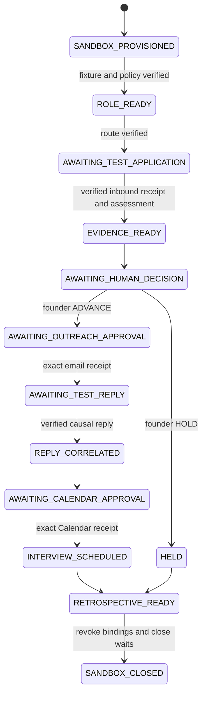

# 30 — Hiring H4S Sandbox and Hiring Run Intelligence

## Status and decision

**Status:** proposed engineering contract; review and implementation are separate
decisions. **H4S** means *H4 Sandbox*, not H4. It adds a controlled synthetic
demonstration environment for a Hiring Run; it cannot become an incremental
configuration switch for live H4 communications or interviews.

H0–H3 in [doc 25](25-hiring-operations.md) remain the source of truth. This
document preserves their non-scoring, non-ranking, human-decision,
restricted-evidence, durable-runtime, and embedded-browser rules. The live H4
gate and all qualified reviews in [doc 28](28-hiring-qualified-review-packet.md)
remain pending.

**Decision:** Alex should be convincingly useful over a long-running hiring
operation, while provider effects are permitted only between team-controlled
test accounts. Alex can explain the Ruhu Forward Deployment Engineer run, cite
committed evidence and receipts, draft a recap and—after exact founder
approval—send test mail and create a test Calendar invite. Alex cannot contact
a real candidate, process real candidate data, publish a job, choose a
candidate, or join, record, or transcribe an interview.

Synthetic history may represent weeks of activity. Every displayed sandbox
email, reply, approval, and Calendar receipt must be a real bounded action in
the designated test accounts.

## 1. Scope and non-goals

### 1.1 What H4S proves

For one server-created, synthetic HiringSandboxRun, a founder can:

1. open the existing Hiring operations cockpit for **Ruhu · Forward Deployment
   Engineer**;
2. ask or speak to Alex about the role brief, scorecard, interview plan,
   committed evidence, pending approvals, timeline, uncertainty, and next
   human action;
3. ask what Alex can and cannot do in this workflow and receive a grounded,
   versioned capability answer;
4. review an unranked Evidence Passport and record the human ADVANCE or HOLD
   decision through the existing decision control;
5. approve an exact, allowlisted test outreach email, obtain a provider
   receipt, then wake the same CandidateRun from a verified test reply;
6. approve exact interview attendees, time, timezone, and content, then obtain
   a Calendar receipt; and
7. ask for a cited process retrospective and separately approve delivery to the
   founder's verified test address.

ADVANCE is a founder decision, never a chat/voice result. “Approve the
interview” opens the review surface only; server-rendered exact approval is the
only authority that may grant or consume an effect.

### 1.2 Explicitly out of scope

- Live candidates, real candidate documents, public inboxes, production
  company mailboxes, real job posting/application address, and public job-board
  effects.
- LinkedIn automation, public URL verification, Browser form submission, or
  externally opened Browser windows.
- Autonomous decline, ranking, scoring, recommendation, comparative prose, or
  decisions inferred from reply, silence, timeout, calendar event, or model.
- References, offers, onboarding, background checks, provisioning, or a
  candidate portal.
- Alex attending, recording, listening to, transcribing, or assessing an
  interview. A consented meeting-notetaker is separate future work.
- Generic company-wide candidate memory/retrieval, polling, a process held open
  while waiting, client-controlled sandbox/live modes, or connector fallback.

### 1.3 Patterns adopted and rejected

The reference repositories are read-only pattern inputs; none is imported.

| Pattern | Decision |
|---|---|
| Google Cloud ADK onboarding lifecycle and webhook wake | Adopt: write durable receipt/event before UI transition; resume with state_delta. |
| Recruiter examples that poll, score, or automatically reject | Reject: H4S is event-driven, non-ranking, founder-decided. |
| Visible approval queue | Adopt its visibility only: authority remains single-use server-bound exact action, never text/email parser. |
| Voice/note-taking examples | Voice is presentation transport only: no independent workflow authority or hidden memory. |

## 2. Activation and safety invariants

### 2.1 Independent H4S gate

The H0 policy stays SYNTHETIC_ONLY, and its external_email_writes and
external_calendar_writes values remain false. H4S does not weaken the existing
synthetic/effect-disabled guards. Enabling HIRING_ENABLE_H4_SANDBOX must not
edit the H0 policy or add a success path to its H0–H3 effect guards. H4S uses a
separate, hiring-specific executor with its own SANDBOX_ONLY gate.

A new closed versioned h4s-sandbox-policy is evaluated in addition to H0.
Provider execution is allowed only when all conditions are true:

    valid H0 synthetic record
    AND H4S policy status is SANDBOX_ONLY
    AND deployment HIRING_ENABLE_H4_SANDBOX equals 1
    AND active server-created fixture-marked sandbox run
    AND exact test connector binding belongs to that run
    AND destination belongs to that run's server-owned allowlist
    AND exact hiring approval is GRANTED for this current action
    AND external-action ledger is PREPARED and leased

The flag alone is insufficient and is never shown to the browser. Missing,
stale, mismatched, revoked, or live-looking values return errors-as-data before
a provider call. Production H4 needs different policy status, qualified reviews,
separate implementation review, and a new release decision.

### 2.2 Identities, destinations, and data

Provisioning is operator-only, server-side, and uses distinct team-controlled
Google test accounts—not labels in the founder's ordinary mailbox.

| Purpose | Required identity | Direction |
|---|---|---|
| Alex sender | designated sandbox Gmail account | only to run allowlist |
| Test applicant | named synthetic candidate mailbox | application/reply only to sandbox mailbox |
| Founder / Ijidai | verified team-owned test address | recap only after exact approval |
| Calendar | designated sandbox calendar | only allowlisted test attendees |

Each SandboxConnectorBinding holds opaque grant reference, account subject hash,
required scopes, active window, state, and positive/negative probe receipt. No
token or email body is stored. Credentials are resolved only at execution and
account-subject drift refuses. Its connector id is derived from sandbox_run_id
by the server, never from a model, request, approval, or client field. The
binding resolver must additionally prove that the resolved account subject is
in a deployment-owned sandbox-account set and is not any founder or ordinary
Alex account subject. It must refuse the generic legacy-unprojected/automatic
connection-projection path; sandbox effects fail closed when their binding
cannot be resolved.

Each SandboxDestination is server-created with normalized address, purpose,
active window, and verification receipt. Provider adapters receive an address
only after a server lookup by destination id. Closing a sandbox revokes both
bindings and destinations before cleanup. The allowlist lookup and binding
validation occur inside the action's prepare-and-lease transaction, immediately
before the provider call; free-text recipient fields are never provider input.

Every H4S record retains synthetic=true, is_synthetic=true, fixture_id,
fixture_set_id, synthetic_namespace, workspace_id, and sandbox_run_id. Missing
or cross-run provenance refuses. All fixture CV/email/reply artifacts are
HIRING_RESTRICTED, excluded from profile, company knowledge, global search, and
generic chat. Identity stays separate from evidence and is pseudonymous in
conversation unless the existing identity authority gate is met.

Browser access remains app-owned embedded Browser only. H4S has no Browser write
tool, external window, window.open, or OS browser launch path. Email and
Calendar use provider APIs, not Browser automation.

## 3. Model, lifecycle, and event recovery

### 3.1 Data contracts

H4S extends existing workflow_runs, workflow_events, waits, approvals, and
external_actions; it must not create a second action ledger.

| Record | Purpose |
|---|---|
| hiring_sandbox_runs | owner, fixture, state, policy, binding ids, active window, teardown receipt |
| hiring_sandbox_destinations | allowlist and verification receipt; encrypted normalized test address |
| hiring_conversation_turns | actor/run scope, request/response hashes, cited ids, capability version, outcome; no raw audio |
| hiring_process_retrospectives | versioned cited process summary, unknowns, improvement proposals |
| hiring_reply_correlations | inbound receipt, causal message/thread/token evidence, certainty/ambiguity outcome |

All records are closed, versioned, registered, indexed, lifecycle-inventoried,
and CAS-protected. Existing external-action rows gain closed sandbox_context:
sandbox_run_id, connector_binding_id, destination_ids, and fixture_id. It is in
the exact-action hash and idempotency key. A non-sandbox receipt cannot execute
H4S; an H4S receipt cannot reconcile through a different account. The first
H4S-1 change registers these collections and the action-context migration
before any route or adapter exists.

### 3.2 State machine

RoleRun and CandidateRun remain authoritative. H4S adds envelope states only.

Conversation may read state but cannot transition it. Every transition is an
ordered event and projection update under durable-runtime lease.

### 3.3 Inbound and recovery

A separately verified **unfiltered** Gmail watch and history stream wakes
durable fetch/reconcile work. No mailbox polling, screen refresh, or voice
connection fetches messages. The sandbox worker route verifies its
route-specific WorkloadPrincipal (issuer, audience, service account and route
allowlist) before it parses any sandbox/run identifier.

1. Verify provider signature/audience, binding id, account subject, sandbox
   window, and test-sender allowlist.
2. Persist inbound receipt/fetch-batch before derived artifact or cursor change.
   Retain doc-25 recoverable cursor semantics.
3. Verify causal RFC822 Message-ID, thread id, and run token from outbound
   ledger. Name, subject words, and CV text are never sufficient.
4. On certain match, atomically write correlation, append event, resolve the
   generation-fenced wait, and wake with minimal state_delta. A unique inbound
   receipt/correlation key makes concurrent duplicate deliveries converge on
   one correlation and one wake.
5. On ambiguity, forged route, account drift, or unsafe content, quarantine in
   restricted founder inbox. Do not correlate, send, or advance.

Email and Calendar use PREPARED → provider call → SUCCEEDED | FAILED |
UNCERTAIN → provider-evidence reconciliation. Timeout is UNCERTAIN, consumes
approval, and blocks blind resend/rebook. Duplicates return original receipt.

## 4. Conversation and agents

### 4.1 One service, two transports

Add a code-owned HiringRunAnswerService. Its closed request is server-derived
workspace_id, actor_id, and selected authorized hiring_run_id, plus bounded
question, modality TEXT or VOICE, and opaque conversation_id.

HTTP chat and live WebSocket call this same service. Voice can stream captions
and audio but cannot select another run, append hidden context, or bypass
authorization. Server issues a short-lived conversation token bound to selected
run, workspace, actor, and a single candidate scope (when evidence is in view);
client sends opaque conversation id only. The server verifies this binding on
every turn and refuses stale/revoked tokens. Raw audio is ephemeral and a
completed turn persists only as bounded redacted text in
hiring_conversation_turns.

Do not put hiring_run_id in generic ADK session state or leak restricted records
to generic root-agent chat. The existing live surface routes valid H4S calls to
this service before general orchestration and must not append the H4S turn to
the shared founder chat session. A scoped H4S agent exposes no generic
send_alex_email or book_meeting tool; those tools hard-refuse if a sandbox
context reaches them as defence in depth. With no valid scope, Alex asks the
founder to select a run and reads no candidate data. The scoped route cannot
fall through to the generic root-agent toolset.

### 4.2 Grounding and output

The service builds a minimal server-filtered view: role contract, scorecard,
interview plan, states, decisions, Evidence Passport citations/unknowns, waits,
approved drafts, receipts, and policy/capability descriptors. It excludes raw
mail, credentials, unrestricted identity, cross-run records, and generic
company knowledge.

The model returns a closed HiringRunAnswer.v1: bounded answer, record refs for
every factual claim, unknowns/next human action, and intent EXPLAIN, STATUS,
RETROSPECTIVE, DRAFT_ACTION, OPEN_APPROVAL, REFUSAL, or OUT_OF_SCOPE. It cannot
return state transition, decision, recipient address, approval result, or effect
command.

Code validates citations, scope, record ownership, length, and forbidden
output. A deterministic content-level validator runs over every free-text
field in HiringRunAnswer, AnalystOutput explanations, and retrospectives. It
fails closed on score/rank, comparative candidate prose, hire/reject or
decision-by-implication language, protected-trait inference, implied action
success, or unsupported capability claims. A role-level answer is
single-candidate when it includes evidence; it must not place two candidates'
evidence into one model context. Validation failure returns transparent
non-factual fallback with no effect.

### 4.3 Required answers

| Founder question | Required result |
|---|---|
| “Where are we?” | stage, active wait/approval, last durable event, next founder action, citations |
| “What does the CV show?” | criterion evidence, refs, unknowns; never score/rank/recommendation |
| “What can you do?” | versioned HiringCapabilityCatalog: sandbox available, approval-required, unavailable |
| “What went well/improve?” | cited process retrospective of events, delays, uncertainty, feedback, unknowns; no candidate judgment |
| “Email Ijidai/founder a recap” | resolve verified test destination, draft exact body, open separate approval |
| “Book interview” | prepare exact proposal/approval path; never create from speech/text |

HiringCapabilityCatalog is code-owned, versioned, and tested; it is the sole
source for platform-wide capability answers.

### 4.4 Agent boundaries

No free-running agent is added. Alex presents scoped committed truth and opens
UI actions. Hiring Operator is wired only to typed preparation of role artifacts,
exact email/meeting proposals, and retrospective; it has no effect/decision
tool. Evidence Analyst preserves include_contents=none, pseudonymous input,
closed output, and no connector tools. Services own transitions, correlation,
policy, approval, credentials, provider calls, receipts, reconciliation.

Generic root agent must not receive the hiring agents as unscoped transfer
targets; it may deep-link to a scoped Hiring Run only.

## 5. Effects, UI, and teardown

### 5.1 Exact binding

Email approval binds action kind, sandbox/candidate run, connector binding,
destination id, normalized server-resolved recipient, exact subject, rendered
body hash, per-attempt causal token, and policy version.

Calendar adds calendar binding, summary, description hash, ordered attendee
destination ids, exact start/end, timezone, conferencing choice, and
cancel/change generation. Field drift makes approval stale. Guards revalidate
connector/destination after claim and immediately before provider call.

An update or cancellation additionally names a prior successful sandbox
Calendar action. The server proves that its candidate run, connector binding,
and ordered destination ids are identical before it renders a new exact action;
it cannot be repointed at an ordinary Calendar event. Calendar reconciliation
uses the provider event id and the last sandbox action marker, while cancellation
reconciles only on verified provider absence.

Do not route H4S through generic mail/calendar functions by special application
id. Add hiring-specific wrappers that call shared ledger primitives only after
H4S guards, preventing bypasses. They use a distinct H4S action_kind, and only
the workspace/run-scoped hiring approval can claim it. The server constructs
the canonical action from immutable ids and rendered content; a generic
session-scoped approval can never satisfy it. Claim and single-use consumption
are one transaction with the PREPARED lease, before the provider call.

### 5.2 Surface

Extend hiring.html, not a separate product:

- persistent **Synthetic sandbox** badge with fixture/test-only boundary;
- Alex text panel and optional voice drawer, visibly scoped to selected run and
  showing sources/unknowns;
- capability panel: available in sandbox, approval-required, unavailable;
- exact action review showing canonical payload, destination label, expiry,
  policy version, and receipt state;
- causal timeline; and
- cited retrospective plus separate “draft email to founder.”

UI renders backend projections/receipts only. It cannot infer success,
optimistically advance, resolve approval from chat, or navigate outside embedded
Browser containment.

### 5.3 Teardown

SANDBOX_CLOSED is a durable, idempotent transition. It first revokes
bindings/destinations and cancels waits with generation fences. It then records
unsubscribe attempts, forces an in-flight PREPARED lease to UNCERTAIN rather
than re-sending, reconciles or visibly retains uncertain effects, and writes a
teardown receipt. A late webhook/event is rejected by sandbox state and wait
generation before any wake or effect. Synthetic deletion remains through
existing inventory/hash controls and must state provider copies that cannot be
automatically deleted.

## 6. Build order

### D0 — demo-integrity prerequisites

1. Fix the feedback edit loop: render an Edit-specific success toast rather
   than a rejection message, and preserve edited text through the frontend/
   backend round trip so an edit is not silently discarded.
2. Fix distillation UI claim so it reports success only after persisted successful
   backend result, not merely a returned error object.
3. Add regressions and retain H0–H3 suite.

### H4S-1 — envelope and conversation

Register H4S collections/action-context migration first, then add closed policy,
provisioning/teardown, connector/destination registries, provenance
enforcement; answer service, capability catalog, scoped text/voice handoff,
content-level refusal validator/audit; typed Hiring Operator runtime wiring.
Fixture analyst output remains honestly labelled until closed-output/eval gate
permits model assessment.

**Exit:** no provider write exists; authorized founder gets grounded Ruhu FDE
text/voice answers and cannot access other runs or generic company data.

### H4S-2 — test Gmail/reply/resume

Test binding probes/allowlist, outbound wrapper, exact approval, ledger/receipt;
test application/reply, recoverable batch/cursor, causal correlation, durable
wait/state_delta; DSN, auto-reply, forged sender, ambiguity/inbox.

**Exit:** test email sends once and reply resumes correct run after restart;
every adverse path refuses/quarantines without action/state advance.

### H4S-3 — test Calendar

Exact wrapper, test binding, permitted availability proposal, exact invite
approval, ledger/receipt/reconciliation; test-event change/cancel; interview
brief/scorecard only.

**Exit:** invite creates once after approval, has receipt, and change/cancel
recovers durably.

### H4S-4 — demo proof

Seed ordinary durable Ruhu FDE history, never mutable demo read model; add
walkthrough, demo checker, operating/reset/teardown runbooks; record only after
deterministic, integration, adversarial, and manual provider checks.

## 7. Tests and acceptance

### 7.1 Required tests

- Marker/namespace/fixture/workspace/cross-run provenance refusal on every H4S
  write; missing/bad policy/flag; no client/chat/voice activation.
- Generic mail/calendar tool invocation from scoped chat/voice is unreachable
  and hard-refused; only the server-derived H4S connector may execute.
- Grant/account/scope/window/destination mismatch, legacy connector fallback,
  and production Alex/primary-Calendar selection refuse; arbitrary “Ijidai”
  never resolves to a recipient; approval drift/expiry/double-claim/session
  switch and a generic session approval presented to H4S refuse.
- Two sandbox runs with equivalent messages have distinct action identities;
  same-run retry returns original receipt. Recipient allowlist check occurs
  within prepare/lease, before provider request.
- PREPARED crash, duplicate send/invite, UNCERTAIN/reconciliation, no blind
  retry; bad webhook/worker identity, copied label, forged sender, wrong
  causal token, non-INBOX reply/DSN/auto-reply, duplicate event, expired
  cursor, restart recovery.
- Wait-generation/cancel/teardown race, no active Browser/voice while dormant,
  no external window/write, restricted data exclusion, cross-run conversation
  refusal.
- Human-reviewed synthetic model cases for cited state, unknowns, evidence
  without score/rank/recommendation, comparative/recommendation or
  decision-by-implication prose rejection, action-pressure refusal, truthful
  capability answer, retrospective, and injection handling.
- Voice semantic equivalents plus stale scope, interrupted turn,
  transcript-persist failure, and no raw-audio retention.
- Manual proof: successful test send/reply/invite; blocked non-allowlisted send;
  quarantined forged mail; reconciled provider uncertainty; refusal after
  deactivation.

### 7.2 Acceptance checks

- [ ] H0 stays SYNTHETIC_ONLY, live effects disabled, and H4S policy is
      independently SANDBOX_ONLY.
- [ ] No client, chat/voice, normal connector, legacy migration path, or
      Browser action can escape sandbox; generic mail/calendar tools are
      structurally unreachable and hard-refuse in sandbox scope.
- [ ] Effects reach only server-derived, verified test connector/destination
      ids; production Alex/primary Calendar and free-text recipients refuse.
- [ ] Every effect is exact-approved, PREPARED, idempotent, audited,
      receipt-backed, and reconciled when uncertain.
- [ ] Chat/voice is never workflow truth or shared founder-chat content;
      selected run survives refresh, restart, session switch, and dormant waits.
- [ ] Verified reply wakes only causal CandidateRun; ambiguous/forged mail
      quarantines.
- [ ] Alex answers Ruhu FDE status, evidence, unknowns, capabilities, and
      retrospective with citations, without scores/ranks/recommendations,
      comparisons, or decision-by-implication prose.
- [ ] “Email Ijidai/founder” makes only a verified-test-destination draft plus
      separate exact approval.
- [ ] UI labels synthetic history versus real test-account actions and never
      falsely claims action/distillation success.
- [ ] Walkthrough shows role brief → test application/evidence → human decision
      → approved email → verified reply → approved Calendar invite → cited
      retrospective while live H4 remains disabled.
- [ ] Passing H4S does not change pending employment, privacy, accessibility,
      retention, security, or destination-terms reviews and does not authorize
      H4 or a pilot.
