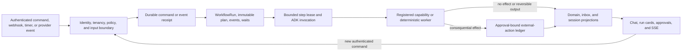
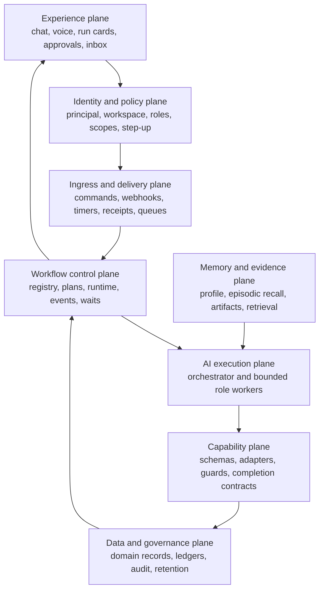
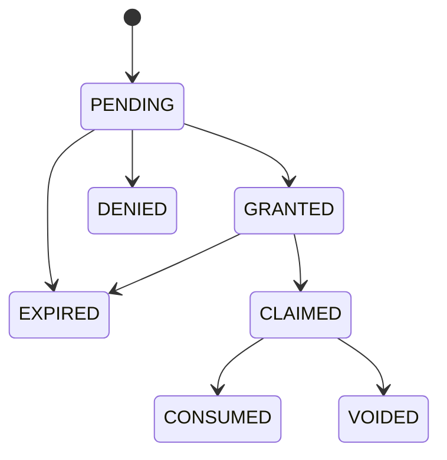
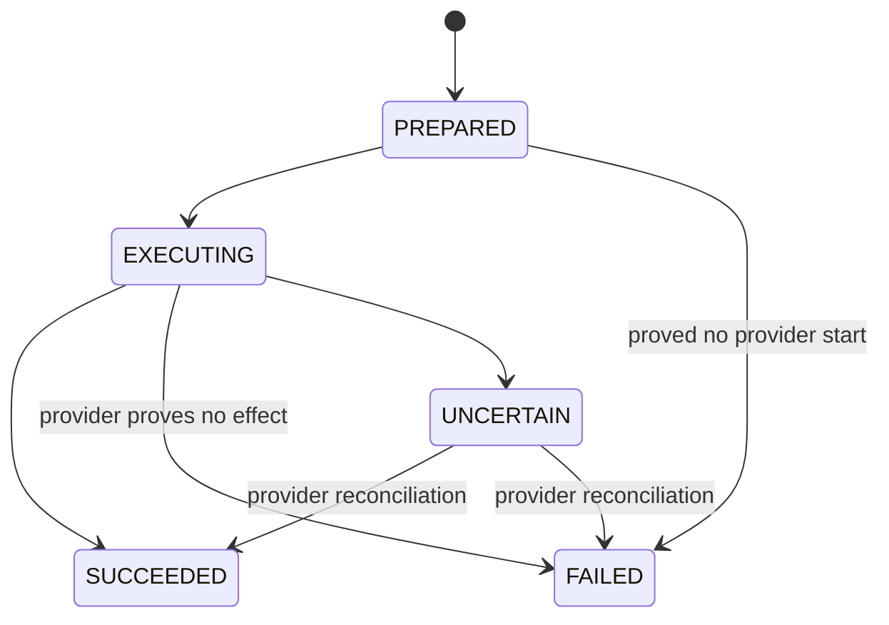

# 34 — Co-Founder platform architecture and convergence plan

**Status:** Revised architecture candidate after adversarial review. This
document is not binding and does not authorize a phase, live connector, data
migration, or consequential action until the adoption gate in §1 and the
relevant phase entry/exit gates are approved with recorded evidence.

**Audience:** principal software engineers, AI engineers, security reviewers,
product owners, and engineers implementing the platform.

**Normative relationship:** [21](21-alex-platform-north-star.md) remains the
product and workflow north star. This document is its implementation and
convergence specification. The current contracts in [01](01-architecture.md),
[02](02-data-model.md), [03](03-state-machine.md),
[06](06-memory-profile.md), [12](12-security.md), and
[24](24-data-source-reliability.md) remain binding until a migration phase in
this document is implemented, verified, and cut over. Where this document and a
current implementation differ, the difference is migration work—not permission
to bypass the current guard.

The design incorporates the useful lessons from `support-memory-lab` and
*Build Memory-Enabled Agents with ADK*: explicit session-state progression,
durable handoff, deliberate long-term-memory writes, artifact-backed
multimodal context, and fixed parameterized retrieval. It does not copy the
lab's fixed identity, process-local memory, transcript-driven authority,
prompt-only approval, polling UI, or prototype error boundaries.

---

## 1. Executive decision

Co-Founder will be a **durable workflow platform with an AI execution layer**,
not a persistent chat process and not one increasingly powerful agent.

The central invariant is:

> Durable workflow and domain state authorize behavior. ADK session state is a
> bounded model-facing projection. Chat history and recalled memory provide
> context but never authority.

The end-to-end control flow is:



This architecture preserves the current strengths:

- code-owned state transitions and guards;
- tools returning safe errors as data;
- dormant waits resumed by durable events and `state_delta`;
- exact, server-resolved approvals;
- idempotent external actions and append-only audit;
- isolated workers with minimum context;
- confirmed business-profile and actor-preference facts with provenance.

It corrects the current structural gaps:

- workflow truth split between Firestore and ADK session state;
- a generic-looking runtime coupled to hiring contracts and activation policy;
- identity and tenancy enforced on only some newer surfaces;
- multiple approval/action implementations with different guarantees;
- non-uniform wake delivery and wait projections;
- process/session memory being easy to confuse with durable knowledge;
- capabilities existing as Python functions without one closed, versioned
  platform registry;
- operational projections and UI refresh behavior varying by feature.

### 1.1 Adoption decision and scope

This specification becomes binding only when all of the following are true:

1. the Phase 0 tests and remediation evidence are green in a clean, locked
   environment;
2. the authority, transaction, migration, and rollback contracts in this
   revision receive architecture and security approval;
3. [README](README.md), [01](01-architecture.md), [02](02-data-model.md),
   [03](03-state-machine.md), [06](06-memory-profile.md), [07](07-server-webhooks.md),
   and [12](12-security.md) are updated in the same reviewed change to name the
   cut-over contract; and
4. the approved phase is enabled behind a workspace-scoped feature flag with a
   tested rollback path.

Before adoption, current specifications and guards win. After adoption, this
document governs only the contracts explicitly cut over; untouched current
flows remain on their prior contracts. A phase completion record MUST list the
routes, collections, workers, and capabilities that moved. “Platform migration
complete” is not a valid blanket assertion.

### 1.2 Complexity budget

The target begins as a modular monolith using Firestore for control-plane and
domain transactions, Cloud SQL only for ADK conversation/session persistence,
and GCS for blobs. API, control, dispatch, projection, and general worker code
remain modules in one deployable until measured isolation, scale, or reliability
requires a split. The browser worker remains isolated because its trust boundary
already justifies separation.

Do not introduce Kafka, a general event-streaming platform, distributed sagas
for local datastore writes, a graph database, a separately deployed capability
registry, or model-composed consequential plans under this specification.

## 2. Binding principles and refinements

The repository's eight binding principles remain in force, with one necessary
clarification to the first principle.

| Principle | Production interpretation |
|---|---|
| State machine grounds everything | The durable `WorkflowRun` plus its domain record is authority. Session state carries only a reconciled projection for the current invocation. |
| Errors are data | Model-facing capabilities return a closed error envelope. HTTP surfaces use correct HTTP status plus the same safe error code and a correlation ID. Raw exceptions never enter model or client context. |
| Dormancy by default | Every human, timer, or provider wait is a durable `Wait`; no model call, thread, container, WebSocket, or periodic browser poll is required to keep it alive. |
| External actions are idempotent and audited | The action ledger is written before the provider call. Duplicate commands return the original receipt. Ambiguous provider outcomes become `UNCERTAIN` and reconcile before retry. |
| Autonomous, with human control | Read-only and internal reversible work may proceed within policy. Every irreversible or consequential action requires an exact action-bound approval unless a separately reviewed delegated policy covers it. |
| Docstrings are load-bearing | Each model-facing capability has a complete schema-generating docstring, but docstrings do not replace server validation or authorization. |
| Guards live in code | Identity, policy, state, staleness, approval, budgets, and completion evidence are checked in deterministic code at the consequence boundary. |
| Isolated workers see nothing by default | Workers receive a constructed context pack. Distillers and validators use `include_contents="none"`; no worker receives unrelated transcript or cross-run state. |

Additional platform invariants:

1. The platform provides one universal **runtime lifecycle**, but each workflow
   family owns its own **domain lifecycle**.
2. A conversation may reference many runs. It never owns those runs.
3. Models propose or select registered operations. They cannot create policy,
   credentials, executable code, approval, or new capabilities.
4. Provider acknowledgements—not fluent model text—prove external effects.
5. Every authoritative write is workspace-scoped and actor-attributed.
6. At-least-once delivery is assumed everywhere. Exactly-once effects are
   approached through durable idempotency, compare-and-set, and reconciliation.
7. Every projection has a named source of truth and a rebuild/reconciliation
   rule.

### 2.1 Meaning of “session state grounds everything”

There is no permission for an agent to reason from chat history when session
state is incomplete. During the current implementation, the existing session
state contract remains authoritative as specified by [03](03-state-machine.md).
After the Phase 1 cut-over, “session state grounds everything” means:

- the model receives an explicit, reconciled session projection rather than
  inferring workflow position from the transcript;
- every authoritative field in that projection carries its durable source
  reference and source version; and
- deterministic code authorizes transitions and effects from durable records,
  never from the projection alone.

This is a refinement of the grounding mechanism, not permission to omit state
from model context. If projection reconciliation cannot complete, inference and
consequential tools fail closed with `authoritative_state_unavailable`.

### 2.2 Persistence ownership

| Data | Authoritative store | Transaction boundary | Projection/cache |
|---|---|---|---|
| Run, plan, event, wait, attempt, approval, action, command, delivery | One Firestore database | Firestore transaction/CAS | API/SSE/session projections |
| Current workflow domain records | Same Firestore database until a reviewed migration says otherwise | Firestore transaction with related control records when one invariant spans both | Search/board/UI projections |
| ADK conversation and session projection | Cloud SQL in production; SQLite locally | Session-service transaction only | None; never joined atomically to Firestore |
| Artifact bodies and raw provider payloads | GCS | Object generation precondition; metadata finalized in Firestore | Extracted chunks/indexes |
| Confirmed profile and preferences | Firestore | Firestore transaction/CAS | Session/context projection |
| Episodic semantic memory | Adapter-selected persistent backend | Adapter idempotency contract | Rebuildable derived index |

No design in this document depends on a distributed transaction across
Firestore, Cloud SQL, GCS, a queue, a memory service, or a provider. Firestore
commits authoritative intent first; outbox delivery and derived/session
projections converge idempotently afterward.

## 3. Authority hierarchy

The following order resolves conflicts. A lower row can inform a higher row but
cannot override it.

| Rank | Store or signal | Purpose | May authorize a transition/effect? |
|---:|---|---|---|
| 1 | Verified identity, current workspace membership, policy version | Who may do what, now | Yes |
| 2 | `WorkflowRun`, immutable plan, domain record, open wait, approval/action ledger | Durable process truth and consequence guards | Yes |
| 3 | Provider receipt or verified inbound event | Evidence that an external fact/effect occurred | Yes, through a registered transition |
| 4 | Confirmed business/actor profile facts and verified entity records | Durable business facts and preferences | May satisfy declared facts; not approval |
| 5 | Artifact/evidence store and governed institutional retrieval | Source material with provenance | Evidence only until validated/confirmed |
| 6 | ADK session state | Compact projection used to ground one invocation | No independent authority |
| 7 | Episodic/semantic memory recall | Advisory recall across sessions | No |
| 8 | Chat transcript, email/page text, model output | Interaction and untrusted content | No |

When session state disagrees with Firestore, Firestore wins and the session
projection is repaired before instruction rendering. When recalled memory
disagrees with a confirmed profile fact or provider evidence, the recall is
ignored, the conflict is recorded, and the affected branch stops if the fact is
material.

### 3.1 Deterministic conflict resolution

| Conflict | Deterministic result |
|---|---|
| Principal claims vs current membership | Current membership/policy wins; reject stale or revoked authority. |
| Run projection vs ordered run events | Rebuild to a scratch projection; quarantine the run if the reducer result differs until repaired. |
| Domain record vs run control projection | Domain adapter declares the invariant owner. Stop the affected transition; never guess or silently overwrite either record. |
| ADK session vs durable run/domain version | Replace the session projection before inference. |
| Approval vs current target/payload/plan/policy/version | Binding mismatch invalidates the approval; require a new decision. |
| Provider response vs local action status | Verified provider receipt/reconciliation wins; append a correcting event, never edit audit history. |
| Confirmed profile fact vs episodic recall | Confirmed fact wins; suppress and flag the recalled item. |
| Two confirmed profile facts | Mark the field `CONFLICTED`; a policy-declared non-material branch may proceed without it, otherwise create a founder question. |
| Artifact extraction vs immutable source hash | Extraction for another hash is stale and cannot be cited. |
| Chat/model output vs any durable record | Durable record wins; output may only propose a command or correction. |

### 3.2 Reconciliation checkpoints

`ReconcileContext` runs at four boundaries: before inference, before a
capability call, inside the action-start transaction, and before presenting a
success state. It verifies principal membership/policy version, workspace and
resource ownership, run/plan/domain versions, active wait/lease generation,
approval/action bindings, artifact hashes, and projection version. The output is
a typed immutable context pack plus a reconciliation receipt. Missing or
conflicting material state stops the branch and creates a safe operational
record; it is never repaired by the model.

## 4. Logical architecture

The platform has eight logical planes. They may initially share deployments,
but their interfaces must remain separable.



### 4.1 Recommended deployment topology

Start with two production trust zones, not a service per logical plane:

| Deployment | Responsibilities | Scaling/identity |
|---|---|---|
| `co-founder` modular monolith | Public API, authenticated internal task routes, control modules, outbox dispatch, bounded ADK work, projection/SSE, reconciliation | One versioned Cloud Run image; route-level user or task OIDC identity; provider credentials granted only to the capability-specific service account used by that revision |
| `co-founder-browser-worker` | Playwright portal work and browser expiry | Separate Cloud Run service/account; strict egress, queue-only ingress, and single-flight resource ownership |
| `mock-portal` | Demonstration provider only | Separate service; never production authority |

The public service never holds a Playwright `Browser`, `Context`, or `Page`.
Browser calls cross a closed, versioned internal API using an audience-bound
OIDC token pinned to the API service identity. Only opaque run/application
handles and bounded operation-specific inputs/results cross that API. Login or
registration credentials may appear only in the typed credential operations,
over TLS, are never returned, and are never written into command/session/event
records. Live browser objects remain in the worker. The worker has private
ingress, concurrency one, and the browser-artifact and browser-expiry
capabilities. Its status publications are
durable workspace projection notifications, so a process-local SSE hub is an
optional local fast path rather than a cross-service correctness mechanism.

Logical packages (`identity`, `commands`, `runtime`, `approvals`, `actions`,
`events`, `memory`, `capabilities`, `projections`) have closed interfaces and no
domain imports in the generic core. Extract a general worker or control service
only when at least one of these is demonstrated: incompatible scaling,
independent availability target, materially different service-account/egress
boundary, or measured contention that cannot be solved with queue/concurrency
configuration. A diagrammed plane alone is not sufficient justification.

### 4.2 Queue lanes

Use separate queues so a slow workload cannot block safety or interaction:

- `interactive-steps`: founder-triggered bounded reasoning;
- `provider-events`: verified webhook/event correlation and wakes;
- `discovery-ingestion`: crawling, extraction, indexing, artifact processing;
- `browser-actions`: portal automation with low concurrency;
- `timers-expiry`: wait deadlines, approval expiry, browser cleanup;
- `reconciliation`: `UNCERTAIN` external-action/provider checks;
- domain lanes such as `hiring-synthetic` only when isolation or policy requires
  them.

Each task carries only opaque IDs, attempt/generation, and a signed routing
envelope. PII, secrets, prompts, and full event bodies remain in their durable
stores.

## 5. Core contracts

### 5.0 Canonical form and hashes

Every safety-relevant hash in this document—`plan_hash`,
`normalized_request_hash`, `target_hash`, `normalized_payload_hash`,
`subject_hash`, request hashes, and bounded event-payload hashes—uses one
versioned canonicalization module. `canonical_json_v1` adopts the normalization
and rejection rules in [21 §7.4](21-alex-platform-north-star.md): validated
closed schemas, sorted ASCII-constrained object keys, UTF-8/NFC strings,
meaningful array order, integer or schema-declared fixed-scale numbers, and no
`NaN`, infinity, executable content, or producer-supplied serialized bytes.

Each digest includes the canonical-form version and a per-use domain separator
inside the digest input. A canonical-form or domain change can therefore never
silently compare equal to an old approval, plan, command, or action. Schemas set
bounded input sizes appropriate to their data; large artifacts and provider
bodies are content-hashed separately and represented in canonical input by an
immutable reference plus digest rather than embedded bytes.

One platform module implements these hashes. Golden vectors, cross-language
vectors where another service verifies them, rejection cases, and a migration
rule for every prior hash representation are release gates. Domain code may
define typed input schemas and domain separators; it may not define another
JSON canonicalizer.

### 5.1 Identity and workspace principal

Promote `ActorPrincipal` from the hiring slice to the whole platform. The
principal is reconstructed server-side for every request from verified claims
and the current membership record:

```text
ActorPrincipal
  actor_id
  workspace_id
  role
  permission_set / scoped grants
  resource assignments
  authentication time and strength
  membership_version
  policy_version
```

Rules:

- Never accept `actor_id`, `workspace_id`, `approved_by`, or role from a request
  body as authority.
- Every query includes `workspace_id`; a post-query ownership check is not an
  adequate tenancy boundary.
- Membership revocation is effective on the next request/step because roles are
  read from current durable membership, not only a long-lived cookie.
- Consequential actions require fresh authentication according to policy.
- The current demo identities `user`, `eval_founder`, and the demo founder stay
  seeded, but are resolved through the same principal adapter.
- Cookie-authenticated mutations require CSRF protection; service-to-service
  calls require audience-bound OIDC or an equivalent signed identity.

The principal adapter has three closed sources with different authority:

| Source | Construction | Authority |
|---|---|---|
| Interactive human | Verified OIDC/session claims plus current active workspace membership | May carry a human role, satisfy authentication freshness, issue commands, and decide approvals allowed by policy. |
| Workload | Audience-bound OIDC, exact route/service-account grant, delivery identity, and workspace/capability scope from durable work | May execute only its declared capability for that workspace. It never acquires a human role, satisfies step-up authentication, or decides an approval. |
| Local/eval | Explicit `local_only` seeded membership and signed local dispatcher/test identity | Available only outside deployed service environments. It is refused whenever `K_SERVICE` or the equivalent production marker is set. |

Workspace selection is explicit. Resolution takes `workspace_id`; when the
caller has not selected one, exactly one active membership may be selected
automatically. More than one returns `workspace_selection_required`, not a
generic missing-membership error. `user`, `eval_founder`, and the demo founder
receive local-only memberships in the same seed migration that enables this
adapter.

Human initiation and human approval are separate audit facts, not a default
separation-of-duties requirement. For current single-founder workflows, the
authenticated active workspace member may approve work they initiated;
`requested_by_actor_id` and `decided_by_actor_id` MAY be equal. A distinct
approver or multiple approvers are required only when an explicit reviewed
capability policy says so. The server always derives the deciding actor from the
interactive principal.

Point reads by globally unique ID still verify workspace ownership before
returning data, and every transition transaction verifies the workspace on all
guard records it reads. Shared datastore helpers require workspace scope in
their API; route-specific post-read checks are defense in depth, not the primary
tenancy boundary.

### 5.2 Command receipt

Every public mutation first creates a durable command receipt keyed by
`(workspace_id, client_request_id)`:

```text
CommandReceipt
  command_id, client_request_id, command_type
  workspace_id, actor_id, origin_session_id
  normalized_request_hash
  status: RECEIVED | ACCEPTED | DISPATCHED | COMPLETED | FAILED | REJECTED |
          CANCELLED
  run_id/result_ref/error_code
  created_at, accepted_at, terminal_at, schema_version, version
```

A duplicate with the same hash returns the original receipt. If that receipt is
non-terminal, the API returns `202` with `command_id`, optional `run_id`, current
status, and the projection/stream location to follow—never a synthesized
success or empty result. A terminal receipt returns its recorded result or safe
error. Reusing the key with a different hash returns
`409 idempotency_conflict`.

`REJECTED` means validation/policy refused the command before accepted work was
scheduled. `FAILED` means accepted work reached a terminal safe error.
`COMPLETED` always carries a `result_ref`; `FAILED`/`REJECTED` always carry a
closed `error_code`. A queue or worker retry never creates another receipt.

Creation and initial dispatch intent are atomic: the transaction creates the
receipt and an outbox record, or creates neither. `ACCEPTED` means durable, not
executed. `DISPATCHED` means the queue accepted the task, not that a run
succeeded. A client that times out safely retries the same key and receives the
same receipt. Server-generated keys are allowed only for authenticated provider
events whose provider identity and event ID form an equivalent stable key.

When a command creates a workflow, that same transaction also creates the
immutable initial plan, `RUN_CREATED` event, run control projection, and domain
root. The outbox carries only the closed command type and opaque run/domain
references. Its dispatcher uses a deterministic task name, records
`DISPATCHED` only after the queue accepts the task, and is recoverable by the
bounded timers lane. A crash before enqueue leaves `ACCEPTED/PENDING`; a crash
after enqueue is collapsed by the deterministic task name. There is no legal
state in which an accepted run-creation command exists without its run.

### 5.3 Workflow run and plan

`WorkflowRun` is generic platform state. It MUST NOT import a domain activation
module or a domain-specific `RunKind` enum.

```text
WorkflowRun
  run_id, workspace_id, objective, workflow_definition_id
  workflow_definition_version, plan_version, plan_hash
  policy_profile_id, policy_version, capability_registry_version
  runtime_status, domain_state_ref
  origin_session_id, journey_id, parent_run_id
  priority, budget, next_run_seq
  cancellation_generation
  created_by_actor_id, created_at, updated_at, terminal_at
  version
```

The universal runtime lifecycle is:

```text
RECEIVED -> VALIDATING -> QUEUED -> RUNNING
VALIDATING -> REJECTED
RECEIVED/VALIDATING -> CANCELLED
RUNNING <-> QUEUED
RUNNING/QUEUED -> WAITING
WAITING -> QUEUED
RUNNING/QUEUED/WAITING -> PAUSED
PAUSED -> QUEUED or WAITING
RUNNING/QUEUED/WAITING/PAUSED -> CANCELLING -> CANCELLED
RUNNING -> SUCCEEDED or FAILED
```

`journey_id` is an optional durable grouping identity, not an authority source.
It is server-created for a founder objective that intentionally spans related
runs, is workspace-scoped, and records its member run IDs through a versioned
projection. Cancelling a journey issues separately idempotent cancellation
commands to each non-terminal member run; it is not an atomic multi-run
transition and cannot erase completed effects. Until a workflow needs that
contract, `journey_id` remains absent rather than being populated with a session
or conversation ID.

Domain state remains inside a registered adapter, for example
`grant_application:v1`, `opportunity_discovery:v1`, or `hiring_role:v1`.
Runtime code calls that adapter for transition validation and completion; it
does not special-case domains.

The plan is immutable, closed-schema, canonicalized, and hashed. Every step,
wait, event, output, approval, and action records the plan hash/version under
which it was created. Replanning creates a new version; it never edits prior
plans or erases completed effects.

Plans live at `workflow_runs/{run_id}/plans/{plan_version}` and include
`schema_version`, `reducer_version`, canonical bytes/hash, capability versions,
declared domain adapter/version, dependencies, retry/wait/completion contracts,
and budgets. The run document points to the active version. Activating a new
plan is a Firestore transaction that validates the current run version, writes
the immutable plan if absent, appends `PLAN_ACTIVATED`, updates the run
projection, and writes dispatch outbox records. A hash collision or a repeated
version with different canonical bytes is a terminal contract error.

### 5.4 Run event and projection

Each accepted transition appends an immutable event with a gap-free monotonic
`run_seq` and updates the current run projection in the same Firestore
transaction. No caller computes `run_seq` outside that transaction.

Required event fields:

```text
event_id, event_type, event_version
workspace_id, run_id, run_seq
actor_id or verified source identity
causation_event_id, correlation_id, idempotency_key
plan_version, plan_hash
safe_payload, payload_ref
occurred_at, received_at, created_at
```

`safe_payload` contains identifiers and bounded non-sensitive metadata only.
Raw external bodies and model artifacts are stored behind `payload_ref`.

Only the **run control projection** is event-reduced. Its rebuildable fields are
`runtime_status`, active plan version/hash, current/ready/blocked step IDs, open
wait references, cancellation generation, terminal reason, and
`next_run_seq`. Domain records, approvals, actions, command receipts, artifact
bodies, and provider receipts are separate authorities and are not reconstructed
from run events.

Every control event has a registered schema and deterministic reducer version.
An event contains the complete bounded reducer input; a reducer may validate a
referenced record/hash but may not fetch mutable data to decide its result.
Unknown event or reducer versions stop rebuild. Rebuild writes a scratch
projection, compares it with the live projection, and emits a content-free
reconciliation report. Automatic repair is allowed only for fields owned by the
control reducer and only after the full stream passes sequence/schema/hash
validation; otherwise the run is quarantined for operator repair.

The transition transaction is:

1. read the run projection and any records whose CAS versions guard the
   transition;
2. validate workspace, plan, adapter, lease/cancellation generation, expected
   run version, and `next_run_seq`;
3. create exactly one event at that sequence using an event idempotency key;
4. reduce that event into the run projection and increment version/sequence;
5. update a same-database domain record only when the domain adapter declares a
   cross-record invariant; and
6. create any queue/SSE/inbox outbox rows in the same transaction.

Firestore transaction contention is retried with bounded jitter. Exhaustion
returns a conflict/retryable error and performs no provider call. A transition
that would exceed datastore transaction limits must be decomposed into smaller
steps joined by an outbox; it must not silently weaken atomicity.

### 5.5 Step attempt and lease

One dispatch performs one bounded attempt:

```text
StepAttempt
  attempt_id, run_id, step_id, attempt_number
  plan_hash, capability_id/version, agent_role
  lease_owner, lease_generation, lease_expires_at
  observed_cancellation_generation
  input_refs/hash, output_refs/hash
  model/provider/instruction versions
  status: QUEUED | RUNNING | SUCCEEDED | FAILED | CANCELLED | FENCED
  safe_error_code, retry_class, metrics, timestamps
```

Rules:

- Lease generation is monotonic per step. A stale generation cannot commit an
  outcome, state transition, follow-on task, or action.
- Lease acquisition records the run's `cancellation_generation`. Step outcome,
  wait creation/resolution, action preparation/start, and follow-on enqueue
  re-read it inside their commit transaction. A changed generation produces a
  `FENCED` attempt and no domain transition, provider call, or follow-on task.
- The worker writes output/effect receipt before acknowledging the task.
- Retries create a new attempt and apply only to the capability's declared
  retry classes.
- Timeout does not imply failure when a provider may have acted; it creates an
  `UNCERTAIN` action.
- One run may execute independent read-only branches concurrently. Writes to
  the run projection serialize on `run_seq`; domain adapters declare additional
  entity locks or compare-and-set versions where required.

Lease acquisition/reclaim is a transaction over the step control record and
attempt: verify the step is ready, compare the expected generation, increment
generation, create the attempt, and record dispatch ownership. Heartbeats may
extend only the same owner/generation and never beyond the capability's maximum
attempt duration. Commit is another transaction that verifies run cancellation
generation, active plan, attempt/lease generation, and expected domain/run
versions before it accepts outputs and creates follow-on outbox records. A task
acknowledgement is never evidence of step completion.

Cancellation linearizes by transactionally changing the run to `CANCELLING`
or `CANCELLED`, incrementing `cancellation_generation`, appending the control
event, and creating cleanup outbox work. It does not attempt to update an
unbounded set of waits or attempts in one transaction. Paginated idempotent
cleanup closes open waits and fences attempts under the new generation; the run
records `cancellation_cleanup_status` and a cursor/receipt. `CANCELLING` becomes
`CANCELLED` only when open waits are closed, attempts are terminal/fenced, and
each provider-started action is terminal or visible `UNCERTAIN` with
reconciliation scheduled. A late event or worker with an older generation
cannot reopen or commit to the run.

### 5.6 Durable wait

Long-running business work is represented by a durable wait, not a long-lived
model invocation:

```text
Wait
  wait_id, workspace_id, run_id, step_id
  wait_kind, correlation_contract, correlation_key_hash
  plan_version, generation
  status: OPEN | RESOLVED | EXPIRED | CANCELLED
  wake_after, expires_at
  resolved_by_event_id, resolved_at
  timeout_transition, version
```

Resolving a wait is a single compare-and-set operation. A matching inbound
event and the wait resolution are durably recorded before a wake task is
acknowledged. Late or duplicate events return the existing result or enter the
exception inbox; they cannot revive a cancelled/expired wait.

Specifically, the correlation transaction reads the verified event, `OPEN`
wait, run, and plan generation; creates `WAIT_RESOLVED` at the next `run_seq`;
sets the wait to `RESOLVED`; reduces the run to `QUEUED`; and creates one wake
outbox record keyed by `(run_id, wait_id, event_id, generation)`. If the wait is
already terminal, the transaction records the duplicate/late disposition
without changing the run. Wait timeout and cancellation use the same CAS and
cannot race a successful resolution into two transitions.

`wait_kind` and `correlation_contract` are registered, versioned IDs owned by
the workflow/capability manifest. Their registration names accepted event
types, deterministic correlation fields, timeout transition, owner, UI copy,
and retention. Plan validation rejects an unknown wait kind or a wait with no
routable event and no bounded timeout/operator path.

### 5.7 Capability registry

All model-callable and deterministic operations are registered under stable,
versioned IDs:

```text
CapabilityDescriptor
  capability_id, semantic_version
  implementation_binding
  input_schema_id, output_schema_id, error_schema_id
  allowed_agent_roles, required_permissions
  accepted_data_classes, produced_data_classes
  side_effect_class
  approval_policy_id
  idempotency, timeout, retry, reconciliation, compensation contracts
  completion_contract_id
  model_policy, cost/concurrency budget
  observability schema and eval suite IDs
  lifecycle: EXPERIMENTAL | ACTIVE | DEPRECATED | DISABLED
```

Risk comes from the registry, never from a model-authored tool argument. Tool
names, SQL, import paths, filesystem paths, provider scopes, and credentials are
not plan inputs. Fixed parameterized retrieval tools bind reviewed queries and
datasets in code; the model supplies only validated parameters.

The first registry is a versioned, code-owned manifest loaded into the modular
monolith and checked in CI—not a network service. Its schema is useful before
dynamic planning because it closes existing tool authority. Model-authored plan
IR, composed waits, loops, code, and consequential effects remain disabled until
two production workflow families have passed the same runtime and safety gates
and a separate architecture decision authorizes them.

The minimum enforcement descriptor ships with the Phase 0 consequence kernel:
capability ID/version, implementation binding, input/output/error schemas,
allowed roles and required permissions, side-effect class, approval policy,
idempotency, retry, timeout, and reconciliation contract. Completion evidence,
data classes, budgets, observability/eval IDs, compensation, and model policy
are added when a capability uses them; placeholder values are prohibited.
Descriptor fields record the reviewing owner, review/decision reference,
effective version, and test/evidence reference.

Lifecycle semantics are deterministic. `DEPRECATED` rejects new unpinned plans
but remains executable by a run already pinned to that descriptor version.
`DISABLED` blocks new execution; runs with unexecuted dependent steps move to
`PAUSED` with an operator item rather than silently failing. An already-started
external action still settles or reconciles under its recorded version.

### 5.8 Error envelope

Every model-facing capability returns one of:

```json
{"status":"success","result":{},"receipt_ref":"..."}
```

```json
{
  "status":"error",
  "error":true,
  "error_code":"warehouse_temporarily_unavailable",
  "message":"The evidence search is temporarily unavailable.",
  "retryable":true,
  "retry_after_seconds":30,
  "correlation_id":"corr_..."
}
```

Closed error codes distinguish validation, authorization, stale state,
conflict, dependency/transient, provider rejection, ambiguous outcome, budget,
and internal contract failures. Stack traces, SQL, credentials, raw provider
messages, and sensitive payloads are logged only in restricted telemetry, never
returned to the model or user.

HTTP APIs preserve semantics: validation `400/422`, authentication `401`,
authorization/cross-tenant `403` or collapsed `404`, conflict/idempotency `409`,
rate/budget `429`, unavailable dependency `503`, unexpected internal error
`500`. They do not disguise every failure as HTTP 200.
The model-facing envelope never includes `http_status` or other transport
fields; one route-boundary mapping derives HTTP status from the closed error
code without changing what the model sees.

### 5.9 Atomicity and outbox contract

The following boundaries are mandatory:

| Invariant | One atomic boundary |
|---|---|
| Command accepted and scheduled | Command receipt + dispatch outbox |
| Run transition | Run event + run projection + invariant-coupled domain CAS + outbox |
| Step ownership | Lease generation + attempt creation |
| Wait resolution | Event disposition + wait CAS + run event/projection + wake outbox |
| Approval decision | Approval CAS + decision audit/inbox outbox |
| Consequence preparation | Approval claim + action creation + execution lease |
| Consequence start | Approval consumption + action `EXECUTING` + immutable attempt/start record |
| Provider result application | Action receipt/status + success domain transition/event + inbox/SSE outbox |

These records MUST share the same Firestore database when they participate in
one row above. Cloud SQL session updates, GCS objects, Cloud Tasks calls, memory
writes, and provider calls are outside the transaction. They are driven by
durable outbox rows with stable idempotency keys.

The generic durable-store interface therefore provides a callback-style
multi-document transaction primitive supporting reads, creates, updates,
deletes, and explicit version/existence preconditions across registered
collections in one Firestore database. The callback is retry-safe and performs
no provider, queue, GCS, Cloud SQL, or model call. The in-memory test store
provides equivalent serializable behavior for concurrency tests. The existing
single-record `compare_and_set` remains useful for isolated records, but the
current `pending_event` reservation sequence is removed rather than generalized
for any boundary in the table above.

An outbox row has `outbox_id`, workspace, kind, aggregate ID/version,
idempotency key, destination, safe payload reference, status
`PENDING|LEASED|DELIVERED|DEAD_LETTER`, attempt count, lease generation/expiry,
next attempt, last safe error, and timestamps. Dispatch uses CAS leases and may
deliver at least once. It marks `DELIVERED` only after Cloud Tasks or the local
consumer returns a durable delivery identifier. A deterministic repair scan for
stale outbox rows is permitted operational reconciliation; it is not workflow
polling and never invokes a model merely because time passed.

## 6. State, session, and ADK execution

### 6.1 Session state contract

ADK session state is a **projection cache for one conversational/worker
invocation**, not the system of record. It may contain:

- `current_run_id` and recently referenced run IDs;
- the current durable runtime/domain-state version;
- compact checklist/wait/approval references;
- a small reference-resolution projection;
- scoped profile preference references;
- active browser projection reconciled from durable browser state;
- UI-safe transient fields.

It must not contain as sole authority:

- an approval or approval token;
- an external action result;
- canonical domain facts;
- a workflow plan or policy that does not also exist durably;
- secrets or provider credentials;
- unrestricted hiring/financial records;
- raw artifacts or large event bodies.

Before each inference, a `before_agent_callback`:

1. resolves the current principal and authorized run;
2. reads the run/domain version and active waits/actions;
3. replaces stale projection fields;
4. constructs the minimum instruction/context projection;
5. fails closed if authoritative state cannot be read.

The projection envelope includes
`projection_schema_version`, `workspace_id`, `actor_id`, `run_id`,
`run_version`, `run_seq`, `plan_hash`, `domain_ref`, `domain_version`,
`policy_version`, `membership_version`, and `reconciled_at`. Every state key
used by an instruction or tool is either derived during this reconciliation or
explicitly classified as UI/transient. Unknown authoritative-looking keys are
removed and audited; agents cannot add new authority by inventing state names.

After a valid capability outcome, deterministic code commits durable state
first, then updates session projection. A projection update failure is
recoverable: the next callback repairs it. A durable write failure means the
transition did not occur.

There is intentionally no Firestore/Cloud SQL distributed transaction. After a
Firestore commit, a session-projection outbox item updates Cloud SQL
best-effort. Until it succeeds, the old session is visibly stale and the next
invocation performs a read-through repair. Consequence code does not read
approval or action authority from Cloud SQL under any condition.

### 6.2 ADK session services

- Local development may use SQLite for ADK sessions.
- Production uses a durable supported database session service.
- Session IDs are opaque and bound to actor/workspace on the server.
- Session service persistence provides conversation continuity; it does not
  replace `WorkflowRun`, memory, artifacts, or the action ledger.
- Each bounded worker may use a separate ADK session or `include_contents="none"`.
  A business run is not required to map one-to-one to an ADK session.
- ADK Web is a development client, not an independent production authority. It
  must use the same principal adapter, durable records, artifact service, and
  configured memory adapter when cross-client behavior is being tested. A
  default local ADK Web process MUST be labelled isolated and non-shared.

### 6.3 Agent roles

Use a stable founder-facing coordinator and bounded workers:

| Role | Responsibility | Prohibited authority |
|---|---|---|
| Coordinator (Alex) | Conversation, intent clarification, status narration, proposing work | Direct state/action/approval mutation |
| Planner | Select reviewed template/variant; later propose restricted plan IR | Execution tools, secrets, policy changes |
| Researcher | Retrieve and structure evidence with citations | External writes |
| Analyst | Score, compare, identify conflicts/unknowns | Final consequential decisions |
| Interviewer | Ask material questions and record confirmed answers through tools | Inventing or silently persisting facts |
| Writer | Produce drafts from approved evidence/profile | Sending or submitting |
| Distiller | Propose bounded memory/profile updates from explicit feedback | Transcript access beyond supplied item; direct profile overwrite |
| Validator/evidence checker | Advisory schema/evidence checks | Blocking or authorizing by model judgment alone |
| Effect worker | Invoke one registered adapter after deterministic gates pass | Selecting recipient/payload/approval |

Agent handoff never advances domain state by itself. A typed completion outcome
must pass the registered deterministic transition and completion contract.

### 6.4 Model routing and context packs

Model choice is a policy decision based on role, sensitivity, residency,
latency, capability, and eval qualification. Every attempt records model,
instruction, tool-schema, capability, and prompt-template versions.

A worker context pack contains only:

- principal/workspace/run/step identifiers and policy summary;
- objective, constraints, current durable state, and completion contract;
- explicitly scoped artifact/evidence references;
- required confirmed profile/entity facts;
- approved outputs from dependencies;
- the small set of allowed capability schemas.

External content is labelled untrusted data and cannot become instructions.
Compaction summarizes conversational context; it is not a memory-write event.

## 7. Memory and evidence architecture

### 7.1 Memory tiers

| Tier | Store | Lifetime | Authority/use |
|---|---|---|---|
| Turn context | Model invocation | Seconds | Current request only |
| Conversation projection | ADK session | Conversation | Reference resolution and UX continuity |
| Run memory | Run events, plan, outputs, domain records | Run/retention policy | Authoritative process history |
| Workspace business profile | Versioned Firestore facts | Long term | Confirmed company facts and shared business rules |
| Actor preference profile | Versioned Firestore facts | Long term | Private interaction/voice preferences unless explicitly shared |
| Episodic memory | Shared persistent memory service/Memory Bank | Retention policy | Advisory recall of prior interactions/outcomes |
| Artifact/evidence memory | GCS + artifact/chunk metadata | Scope/retention policy | Source evidence, citations, multimodal inputs |
| Institutional knowledge | Governed datasets/vector/search indexes | Dataset lifecycle | Fixed parameterized retrieval; never arbitrary data access |

### 7.2 Confirmed profile data remains canonical

Do not collapse a person, a company, and a workspace into one profile document.
The target separates:

- `WorkspaceBusinessProfile`: confirmed company facts and reusable business
  evidence shared according to workspace role;
- `ActorPreferenceProfile`: the founder's own voice, interaction preferences,
  and personal working rules, private unless explicitly shared; and
- domain entity records: opportunity, application, role, candidate, investor,
  and other facts whose lifecycle belongs to a workflow.

The current `profiles/{founder_id}` remains the compatibility authority until a
Phase 4A migration classifies each field, dual-reads, verifies parity, and cuts
over. A workspace profile MUST NOT make one actor's private preference visible
to another workspace member by default.

Profile facts carry:

- field/value or structured value;
- verification status and confidence;
- source artifact/event/answer IDs;
- created/confirmed/last-used times;
- sensitivity, retention, and visibility;
- version and superseded value reference;
- conflict state.

The target storage shape is a small workspace/actor profile pointer document
plus versioned fact records (for example
`workspace_profiles/{workspace_id}/facts/{fact_id}` and the equivalent
actor-private path). Each fact record owns the metadata above and an immutable
supersession link. The compatibility `profiles/{founder_id}` arrays are migrated
with per-fact receipts; history is never truncated to fit one Firestore
document, and concurrent fact writers do not rewrite unrelated facts.

Models and distillers produce **proposals**. Code validates the schema and
source; material or conflicting facts require founder confirmation. Corrections
supersede, rather than erase, prior values.

### 7.3 Persistent cross-session episodic memory

Persistent semantic memory is optional and advisory. Enable it only after
offline evaluation demonstrates useful recall without cross-workspace leakage.
Both ADK Web and the product must point to the same configured service when the
product claims shared memory. Process-local `InMemoryMemoryService` is allowed
only in tests or explicitly labelled local demos.

The platform owns a `PersistentMemoryAdapter`; agents and routes do not call a
vendor SDK directly. The minimum contract is:

```text
put(item, idempotency_key) -> MemoryWriteReceipt
search(query, workspace_id, actor_id, allowed_scopes, sensitivity_ceiling,
       purpose, limit) -> MemorySearchResult | MemoryBackendError
get(memory_id, principal, purpose) -> MemoryItem | not_found | MemoryBackendError
list_by_source(source_ref, cursor) -> page[MemoryItem]
delete_by_source(source_ref, deletion_job_id) -> DeletionReceipt
delete_workspace(workspace_id, deletion_job_id) -> DeletionReceipt
health/configuration() -> backend, namespace, filter/delete capabilities
```

The adapter, not the model, injects workspace/actor/scope/sensitivity filters.
Every returned hit is re-authorized against current membership and source
visibility before entering a context pack. A backend that cannot prove hard
tenant filtering, idempotent writes, source enumeration, and deletion does not
qualify for production; it may run only in an isolated evaluation namespace.

Vertex AI Memory Bank is one candidate backend, not an architectural
dependency. It is enabled only if a version-pinned adapter passes the above
contract and region, retention, deletion, and access-control review. The
portable fallback is a Firestore metadata/source store plus a reviewed
workspace-filtered embedding/search index. Keyword/tag retrieval is an
acceptable degraded mode. Silent fallback to process memory is prohibited.
Backend unavailability is a closed, visible `MemoryBackendError`/degraded-recall
state, never an empty hit list that the model could mistake for “nothing is
known.” Product and ADK Web resolve the same adapter configuration and backend
namespace through one server-owned factory.

Memory writes occur at declared milestones, for example:

- founder explicitly asks Alex to remember a preference;
- confirmed feedback is distilled into a proposal and accepted;
- a run closes and emits a bounded outcome summary;
- a reusable decision rationale is explicitly marked for recall.

Do not archive every turn automatically. Every memory item carries `memory_id`,
workspace and optional actor subject, source event/artifact/run/profile-version
reference and hash, purpose, scope, sensitivity, legal/retention class,
created/expiry/deletion status, writer policy/version, summary schema/version,
embedding model/version, and source trust class. The item inherits the least
trusted classification of every source. Memory derived from email, webpages,
retrieved chunks, tool output, or other external content is rendered in the
same untrusted-data delimiters as its source and can never enter an instruction
section of a context pack. Writes are derived from an authoritative milestone
event through an outbox and use `(source_ref, memory_policy_version)` as their
idempotency key. Failure to write memory never rolls back the authoritative
event and is visible as degraded recall.

Search records the query purpose, filters, returned IDs/scores, policy and
embedding versions, and whether a hit entered a context pack—without logging
raw query or memory text in standard logs. Retrieval is first filtered, then
ranked, then conflict-checked against confirmed/profile/domain/provider facts.

Recall can suggest context but cannot:

- resolve an approval or wait;
- authorize an action;
- overwrite a confirmed profile fact;
- establish that a provider action succeeded;
- silently become a new workflow constraint.

Cross-session acceptance requires the same confirmed item to be recallable,
subject to policy, from a new product session, an authorized ADK Web client, a
restarted container, and a different worker instance. It also requires an actor
without the source scope, a different workspace, and a deleted source to receive
no hit. Conversation deletion alone does not delete memory derived from a run
unless the source/retention policy says it should; the UI must explain that
boundary before deletion.

### 7.4 Artifacts and multimodal inputs

Every upload receives a server-generated artifact ID and immutable content
hash. Metadata includes workspace/actor, MIME detected from content, size,
dimensions/pages, storage URI, encryption, scope, run/journey/entity links,
source, extraction status/version, retention, and deletion state.

Uploads are validated server-side: bounded request size, strict decoding,
allowlisted formats, content sniffing, decompression/dimension limits, malware
policy, safe filename handling, and orphan cleanup. Client resizing is an UX
optimization, never the enforcement boundary.

Extracted fields cite the artifact and extractor/model version. The artifact
callback is cumulative across all later agent versions; adding a later workflow
must not silently remove persistence. Derived facts store `artifact_id` and
evidence spans, not only values such as `photo_damage=true`.

### 7.5 Institutional retrieval

Institutional/company retrieval uses registered tools with:

- fixed reviewed query templates and explicit dataset/index IDs;
- parameter schemas, limits, filters, and workspace grants;
- explicit search column/index selection;
- citations and retrieval/version metadata;
- timeouts and safe errors as data;
- no model-authored SQL, collection paths, or arbitrary connectors.

Vector similarity is candidate retrieval, not connected truth. Exact entity
relationships, policy, ownership, and authorization use deterministic records
or graph/relational lookups.

### 7.6 Privacy, deletion, and retention

Deletion is scope-aware and asynchronous but auditable. It removes or
tombstones profile facts, episodic memory, embeddings, artifacts/chunks,
derived indexes, and projections according to legal retention rules. Deleting
a conversation does not silently delete a run or required action receipt;
deleting a workspace does not leave retrievable embeddings or orphaned blobs.

Deletion uses a durable `DeletionJob` with subject/scope, policy/legal holds,
enumerated source refs, per-store work items, status, attempts, receipts, and a
completion manifest. It first denies new retrieval and memory/index writes for
the scope, then tombstones metadata, deletes GCS generations and extracted
chunks, calls adapter deletion, removes embeddings/search projections and
session/resource links, and finally verifies by source enumeration plus
negative retrieval probes. Immutable audit/action receipts retain only the
minimum legally required hashes/metadata. Partial completion is `DEGRADED`, not
success, and remains retryable. Backups expire under the documented backup
retention schedule; the completion manifest names that residual window.
Restore procedures reapply deletion tombstones/manifests before rebuilding any
memory or search index, so an older backup cannot make deleted material
retrievable again.

## 8. Human-in-the-loop and external actions

### 8.1 Separate approval from execution

An approval records a human decision. An action ledger records execution. They
are distinct records linked by immutable bindings.





State meanings are exact:

- `GRANTED`: the exact subject is approved and unexpired but not reserved.
- `CLAIMED`: one action ID/lease has reserved the grant; it is never available
  to a different action.
- `CONSUMED`: the consequence-start transaction committed, so the provider may
  have received the request. Consumption is terminal even if the provider later
  rejects or the outcome is uncertain.
- `VOIDED`: execution provably did not cross the provider boundary and this
  claim will never be used. It does not return to `GRANTED`; a new decision is
  required.
- `PREPARED`: action and idempotency identity exist, approval is `CLAIMED`, and
  the provider boundary has not been crossed.
- `EXECUTING`: approval is `CONSUMED`; a provider effect is now possible.
- `SUCCEEDED`: registered completion evidence proves the effect.
- `FAILED`: terminal evidence proves the intended effect did not occur. A new
  action/approval is required unless the original reviewed policy explicitly
  authorized bounded same-action attempts before consequence start.
- `UNCERTAIN`: the provider may have acted and there is not yet authoritative
  completion/non-effect evidence. Blind retry and a new action for the same
  subject are blocked until reconciliation or a reviewed operator resolution.

Approval record minimum fields:

```text
approval_id, workspace_id, requested_by_actor_id
run_id, plan_hash, step_id, capability_id/version
action_kind, target_hash, normalized_payload_hash, subject_hash
policy_id/version, domain_ref/version, connector_binding/version
approving_actor_requirement, authentication_freshness, bounded count/scope
status, created_at, expires_at
decided_by_actor_id, decision_at, decision_reason
claim_id, claimed_action_id, claimed_at, claim_lease_generation/expires_at
consumed_at, voided_at/reason, version
```

Action record minimum fields:

```text
action_id, workspace_id, run_id, step_attempt_id
action_kind, connector_id/binding_version
request_hash, idempotency_key, approval_id
status, lease_owner/generation/expiry, execution_attempt
executing_workload_principal, observed_cancellation_generation
provider_idempotency_key, provider_request_id
consequence_start_committed_at, provider_call_attempted_at, provider_effect_id
result_ref, uncertainty_reason, error_code
prepared_at, terminal_at, reconciled_at
```

### 8.2 Consequence-bound execution protocol

Approval, action, run, and domain guard records for a consequence live in the
same Firestore database. The exact sequence is:

**T0 — decision.** In one transaction, read `PENDING` approval and current
principal/membership; verify approver role, freshness, workspace, subject and
expiry; CAS to `GRANTED` or `DENIED`; append audit; create inbox/SSE outbox. Two
decisions cannot both win.

**T1 — claim and prepare.** In one transaction:

1. read the exact approval by ID—never search “latest granted”—plus run, active
   plan, domain record, policy, connector binding, step/attempt and any existing
   action at the deterministic idempotency key;
2. recompute target, normalized payload and subject hashes from current durable
   data before accepting any duplicate;
3. if an action already exists, return its receipt only when its request hash,
   approval, workspace/run/plan/step/capability/policy/domain/connector, target,
   payload, and subject bindings are identical; otherwise return
   `409 idempotency_conflict` without changing either record;
4. verify `GRANTED`, unexpired approval and exact workspace/actor requirement,
   run/plan/step/capability/policy/domain/connector/hash bindings;
5. CAS approval to `CLAIMED` with `claimed_action_id` and a bounded start lease;
   and
6. create the action as `PREPARED` with the same ID, key, hashes, lease
   generation and a durable execution outbox row.

**T2 — consequence start.** Immediately before the provider call, one
transaction re-reads the claimed approval, prepared action, current membership,
run/plan/domain/policy/connector versions and lease/cancellation generations.
If any binding is stale or the maximum start time passed, it atomically marks
the approval `VOIDED` and action `FAILED` without a provider call. Otherwise it
sets the approval `CONSUMED`, action `EXECUTING`, and immutable
`consequence_start_committed_at`, `provider_request_id`, stable provider
idempotency key, executing workload principal, and execution-attempt metadata.
Only the worker holding that generation may perform the following provider call.

T2 is the linearization point for authorization. A membership revocation,
policy change, cancellation, or approval expiry committed before T2 blocks the
action; one committed after T2 cannot pretend the already-started consequence
never existed and instead follows normal provider settlement/reconciliation.
Keep the interval from T2 to the SDK call minimal and emit an alert if the
worker does not cross/settle the boundary within the capability deadline.

**External call.** The provider call is outside all datastore transactions.
Secrets are resolved only here. The adapter records a best-effort bounded
`provider_call_attempted_at`, sends the precommitted `provider_request_id` and
provider idempotency key where supported, and uses a registered
read-before/write/reconciliation contract otherwise. If neither provider
idempotency nor deterministic reconciliation exists, the capability cannot be
registered as an autonomous consequence.

**T3 — settle.** A transaction verifies action/lease generation and completion
evidence, then sets `SUCCEEDED`, `FAILED`, or `UNCERTAIN`. `SUCCEEDED` also
applies the domain transition, appends the run event/projection, writes the safe
provider receipt reference and creates inbox/SSE/follow-on outbox records.
`FAILED` is allowed only with evidence that no effect occurred. Timeout,
connection loss after T2, malformed response, or worker death is `UNCERTAIN`.

**Reconciliation.** A separate idempotent worker queries by provider effect or
idempotency key. It may move `UNCERTAIN` only to `SUCCEEDED` or `FAILED` with
registered evidence. It cannot call the effect endpoint again. An operator may
record evidence or abandon further automation, but cannot rewrite history or
convert an uncertain action into a fresh grant.

Claim recovery before T2 may transfer the claim/action lease by CAS after
expiry while retaining the same approval and action IDs. It can never return
the approval to `GRANTED` or create a second action. This avoids both stranded
claims and approval reuse.

### 8.3 Crash and ambiguity matrix

| Failure point | Durable observation | Recovery |
|---|---|---|
| Before T1 commits | Approval still `GRANTED`; no action | Same request/key may retry T1. |
| After T1, before T2 | `CLAIMED` + `PREPARED`; no provider start | Lease reclaim continues same action, or start deadline voids it and requires new approval. |
| During T2 | Transaction is all-or-nothing | Re-read records; never infer from worker memory. |
| After T2, before provider SDK call | `CONSUMED` + `EXECUTING`; call may or may not have begun | Mark/reconcile as `UNCERTAIN` using provider key; no blind retry. |
| Provider acted, process died before T3 | `EXECUTING` with stable provider key | Reconciler obtains provider evidence and settles once. |
| Provider proved rejection/no effect | `FAILED` receipt | Domain does not advance; new exact approval for a new action unless policy says otherwise. |
| T3 committed, task ack lost | Terminal action + outbox | Redelivery returns original receipt; no provider call. |

### 8.4 Human decision surface

The UI renders the exact target, payload summary, evidence, expiry, and effect
class from the server. It does not accept `approved_by` from the client. A
decision enum is closed (`GRANT` or `DENY`), uses a CSRF-protected authenticated
mutation, requires current ownership/role, and returns `409` for a losing or
already-resolved decision. Grant, denial, expiry, stale binding, failed claim,
and rejected cross-tenant attempts are all audited.

Chat phrases such as “I approve” can open or focus the pending approval surface
but cannot grant it. Email or artifact text cannot mint a decision.

### 8.5 Long-running function tools

Use an ADK long-running function tool only when one bounded capability has a
native asynchronous handle and its resume semantics are evaluated. It may
represent “start export, resume with export handle result”; it must not
represent a multi-day business workflow.

Because resumed tools may execute at least once rather than exactly once, the
tool must use the same action ledger/idempotency/reconciliation protocol. A
`WorkflowRun` plus events/waits remains the owner of approvals, replies,
deadlines, human decisions, and cross-step progress.

## 9. Event ingestion, wake delivery, and dormancy

### 9.1 Inbound event lifecycle

Every webhook, mailbox message, timer, browser callback, and provider event
uses one durable receipt pipeline. The common happy-path narrative is:

```text
RECEIVED -> VERIFIED | REJECTED
VERIFIED -> CORRELATED | UNMATCHED | AMBIGUOUS
CORRELATED -> WAIT_RESOLVED | DELIVERY_PENDING
WAIT_RESOLVED -> WAKE_PENDING
UNMATCHED/AMBIGUOUS -> FOUNDER_INBOX_PENDING
WAKE_PENDING/DELIVERY_PENDING/FOUNDER_INBOX_PENDING -> DELIVERED | DEAD_LETTER
```

`external_events` stores provider idempotency key, signature verification,
workspace/source grant, raw payload reference, correlation result, business
disposition, and safe error. Its state is not collapsed into one lossy enum:

```text
verification_status: RECEIVED | VERIFIED | REJECTED
correlation_status:  PENDING | EXACT | AMBIGUOUS | UNMATCHED | NOT_REQUIRED
business_disposition: RECEIVED | APPLYING | WAIT_RESOLVED | APPLIED | INBOXED |
                      REJECTED
```

Milestone timestamps and separate per-destination delivery rows record fan-out.
The arrow chain above is the ordinary narrative path, not a replacement for
these independent axes. An event that does not target a wait uses
`NOT_REQUIRED` and skips `WAIT_RESOLVED`. `DELIVERED` means the required durable
consumer or inbox projection acknowledged its idempotency key, not that an SSE
client was open.

A delivery record includes `delivery_id`, workspace/event/run/wait IDs,
generation, destination kind, stable idempotency key, status, lease
owner/generation/expiry, queue receipt, attempts/next attempt, safe error,
delivered timestamp, and version. Business event disposition and delivery state
are queryable independently; one failed notification cannot roll back a
resolved wait.

For signed HTTP webhooks, the handler reads a bounded body, verifies transport,
signature, timestamp/replay window and connector grant synchronously, stores an
encrypted raw object when policy permits, and transactionally creates the
`RECEIVED`/`VERIFIED` event receipt plus processing outbox before returning 2xx.
An invalid request may store only a safe hash/security audit and returns the
provider-appropriate failure. If raw-object persistence or the Firestore
receipt/outbox transaction fails, do not acknowledge. Pub/Sub and Cloud Tasks
are acknowledged only after the equivalent durable transaction; redelivery
returns the existing receipt.

Correlation authority order:

1. provider handle explicitly bound to a run/wait/action;
2. signed state/correlation token generated by the platform;
3. exact connector/entity binding registered for that workflow;
4. deterministic unique match;
5. otherwise unmatched/ambiguous inbox—never “latest session.”

### 9.2 Durable wake

Resolving a wait creates a unique wake delivery keyed by
`(run_id, wait_id, event_id, generation)`. Delivery acquires a lease, hydrates
the worker session if one is required, and invokes ADK with a minimal
`state_delta` after authoritative state is committed. The wake message is a
short system event notice, not a fabricated founder utterance.

Wake delivery failures remain visible and retryable in durable state. They are
never swallowed after an inline best-effort callback.

Cloud Tasks enqueue is not part of the Firestore transaction. Wait resolution
creates `WAKE_PENDING` outbox/delivery records; the dispatcher enqueues with the
delivery ID as task name and then records the task receipt. The task worker
CAS-leases the delivery, reconciles state, runs the bounded step, persists its
outcome/follow-on outbox, and only then acknowledges. A crash causes redelivery
or lease repair. `DELIVERED` is terminal for that generation; a later plan or
cancellation generation fences it.

Duplicates return the stored disposition. Out-of-order events remain durably
unmatched until a registered bounded re-correlation trigger exists. Late events
cannot revive terminal waits. Ambiguous events require a human or deterministic
connector update; a model may summarize them but cannot choose the target.

### 9.3 Timers

Timers are one-shot tasks/checkpoints bound to wait and plan generation. Long
waits beyond the queue scheduling horizon use state-checked checkpoints. A
checkpoint performs no model call and schedules the next checkpoint or emits
the timeout event. There is no recurring “scan everything” loop in the default
design.

Operational scans for expired leases, missed outbox delivery, and due
checkpoints are permitted deterministic repair. They operate on indexed due
times with bounded pages and stable keys; they do not scan transcripts or wake
a model without a state transition.

### 9.4 Founder inbox and notifications

Every material update is written to a workspace/actor-scoped inbox before UI
delivery. Notification uniqueness is `(run_id, event_id, notification_type,
recipient_actor_id)`. Origin-session delivery is an optimization; changing or
closing a chat cannot lose a result.

## 10. API and experience contracts

### 10.1 Public APIs

```text
POST /api/v1/chat/messages
GET  /api/v1/chat/sessions/{session_id}

POST /api/v1/workflow-runs
GET  /api/v1/workflow-runs
GET  /api/v1/workflow-runs/{run_id}
POST /api/v1/workflow-runs/{run_id}:pause
POST /api/v1/workflow-runs/{run_id}:resume
POST /api/v1/workflow-runs/{run_id}:cancel
POST /api/v1/workflow-runs/{run_id}:retry-step

GET  /api/v1/approvals
GET  /api/v1/approvals/{approval_id}
POST /api/v1/approvals/{approval_id}:decide

GET  /api/v1/inbox
POST /api/v1/inbox/{item_id}:acknowledge

POST /api/v1/artifacts
GET  /api/v1/artifacts/{artifact_id}
DELETE /api/v1/artifacts/{artifact_id}

GET  /api/v1/events/stream
```

Worker, webhook, reconciliation, and timer endpoints live under authenticated
private routes and are not UI-callable.

Every mutation requires `Idempotency-Key` (mapped to `client_request_id`) and
an authenticated principal; create responses return `202` plus a command/run
receipt when work is asynchronous and `Location` for the durable resource.
Resource reads enforce workspace in the datastore query and return an `ETag` or
projection version. CAS-sensitive mutations require `If-Match` or an explicit
expected version. Cursor tokens are opaque, signed, workspace/filter-bound, and
expiring. Current unversioned routes remain compatibility adapters only; they
do not gain new semantics and are removed after measured client migration.

### 10.2 Server-sent events

SSE is the default server-to-browser update channel for run state, messages,
waits, approvals, inbox items, action receipts, and agent completion. WebSocket
is reserved for genuinely bidirectional low-latency features such as live
voice.

Each SSE event has `event_id`, `workspace_id`, optional `run_id`, projection
type, version/sequence, and a bounded safe payload. The client stores the last
event ID, reconnects with it, rejects an older projection version, and fetches a
fresh snapshot when the replay window is unavailable. No periodic workflow or
approval polling is required.

SSE is never part of workflow correctness. Durable inbox/projection records are
committed before an SSE outbox item, and a disconnected or slow client loses no
business result. Stream authorization is rechecked at connect and periodically
against membership version; revocation closes the stream. Replay is bounded by
workspace and retention, heartbeats contain no data, and backpressure closes a
lagging stream with a snapshot-recovery cursor rather than buffering without
limit. Clients keep independent sequence watermarks per projection/aggregate;
an unrelated higher global event number cannot hide a missing run update.

### 10.3 Run and approval UX

The founder sees:

- one conversation with explicit references to independently durable runs;
- a run card showing objective, domain stage, runtime status, active wait,
  evidence, last durable event, next action, and uncertainty;
- exact approvals showing what will happen, where, under which account, and
  when authority expires;
- distinct states for prepared, succeeded, failed, and uncertain effects;
- recoverable errors, retry controls where safe, and no optimistic success;
- a durable return digest after absence.

All UI uses [16](16-design-system.md): semantic tokens, type scale, generated
Phosphor sprite, AA contrast, keyboard access, visible focus, semantic live
regions, non-colour status cues, reduced motion, and responsive layouts.

## 11. Security and trust boundaries

### 11.1 Required controls

- Deny-by-default authorization at API, service, query, capability, artifact,
  connector, and provider boundaries.
- Workspace and actor scope on every durable record; no global founder constant
  as authorization.
- Secrets fetched by reviewed name at execution time and never exposed to
  models, plans, session state, artifacts, or logs.
- Per-capability egress allowlists and connector scopes; browser credentials
  only in isolated credential-typing contexts.
- Strict upload and webhook size/type/signature validation.
- Prompt-injection treatment for pages, email, artifacts, retrieved chunks, and
  tool output as untrusted data.
- Step-up authentication and, where required, dual control for financial/legal
  or sensitive membership changes.
- Retention, deletion, data export, and access-log controls by data class.
- Rate, token, model-call, provider-call, artifact, run, and browser budgets.

### 11.2 Threats that must be tested

- forged/cross-workspace IDs and stale/revoked membership;
- CSRF and replayed command/decision requests;
- prompt injection asking the model to bypass state or approval;
- stale approval after target, payload, artifact, form, or plan changes;
- two simultaneous approval decisions or action attempts;
- queue/webhook duplicate and out-of-order delivery;
- provider timeout after effect but before response;
- stale worker committing after lease supersession;
- malicious/oversized/decompression-bomb uploads;
- memory retrieval crossing workspace or sensitivity scope;
- logs containing raw profile, event, email, artifact, or candidate content;
- planner attempts to reference unregistered tools, code, SQL, or side effects.

## 12. Observability and operational model

### 12.1 Correlation

Trace identifiers form one chain:

```text
request_id -> command_id -> session_id -> journey_id -> run_id -> run_seq
           -> step_attempt_id -> capability_call_id -> approval_id/action_id
           -> provider_request_id/provider_idempotency_key -> provider_effect_id
           -> outbox/delivery/reconciliation_attempt_id -> inbox/notification_id
```

`browser_run_id` branches from `step_attempt_id`/`action_id` and rejoins at the
provider request/receipt. `provider_request_id` is generated and persisted
before the call, so an `UNCERTAIN` action remains traceable when no
`provider_effect_id` was returned.

### 12.2 Required telemetry

Record bounded metadata for:

- command acceptance/rejection and idempotent duplicate rate;
- run/step/wait duration, queue delay, lease expiry/fencing, retries;
- model, instruction, schema, capability, policy, and plan versions;
- token/cost/latency by role and capability;
- capability schema errors and safe error codes;
- approval request/decision/expiry/claim/consumption;
- action status, provider latency, uncertainty, and reconciliation;
- event verification/correlation/deduplication/delivery;
- memory write/retrieval usefulness, conflict, and deletion;
- artifact ingestion/extraction/orphan cleanup;
- SSE delivery/reconnect/snapshot fallback.

Logs are content-free by default. Do not log full ADK events, prompts,
transcripts, profile values, email bodies, artifact text, secrets, tokens, or
provider payloads. Restricted diagnostic content requires explicit sampling,
redaction, access control, and retention.

### 12.3 Service objectives and alerts

Initial service indicators:

- accepted command durably acknowledged;
- task/event delivery lag;
- run stuck without open wait or active lease;
- open wait past deadline without timeout event;
- `PREPARED` or `UNCERTAIN` action age;
- approval claimed but not terminally consumed/voided;
- projection reconciliation failures;
- cross-workspace denial and signature failure spikes;
- dead-letter queue depth;
- cost/budget exhaustion.

Alerts must point to a durable record and runbook action, not merely a log line.

Before the first external pilot, owners set and load-test numeric objectives at
minimum for: durable command acknowledgement, verified event acknowledgement,
interactive step start, wake dispatch lag, stale lease repair, action
reconciliation age, and projection/SSE freshness. Each objective names a
measurement query, window, error budget, page/ticket threshold, and degradation
behavior. “Best effort” is not an SLO.

Phase 0 uses conservative operational alarms even before formal availability
SLOs: any consequential action left `EXECUTING`/`UNCERTAIN`, claimed approval
past start lease, open wait past expiry, dead-letter wake, or projection rebuild
mismatch creates an operator item. Phase 7 sets business-approved RPO/RTO and
proves backup restore; until then the platform must not claim disaster-recovery
readiness.

### 12.4 Reconciliation and operator authority

Operators receive content-minimized views for stuck run, wait, delivery,
approval and action IDs with causal links and safe evidence references.
Runbooks may replay an outbox item, fence a lease, run a projection comparison,
trigger provider read-only reconciliation, or quarantine a run. They may not
manufacture provider success, mutate an immutable event, reuse an approval,
change a subject hash, or retry an uncertain consequence. Any exceptional
resolution is a new actor-attributed audit/event under a reviewed policy.

## 13. Evaluation and verification strategy

Use four layers:

1. **Pure contract tests:** schemas, canonical hashes, transitions, policy,
   authority, error envelopes, memory scope, and capability registry.
2. **Transactional/concurrency tests:** compare-and-set, run sequence, wait
   resolution, approval claim, action preparation, lease fencing, duplicate
   commands/events, and projection rebuild.
3. **Integration tests:** ADK session reconciliation, queue redelivery, provider
   adapters, artifact extraction, SSE replay, shared-memory configuration, and
   cold-start resume.
4. **Model/eval tests:** intent/reference resolution, tool selection, refusal,
   evidence/citation, adaptation, prompt injection, and completion truthfulness.

Every phase includes kill-point testing around each durable boundary. For a
consequential action, test process death:

- before approval claim;
- after approval claim/action preparation;
- immediately before provider call;
- after provider effect but before receipt;
- after receipt but before domain projection;
- before and after queue acknowledgement.

The invariant is one provider effect, one terminal receipt, and a recoverable
projection in every case.

Release gates include locked dependency install, full unit/integration/eval
suites, schema/collection registry checks, lint/type checks, shell validation,
frontend build, accessibility/contrast, migrations and rollback rehearsal,
container security, and staging smoke tests. A native-library crash or test
collector crash is a release blocker, not a skipped test.

### 13.1 Migration and rollback protocol

Every schema/contract migration has these named stages:

1. **inventory:** enumerate records/routes/capabilities and capture baseline
   counts, hashes, terminal states, and unresolved exceptions;
2. **expand:** deploy backward-readable schemas/indexes with the new path off;
3. **backfill:** idempotently write new records with per-record receipts and no
   external effects;
4. **shadow:** dual-read or shadow-reduce and compare content-free hashes;
5. **canary:** enable selected synthetic/internal workspaces and record gates;
6. **cut over:** change authority for an explicit route/capability list;
7. **observe:** keep the old reader available for the declared rollback window;
8. **contract:** remove old writes only after parity, backup and rollback proof.

Dual writes are never the sole consistency mechanism for approvals, actions,
waits, or event sequences. During migration one named service owns the atomic
write; compatibility records are derived through its outbox. Rollback disables
new command admission, drains/fences active leases, preserves immutable events
and action ledgers, and returns reads to the old projection only if no new-only
state would be hidden. A migration that has crossed a provider boundary may be
rolled forward/reconciled, never erased.

The convergence plan requires explicit manifests for at least these migrations:

| Migration | Required manifest content |
|---|---|
| Runtime status | Total legacy-to-target mapping, treatment of open waits/leases, `runtime_status_schema_version`, counts by status, and rollback reader window. |
| Generic provenance | Backfill from hiring `synthetic`/namespace/fixture fields into a domain-owned provenance object and removal of domain normalization from the generic store. |
| Approval/action | Legacy grant and hiring schema discriminators, workspace/actor binding, hash-version conversion, route ownership during cut-over, and terminal/uncertain receipt parity. |
| Identity/tenancy | Seeded local memberships, multi-workspace selection, workspace backfill, ownership field/index creation, and point/query authorization parity. |
| Profile facts | Classification into workspace-business versus actor-private facts, per-fact receipt/supersession graph, history-count parity, and compatibility-document retirement. |
| Canonical hashes | Old representation/version inventory, re-derivation source, invalidation rule where re-derivation is impossible, and golden-vector version. |

Before each cut-over, take a compatible scoped backup/export, prove a restore
into an isolated environment, rehearse rollback/roll-forward, and record how
external effects and deletion tombstones reconcile after restore. Phase 7 sets
platform RPO/RTO and regional disaster recovery; it is not the first time a
schema migration becomes recoverable.

## 14. Convergence plan

Phases are capability gates, not calendar promises. A phase begins only after
its named dependency gates are green. Compatibility adapters keep current
founder flows working until their replacement is proven.

Each phase record MUST name an owner, entry evidence, exact in-scope routes/
collections/capabilities, migration manifest, security review, dashboards,
rollback command/runbook, and signed exit evidence. New live effects are off by
default. Failure of an exit test rolls back the canary or blocks advancement; it
does not become accepted debt.

Phase numbers group related work; execution follows explicit dependencies, not
numeric order alone. The mandatory critical path is Phase 0 → Phase 1 → Phase
2A → Phase 3 → Phase 2B → Phase 6. Phase 4A may proceed after Phase 2A, but
Phase 4B episodic memory and Phase 5 registry maturation wait until Phase 6 has
proved the second production workflow. Every phase performs its own compatible
backup, restore probe, and rollback rehearsal before cut-over; Phase 7 improves
platform-wide objectives and disaster recovery rather than introducing the
first recoverable migration.

### Phase 0 — Stabilize and freeze the current vertical

**Goal:** remove known correctness gaps before introducing new abstractions.

Work:

- Establish the minimum platform safety primitives needed by this phase: the
  interactive/workload/local principal sources in §5.1, workspace-scoped
  authorization helpers, the multi-document transaction/outbox interface in
  §5.9, and the minimum enforcement capability descriptor in §5.7. This is not
  the Phase 2 multi-workspace product or Phase 5 registry maturation.
- Implement the minimal consequence kernel from §8 (`T1`, `T2`, action ledger,
  stable provider key, ambiguity reconciliation) and migrate every currently
  enabled grant/form, email, Calendar, Drive/browser, and controlled-demo effect
  to it—or disable that effect. Do not wait for Phase 3 to fix an unsafe live
  path.
- Reconcile durable application state into session state before every active
  application invocation; never authorize from a stale `current_step`.
- Add the same-database receipt/outbox primitive to every currently enabled
  wake and command source; stop swallowing inline wake failures.
- Complete all wait readers, including provider verification and action
  uncertainty, and ensure the waiting UI cannot advertise an unsupported wake.
- Inventory which current records are authoritative and remove any UI/model
  success that cannot cite a domain record, artifact, verified event, or
  provider receipt.
- Remove raw event/PII logging from the distiller and related workers.
- Repair documentation/implementation drift, closed collection registries,
  package/runtime contracts, lint, test clocks, and local native dependency
  failures.
- Amend `AGENTS.md`, `README.md`, [03](03-state-machine.md), and
  [12](12-security.md) in the same cut-over so they state that durable
  run/domain/action state authorizes work and session state is the required
  reconciled model-facing projection. Until that cut-over, compatibility code
  may read the legacy projection but no enabled consequence may authorize from
  it alone.
- Keep grant, browser, document, adaptation, approval, and hiring synthetic
  regression suites green.

Exit gate:

- full CI/evals collect and pass in a clean locked environment;
- two concurrent attempts for every enabled consequence cause at most one
  provider effect identity and return one action receipt;
- kill/restart at T1, T2, provider call, T3, and task acknowledgement converges
  to `SUCCEEDED`, proved `FAILED`, or visible `UNCERTAIN` without blind retry;
- a failed wake remains durably retryable and visible;
- a webhook/task is never acknowledged before its durable receipt/outbox;
- Firestore/session divergence repairs before tool selection;
- no raw user/event content appears in standard logs;
- the signed-in founder may approve work they initiated, while workload and
  local/eval principals cannot manufacture a human decision; and
- every enabled consequence is backed by a minimum capability descriptor and
  every atomic boundary uses the transaction interface rather than a
  collection-specific two-write protocol.

**Rollback:** disable consequence and wake admission flags, preserve all
approval/action/event/outbox records, and return only read/status surfaces. Do
not restore a legacy provider path.

### Phase 1 — Extract the generic durable runtime

**Goal:** make the already implemented `WorkflowRuntime` a platform service
instead of a hiring-specific service.

Work:

- Move generic contracts into platform modules: runtime status, run/event/wait/
  attempt schemas, stable IDs, canonical JSON/hash, and error types.
- Replace the pending-event reservation with the §5.9 multi-document
  transaction primitive; provide equivalent serializable in-memory tests.
- Replace imports of hiring activation/contracts with injected
  `WorkflowDefinition`, `DomainAdapter`, and policy interfaces.
- Keep hiring synthetic restrictions in its adapter, not in generic runtime.
- Add registry-backed workflow kinds and immutable plan/policy/capability
  version fields.
- Add transactional run sequence and destroy/rebuild projection verification.
- Adapt `opportunity_discovery:v1`, `grant_application:v1`, and existing hiring
  role/candidate/onboarding runs without changing their domain guards.
- Migrate dual-write/read behind feature flags; compare old/new projections
  before cutover.
- Migrate every legacy runtime status through an explicit total mapping. An
  `ACTIVE` row is not blindly assumed queued or running: inventory its open
  waits and attempts, fence/expire any pre-cut-over lease, then derive the safe
  target status. Add `runtime_status_schema_version` and retain a dual-read
  window.
- Move `synthetic`, `synthetic_namespace`, and `fixture_id` out of generic
  records into a domain-owned provenance object with an idempotent backfill;
  generic store normalization must not add domain fields.
- Keep external effects on the Phase 0 consequence kernel; runtime shadowing
  cannot originate a second provider call.

Exit gate:

- no domain import exists in the generic runtime;
- grants and hiring use the same run/event/wait/lease contracts;
- old and new projections match on replay fixtures;
- two concurrent runs in one conversation do not leak state/context;
- stale lease generations cannot commit;
- a cancellation-generation change fences an in-flight step, wait, action
  preparation/start, and follow-on enqueue; cancellation cleanup proves it
  exhausted every page rather than stopping at a collection limit;
- canonical hash golden/rejection vectors pass and no domain defines another
  JSON canonicalizer;
- control projection rebuild uses only registered event/reducer versions and
  produces the same declared control fields; non-control domain state is not
  falsely claimed as event-rebuildable.

**Rollback:** stop new generic-run admission, fence new-runtime leases, drain
outbox, and continue current domain readers. Runs containing new-only states
remain on the new reducer until terminal or explicitly migrated forward.

### Phase 2 — Unify identity, tenancy, command, and event delivery

This phase has two independently gated cuts. Phase 2A is a prerequisite for
Phase 3. Phase 2B follows Phase 3 so delivery/UI work cannot delay unification
of the consequence boundary.

#### Phase 2A — Identity, tenancy, and commands

**Goal:** every mutable surface and worker uses one server-derived,
workspace-scoped principal and every public mutation has a durable receipt.

Work:

- Promote the interactive/workload/local principal adapter and workspace
  membership checks to all APIs and services; eliminate global founder identity
  as an authorization mechanism.
- Add command receipts and idempotency to every public mutation, including the
  explicit non-terminal duplicate behavior in §5.2.
- Move unversioned public mutations behind `/api/v1` compatibility adapters and
  require command idempotency/expected versions.
- Backfill `workspace_id` and mandatory domain/schema discriminators onto
  legacy approvals, actions, events, and related records with per-record
  receipts; add and verify required composite indexes before query cut-over.
- Route durable access through workspace-scoped repository methods. Point-read
  authorization and cross-workspace not-found behavior receive adversarial
  tests; static scans are supplementary, not the tenancy proof.

Exit gate:

- forged/cross-workspace identifiers fail closed on all route families;
- revocation is effective without session recreation;
- a multi-workspace human resolves only the explicitly selected workspace;
- workload principals cannot gain a human role, satisfy freshness, or decide an
  approval;
- seeded `user`, `eval_founder`, and demo identities resolve locally through
  the same adapter and are refused in deployed service environments; and
- duplicate in-flight commands return their original `202` receipt, while a
  changed request under the same key returns `409`; and
- kill tests before and after command commit, queue enqueue, and `DISPATCHED`
  persistence prove that one accepted run-creation command produces one run
  and one deterministic task, with no accepted command stranded without a run.

**Rollback:** stop new multi-workspace admission and new command types; keep the
new workspace fields readable and do not re-enable global founder constants for
records already workspace-scoped.

#### Phase 2B — Event delivery, run controls, and SSE

**Goal:** every event and update uses one durable ingress/delivery path without
making a connected client part of correctness.

Work:

- Standardize external-event receipts, independent verification/correlation/
  disposition axes, exception inbox, waits, wake delivery, and founder inbox.
- Split queue lanes and service identities; add dead-letter and replay tooling.
- Add run-scoped pause/resume/cancel, priorities, and budgets.
- Add SSE projection stream with sequence/replay/snapshot recovery; remove
  feature-specific polling.

Exit gate:

- duplicate/out-of-order event delivery resolves a wait and wakes a run once;
- no notification depends on a latest/global session;
- an expired wake lease is reclaimed and every dead letter is drainable;
- SSE reconnect cannot overwrite a newer projection or replay another
  workspace's cursor;
- slow clients are closed into snapshot recovery and do not delay task routes;
  and
- dormant runs consume no active worker/model requirement.

**Rollback:** stop new ingress adapters and SSE admission, retain durable
receipts/inbox projections, and use snapshot reads. Do not restore inline
best-effort wake correctness paths.

### Phase 3 — Unify approval and external-action control

**Goal:** one platform safety boundary for every consequential connector.

**Entry:** Phase 2A is complete. The consequence service can therefore verify
current human membership and workload scope transactionally; it does not depend
on Phase 2B SSE or event-product work.

Work:

- Promote the Phase 0 consequence kernel into the generic approval/action
  modules and versioned schemas in this document.
- Migrate form submission, portal account creation, outbound email, Calendar,
  Drive export, and any synthetic hiring effects to the same service.
- Expand/backfill the legacy grant and hiring approval schemas into one
  workspace-scoped, domain-discriminated schema. One named service owns each
  decision/claim during cut-over; compatibility rows are outbox projections,
  never independent dual-write authorities.
- Bind approvals to workspace/run/plan/step/capability/target/payload/policy.
- Require consequence-start/provider-request and terminal receipt evidence; add
  `UNCERTAIN` reconciliation workers and operator views.
- Add step-up/role policy and optional dual-control seam for future high-risk
  capabilities.
- Delete or disable legacy effect paths only after receipt equivalence and
  concurrency tests pass.

Exit gate:

- every registered consequential capability names the same gate protocol;
- no provider call can occur before atomic claim/preparation;
- changed payload/recipient/form/plan invalidates approval;
- timeout after provider start cannot blind-retry;
- duplicates return the original receipt;
- audit proves actor, authority, exact subject hash, and outcome without PII;
- the initiating and deciding actor may be the same signed-in founder under the
  default policy, while an explicit distinct-approver policy is enforced when
  configured; and
- the kill-point matrix passes for every migrated connector, including death
  between T1/T2, after consequence start, after provider effect, and before T3.

**Rollback:** route unmigrated capabilities to their Phase 0 kernel, disable
new generic capability admission, and keep migrated action IDs on the generic
ledger. Never dual-execute or translate `UNCERTAIN` into a legacy retry.

### Phase 4 — Formalize memory, artifacts, and evidence

This phase has an authoritative profile/evidence cut and a separately gated
advisory-memory cut.

#### Phase 4A — Profiles, artifacts, and evidence

**Entry:** Phase 2A tenancy is complete. This cut may proceed before Phase 6.

Work:

- Keep confirmed profile facts canonical; migrate the compatibility profile
  document into versioned workspace-business and actor-preference fact records
  with per-fact receipts, conflicts, immutable supersession, and no history
  truncation.
- Enforce the memory-tier and attachment-scope contracts in one service layer.
- Make artifact persistence cumulative across all relevant agents; add unique
  IDs, content hashes, evidence spans, extraction lineage, and orphan cleanup.
- Move institutional retrieval to registered fixed parameterized capabilities
  with citations and explicit indexes/columns.
- Introduce the durable deletion job and restore-time tombstone replay before
  any derived index is rebuilt.

Exit gate:

- task/run artifacts cannot mutate the profile without a proposal path;
- fact history is not truncated, unrelated concurrent fact writers do not
  contend on one document, and superseded facts remain reachable;
- every derived fact/result traces to evidence and model/extractor version;
- artifact deletion removes blobs, chunks, embeddings, and projections; and
- a deletion completion manifest and negative probes cover every configured
  backend and declare backup residual-retention windows.

**Rollback:** retain the compatibility profile reader during its declared
window, stop new fact-path admission if parity fails, and continue from exact
evidence. Deletion tombstones/jobs remain forward-owned and are never rolled
back into retrievable data.

#### Phase 4B — Evaluated episodic memory

**Entry:** Phase 6 has proved two production workflow families, and an offline
evaluation defines usefulness, conflict, leakage, deletion, and
degraded-backend thresholds before implementation is enabled.

Work:

- Introduce the portable `PersistentMemoryAdapter` and one reviewed production
  backend configuration shared by the product and ADK Web.
- Add explicit episodic-memory write milestones, source trust/provenance,
  sensitivity, retention, deletion, and usefulness evaluation.
- Permit keyword/tag degraded retrieval only through the same adapter; label or
  remove process-local shared-memory claims.

Exit gate:

- recalled memory cannot satisfy approval/state/provider proof or enter trusted
  instructions when derived from untrusted content;
- cross-workspace, unauthorized-scope, restored-deleted, and deleted memory are
  unretrievable in adversarial tests;
- restart and alternate clients see the same promised persistent memory; and
- backend unavailability produces an explicit degraded/error result, never an
  empty recall indistinguishable from “no memory.”

**Rollback:** turn episodic retrieval/write off, continue from confirmed
Firestore profiles and exact evidence retrieval, and retain deletion jobs until
all configured stores settle. Never fall back to process-local memory.

### Phase 5 — Capability registry maturation and template validation

**Goal:** mature the minimum Phase 0 enforcement manifest from evidence across
two production workflows without introducing a model planner.

**Entry:** Phase 6 has proved grants and investor outreach on the minimum static
registry. Only fields and abstractions exercised by those workflows become
required platform contracts.

Work:

- Complete descriptors for every current capability with the fields it uses,
  including completion evidence, budgets, observability/eval references,
  provenance, and lifecycle semantics. Do not require placeholder planner,
  compensation, or model-policy fields.
- Validate workflow plans against registry and principal/policy before queueing.
- Provide agents only role/step-allowed descriptors.
- Support code-reviewed template variants and immutable operator/domain-driven
  replanning with stale-output invalidation.
- Keep model-authored plan IR, loops, composed waits, arbitrary parameters, and
  composed external effects disabled. A separate ADR may consider safe
  `NO_EFFECT`/`READ_ONLY` composition only after Phase 6 proves two production
  workflow families.

Exit gate:

- unregistered IDs, unknown fields, loops, excessive budgets, and prohibited
  effects fail deterministic validation;
- agents and template validators cannot access secrets, policy mutation, or
  capabilities outside their static role/step descriptors;
- all reviewed templates run on the same runtime and static registry;
- replanning preserves completed effects and re-approves changed subjects;
- capability/version/model changes are eval-gated and traceable; and
- deprecating a capability preserves pinned runs, while disabling one pauses
  dependent unexecuted steps with an operator item and still settles started
  external actions.

**Rollback:** pin the prior manifest/version and reject plans referencing newer
descriptors. Existing runs continue with their recorded manifest version.

### Phase 6 — Second production workflow and multi-workflow product

**Goal:** prove that the abstractions are real with one second
production-quality vertical. This phase does not authorize all domain families.

**Entry:** Phases 0, 1, 2A, 3, and 2B are complete. The minimum static
capability registry is enforced. Phase 4B episodic memory and Phase 5 registry
maturation are not prerequisites; this phase supplies the second-domain
evidence that constrains them.

In scope: investor outreach—research, ranking, draft-only, exact approved send,
reply wait, and meeting brief. Customer discovery, vendor/partnership,
compliance, live hiring, bookkeeping, payments, tax, and legal workflows remain
deferred to their own product, legal/privacy/security, data and human-control
review packs after this phase.

Product work:

- unified natural-language/slash/UI command compilation;
- run/journey cards, approvals, inbox, return digest, pause/cancel/retry;
- multiple concurrent runs in one conversation;
- server-created journey grouping with the lifecycle/cancellation behavior in
  §5.3, without treating a conversation as a journey authority;
- workspace roles and assignments;
- domain-specific eval packs, retention, and policy.

Exit gate:

- one founder can run grants and investor outreach concurrently, close the app,
  and receive correctly correlated results after cold starts;
- domain records, memory, artifacts, waits, and notifications do not leak;
- every external effect has an exact approval and terminal/uncertain receipt;
- product status is evidence-backed and never inferred from chat; and
- disabling investor outreach leaves the grant vertical and generic runtime
  healthy; this proves domain isolation and rollback.

**Rollback:** disable the investor workflow definition/capabilities, stop its
new commands, allow safe terminalization/cancellation of existing runs, and
preserve its action/wait/event evidence. The grant workflow remains online.

### Phase 7 — Scale, reliability, and governance

**Goal:** make the accepted architecture operable under real multi-tenant load.

The binding operational procedure and evidence format are in
[35](35-platform-operations-and-recovery.md). Passing local contract tests is
implementation readiness, not production completion; the exit gate below
requires dated staging/cloud evidence at one immutable revision.

Work:

- capacity models, queue/backpressure policy, regional/data-residency strategy,
  backup/restore, disaster recovery, and migration rollback;
- SLOs, error budgets, paging and runbooks for stuck runs/waits/actions;
- policy/capability/model change management, canaries, shadow projection and
  automated rollback;
- privacy administration, deletion/export proof, audit access, and retention
  jobs;
- chaos tests for queue duplication, datastore contention, provider outages,
  worker death, and partial regional failures;
- cost allocation and per-workspace/model/provider budgets.

Exit gate:

- recovery-point/recovery-time objectives are demonstrated;
- every numeric SLO has a non-empty healthy error-budget window, and queue/
  workspace/model/provider budgets shed new work without dropping durable work;
- load and chaos tests preserve state/action invariants;
- migrations can roll forward/back without orphaning waits or actions;
- operators can reconcile every `PREPARED`/`UNCERTAIN` action and stuck run from
  durable evidence;
- governance reports trace deployed policy/model/capability versions.

**Rollback:** shed new work by capability/tenant priority, pause admission while
preserving open waits/actions, restore the tested compatible application/data
version, and reconcile forward any provider-bound actions. Disaster recovery
never rewinds external effects from an older backup.

Dynamic/model-authored workflow composition remains out of scope after Phase 7
unless a separate ADR, threat model, eval pack and rollout plan are approved.

## 15. Current implementation convergence map

| Existing component | Decision | Target change |
|---|---|---|
| `services/workflow_runtime.py` | Promote | Remove hiring imports/activation assumptions; add generic definitions, plan/policy versions, run sequence, projections. |
| `services/durable_store.py` | Promote and harden | Add the §5.9 multi-document transaction interface and serializable test implementation; remove domain provenance normalization and the pending-event workaround. |
| Hiring runtime/contracts | Preserve as domain adapter | Keep synthetic/live gates and domain states outside generic core. |
| `services/actor_identity.py` | Promote | General workspace principal and authorization policy used by all routes. |
| `services/workload_identity.py` and seeded demo/eval identity | Converge as principal sources | Keep workload authority disjoint from human roles; use local-only memberships/dispatch identities outside deployed environments. |
| Existing canonical-hash helpers | Converge | One versioned/domain-separated `canonical_json_v1` module and migration; domain code supplies schemas and separators only. |
| `services/approval_service.py` and `services/hiring_approval_service.py` | Converge | First fix enabled effects through the Phase 0 kernel; then use one platform approval record/state machine with domain presentation adapters only. |
| `services/external_action_service.py` | Promote and harden | Make mandatory for all enabled consequences; implement T1/T2/T3, stable provider idempotency and reconciliation. |
| Application/session transition code | Adapt | Durable domain record/run authorize; session becomes reconciled projection. |
| `app/resume_handler.py` and inline wake callers | Preserve behind delivery service | Wake only after durable event/wait/outbox transition; remove swallowed best-effort correctness paths. |
| Founder Profile/distiller | Split carefully and harden | Preserve compatibility authority; migrate classified business facts vs actor preferences; add proposals, provenance, conflicts and content-free logs. |
| Current ADK session service | Preserve as conversation/projection store | Add durable source versions and repair; never join it transactionally to Firestore authority. |
| Event/mail/provider collectors | Converge | One verified receipt, correlation, wait CAS, outbox, delivery and exception-inbox contract. |
| Browser runtime | Preserve isolation | Use common command/action/receipt contracts and browser queue lane. |
| Session resources/global search | Preserve as projection | Link to run/journey/artifact authority; never index approval fields or secrets. |
| Polling feature endpoints | Replace | SSE projections with sequence and snapshot recovery. |

## 16. Reference-pattern decisions

| Reference pattern | Decision for Co-Founder |
|---|---|
| Session state makes current lesson/step explicit | Adopt as a model-facing projection, not durable authority. |
| Persistent handoff/long-running tool | Adopt for one bounded async operation; use runs/events/waits for business workflows. |
| Explicit archive to long-term memory | Adopt; milestone writes with provenance and retention. |
| Memory recall across sessions | Adopt as advisory recall after tenancy/eval gates. |
| Artifact-backed photo/document understanding | Adopt; unique durable artifacts, lineage, and scope. |
| Fixed parameterized warehouse/vector retrieval | Adopt; explicit dataset/index/column and safe errors. |
| Fixed demo user/session | Reject outside isolated local demo. |
| Process-local memory described as shared | Reject. |
| Prompt-only refund/approval threshold | Reject; capability and policy code own guards. |
| Approval synthesized as a function response | Reject for effects; use persisted approval/action records. |
| Transcript scan to find pending work | Reject; query durable waits/approvals/runs. |
| Periodic UI polling | Reject for orchestration; use SSE/event projection. |
| Arbitrary state keys/tool fields | Reject; closed schemas and enums. |
| Provider/warehouse exceptions reaching the model | Reject; safe errors as data and restricted diagnostics. |

## 17. Review decisions required

Reviewers should explicitly accept, modify, or reject these defaults before
this document becomes binding. Phase 0 may remediate existing safety defects,
but its cut-over still requires recorded architecture/security approval:

1. Firestore `WorkflowRun` + domain records are authoritative; ADK session state
   is a repairable projection.
2. `services/workflow_runtime.py` is generalized in place rather than replaced
   by a second runtime.
3. One universal runtime lifecycle coexists with workflow-specific domain
   state machines.
4. `ActorPrincipal` and workspace membership become mandatory platform-wide.
5. Approval claim and action preparation form one atomic consequence boundary.
6. SSE is the standard product update transport; WebSocket remains for live
   bidirectional media.
7. Confirmed workspace-business and actor-preference facts remain canonical
   long-term profile data; semantic memory is advisory and optional.
8. Long-running function tools are bounded capability mechanisms, not the
   business workflow runtime.
9. The first capability registry is a code-owned manifest; model-authored plans
   remain disabled through Phase 6 and require a separate later ADR.
10. Investor outreach is the second general platform proof before additional
    high-liability domains.
11. The deployment begins as one modular monolith plus an isolated browser
    worker; service extraction follows measured trust/scale needs.
12. Every phase requires concurrency, crash-recovery, security, and eval gates;
    UI completeness alone cannot authorize cutover.

## 18. Architecture acceptance checks

### Authority and state

- [ ] Every mutable route/service resolves `ActorPrincipal` server-side and
      scopes reads/writes by `workspace_id`.
- [ ] Interactive, workload, and local/eval principal sources have disjoint
      authority; workloads cannot decide approvals and local identities fail
      closed in deployed environments.
- [ ] Durable run/domain/action state wins over session, memory, and transcript.
- [ ] Session projection is repaired before inference and can be rebuilt after
      deletion without losing workflow progress.
- [ ] Every model-visible authoritative field carries run/domain/policy/source
      versions from a successful `ReconcileContext` receipt.
- [ ] Only deterministic transition code can change runtime/domain status.
- [ ] Each conflict class in §3.1 produces its specified deterministic outcome;
      no model is asked to choose authority.

### Runtime and delivery

- [ ] Plans are immutable, closed-schema, versioned, canonicalized, and hashed.
- [ ] One versioned/domain-separated canonicalization module passes golden and
      rejection vectors for plans, commands, approvals, actions, and events.
- [ ] Events are append-only with transactional monotonic `run_seq`.
- [ ] The production and in-memory stores implement the §5.9 multi-document
      transaction contract; no run transition relies on `pending_event`.
- [ ] Rebuild is limited to declared control fields and fails closed on an
      unknown event/reducer version or mutable reducer dependency.
- [ ] Stale step lease or run cancellation generations cannot commit, create a
      wait/action, or enqueue follow-on work; paginated cancellation cleanup is
      durably complete.
- [ ] Duplicate commands/events/tasks converge to one receipt; non-terminal
      command duplicates remain `202`, never false success.
- [ ] Open waits require no active worker/model and resolve once by CAS.
- [ ] Unknown wait/correlation contract IDs fail plan validation.
- [ ] Wake failure remains durably visible and retryable.
- [ ] Command acceptance, wait resolution, and provider-result application each
      create their outbox record in the same Firestore transaction.
- [ ] Queue/API acknowledgement loss redelivers safely from the durable receipt.
- [ ] Run projection rebuild produces the same status, plan, open waits, and
      next sequence.
- [ ] Event verification, correlation, business disposition, and per-destination
      delivery remain independently queryable through migration and replay.

### Actions and human control

- [ ] Every consequential capability uses the common approval/action protocol.
- [ ] Approval binds actor/workspace/run/plan/step/capability/target/payload/
      policy/expiry.
- [ ] Approval claim and action preparation occur before provider execution.
- [ ] T1 and T2 are Firestore transactions; T2 consumes approval before the
      provider boundary and crash after T2 becomes `UNCERTAIN`, never a blind
      retry.
- [ ] Provider ambiguity creates `UNCERTAIN`; retry is blocked until
      reconciliation.
- [ ] A `CLAIMED`/`PREPARED` lease can be reclaimed only for the same action or
      voided before provider start; it never returns to `GRANTED`.
- [ ] A duplicate action returns the original safe receipt and does not call the
      provider again.
- [ ] T1 recomputes and compares every binding before returning an existing
      action; a changed request under the same key is `409`.
- [ ] The current signed-in founder may initiate and decide the same approval
      under the default policy; distinct-human control occurs only under an
      explicit tested policy.
- [ ] Every provider attempt is traceable from a precommitted
      `provider_request_id` and executing workload principal even when no
      provider effect ID is returned.
- [ ] Chat, email, artifacts, and model output cannot grant approval.

### Memory and evidence

- [ ] Workspace-business and actor-preference facts are separated, versioned,
      sourced, shared only by policy, and confirmed according to policy.
- [ ] Episodic memory is workspace-filtered, provenance-bearing, deletable, and
      never authoritative.
- [ ] Recalled memory inherits source trust; external-derived recall remains
      untrusted data and backend failure is distinguishable from an empty
      result.
- [ ] A new product session, authorized ADK Web client, restarted process, and
      different worker see the same allowed memory through one adapter; a
      different workspace/source scope sees none.
- [ ] Artifacts have unique IDs, hashes, detected MIME, scope, extraction
      lineage, and orphan cleanup.
- [ ] Derived claims cite artifacts/events and become stale when evidence
      changes.
- [ ] Fixed retrieval capabilities prevent model-authored SQL/path/index scope.
- [ ] Deletion jobs deny retrieval first, enumerate every derived item/backend,
      retain receipts, and pass negative retrieval probes.
- [ ] Restore replays deletion tombstones before rebuilding search/memory
      indexes, and versioned profile history is never truncated.

### Security and operations

- [ ] Cross-workspace, stale membership, CSRF, prompt injection, upload abuse,
      approval drift, and replay tests fail closed.
- [ ] Secrets are fetched by name only at execution time and never reach model
      or logs.
- [ ] Standard logs contain identifiers/metrics, not raw user/event content.
- [ ] Model-facing error envelopes contain no HTTP/transport fields; route
      boundaries map closed error codes to correct HTTP status.
- [ ] Full locked CI/evals, accessibility/contrast, migration, crash, and
      concurrency suites pass before each cutover.
- [ ] Operators can find and reconcile every stuck wait, action, delivery, and
      run from durable records.
- [ ] Every cut-over has inventory, backfill receipts, shadow parity, canary,
      isolated restore/rollback rehearsal, and an explicit route/capability/
      data migration manifest.

### Product proof

- [ ] Two workflows run concurrently from one conversation without state or
      memory leakage.
- [ ] Journey grouping is server-created and workspace-scoped; journey
      cancellation fans out idempotently without erasing completed effects.
- [ ] Closing the client does not interrupt work or lose results.
- [ ] The founder sees exact active waits, approvals, evidence, actions, and
      uncertainty through SSE-backed projections.
- [ ] Every success claim is backed by a domain record, artifact, event, or
      provider receipt.
