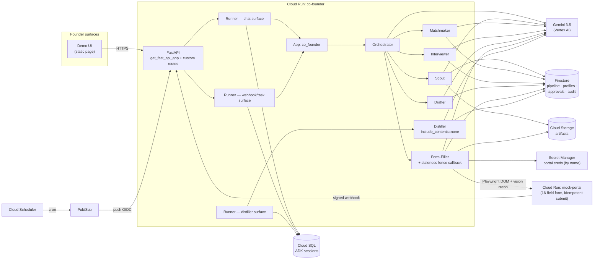

# Architecture Diagram (submission artifact — docs/13 §submission housekeeping)

## Mermaid (renders on GitHub)

## One-paragraph walkthrough (for the caption)

The founder talks to a demo UI served by a FastAPI app on Cloud Run. ADK's
`get_fast_api_app` owns the chat surface; a second Runner handles webhooks and
scheduled tasks; a third runs the isolated Distiller. All three share one
Cloud SQL session store, so a run parked for days resumes via `state_delta`
with zero replay. The orchestrator routes by an explicit state machine
(`current_step` injected into every instruction), delegating to five scoped
sub-agents. Firestore holds the pipeline, the Founder Profile (long-term
memory), approval tokens (never in model context), and an append-only audit
trail. The Form-Filler drives Playwright against portals — DOM-first, vision
recon as tier-1 fallback — and submits only behind a founder-granted,
server-resolved approval, with a derived idempotency key. Cloud Scheduler →
Pub/Sub wake the agent for discovery sweeps and deadline scans; the mock
portal calls back over a signed webhook when a submission confirms.
